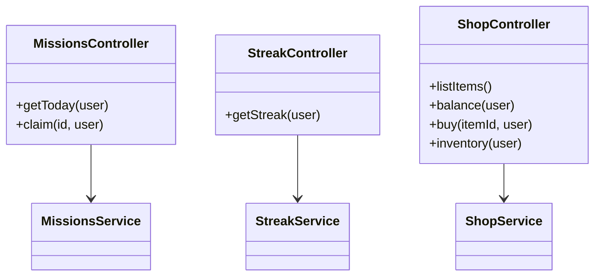
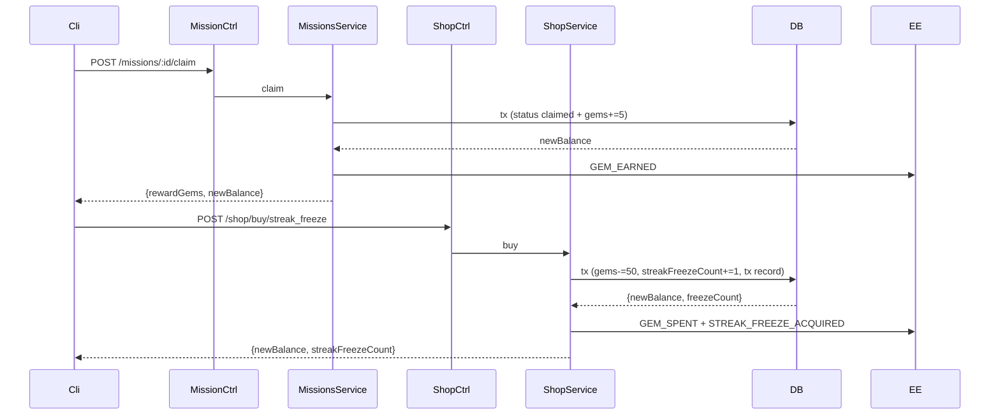

# P11.T4 — Mission + Streak + Shop Endpoints

## 1. METADATA

| Field | Value |
|-------|-------|
| Task ID | P11.T4 |
| Phase | 11 |
| Depends on | P11.T2, P11.T3, P09.T3 |
| Complexity | Low |
| Risk | Low |

---

## 2. MỤC TIÊU & SCOPE

**In-scope**:
- `GET /missions/today`, `POST /missions/:id/claim`.
- `GET /streak`.
- `GET /shop/items`, `GET /shop/balance`, `POST /shop/buy/:itemId`, `GET /shop/inventory`.
- Special handling: `streak_freeze` buy → ALSO increment `streakFreezeCount`.
- All Firebase guarded + rate limit 60/min/uid.

---

## 3. FILES CẦN TẠO / SỬA

| # | Path |
|---|------|
| 1 | `apps/server/src/modules/missions/missions.controller.ts` |
| 2 | `apps/server/src/modules/missions/streak.controller.ts` (or add to users) |
| 3 | `apps/server/src/modules/shop/shop.controller.ts` (T3 nếu chưa có) |
| 4 | `apps/server/src/modules/shop/shop.service.ts` — sửa: handle streak_freeze post-buy |
| 5 | `apps/server/src/modules/missions/dto/{claim.dto,mission-response.dto}.ts` |

---

## 4. CLASS DIAGRAM



---

## 5. CHI TIẾT

### 5.1. MissionsController

```
@Controller('missions')
@UseGuards(FirebaseAuthGuard)
class MissionsController:

  @Get('today')
  async getToday(@CurrentUser() user):
    missions = await missionsService.ensureToday(user.uid)
    return missions.map(toDto)
    // shape: { id, templateId, title, description, progress, target, status, rewardGems, completedAt?, claimedAt? }

  @Post(':id/claim')
  async claim(@Param('id') id, @CurrentUser() user):
    return await missionsService.claim(user.uid, id)
    // returns { rewardGems, newBalance, missionId }
```

### 5.2. StreakController

```
@Controller('streak')
@UseGuards(FirebaseAuthGuard)
class StreakController:

  @Get()
  async getStreak(@CurrentUser() user):
    s = await streakService.getStreak(user.uid)
    return {
      current: s.currentStreak ?? 0,
      highest: s.highestStreak ?? 0,
      freezes: s.streakFreezeCount ?? 0,
      lastDate: s.lastStreakDate?.toISOString() ?? null
    }
```

### 5.3. ShopController (refactor / verify from P09.T3)

```
@Controller('shop')
@UseGuards(FirebaseAuthGuard)
class ShopController:

  @Get('items')
  async listItems():
    items = await shopService.listSystemItems()
    return items.map(toDto)

  @Get('balance')
  async balance(@CurrentUser() user):
    bal = await shopService.getBalance(user.uid)
    return { balance: bal }

  @Post('buy/:itemId')
  async buy(@Param('itemId') itemId, @CurrentUser() user):
    return await shopService.buy(user.uid, itemId)

  @Get('inventory')
  async inventory(@CurrentUser() user):
    return await shopService.listInventory(user.uid)
```

### 5.4. ShopService.buy — extend `streak_freeze` handling

```
buy(uid, itemId):
  item = await prisma.shopItem.findUnique({ where: { id: itemId } })
  if !item → ITEM_NOT_FOUND
  if !item.active → ITEM_INACTIVE
  if item.category !== 'system' → FORBIDDEN
  
  result = await prisma.$transaction(async tx => {
    // Check gems
    user = await tx.usersMeta.findUnique({ where: { uid }, select: { gems: true } })
    if user.gems < item.priceGems → NOT_ENOUGH_GEMS
    
    updated = await tx.usersMeta.update({
      where: { uid },
      data: {
        gems: { decrement: item.priceGems },
        ...(itemId === 'streak_freeze' ? { streakFreezeCount: { increment: 1 } } : {})
      },
      select: { gems: true, streakFreezeCount: true }
    })
    
    await tx.shopTransaction.create({ data: { userId: uid, itemId, pricePaid: item.priceGems, source: 'system_shop' } })
    
    if itemId !== 'streak_freeze':
      // Streak freeze is "consumable" → don't go to inventory; only counted in user meta
      await tx.inventory.upsert({
        where: { userId_itemId: { userId: uid, itemId } },
        update: { quantity: { increment: 1 } },
        create: { userId: uid, itemId, quantity: 1 }
      })
    
    return { newBalance: updated.gems, streakFreezeCount: updated.streakFreezeCount, itemId }
  })
  
  // After commit
  await usersService.syncToFirestore(uid, {
    gems: result.newBalance,
    ...(itemId === 'streak_freeze' ? { streakFreezeCount: result.streakFreezeCount } : {})
  })
  eventEmitter.emit(EVENTS.GEM_SPENT, { userId: uid, amount: item.priceGems, source: 'system_shop' })
  if itemId === 'streak_freeze':
    eventEmitter.emit(EVENTS.STREAK_FREEZE_ACQUIRED, { userId: uid, count: result.streakFreezeCount })
  
  return result
```

### 5.5. DTOs

```
MissionDto:
  id, templateId, title, description, progress, target, status, rewardGems, completedAt?, claimedAt?

ShopItemDto:
  id, name, description, priceGems, category

ClaimResultDto:
  rewardGems, newBalance, missionId
```

---

## 6. SEQUENCE — Claim then buy freeze



---

## 7. ACCEPTANCE & TEST PLAN

- [ ] GET /missions/today → 3 items first call (created), idempotent same on subsequent.
- [ ] Claim → newBalance correct.
- [ ] GET /streak → returns correct shape.
- [ ] GET /shop/items → only category='system' active items.
- [ ] POST /shop/buy/streak_freeze → freezeCount+=1 trong UsersMeta + Firestore.
- [ ] Insufficient → 402.
- [ ] Streak freeze NOT in inventory listing (only meta counter).
- [ ] Other system items DO go to inventory.

### Tests
- E2E full flow.
