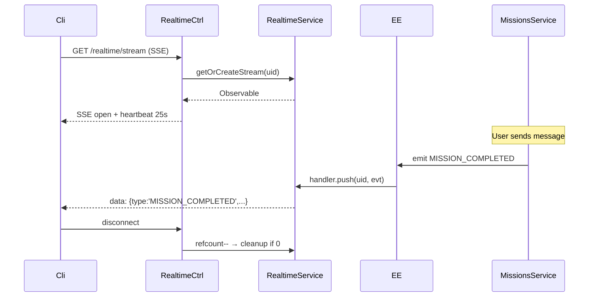

# P11.T5 — SSE Realtime Push

## 1. METADATA

| Field | Value |
|-------|-------|
| Task ID | P11.T5 |
| Phase | 11 |
| Depends on | P11.T2, P11.T3 |
| Complexity | Medium |
| Risk | Medium (long-lived connections, scaling) |

---

## 2. MỤC TIÊU & SCOPE

**In-scope**:
- `RealtimeModule` SSE endpoint `GET /realtime/stream` (single-server in MVP; Redis pub/sub for multi-instance).
- `RealtimeService` maintains per-user RxJS Subject Map; subscribes to domain events.
- Heartbeat every 25s (`: keepalive\n\n`).
- Auto-cleanup on client disconnect (Subject.complete + map delete).
- Push events: `MISSION_COMPLETED`, `MISSION_PROGRESS`, `GEM_EARNED`, `GEM_SPENT`, `STREAK_UPDATED`, `ITEM_ACQUIRED`, `STREAK_FREEZE_ACQUIRED`.
- Auth via query token (`?token=...`) hoặc Authorization header.

---

## 3. FILES CẦN TẠO

| # | Path |
|---|------|
| 1 | `apps/server/src/modules/realtime/realtime.module.ts` |
| 2 | `apps/server/src/modules/realtime/realtime.controller.ts` |
| 3 | `apps/server/src/modules/realtime/realtime.service.ts` |
| 4 | `apps/server/src/modules/realtime/realtime.gateway-listener.ts` |
| 5 | `apps/server/src/modules/realtime/dto/sse-event.ts` |

---

## 4. CLASS DIAGRAM

```mermaid
classDiagram
    class RealtimeService {
        -userStreams Map~uid, Subject~
        +getOrCreateStream(uid) Observable~SseEvent~
        +push(uid, event SseEvent) void
        +disconnect(uid) void
        +stats() {totalUsers}
    }
    class RealtimeController {
        +stream(@CurrentUser, @Res, @Req) Observable
    }
    class RealtimeEventListener {
        +@OnEvent MISSION_COMPLETED
        +@OnEvent MISSION_PROGRESS
        +@OnEvent GEM_EARNED, GEM_SPENT
        +@OnEvent STREAK_UPDATED
        +@OnEvent ITEM_ACQUIRED
    }
    class SseEvent {
        type, data, timestamp
    }

    RealtimeController --> RealtimeService
    RealtimeEventListener --> RealtimeService
```

---

## 5. CHI TIẾT

### 5.1. `SseEvent`

```
type SseEventType =
  | 'MISSION_PROGRESS' | 'MISSION_COMPLETED'
  | 'GEM_EARNED' | 'GEM_SPENT'
  | 'STREAK_UPDATED'
  | 'ITEM_ACQUIRED' | 'STREAK_FREEZE_ACQUIRED'
  | 'PING'

type SseEvent = {
  type: SseEventType
  data: unknown
  timestamp: number
}
```

### 5.2. `RealtimeService`

```
private userStreams = new Map<string, Subject<SseEvent>>()
private userRefcount = new Map<string, number>()  // multi-tab support

getOrCreateStream(uid): Observable<SseEvent>
  let subj = userStreams.get(uid)
  if !subj:
    subj = new Subject<SseEvent>()
    userStreams.set(uid, subj)
  userRefcount.set(uid, (userRefcount.get(uid) ?? 0) + 1)
  
  // Return observable that, on unsubscribe, decrements ref
  return new Observable(sub => {
    const inner = subj.asObservable().subscribe(sub)
    return () => {
      inner.unsubscribe()
      const c = (userRefcount.get(uid) ?? 1) - 1
      if c <= 0:
        userRefcount.delete(uid)
        userStreams.get(uid)?.complete()
        userStreams.delete(uid)
      else:
        userRefcount.set(uid, c)
    }
  })

push(uid, event):
  const s = userStreams.get(uid)
  if s: s.next(event)
  // else: user not connected → drop silently

disconnect(uid):
  userStreams.get(uid)?.complete()
  userStreams.delete(uid)
  userRefcount.delete(uid)
```

### 5.3. `RealtimeController`

```
@Controller('realtime')
@UseGuards(FirebaseAuthGuard)
class RealtimeController:

  @Sse('stream')
  stream(@CurrentUser() user): Observable<MessageEvent> {
    const stream$ = realtimeService.getOrCreateStream(user.uid)
    
    // Merge with heartbeat (25s) to keep proxies open
    const heartbeat$ = interval(25_000).pipe(
      map(() => ({ type: 'PING', data: {}, timestamp: Date.now() } as SseEvent))
    )
    
    return merge(stream$, heartbeat$).pipe(
      map(ev => ({ data: JSON.stringify(ev), type: ev.type } as MessageEvent))
    )
  }
```

### 5.4. `RealtimeEventListener`

```
@OnEvent(EVENTS.MISSION_COMPLETED)
onMissionCompleted(p) { realtimeService.push(p.userId, { type:'MISSION_COMPLETED', data:p, timestamp:Date.now() }) }

@OnEvent(EVENTS.GEM_EARNED)
onGemEarned(p) { realtimeService.push(p.userId, { type:'GEM_EARNED', data:{amount:p.amount, source:p.source, newBalance:p.newBalance}, timestamp:Date.now() }) }

@OnEvent(EVENTS.GEM_SPENT)
onGemSpent(p) { realtimeService.push(p.userId, { type:'GEM_SPENT', data:p, timestamp:Date.now() }) }

@OnEvent(EVENTS.STREAK_UPDATED)
onStreak(p) { realtimeService.push(p.userId, { type:'STREAK_UPDATED', data:p, timestamp:Date.now() }) }

@OnEvent(EVENTS.ITEM_ACQUIRED)
onItem(p) { realtimeService.push(p.userId, { type:'ITEM_ACQUIRED', data:p, timestamp:Date.now() }) }

@OnEvent(EVENTS.STREAK_FREEZE_ACQUIRED)
onFreeze(p) { realtimeService.push(p.userId, { type:'STREAK_FREEZE_ACQUIRED', data:p, timestamp:Date.now() }) }
```

### 5.5. Optional: Mission progress event (granular)

Add new event `EVENTS.MISSION_PROGRESS` emitted from `MissionsService.incrementProgress` (after row update) when status is still 'in_progress' (avoid spam: only emit if progress changed by 1).

### 5.6. Scaling note

MVP: single server, in-memory Map. For multi-instance:
- Replace push with Redis pub/sub: `realtime:user:{uid}` channel.
- Each instance subscribes to all events; matches by uid in active subscribers map.
- Document as future TODO trong file.

---

## 6. SEQUENCE



---

## 7. ACCEPTANCE & TEST PLAN

- [ ] EventSource connects (200 OK, `content-type: text/event-stream`).
- [ ] Heartbeat every 25s (PING event).
- [ ] Send message → MISSION_PROGRESS event delivered.
- [ ] Complete mission → MISSION_COMPLETED event.
- [ ] Claim → GEM_EARNED event.
- [ ] Streak action → STREAK_UPDATED event.
- [ ] User B's events NOT received by user A.
- [ ] Disconnect → server cleans up subject (verify map size).
- [ ] Multi-tab same user → 2 subscribers receive same events.
- [ ] Unauthorized (no token) → 401.

### Tests
- Integration: open SSE, trigger events, assert receipt.
