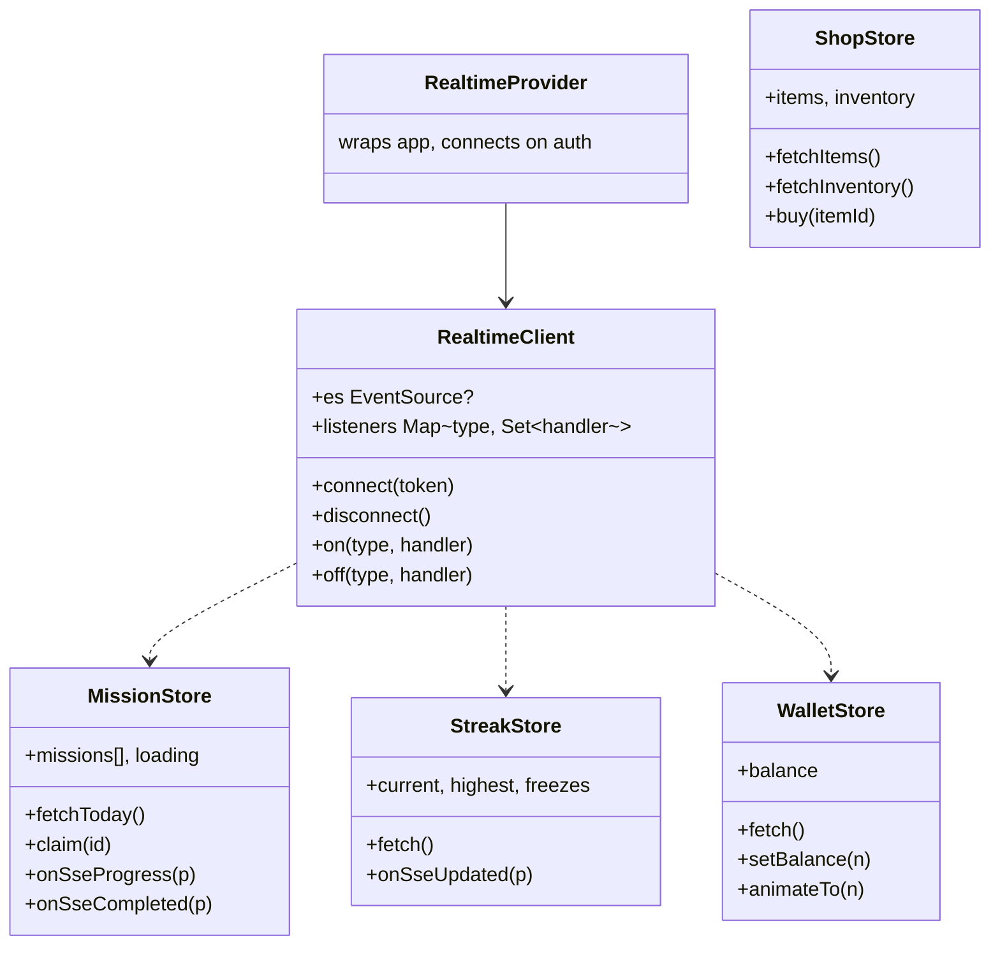
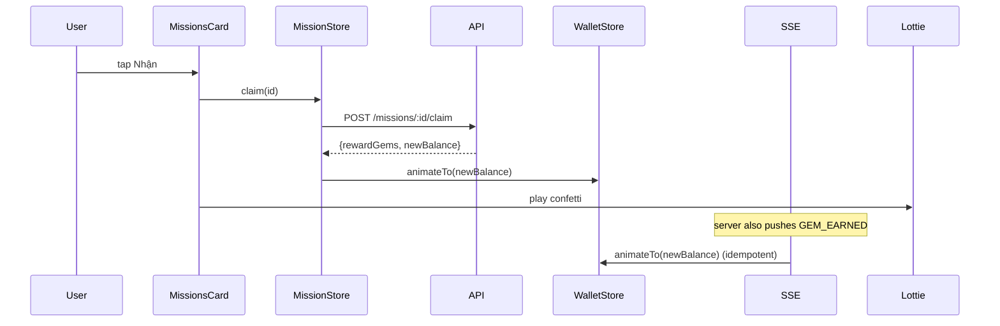

# P11.T6 — Client: Mission Widget + Streak + Shop Screen + SSE

## 1. METADATA

| Field | Value |
|-------|-------|
| Task ID | P11.T6 |
| Phase | 11 |
| Depends on | P11.T4, P11.T5 |
| Complexity | High |
| Risk | Medium (SSE on React Native + animations) |

---

## 2. MỤC TIÊU & SCOPE

**In-scope**:
- `RealtimeClient` (React Native SSE via `react-native-sse` lib).
- Stores: `MissionStore`, `StreakStore`, `WalletStore`, `ShopStore`.
- HomeScreen widget: Streak banner + Missions card + Gem counter.
- ShopScreen: list items, buy flow, inventory section, current balance.
- Animations: Lottie confetti on claim, animated gem counter, streak fire pulse.
- Wire SSE events → store dispatchers.

---

## 3. FILES CẦN TẠO / SỬA

| # | Path |
|---|------|
| 1 | `apps/mobile/src/core/realtime/realtime.client.ts` |
| 2 | `apps/mobile/src/core/realtime/realtime.provider.tsx` |
| 3 | `apps/mobile/src/features/mission/store/mission.store.ts` |
| 4 | `apps/mobile/src/features/mission/services/mission.service.ts` |
| 5 | `apps/mobile/src/features/streak/store/streak.store.ts` |
| 6 | `apps/mobile/src/features/wallet/store/wallet.store.ts` |
| 7 | `apps/mobile/src/features/shop/store/shop.store.ts` |
| 8 | `apps/mobile/src/features/shop/services/shop.service.ts` |
| 9 | `apps/mobile/src/features/home/components/StreakBanner.tsx` |
| 10 | `apps/mobile/src/features/home/components/MissionsCard.tsx` |
| 11 | `apps/mobile/src/features/home/components/GemCounter.tsx` |
| 12 | `apps/mobile/src/features/shop/screens/ShopScreen.tsx` |
| 13 | `apps/mobile/src/features/shop/components/ShopItemCard.tsx` |
| 14 | `apps/mobile/src/features/shop/components/InventoryList.tsx` |

---

## 4. CLASS / STATE DIAGRAM



---

## 5. CHI TIẾT

### 5.1. `RealtimeClient`

```
class RealtimeClient {
  private es: EventSource | null = null
  private listeners = new Map<string, Set<Function>>()
  private reconnectAttempt = 0

  connect(token: string) {
    this.disconnect()
    this.es = new EventSource(`${BASE_URL}/realtime/stream`, {
      headers: { Authorization: `Bearer ${token}` }
    })
    this.es.addEventListener('message', (ev) => {
      try {
        const evt = JSON.parse(ev.data)
        if (evt.type === 'PING') return
        this.dispatch(evt.type, evt.data)
      } catch (e) { /* ignore */ }
    })
    this.es.addEventListener('error', () => this.scheduleReconnect(token))
    this.reconnectAttempt = 0
  }

  on(type, handler) {
    if (!this.listeners.has(type)) this.listeners.set(type, new Set())
    this.listeners.get(type)!.add(handler)
  }
  off(type, handler) { this.listeners.get(type)?.delete(handler) }
  
  private dispatch(type, data) {
    this.listeners.get(type)?.forEach(h => { try { h(data) } catch {} })
  }
  
  disconnect() { this.es?.close(); this.es = null }
  
  private scheduleReconnect(token) {
    const delay = Math.min(30_000, 1000 * Math.pow(2, this.reconnectAttempt++))
    setTimeout(() => this.connect(token), delay)
  }
}
```

### 5.2. `RealtimeProvider`

```
function RealtimeProvider({ children }) {
  const { user, getIdToken } = useAuth()
  
  useEffect(() => {
    if (!user) return
    let mounted = true
    const setup = async () => {
      const token = await getIdToken()
      if (!mounted) return
      realtimeClient.connect(token)
      
      realtimeClient.on('MISSION_PROGRESS', missionStore.getState().onSseProgress)
      realtimeClient.on('MISSION_COMPLETED', missionStore.getState().onSseCompleted)
      realtimeClient.on('GEM_EARNED', (p) => walletStore.getState().animateTo(p.newBalance))
      realtimeClient.on('GEM_SPENT', (p) => walletStore.getState().fetch())
      realtimeClient.on('STREAK_UPDATED', streakStore.getState().onSseUpdated)
      realtimeClient.on('ITEM_ACQUIRED', shopStore.getState().fetchInventory)
      realtimeClient.on('STREAK_FREEZE_ACQUIRED', (p) => streakStore.getState().fetch())
    }
    setup()
    return () => { mounted = false; realtimeClient.disconnect() }
  }, [user])
  
  return children
}
```

Also listen `AppState` to reconnect on resume.

### 5.3. Stores summary

```
MissionStore:
  missions[], loading
  fetchToday(): missions = await missionService.getToday()
  claim(id):
    res = await missionService.claim(id)
    update mission status='claimed'
    walletStore.animateTo(res.newBalance)
    trigger Confetti
  onSseProgress(p): update mission progress in array
  onSseCompleted(p): mark status='completed' in array

StreakStore:
  current, highest, freezes
  fetch(): from /streak
  onSseUpdated(p): set values, if isNewHighest → Toast

WalletStore:
  balance, displayedBalance
  fetch(): /shop/balance
  setBalance(n): displayed jumps
  animateTo(n): tween via Reanimated useSharedValue (counter rolling)

ShopStore:
  items, inventory, loading
  fetchItems(): /shop/items
  fetchInventory(): /shop/inventory
  buy(itemId):
    res = await shopService.buy(itemId)
    walletStore.animateTo(res.newBalance)
    fetchInventory()
```

### 5.4. `StreakBanner`

```
useEffect: streakStore.fetch()
const { current, freezes } = useStreakStore()
Render:
  <View row>
    <FireIcon animatedPulse={current>0} />
    <Text bold>Streak: {current} ngày</Text>
    {freezes > 0 && <Badge>❄️ x{freezes}</Badge>}
  </View>
```

### 5.5. `MissionsCard`

```
useEffect on mount: missionStore.fetchToday()
Render:
  <Card>
    <Title>📋 Nhiệm vụ hôm nay</Title>
    {missions.map(m => (
      <Row key={m.id}>
        <IconByStatus status={m.status} />
        <Text>{m.title} ({m.progress}/{m.target})</Text>
        <ProgressBar value={m.progress/m.target} />
        {m.status === 'completed' && (
          <Button onPress={() => onClaim(m.id)}>Nhận {m.rewardGems}💎</Button>
        )}
      </Row>
    ))}
  </Card>

onClaim(id):
  await missionStore.claim(id)
  // Confetti triggered via LottieView ref
```

### 5.6. `GemCounter`

```
const balance = useWalletStore(s => s.balance)
const animated = useSharedValue(balance)
useEffect: animated.value = withTiming(balance, { duration: 600 })
useDerivedValue: rounded
Render: <AnimatedText>💎 {Math.round(animated.value)}</AnimatedText>
```

### 5.7. `ShopScreen`

```
useEffect: shopStore.fetchItems() + fetchInventory()
Render:
  <Header><GemCounter /></Header>
  <SectionList>
    Section: Items - render ShopItemCard
    Section: Vật phẩm đã có - render InventoryList
  </SectionList>

ShopItemCard:
  Props: { item, onBuy }
  Render: name, description, price, button "Mua"
  disabled if wallet.balance < item.priceGems → label "Không đủ"

InventoryList:
  Render inventory items + freezeCount (special row)
```

### 5.8. `ShopScreen` buy flow

```
onBuy(item):
  Alert.confirm(`Mua ${item.name} với ${item.priceGems}💎?`, async () => {
    try {
      await shopStore.buy(item.id)
      Toast.show('Mua thành công ✓')
    } catch e {
      if e.code==='NOT_ENOUGH_GEMS' → Toast 'Không đủ gem'
      else Toast.show('Lỗi: ' + e.message)
    }
  })
```

---

## 6. SEQUENCE — Claim with confetti



---

## 7. ACCEPTANCE & TEST PLAN

- [ ] Home loads → streak + missions + balance hiển thị.
- [ ] Send messages → mission progress updates realtime (SSE).
- [ ] Mission completed → button "Nhận" appears.
- [ ] Claim → confetti, gem counter animates, button → Đã nhận.
- [ ] Streak update → fire pulse + Toast nếu new highest.
- [ ] ShopScreen → mua streak freeze → freeze count tăng trong banner.
- [ ] Insufficient gems → Toast, no state change.
- [ ] SSE disconnect → auto reconnect (verify network toggle).
- [ ] AppState background → SSE closes; resume → reconnects + fetch fresh.
