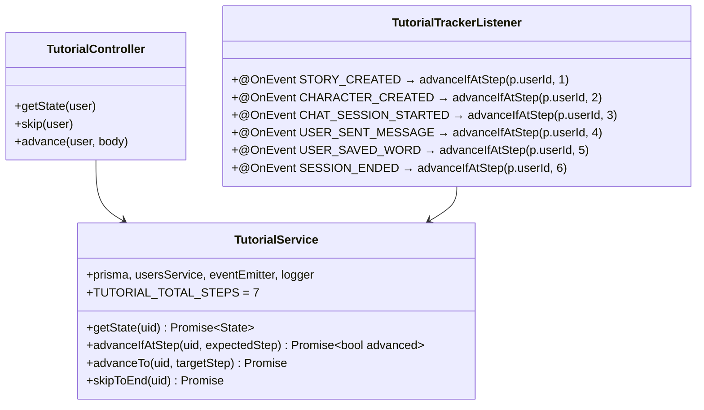
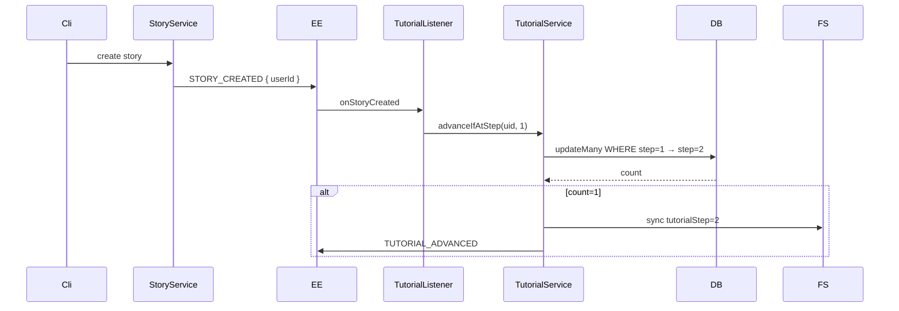

# P12.T1 — Tutorial Step Tracking (Server)

## 1. METADATA

| Field | Value |
|-------|-------|
| Task ID | P12.T1 |
| Phase | 12 — Tutorial |
| Depends on | P11 hoàn thành |
| Complexity | Low |
| Risk | Low |

---

## 2. MỤC TIÊU & SCOPE

**In-scope**:
- `TutorialService` with `advanceIfAtStep(uid, expectedStep)` and `skipToEnd(uid)`.
- Event listeners wired in `tutorial-tracker.listener.ts` to auto-advance based on user actions.
- Endpoints: `GET /tutorial/state`, `POST /tutorial/skip`, `POST /tutorial/advance` (manual, e.g. step 0 → 1).
- All advance ops atomic with conditional update (only advance if current step == expected, prevents race).
- Sync to Firestore.
- Const `TUTORIAL_TOTAL_STEPS = 7` (steps 0..7; 7 = done).

---

## 3. FILES CẦN TẠO

| # | Path |
|---|------|
| 1 | `apps/server/src/modules/tutorial/tutorial.module.ts` |
| 2 | `apps/server/src/modules/tutorial/tutorial.service.ts` |
| 3 | `apps/server/src/modules/tutorial/tutorial.controller.ts` |
| 4 | `apps/server/src/modules/tutorial/tutorial-tracker.listener.ts` |
| 5 | `apps/server/src/modules/tutorial/tutorial.service.spec.ts` |
| 6 | `packages/shared-types/src/tutorial.ts` |

---

## 4. CLASS DIAGRAM



---

## 5. CHI TIẾT

### 5.1. Shared types

```ts
export const TUTORIAL_STEPS = [
  { step: 0, name: 'welcome' },
  { step: 1, name: 'create_story' },
  { step: 2, name: 'create_character' },
  { step: 3, name: 'start_chat' },
  { step: 4, name: 'send_message' },
  { step: 5, name: 'save_word' },
  { step: 6, name: 'end_chat' },
  { step: 7, name: 'done' },
] as const
export const TUTORIAL_DONE_STEP = 7
```

### 5.2. `getState(uid)`

```
Logic:
  user = await prisma.usersMeta.findUnique({ where: { uid }, select: { tutorialStep: true } })
  if !user → throw NOT_FOUND
  return {
    step: user.tutorialStep,
    isComplete: user.tutorialStep >= TUTORIAL_DONE_STEP,
    totalSteps: TUTORIAL_DONE_STEP
  }
```

### 5.3. `advanceIfAtStep(uid, expectedStep)` — race-safe

```
Logic:
  if expectedStep < 0 || expectedStep >= TUTORIAL_DONE_STEP → return false
  
  // Atomic conditional advance
  result = await prisma.usersMeta.updateMany({
    where: { uid, tutorialStep: expectedStep },
    data: { tutorialStep: expectedStep + 1 }
  })
  
  if result.count === 0 → return false  // user not at that step
  
  await usersService.syncToFirestore(uid, { tutorialStep: expectedStep + 1 })
  eventEmitter.emit(EVENTS.TUTORIAL_ADVANCED, { userId: uid, newStep: expectedStep + 1 })
  logger.info({ uid, from: expectedStep, to: expectedStep + 1 }, 'tutorial advance')
  return true
```

### 5.4. `advanceTo(uid, targetStep)`

For manual call (e.g. step 0 → 1 when user taps "Tiếp" on Welcome).

```
Logic:
  if targetStep < 0 || targetStep > TUTORIAL_DONE_STEP → throw INVALID_PAYLOAD
  await prisma.usersMeta.update({
    where: { uid }, data: { tutorialStep: targetStep }
  })
  await usersService.syncToFirestore(uid, { tutorialStep: targetStep })
  eventEmitter.emit(EVENTS.TUTORIAL_ADVANCED, { userId: uid, newStep: targetStep })
```

### 5.5. `skipToEnd(uid)`

```
Logic:
  await advanceTo(uid, TUTORIAL_DONE_STEP)
```

### 5.6. `TutorialTrackerListener`

```
@OnEvent(EVENTS.STORY_CREATED) async onStoryCreated({ userId }) {
  try { await tutorialService.advanceIfAtStep(userId, 1) } catch(e){ logger.warn(...) }
}
... (similar for others)
```

**Requires**: Source events must include `userId`. Verify P02.T1 emits `STORY_CREATED`, P02.T4 `CHARACTER_CREATED`, P04.T6 `USER_SENT_MESSAGE`, P04.T7 `CHAT_SESSION_STARTED`, P07.T1 `SESSION_ENDED`, P10.T2 `USER_SAVED_WORD`. If missing → ADD as P12.T1 subtask (small edits to those services).

### 5.7. Controller

```
@Controller('tutorial')
@UseGuards(FirebaseAuthGuard)
class TutorialController:

  @Get('state')
  getState(@CurrentUser() user) → tutorialService.getState(user.uid)

  @Post('skip')
  skip(@CurrentUser() user) → { await tutorialService.skipToEnd(user.uid); return { ok: true } }

  @Post('advance')
  @Body() { targetStep: number }
  advance(@CurrentUser() user, @Body() body) → { await tutorialService.advanceTo(user.uid, body.targetStep); return { ok: true } }
```

---

## 6. SEQUENCE



---

## 7. ACCEPTANCE & TEST PLAN

- [ ] User step=1, tạo story → step=2 + Firestore synced.
- [ ] User step=3, tạo story (already past) → no change.
- [ ] User step=2, gửi message → no change (still waiting for chat session start? — verify logic).
- [ ] Skip → step=7 immediately.
- [ ] Concurrent: 2 stories created cùng lúc khi step=1 → chỉ 1 lần advance (atomic).
- [ ] /tutorial/state returns correct shape.

### Tests
- Unit: mock prisma updateMany return count.
- Integration: full event chain.
