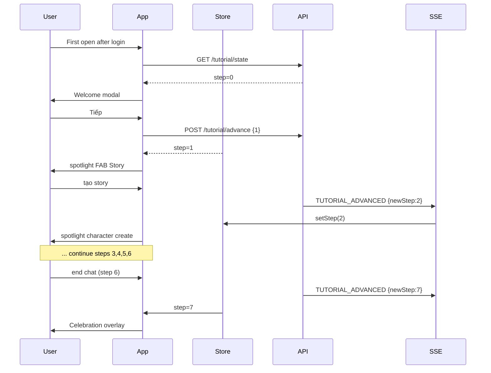

# P12.T3 — Wire Coachmarks vào Existing Screens

## 1. METADATA

| Field | Value |
|-------|-------|
| Task ID | P12.T3 |
| Phase | 12 |
| Depends on | P12.T2 |
| Complexity | Low |
| Risk | Low |

---

## 2. MỤC TIÊU & SCOPE

**In-scope**:
- Wrap target widgets with `useTutorialTarget(id)` ref.
- Mount `<TutorialWelcomeOverlay />` + `<CoachmarkOverlay />` at root.
- Auto-refresh tutorial state on screen focus & SSE `TUTORIAL_ADVANCED` event.
- Celebration overlay khi step transitions 6 → 7.

---

## 3. FILES CẦN SỬA / TẠO

| # | Path | Action |
|---|------|--------|
| 1 | `apps/mobile/src/navigation/RootNavigator.tsx` | mount overlays |
| 2 | `apps/mobile/src/features/story/screens/StoryListScreen.tsx` | FAB ref id='story-create-button' |
| 3 | `apps/mobile/src/features/story/screens/StoryDetailScreen.tsx` | Bắt đầu Chat ref id='start-chat-button' |
| 4 | `apps/mobile/src/features/character/screens/CharacterEditorScreen.tsx` | Save/Create ref id='character-create-button' |
| 5 | `apps/mobile/src/features/chat/components/InputBar.tsx` | container ref id='chat-input-bar' |
| 6 | `apps/mobile/src/features/chat/components/EndChatButton.tsx` | ref id='end-chat-button' |
| 7 | `apps/mobile/src/features/chat/components/WordTooltip.tsx` | Lưu button ref id='word-save-button' |
| 8 | `apps/mobile/src/features/tutorial/components/TutorialCelebrationOverlay.tsx` | new |
| 9 | `apps/mobile/src/core/realtime/realtime.provider.tsx` | listen TUTORIAL_ADVANCED → store.fetchState |
| 10 | `apps/mobile/src/features/tutorial/hooks/useTutorialFocusRefresh.ts` | new |

---

## 4. CHI TIẾT

### 4.1. RootNavigator integration

```tsx
function RootNavigator() {
  return (
    <NavigationContainer>
      <RealtimeProvider>
        <Stacks />
      </RealtimeProvider>
      {/* Mount overlays absolutely at root so they layer above any screen */}
      <TutorialWelcomeOverlay />
      <CoachmarkOverlay />
      <TutorialCelebrationOverlay />
    </NavigationContainer>
  )
}
```

### 4.2. Target wiring pattern

For each target screen/component:

```tsx
// StoryListScreen.tsx
const fabRef = useTutorialTarget('story-create-button')
return (
  <FAB ref={fabRef} onPress={openCreate}>
    <PlusIcon />
  </FAB>
)
```

Do the same for each id in `TUTORIAL_STEPS_CONFIG`.

### 4.3. Auto-advance integration

Server already advances via event listener. Client knows via:

**Path A (SSE)**: New event type `TUTORIAL_ADVANCED` → handler in `RealtimeProvider`:
```
realtimeClient.on('TUTORIAL_ADVANCED', (p) => {
  useTutorialStore.getState().setStep(p.newStep)
})
```
(Requires P11.T5 to subscribe `TUTORIAL_ADVANCED` event — add to listener.)

**Path B (focus fallback)**: `useTutorialFocusRefresh`:
```
function useTutorialFocusRefresh() {
  useFocusEffect(useCallback(() => {
    useTutorialStore.getState().fetchState()
  }, []))
}
```
Call this in each tutorial-relevant screen for resilience.

Recommend both A + B.

### 4.4. `TutorialCelebrationOverlay`

```tsx
function TutorialCelebrationOverlay() {
  const step = useTutorialStore(s => s.currentStep)
  const prevStep = useRef(step)
  const [show, setShow] = useState(false)
  
  useEffect(() => {
    if (prevStep.current === 6 && step === 7) {
      setShow(true)
      setTimeout(() => setShow(false), 4000)
    }
    prevStep.current = step
  }, [step])
  
  if (!show) return null
  return (
    <Modal transparent visible>
      <Center>
        <LottieView source={require('./confetti.json')} autoPlay loop={false} />
        <BigTitle>🎉 Hoàn thành hướng dẫn!</BigTitle>
        <Body>Chúc bạn học tiếng Trung vui vẻ!</Body>
        <Button onPress={() => setShow(false)}>Bắt đầu</Button>
      </Center>
    </Modal>
  )
}
```

### 4.5. Skip-aware mounting

- If `currentStep === 7` (done), all 3 overlays return null.
- No performance impact when not active.

---

## 5. SEQUENCE — Full happy path



---

## 6. ACCEPTANCE & TEST PLAN

- [ ] Brand new user → Welcome → walks through 7 steps end-to-end.
- [ ] Each step spotlight chỉ đúng element.
- [ ] Skip giữa chừng → tất cả overlays disappear, không hiện lại.
- [ ] App restart → step persist từ server.
- [ ] Wrong screen for step → no overlay; auto appears khi navigate đúng.
- [ ] Celebration overlay hiện khi step 6 → 7.
- [ ] No console warnings về missing refs.
- [ ] Existing users (step=7) → 0 overlays render.
