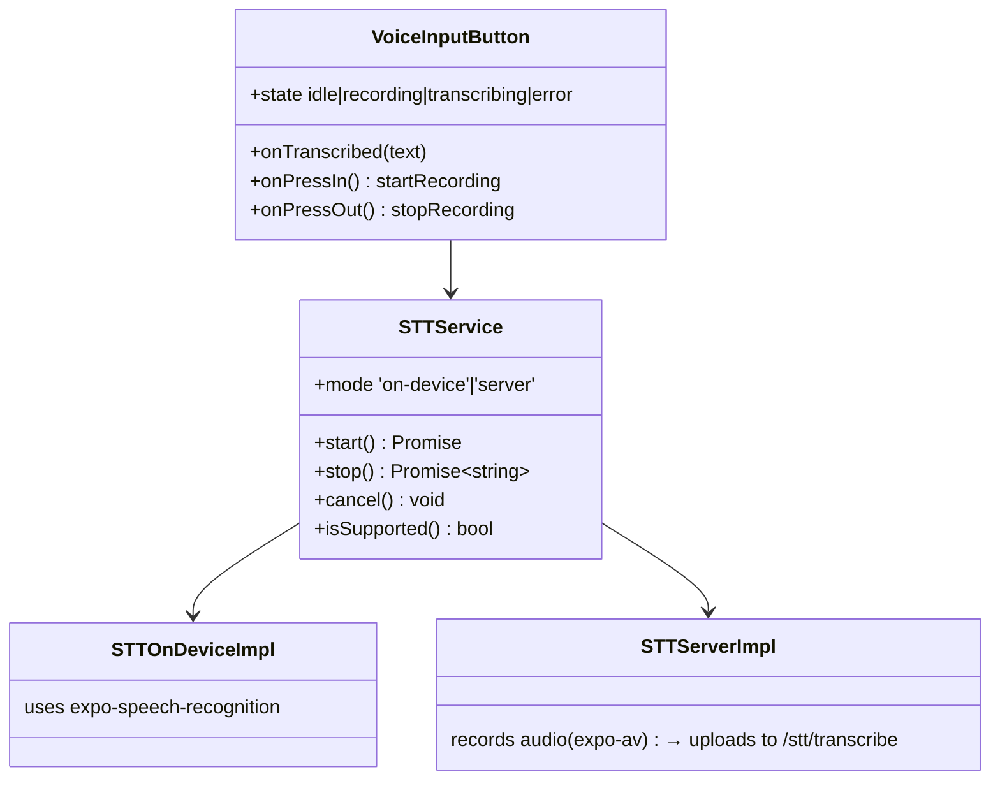
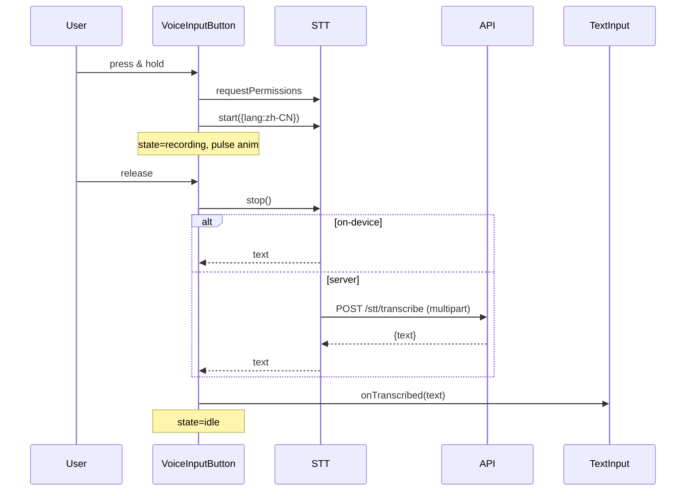

# P13.T1 — Speech-to-Text Input

## 1. METADATA

| Field | Value |
|-------|-------|
| Task ID | P13.T1 |
| Phase | 13 — Premium Polish |
| Depends on | P12 hoàn thành |
| Complexity | Medium |
| Risk | Medium (platform support variance) |

---

## 2. MỤC TIÊU & SCOPE

**In-scope**:
- `VoiceInputButton` (mic) bên cạnh Send button trong `InputBar`.
- Press & hold → record; release → transcribe → fill TextInput (do NOT auto-send).
- Strategy: `expo-speech-recognition` (on-device, primary, free); fallback `POST /stt/transcribe` (server Whisper) nếu device không support.
- Permission handling (microphone, speech recognition).
- Visual states: idle / recording (waveform/pulse) / transcribing / error.
- Feature flag `ENABLE_STT`.

---

## 3. FILES CẦN TẠO / SỬA

| # | Path |
|---|------|
| 1 | `apps/mobile/src/features/chat/components/VoiceInputButton.tsx` |
| 2 | `apps/mobile/src/features/chat/services/stt.service.ts` |
| 3 | `apps/mobile/src/features/chat/services/stt-on-device.ts` |
| 4 | `apps/mobile/src/features/chat/services/stt-server.ts` |
| 5 | `apps/mobile/src/features/chat/components/InputBar.tsx` — sửa: integrate VoiceInputButton |
| 6 | `apps/mobile/src/features/chat/components/RecordingBar.tsx` |
| 7 | `apps/server/src/modules/stt/stt.module.ts` (optional server fallback) |
| 8 | `apps/server/src/modules/stt/stt.controller.ts` |
| 9 | `apps/server/src/modules/stt/whisper.client.ts` |

---

## 4. CLASS DIAGRAM



---

## 5. CHI TIẾT

### 5.1. `STTService` interface

```
interface STTService {
  isSupported(): Promise<boolean>
  requestPermissions(): Promise<boolean>
  start(opts: { language: 'zh-CN' }): Promise<void>
  stop(): Promise<string>     // returns transcribed text
  cancel(): Promise<void>
}

function createSTTService(): STTService {
  if (Platform.OS supports onDevice && ENABLE_STT_ONDEVICE) return new STTOnDevice()
  return new STTServer()
}
```

### 5.2. `STTOnDevice`

```
class STTOnDevice implements STTService {
  private recognizer = ExpoSpeechRecognition
  private currentResult = ''
  
  async start({ language }) {
    await this.recognizer.start({ language, continuous: false, interimResults: true })
    this.recognizer.addEventListener('result', (e) => {
      this.currentResult = e.results[0]?.transcript ?? ''
    })
  }
  
  async stop(): Promise<string> {
    await this.recognizer.stop()
    return this.currentResult
  }
  
  async cancel() { await this.recognizer.abort() }
  
  async isSupported() { return await this.recognizer.isAvailable() }
  
  async requestPermissions() {
    const { status } = await this.recognizer.requestPermissionsAsync()
    return status === 'granted'
  }
}
```

### 5.3. `STTServer`

```
class STTServer implements STTService {
  private recording: Audio.Recording | null = null
  
  async start({ language }) {
    await Audio.requestPermissionsAsync()
    await Audio.setAudioModeAsync({ allowsRecordingIOS: true })
    this.recording = new Audio.Recording()
    await this.recording.prepareToRecordAsync(Audio.RECORDING_OPTIONS_PRESET_HIGH_QUALITY)
    await this.recording.startAsync()
  }
  
  async stop(): Promise<string> {
    if (!this.recording) return ''
    await this.recording.stopAndUnloadAsync()
    const uri = this.recording.getURI()!
    this.recording = null
    
    // Upload
    const form = new FormData()
    form.append('audio', { uri, name: 'rec.m4a', type: 'audio/m4a' } as any)
    form.append('language', 'zh')
    const res = await api.post('/stt/transcribe', form, { headers: { 'Content-Type':'multipart/form-data' } })
    return res.data.text
  }
  
  async cancel() {
    if (this.recording) { await this.recording.stopAndUnloadAsync(); this.recording = null }
  }
  
  async isSupported() { return true }
  async requestPermissions() {
    const { status } = await Audio.requestPermissionsAsync()
    return status === 'granted'
  }
}
```

### 5.4. `VoiceInputButton`

```
Props: { onTranscribed: (text:string)=>void }

State: 'idle' | 'recording' | 'transcribing' | 'error' | 'unsupported'

useEffect: check isSupported() → set state if unsupported

onPressIn:
  granted = await stt.requestPermissions()
  if !granted → Toast 'Cần quyền micro' + state='error'; return
  await stt.start({ language: 'zh-CN' })
  state = 'recording'

onPressOut:
  if state !== 'recording' → return
  state = 'transcribing'
  try {
    text = await stt.stop()
    if text → props.onTranscribed(text)
    state = 'idle'
  } catch e {
    Toast.show('Lỗi STT: ' + e.message)
    state = 'error'
  }

Render:
  unsupported → null
  idle → 🎤 button
  recording → pulse animation, hold tooltip
  transcribing → spinner
  error → ⚠️ briefly
```

### 5.5. `RecordingBar` (replaces InputBar when recording)

```
Props: { onCancel }
Render:
  <Row red border>
    <PulseIcon />
    <Text>🔴 Đang ghi âm... (giữ để tiếp tục)</Text>
    <Pressable onPress={onCancel}>⏹ Huỷ</Pressable>
  </Row>
```

### 5.6. `InputBar` integration

```
const [text, setText] = useState('')
const [recording, setRecording] = useState(false)

return recording ? (
  <RecordingBar onCancel={() => { stt.cancel(); setRecording(false) }} />
) : (
  <Row>
    <TextInput value={text} onChangeText={setText} />
    <VoiceInputButton
      onPressInStart={() => setRecording(true)}
      onPressOutStop={() => setRecording(false)}
      onTranscribed={(t) => setText(prev => prev + t)}
    />
    <SendButton onPress={onSend} />
  </Row>
)
```

### 5.7. Server fallback `/stt/transcribe`

```
@Controller('stt')
@UseGuards(FirebaseAuthGuard)
class SttController:
  @Post('transcribe')
  @UseInterceptors(FileInterceptor('audio'))
  async transcribe(@UploadedFile() file, @Body('language') lang='zh') {
    // file.buffer → write to tmp
    // Call whisper.cpp or OpenAI Whisper API
    const text = await whisperClient.transcribe(file.buffer, lang)
    return { text }
  }

WhisperClient:
  uses 'whisper-node' or local whisper.cpp via child_process
  OR Hugging Face Inference API endpoint
```

Rate limit: 30 calls/min per uid; max file size 5MB; max duration 30s.

### 5.8. Feature flag

```
config: { ENABLE_STT: process.env.ENABLE_STT === 'true' }
If false → VoiceInputButton returns null in InputBar.
```

---

## 6. SEQUENCE



---

## 7. ACCEPTANCE & TEST PLAN

- [ ] Hold mic → speak Chinese → release → text appears in input.
- [ ] Permission denied → Toast + button shows error briefly.
- [ ] Cancel during recording → no transcribe, no text added.
- [ ] Unsupported device → button hidden.
- [ ] Server fallback works when on-device unavailable.
- [ ] Large/long recording → server rejects with 413 / 400.
- [ ] No memory leak after 20 successive recordings.
