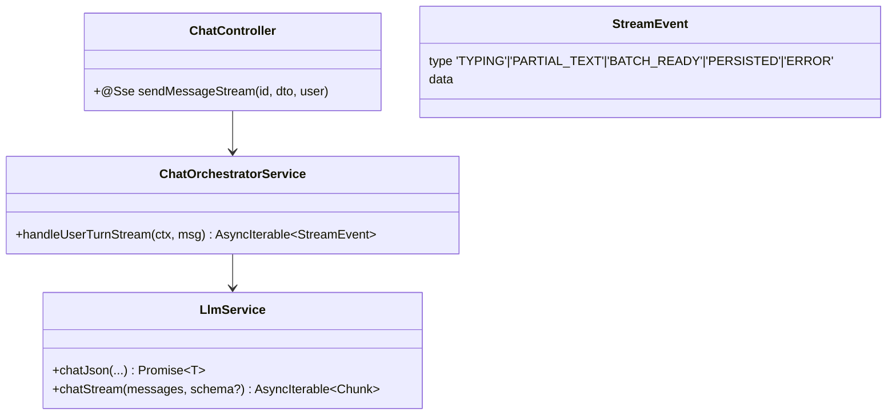
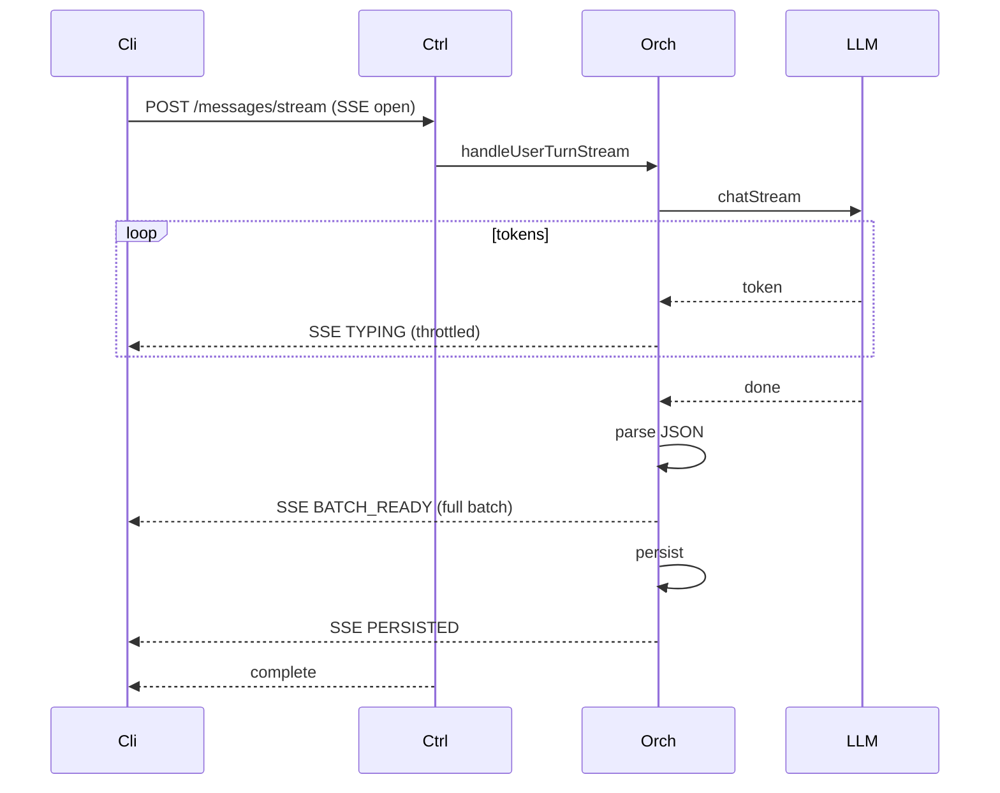

# P13.T2 — LLM Streaming Response (SSE Token-by-Token)

## 1. METADATA

| Field | Value |
|-------|-------|
| Task ID | P13.T2 |
| Phase | 13 |
| Depends on | P13.T1 |
| Complexity | High |
| Risk | High (JSON+streaming inherently conflicting) |

---

## 2. MỤC TIÊU & SCOPE

**In-scope**:
- `LlmService.chatStream(messages, schema)` returns AsyncIterable<TokenChunk>.
- Two strategies:
  - **Strategy A (recommended)**: Stream tokens raw; accumulate; parse JSON only when complete; emit progressive "typing" indicator events.
  - **Strategy B (alt)**: Stream `text` field tokens of first character bubble (parse partial via custom streaming JSON parser like `json-text-parser`).
- New endpoint `POST /chat/sessions/:id/messages/stream` (SSE).
- Client `ChatService.postMessageStreaming` consumes EventSource → updates store progressively.
- UI: typing indicator "..." bubble while streaming; replace with full bubble on complete.
- Feature flag `ENABLE_LLM_STREAMING`.
- Fallback to non-streaming on error.

---

## 3. FILES CẦN TẠO / SỬA

| # | Path |
|---|------|
| 1 | `apps/server/src/modules/llm/llm.service.ts` — thêm `chatStream` |
| 2 | `apps/server/src/modules/chat/chat.controller.ts` — endpoint stream |
| 3 | `apps/server/src/modules/chat/services/chat-orchestrator.service.ts` — `handleUserTurnStream` |
| 4 | `apps/server/src/modules/chat/dto/stream-event.ts` |
| 5 | `apps/mobile/src/features/chat/services/chat.service.ts` — `postMessageStreaming` |
| 6 | `apps/mobile/src/features/chat/store/chat.store.ts` — handle streaming events |
| 7 | `apps/mobile/src/features/chat/components/TypingBubble.tsx` |

---

## 4. CLASS DIAGRAM



---

## 5. CHI TIẾT

### 5.1. `StreamEvent` types

```
type StreamEvent =
  | { type: 'TYPING', data: { tokenCount: number } }
  | { type: 'PARTIAL_TEXT', data: { rawAccumulated: string } }  // optional
  | { type: 'BATCH_READY', data: { batch: AssistantBatchDto } }
  | { type: 'PERSISTED', data: { messageIds: string[] } }
  | { type: 'ERROR', data: { code: string, message: string } }
```

### 5.2. `LlmService.chatStream`

```
async *chatStream(messages, opts?): AsyncIterable<TokenChunk> {
  const res = await this.axios.post(`/api/chat`, {
    model: opts?.model ?? this.bigModel,
    messages,
    format: 'json',
    stream: true
  }, { responseType: 'stream' })
  
  let buf = ''
  for await (const chunk of res.data) {
    // Ollama streams JSONL lines
    buf += chunk.toString()
    const lines = buf.split('\n')
    buf = lines.pop()!
    for (const line of lines) {
      if (!line.trim()) continue
      try {
        const obj = JSON.parse(line)
        if (obj.message?.content) yield { token: obj.message.content }
        if (obj.done) return
      } catch {}
    }
  }
}
```

### 5.3. `ChatOrchestratorService.handleUserTurnStream(ctx, msg)`

```
async *handleUserTurnStream(ctx, userMessage): AsyncIterable<StreamEvent> {
  // Steps 1-6 same as handleUserTurn (history append, OOC pull, characters, memory, prompts)
  
  const llmMessages = buildLlmMessages(...)
  
  let accumulated = ''
  let tokenCount = 0
  
  try {
    for await (const chunk of llmService.chatStream(llmMessages)) {
      accumulated += chunk.token
      tokenCount++
      // Throttle TYPING events to ~10/sec
      if (tokenCount % 5 === 0) {
        yield { type: 'TYPING', data: { tokenCount } }
      }
    }
    
    // Parse final JSON with Zod
    const json = extractJson(accumulated)
    const parsed = AssistantBatchSchema.safeParse(json)
    if (!parsed.success) {
      // Retry non-streaming once
      const fallback = await llmService.chatJson(llmMessages, AssistantBatchSchema)
      yield { type: 'BATCH_READY', data: { batch: transformToDto(fallback) } }
    } else {
      yield { type: 'BATCH_READY', data: { batch: transformToDto(parsed.data) } }
    }
    
    // Persist
    const ids = await persistBatch(ctx, parsed.data ?? fallback)
    yield { type: 'PERSISTED', data: { messageIds: ids } }
    
    // Emit events
    eventEmitter.emit(USER_SENT_MESSAGE, ...)
    eventEmitter.emit(ASSISTANT_REPLIED, ...)
  } catch (e) {
    yield { type: 'ERROR', data: { code: e.code ?? 'INTERNAL_ERROR', message: e.message } }
  }
}
```

### 5.4. Endpoint

```
@Sse('sessions/:id/messages/stream')
@UseGuards(FirebaseAuthGuard)
sendMessageStream(@Param('id') id, @Body() dto: SendMessageDto, @CurrentUser() user): Observable<MessageEvent> {
  return new Observable(sub => {
    (async () => {
      try {
        await lockService.acquire(`chat:lock:${id}`, 30)
        try {
          for await (const evt of orchestrator.handleUserTurnStream({sessionId:id,userId:user.uid,storyId:...}, dto.text)) {
            sub.next({ data: JSON.stringify(evt), type: evt.type } as MessageEvent)
            if (evt.type === 'PERSISTED' || evt.type === 'ERROR') break
          }
        } finally {
          await lockService.release(`chat:lock:${id}`)
        }
        sub.complete()
      } catch (e) {
        sub.next({ data: JSON.stringify({type:'ERROR',data:{code:'INTERNAL_ERROR',message:e.message}}) } as MessageEvent)
        sub.complete()
      }
    })()
  })
}
```

### 5.5. Client `postMessageStreaming`

```
postMessageStreaming(sid, text, onEvent: (e: StreamEvent)=>void): Promise<void> {
  return new Promise((resolve, reject) => {
    const es = new EventSource(`${BASE_URL}/chat/sessions/${sid}/messages/stream`, {
      method: 'POST',
      headers: { 'Content-Type':'application/json', Authorization: `Bearer ${token}` },
      body: JSON.stringify({ text })
    })
    es.onmessage = (ev) => {
      const evt: StreamEvent = JSON.parse(ev.data)
      onEvent(evt)
      if (evt.type === 'PERSISTED') { es.close(); resolve() }
      if (evt.type === 'ERROR') { es.close(); reject(new Error(evt.data.message)) }
    }
    es.onerror = (e) => { es.close(); reject(e) }
  })
}
```

### 5.6. ChatStore handler

```
sendMessageStreaming(text):
  const tempBubbleId = uid()
  appendBubble({ id: tempBubbleId, role:'typing', text: '' })
  
  try {
    await chatService.postMessageStreaming(sessionId, text, (evt) => {
      switch (evt.type) {
        case 'TYPING':
          updateBubble(tempBubbleId, { text: '...' + evt.data.tokenCount + ' tokens' })
          // OR update typing dot animation only
          break
        case 'BATCH_READY':
          removeBubble(tempBubbleId)
          enqueueBatch(evt.data.batch.messages)  // full audio + bubbles
          break
        case 'PERSISTED':
          // done; ids could be reconciled if needed
          break
        case 'ERROR':
          removeBubble(tempBubbleId)
          throw new Error(evt.data.message)
      }
    })
  } catch (e) {
    Toast.show('Lỗi: ' + e.message + ' — thử lại non-streaming')
    // Fallback
    await sendMessage(text)
  }
```

### 5.7. `TypingBubble`

```
3 animated dots ●●● pulsing. Subtle gray.
```

### 5.8. Feature flag

`ENABLE_LLM_STREAMING` env both server and client. If false → endpoint disabled / client uses regular send.

### 5.9. Known caveat

JSON-mode streaming from Ollama: tokens form JSON progressively but client can't safely parse mid-stream. We only show "typing" UI; full batch arrives only at end. This is acceptable improvement over current "loading spinner" UX because user sees activity sooner via TYPING events.

---

## 6. SEQUENCE



---

## 7. ACCEPTANCE & TEST PLAN

- [ ] Streaming endpoint returns 200 SSE.
- [ ] TYPING events arrive within ~500ms (first token).
- [ ] BATCH_READY contains valid AssistantBatch.
- [ ] PERSISTED contains messageIds matching DB.
- [ ] Time-to-first-feedback < 1s (vs 3-8s baseline).
- [ ] Identical final result to non-streaming.
- [ ] Parse fail → orchestrator falls back to chatJson once.
- [ ] Client disconnect mid-stream → server cleans up lock.
- [ ] Feature flag off → endpoint 404 / hidden.
