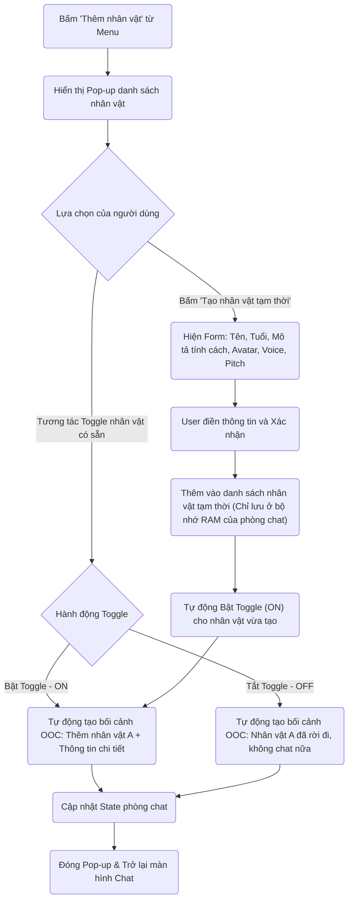
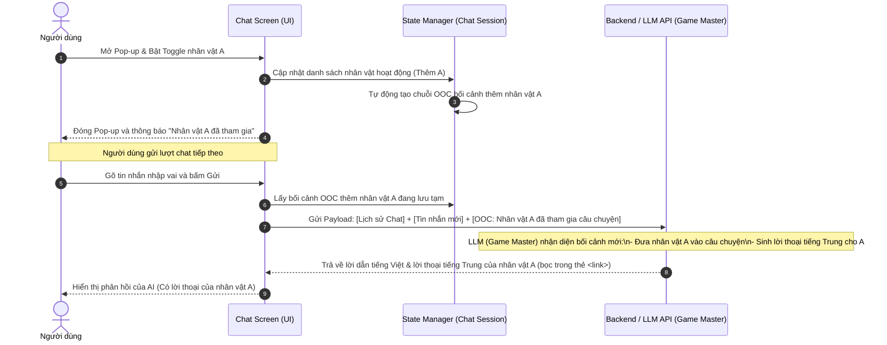

# Tính năng con: Thêm nhân vật & Tạo nhân vật tạm thời (Add Character)

Tính năng này giúp người dùng biến cuộc trò chuyện 1-1 thông thường thành một phòng chat đa nhân vật (Group Chat) sinh động bằng cách thêm/bớt nhân vật linh hoạt, hoặc tạo nhanh các nhân vật phụ dùng một lần.

---

## 1. Mô tả hoạt động

### 🔘 A. Quản lý trạng thái Nhân vật qua nút Toggle
Khi bấm nút **"Thêm nhân vật"** trong Menu góc phải của phòng chat, một Pop-up (Modal) sẽ hiện ra danh sách các nhân vật có sẵn. Cạnh mỗi nhân vật có một nút **Toggle (Bật/Tắt)**:

* **Trạng thái Bật (Toggle ON):**
  - Người dùng bấm bật nhân vật A.
  - Hệ thống sẽ **tự động sinh ra một câu lệnh OOC ẩn** để gửi kèm trong lượt chat tiếp theo của người dùng gửi lên AI Game Master.
  - *Nội dung OOC sinh ra*: 
    `[OOC: Nhân vật A (Tên: [Tên], Tuổi: [Tuổi], Mô tả tính cách: [Mô tả]) đã được thêm vào câu chuyện. Từ lượt chat này, bạn (với vai trò Game Master) có thể cho nhân vật này xuất hiện, hành động và đối thoại bằng tiếng Trung.]`
* **Trạng thái Tắt (Toggle OFF):**
  - Người dùng bấm tắt nhân vật A đã thêm trước đó.
  - Hệ thống **tự động sinh ra một câu lệnh OOC ẩn** gửi kèm trong lượt chat tiếp theo:
  - *Nội dung OOC sinh ra*:
    `[OOC: Nhân vật A đã rời khỏi câu chuyện. Vui lòng không cho nhân vật này xuất hiện hoặc đưa vào các diễn biến chat tiếp theo nữa.]`

### 👤 B. Tạo nhân vật tạm thời (Temporary Character)
Để phục vụ cho các tình huống phát sinh đột xuất trong cốt truyện (ví dụ: người đi đường, bà bán rau, tài xế taxi...), người dùng có thể tạo nhanh nhân vật tạm thời ngay trong phòng chat:
* Bấm nút **"Tạo nhân vật tạm thời"** trên Pop-up.
* Một hộp thoại nhập liệu hiện ra yêu cầu điền: **Tên, Tuổi, Mô tả tính cách, Chọn avatar (tải từ máy và upload lên server), Chọn voice, Chỉnh pitch**.
* Nhấn **"Xác nhận"**: Nhân vật tạm thời được tạo thành công, tự động xuất hiện trong danh sách nhân vật với trạng thái **Toggle Bật (ON)**.
* **Quy tắc vòng đời:** Nhân vật tạm thời này **không được lưu vào Database của ứng dụng**. Khi người dùng kết thúc phiên chat hiện tại, các nhân vật tạm thời này sẽ bị xóa khỏi bộ nhớ State của thiết bị và biến mất vĩnh viễn. 
*(Lưu ý: Việc tạo nhân vật vĩnh viễn để tái sử dụng nhiều lần sẽ được thực hiện ở màn hình quản lý nhân vật ngoài Home và tạm thời chưa bàn đến ở đây).*

---

## 2. Sơ đồ luồng hoạt động (Flowchart)

Sơ đồ dưới đây mô tả cách người dùng tương tác với Pop-up quản lý nhân vật:

---

## 3. Sơ đồ UML tuần tự (Sequence Diagram)

Sơ đồ mô tả quy trình gửi lệnh OOC ẩn lên AI Game Master khi người dùng Bật/Tắt Toggle của một nhân vật:

