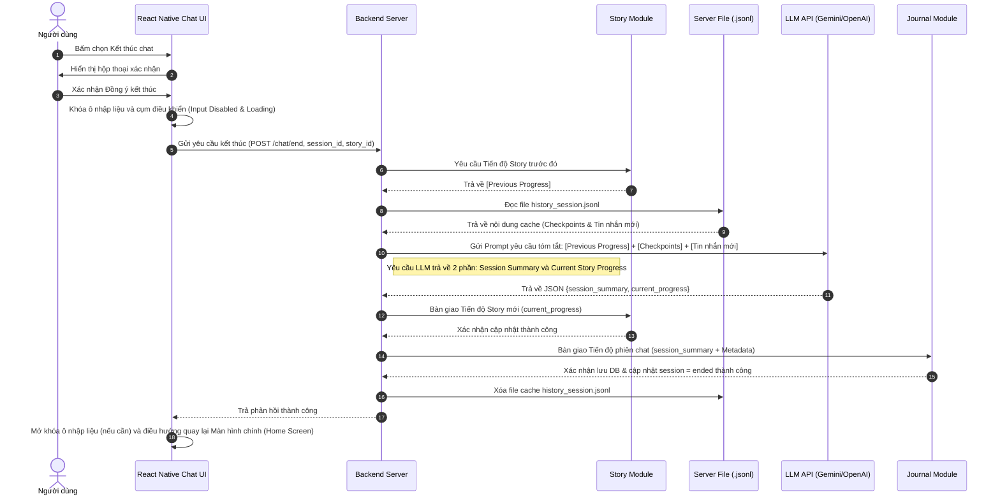
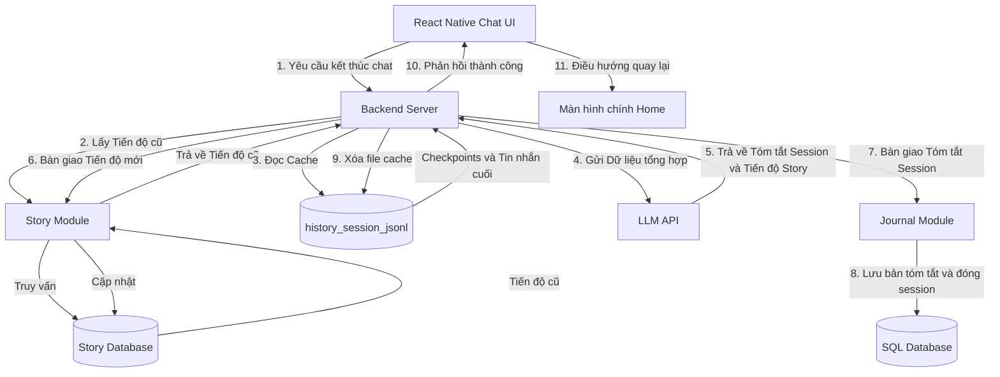

# Tính năng con: Kết thúc chat & Tóm tắt bài học (End Chat)

Tính năng **Kết thúc chat** giúp người dùng đóng lại phiên hội thoại hiện tại và tự động lưu bản tóm tắt cốt truyện bằng tiếng Việt. Tính năng này đóng vai trò là một bộ điều phối (Orchestrator) thực hiện thu thập dữ liệu cache, làm sạch, tóm tắt và bàn giao **bản tóm tắt (summary)** cùng các siêu dữ liệu (metadata) của session sang cho module Journal để lưu trữ vĩnh viễn (lịch sử tin nhắn chi tiết sẽ do History Store bàn giao riêng). Sau khi hoàn tất, hệ thống sẽ đưa người dùng trở lại màn hình Home.

---

## 1. Mô tả hoạt động

- **Vị trí**: Nút **"Kết thúc chat"** trong Menu góc phải của Header.
- **Cách thức hoạt động**:
  - **Bước 1**: Người dùng bấm nút "Kết thúc chat" và xác nhận đồng ý đóng phiên hội thoại.
  - **Bước 2**: Giao diện Client (React Native) lập tức **khóa ô nhập liệu chat (Input Disabled)** và các nút điều khiển, hiển thị biểu tượng đang tải (Loading indicator) để tránh người dùng tiếp tục gửi tin nhắn trong lúc hệ thống đang đóng phiên.
  - **Bước 3 (Tổng hợp Tóm tắt Session và Tiến độ Story)**: Backend Server đọc nội dung file cache `.jsonl` từ Server đĩa cứng và truy xuất **Tiến độ cốt truyện trước đó (Previous Progress)** từ cơ sở dữ liệu Story. Để triệt tiêu nguy cơ tràn token mà vẫn đảm bảo ngữ cảnh tóm tắt hoàn chỉnh, hệ thống sẽ:
    - Quét toàn bộ file `.jsonl` để thu thập **tất cả các dòng `checkpoint`** đã được tạo ra trong phiên hiện tại.
    - Lấy tiếp toàn bộ các tin nhắn đã làm sạch (phẳng hóa `assistant`, lấy thoại của `user`) nằm phía sau dòng checkpoint cuối cùng.
    - Gửi payload tổng hợp gồm: `[Tiến độ cốt truyện trước đó]` + `[Danh sách Checkpoint Summaries hiện tại]` + `[Các tin nhắn sau checkpoint cuối cùng]` lên LLM API.
    - Yêu cầu LLM thực hiện 2 việc độc lập:
      1. Tóm tắt nội dung dành riêng cho phiên chat hiện tại (Session Summary).
      2. Tổng hợp thành **Tiến độ cốt truyện hiện tại (Current Story Progress)** mới nhất để lưu lại cho tương lai.
  - **Bước 4**: Backend Server thực hiện việc bàn giao dữ liệu cho các module tương ứng:
    - Bàn giao **Tiến độ cốt truyện hiện tại (current_progress)** cho **Story Module**. Story Module sẽ chịu trách nhiệm cập nhật tiến độ mới này vào Database.
    - Bàn giao **bản tóm tắt phiên chat (session summary)** cùng metadata của session (như `session_id`, `user_id`, `story_id`, `started_at`, `ended_at`) cho **Journal Module** xử lý. Journal Module chịu trách nhiệm tự động thực hiện lưu trữ bản tóm tắt này vào Database và cập nhật trạng thái session sang đã đóng (`ended`).
  - **Bước 5**: Nhận được phản hồi thành công từ module Journal, Backend Server xóa file cache `.jsonl` tạm thời trên Server và trả phản hồi thành công về cho Client.
  - **Bước 6**: Nhận được tín hiệu thành công, Client **tự động chuyển hướng điều hướng quay trở lại Màn hình chính (Home Screen)** luôn mà không cần qua bất kỳ màn hình báo cáo trung gian nào. Người dùng có thể xem lại lịch sử các buổi chat này sau đó thông qua tính năng **Journal (Nhật ký)** từ màn hình Home.

### Ví dụ cấu trúc JSON dữ liệu bàn giao cho Journal:
```json
{
  "session_id": "session_123456-uuid-abcd",
  "user_id": "user_789",
  "story_id": "story_cabin_in_snow_001",
  "started_at": 1782500000000, 
  "ended_at": 1782500500000,
  "summary": "Bối cảnh ban đầu là bão tuyết trong cabin gỗ. Có tiếng gõ cửa lạ vang lên, hai anh em sau khi mở cửa đã phát hiện ra một chú chó lạc dưới tuyết và đưa nó vào nhà sưởi ấm. Bão tuyết hiện đã ngớt."
}
```

---

## 2. Sơ đồ tuần tự Kết thúc chat (Sequence Diagram)

Sơ đồ mô tả luồng tương tác giữa Client, Server, LLM API, Journal Module và File Cache khi kết thúc phiên hội thoại:



---

## 3. Sơ đồ Luồng dữ liệu End Chat (Data Flow Diagram)

Sơ đồ mô tả dòng chảy của dữ liệu và các thao tác đọc/ghi giữa Client, Backend Server, LLM API và Relational Database (SQL) thông qua Journal:



---

## 4. Ý tưởng phát triển (Premium)

* **Tự động lưu trữ nhanh (One-click End):** Cung cấp cấu hình cho phép kết thúc chat ngay lập tức không cần xác nhận qua modal nếu người dùng đã bật chế độ "Lưu nhanh" trong cài đặt app.
* **Xuất bản kịch bản (Export Script):** Cho phép người dùng xuất bản cuộc trò chuyện nhập vai của mình thành một file PDF hoặc tài liệu chữ có kèm Pinyin và bản dịch từ màn hình Nhật ký (Journal) để ôn tập.