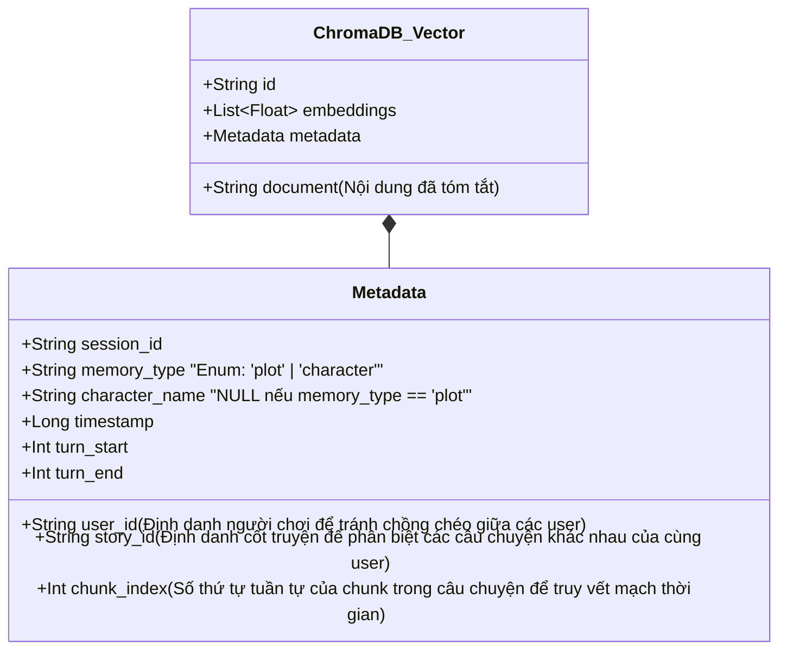
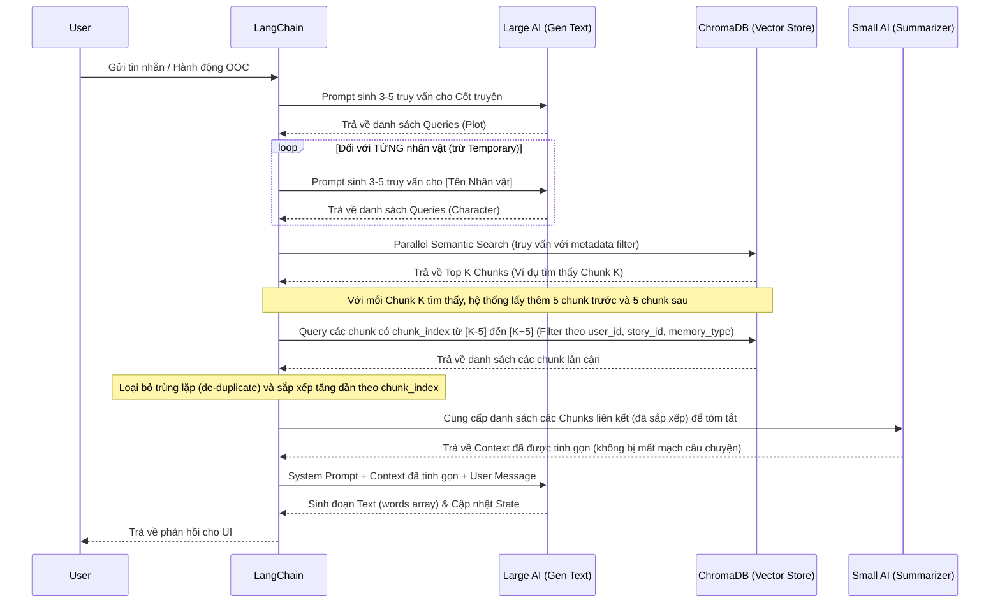
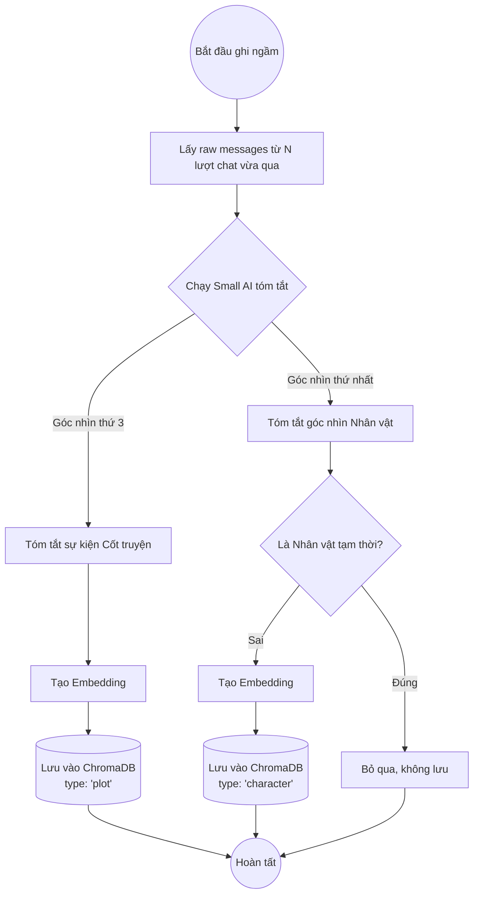
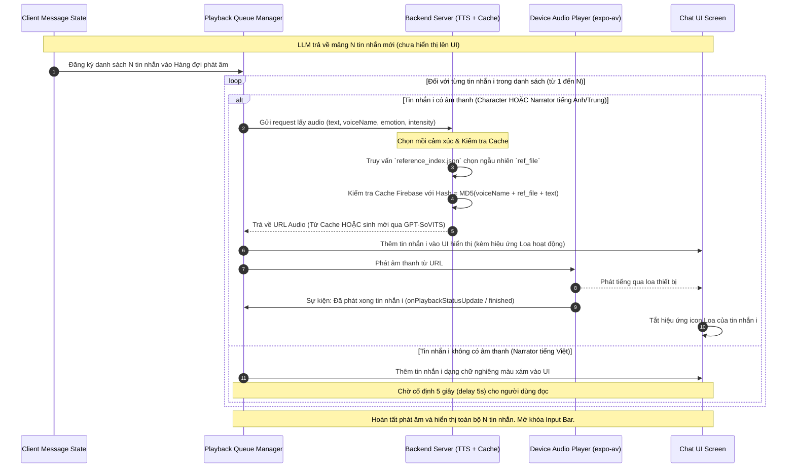

# Quản lý Tin nhắn và Trí nhớ Dài hạn (Long-term Memory)

Tài liệu này định nghĩa kiến trúc hệ thống trí nhớ dài hạn sử dụng **ChromaDB**, cách thức phân loại trí nhớ, và quy trình điều phối AI (Orchestration) cho các model được chạy qua **Ollama**.

## 1. Phân loại Trí nhớ (Dual-Memory System)

Hệ thống sử dụng hai luồng trí nhớ song song nhằm đảm bảo bối cảnh cốt truyện không bị nhầm lẫn với trải nghiệm cá nhân của từng nhân vật.

### 1.1. Trí nhớ Cốt truyện (Plot / Narrator Memory)
- **Góc nhìn:** Thứ 3 (Người kể chuyện / Narrator).
- **Mục đích:** Ghi nhận lại các sự kiện khách quan, diễn biến chính của cốt truyện đã xảy ra trong các lượt chat trước.
- **Ví dụ nội dung lưu:** *"Mimi vừa bị mắng vì đã chơi điện thoại. Cô bé đang rất sợ hãi."*
- **Lưu trữ:** Mỗi "chunk" trong bộ nhớ là một bản tóm tắt các sự kiện diễn ra trong một khoảng thời gian hoặc một số lượt chat nhất định.

### 1.2. Trí nhớ Nhân vật (Character-specific Memory)
- **Góc nhìn:** Thứ nhất (Tôi / Mình / Tên nhân vật).
- **Mục đích:** Lưu trữ cảm nhận, hành động, và suy nghĩ riêng của từng nhân vật về các sự kiện.
- **Quy tắc quan trọng:** **Chỉ áp dụng cho các nhân vật cố định (vĩnh viễn)**. Những nhân vật tạm thời (Temporary Characters) xuất hiện chớp nhoáng (được định nghĩa trong `add_character.md`) sẽ KHÔNG được lưu trí nhớ riêng biệt.
- **Ví dụ nội dung lưu:**
  - *Anh trai:* *"Tôi vừa xông thẳng vào phòng Mimi. Cô bé dám lấy điện thoại của mình chơi."*
  - *Mimi:* *"Anh trai bất ngờ xông vào phòng mình và lấy điện thoại của mình. Mình sợ quá."*

---

## 2. Công cụ Điều phối AI (AI Orchestration Tool)

Dựa trên việc sử dụng Ollama cho local inference, dự án sử dụng **LangChain** (hoặc LangGraph nếu cần quản lý State phức tạp) làm công cụ điều hướng AI chính.

**Lý do đề xuất LangChain:**
1. Hỗ trợ native cho ChromaDB và Ollama.
2. Hỗ trợ **Multi-Query Retriever**: Tự động sinh nhiều câu hỏi ngữ cảnh khác nhau từ câu input của người dùng để truy vấn chính xác hơn.
3. Hỗ trợ **Parallel Execution**: Truy xuất ChromaDB đồng thời cho cả Plot Memory và nhiều Character Memories, tối ưu hóa tốc độ phản hồi.

---

## 3. Cấu trúc Dữ liệu Vector (ChromaDB Schema)

Dữ liệu sẽ được lưu trong ChromaDB với cấu trúc Metadata để có thể dễ dàng lọc (filter) theo nhân vật hoặc loại bộ nhớ.



> [!NOTE]
> **Cơ chế cô lập dữ liệu (Data Isolation):**
> Khi thực hiện Semantic Search trên ChromaDB, hệ thống luôn áp dụng bộ lọc metadata (Metadata Filtering):
> ```json
> {
>   "user_id": "current_user_id",
>   "story_id": "current_story_id"
> }
> ```
> Việc này đảm bảo rằng mỗi người chơi và mỗi câu chuyện độc lập sẽ có không gian trí nhớ hoàn toàn riêng biệt, triệt tiêu khả năng lẫn lộn ký ức giữa các session khác nhau.

---

## 4. Quy trình Đọc Trí nhớ (Read / RAG Flow)

Khi người dùng gửi một tin nhắn hoặc thực hiện một hành động OOC (Out Of Character), quá trình sinh phản hồi được xử lý qua mô hình Multi-Agent (Large AI và Small AI).



### 4.1. Cơ chế Khôi phục Cực đại Ngữ cảnh (Sliding Window Context Expansion)

Khi tìm kiếm ngữ nghĩa (Semantic Search), ChromaDB chỉ trả về các chunk riêng lẻ khớp nhất với từ khóa. Điều này dễ dẫn đến việc AI bị "mất ngữ cảnh" của những gì diễn ra ngay trước và sau chunk đó (ví dụ: chỉ lấy được hành động đòi điện thoại mà mất đi hành động giật điện thoại ở ngay câu tiếp theo).

Để khắc phục, hệ thống áp dụng kỹ thuật **Cửa sổ trượt mở rộng (Sliding Window Expansion)**:

1. **Tìm kiếm ban đầu:** ChromaDB trả về danh sách các chunk kết quả tốt nhất ($C_1, C_2, ...$). Mỗi chunk này có một chỉ số `chunk_index = K`.
2. **Truy vấn lân cận:** Với mỗi chunk $C_i$ có index $K$, hệ thống gửi một truy vấn phụ đến ChromaDB (hoặc cơ sở dữ liệu quan hệ lưu bản backup) để lấy tất cả các chunk có chỉ số:
   $$\text{chunk\_index} \in [K-5, K+5]$$
   *(Điều kiện lọc bắt buộc: Cùng `user_id`, `story_id`, `memory_type` và `character_name` nếu có).*
3. **Loại bỏ trùng lặp và Sắp xếp:** Nếu nhiều chunk tìm kiếm ban đầu nằm gần nhau, các cửa sổ của chúng sẽ giao nhau. Hệ thống sẽ gom tất cả các chunk thu được, loại bỏ các chunk bị lặp lại, và sắp xếp chúng tăng dần theo thứ tự thời gian (`chunk_index` từ nhỏ đến lớn).
4. **Tóm tắt ngữ cảnh:** Gửi toàn bộ chuỗi chunk liên tục đã được sắp xếp này cho **Small AI**. Small AI sẽ đọc toàn bộ mạch truyện mini này, tóm tắt lại thành một đoạn văn ngắn gọn, logic rồi mới đưa vào Context cho Large AI sinh phản hồi.

---

## 5. Quy trình Ghi Trí nhớ (Write / Summarize Flow)

Việc ghi nhớ không diễn ra ở mỗi tin nhắn để tránh quá tải cho LLM và giảm chi phí tài nguyên. Thay vào đó, tiến trình tóm tắt và lưu vào ChromaDB sẽ được kích hoạt dựa trên hai cơ chế chính: **Theo chu kỳ (Turn-based)** và **Theo sự kiện kích hoạt (Event-triggered)**.



### 5.1. Cơ chế Kích hoạt (Triggers)

Hệ thống kết hợp 4 loại kích hoạt để tối ưu hóa bộ nhớ:

| Loại Kích hoạt | Cách thức hoạt động | Ví dụ cụ thể |
| :--- | :--- | :--- |
| **1. Kích hoạt theo Lượt (Turn-based)** | • Hệ thống đếm số tin nhắn mới phát sinh trong Session.<br>• Khi số tin nhắn vượt quá một ngưỡng (Ví dụ: `N = 10` hoặc `15` tin nhắn), tiến trình ghi nhớ sẽ chạy ngầm để tóm tắt các tin nhắn cũ và giải phóng context window. | • Chat được 10 câu, hệ thống gom 10 câu đó lại tóm tắt thành 1 chunk bộ nhớ cốt truyện và nhân vật, sau đó đẩy vào ChromaDB. |
| **2. Kích hoạt theo Hệ thống (System Events)** | • Các hành động thay đổi trạng thái hội thoại hoặc bối cảnh do người dùng/hệ thống thực hiện. | • Người dùng nhấn nút **Kết thúc Chat** (`POST /chat/end`).<br>• Người dùng thực hiện hành động chuyển đổi bối cảnh (Ví dụ: bấm nút "Di chuyển đến Trường học" trên UI). |
| **3. Kích hoạt tự động bằng AI (AI-Detected Milestones)** | • Trong lúc sinh tin nhắn (JSON Mode), Large AI phát hiện một sự kiện bước ngoặt quan trọng hoặc sự thay đổi cảm xúc lớn.<br>• Large AI sẽ trả thêm một flag `"trigger_memory": true` cùng với tin nhắn.<br>• Backend nhận thấy flag này sẽ lập tức gọi tiến trình tóm tắt và ghi nhớ. | • Nhân vật chính quyết định tỏ tình, hoặc có một nhân vật bị thương nặng.<br>• Prompt của Large AI có chỉ dẫn: *"Nếu có bước ngoặt cốt truyện lớn xảy ra, hãy đặt 'trigger_memory': true trong JSON trả về"*. |
| **4. Kích hoạt chủ động từ Người dùng (User-Initiated Trigger)** | • Người chơi chủ động đánh dấu một hoặc một nhóm tin nhắn có nội dung quan trọng trên giao diện UI và nhấn nút **"Lưu vào Trí nhớ"**.<br>• Yêu cầu được gửi lên backend, hệ thống lập tức trích xuất nội dung đó, chạy qua Small AI để tạo chunk tóm tắt và lưu trực tiếp vào ChromaDB làm một điểm nhấn (High-priority memory). | • Người chơi nhấn giữ một tin nhắn quan trọng như: *"Tôi đã chính thức gia nhập hội học sinh"* và nhấn nút **Ghi nhớ** trên menu ngữ cảnh của ứng dụng. |

---

## 6. Luồng Xử lý và Hiển thị Tin nhắn tuần tự kết hợp TTS (Client-side Sequential TTS & Rendering Queue)

Để nâng cao trải nghiệm người dùng theo chuẩn Premium, khi AI phản hồi một mảng gồm nhiều tin nhắn (bao gồm lời thoại nhân vật và lời dẫn chuyện Narrator), Client sẽ không hiển thị đồng loạt toàn bộ tin nhắn ngay lập tức. Thay vào đó, Client sẽ áp dụng cơ chế **Hàng đợi tuần tự (Sequential Queue)** kết hợp hiển thị từng bước cùng âm thanh (TTS):

### 6.1. Sơ đồ UML Tuần tự (Sequence Diagram)



### 6.2. Mô tả thuật toán chi tiết ở Client

1. **Nhận phản hồi từ Server:**
   - Client nhận danh sách gồm $N$ tin nhắn mới từ API.
   - Các tin nhắn này được giữ trong bộ nhớ đệm (hoặc trạng thái ẩn) trên RAM, chưa cập nhật vào State danh sách hiển thị trên UI.

2. **Khởi tạo Hàng đợi (Queue Initialization):**
   - Đưa $N$ tin nhắn vào một hàng đợi xử lý tuần tự (FIFO Queue).
   - Tiếp tục giữ trạng thái **Khóa ô nhập liệu (Input Bar Disabled)** để người dùng không gửi tin nhắn mới cắt ngang luồng phát âm.

3. **Vòng lặp Tuần tự (Sequential Loop):**
   - Lấy tin nhắn thứ $i$ từ hàng đợi ra xử lý:
     - **Trường hợp tin nhắn Nhân vật (Character):**
       - Luôn có âm thanh. Client gọi lên Backend yêu cầu file âm thanh (`text`, `voiceName`, `emotion`, `intensity`).
       - **Tại Backend:**
         1. Tra cứu hệ thống mồi cảm xúc (tham chiếu `text-to-speed.md`) để lấy ngẫu nhiên một file `ref_file` phù hợp.
         2. Tạo mã băm Cache: `Hash = MD5(voiceName + ref_file + text)`.
         3. Kiểm tra file trên Firebase Storage theo mã Hash.
         4. Nếu Cache Miss: Gọi GPT-SoVITS sinh file gốc -> Dùng FFmpeg chỉnh Pitch -> Lưu lên Firebase Storage.
         5. Trả về Download URL cho Client.
       - Ngay khi nhận được URL trả về thành công từ Backend:
         1. Cập nhật State hiển thị để **render tin nhắn $i$ lên giao diện UI** (các tin nhắn từ $i+1$ đến $N$ vẫn ẩn).
         2. Gọi thư viện phát âm thanh (ví dụ: `expo-av`) để load và stream đoạn audio từ URL.
         3. Hiển thị hiệu ứng icon Loa đang phát 🔊 bên cạnh tin nhắn đó.
         4. Đợi sự kiện từ thư viện âm thanh báo hiệu phát xong hoàn toàn (sử dụng callback `onPlaybackStatusUpdate` thiết lập `didJustFinish == true`).
         5. Sau khi phát xong, ẩn hiệu ứng phát âm và tiếp tục chuyển sang tin nhắn thứ $i+1$.
     - **Trường hợp tin nhắn Lời dẫn (Narrator):**
       - Phân biệt theo ngôn ngữ của trường `text`:
         - **Nếu `text` là tiếng Anh hoặc tiếng Trung:** Có âm thanh. Tiến hành gọi Backend lấy URL Audio (kèm cơ chế Cache Hash tương tự) và phát âm thanh giống hệt như tin nhắn Nhân vật (sử dụng giọng đọc kể chuyện - Narrator voice).
         - **Nếu `text` là tiếng Việt:** Không có âm thanh.
           1. Cập nhật State hiển thị để render tin nhắn $i$ lên giao diện UI (in nghiêng màu xám).
           2. Chạy bộ đếm thời gian **chờ cố định đúng 5 giây** để người dùng kịp đọc xong.
           3. Sau khi hết 5 giây, tự động chuyển sang tin nhắn thứ $i+1$.

4. **Kết thúc Luồng:**
   - Khi hàng đợi trống (đã xử lý xong tin nhắn thứ $N$):
     - Mở khóa ô nhập liệu (Input Bar Enabled) cho phép người chơi chat tiếp lượt mới.

