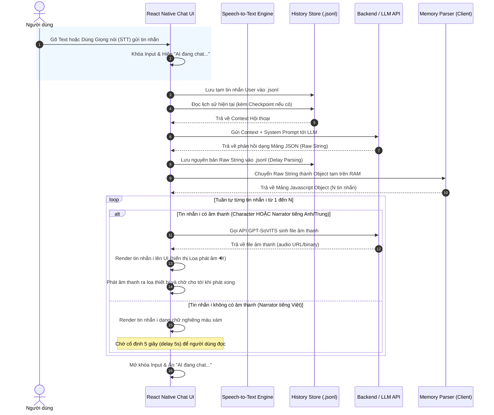
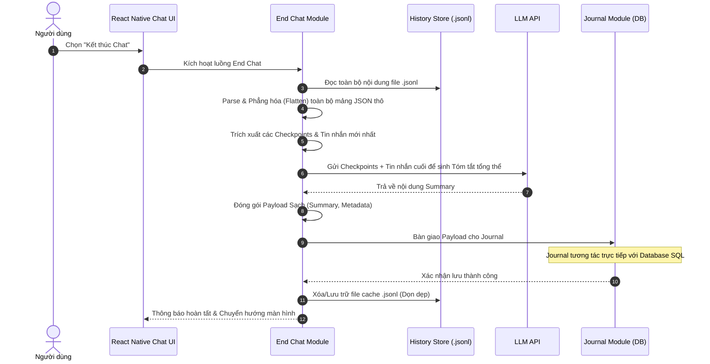
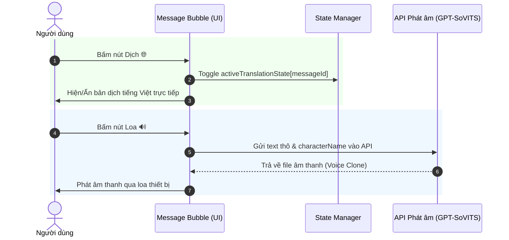
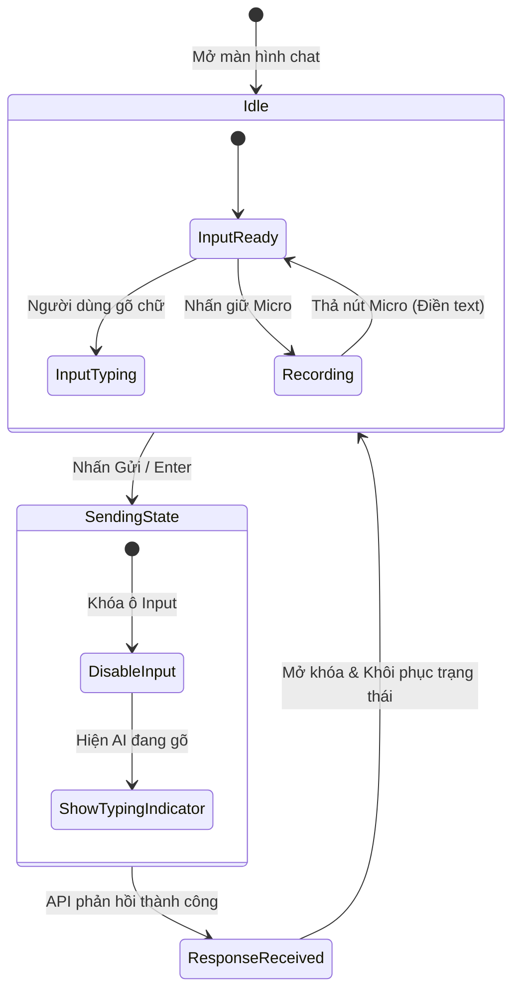

# Tổng quan Tính năng: Nhập vai Chat AI (Roleplay Chat)

Tài liệu này trình bày tổng quan về thiết kế giao diện, luồng hoạt động và kiến trúc tổng thể của hệ thống phòng chat nhập vai. Các module trong hệ thống được thiết kế theo hướng phân tách trách nhiệm (Separation of Concerns), tối ưu hóa hiệu suất (lazy parsing) và ngăn ngừa tràn token (checkpoints).

---

## 1. Kiến trúc Hệ sinh thái Tính năng (Architecture & Modules)

Hệ thống Chat được cấu thành từ các module con chuyên biệt, phối hợp nhịp nhàng từ lúc khởi tạo đến khi kết thúc phiên:

1. **Lưu trữ Lịch sử (History Store - `history_store.md`)**:
   - Quản lý trạng thái và lịch sử hội thoại đang diễn ra thông qua **file bộ đệm cục bộ (`.jsonl`)**, thay vì ghi liên tục vào CSDL SQL.
   - **Tối ưu hiệu suất**: Chỉ lưu trữ nguyên bản mảng JSON (raw string) trả về từ LLM vào `content` của tin nhắn AI. Trì hoãn việc phân tách (flattening) các tin nhắn con cho đến khi kết thúc phiên.
   - **Tối ưu Token**: Hỗ trợ cơ chế **Checkpoint**. Khi lịch sử quá dài, hệ thống tự động sinh tóm tắt trung gian (checkpoint) để nhúng vào Prompt, giúp giảm thiểu tải lượng token cho các lượt chat tiếp theo.

2. **Kết thúc Phiên (End Chat - `end_chat.md`)**:
   - Đảm nhận khâu chốt hạ phiên chat nhưng **không tương tác trực tiếp với Database**.
   - **Quy trình**: Đọc toàn bộ file cache `jsonl` -> Parse và phẳng hóa (flatten) các mảng JSON thô thành danh sách đối tượng tin nhắn độc lập -> Trích xuất toàn bộ Checkpoint hiện có và các tin nhắn sau Checkpoint cuối cùng để gọi LLM sinh **Tóm tắt (Summary)** tổng thể.
   - Bàn giao **Payload sạch** (Summary, Metadata, First/Last Message) sang cho module **Journal** để lưu trữ vĩnh viễn vào DB.

3. **Bối cảnh Ngoài lề (OOC Context - `ooc_context.md`)**:
   - Quản lý System Prompt và bộ quy tắc chỉ đạo LLM nhập vai.
   - Cho phép người dùng bổ sung các thông tin ngoài lề (OOC) để điều hướng bối cảnh, hành vi, và trạng thái của các nhân vật trong suốt phiên chat.

4. **Chat Tự động (Auto Chat - `auto_chat.md`)**:
   - Tính năng "Auto-Pilot" giúp LLM tự động dẫn dắt cốt truyện bằng cách đệ quy gọi API.
   - Được thiết kế tối ưu để không làm gián đoạn UI/UX (có nút dừng khẩn cấp), kết hợp hiệu ứng âm thanh (TTS) tự động để tạo trải nghiệm "xem phim" rảnh tay.

5. **Tin nhắn (Message Chat - `message_chat.md`)**:
   - Phân tích cấu trúc JSON Schema đặc thù từ AI. Đảm bảo dữ liệu trả về tách bạch rõ ràng giữa phần thoại (Character) và phần dẫn chuyện (Narrator).
   - Dữ liệu cung cấp sẵn cấu trúc chữ Hán, Pinyin và tiếng Việt, giúp Client UI map chính xác 100% không cần Regex.

6. **Thêm Nhân vật (`add_character.md`)**:
   - Module quản lý việc khởi tạo và thiết lập các nhân vật tham gia vào phòng chat.

---

## 2. Thiết kế Giao diện & Trạng thái UI

Giao diện phòng chat được thiết kế tối giản, tập trung vào nhân vật và nội dung câu thoại:

1. **Header (Thanh tiêu đề)**:
   - Bên trái: Nút Quay lại (Back) + Avatar và Tên nhân vật AI.
   - Bên phải: Nút Menu Ba chấm (•••) mở ra danh sách các tùy chọn nhanh: OOC, Auto Chat, Kết thúc Chat.

2. **Khu vực tin nhắn (Message List)**:
   - Hiển thị danh sách tin nhắn phân tách rõ ràng:
     - **Nhân vật (Character)**: Dạng bong bóng thoại. Chữ Hán lớn, Pinyin nhỏ hơn nằm trên đầu từng chữ Hán/từ ghép, nút Loa 🔊 và nút Dịch 🌐 ở phía dưới.
     - **Dẫn chuyện (Narrator)**: Miêu tả hành động/bối cảnh được định dạng chữ in nghiêng màu xám.
   - **Tương tác trực tiếp**: Nhấn nút Dịch 🌐 sẽ toggle hiển thị ngay bản dịch của tin nhắn đó mà không cần pop-up rườm rà.

3. **Input Bar (Thanh nhập liệu dưới cùng)**:
   - Tích hợp ô nhập văn bản, nút gửi và nút Micro (Speech-to-Text).
   - **Khóa giao diện bảo vệ**: Sau khi nhấn gửi, ô input lập tức bị **vô hiệu hóa (disabled)** và hiển thị Typing Indicator. Sau khi hoàn tất vòng đời parse JSON và render, ô input mới được mở lại, tránh spam gây nhiễu luồng lịch sử.

---

## 3. Sơ đồ UML tuần tự (Sequence Diagram) - Luồng Gửi tin nhắn

Sơ đồ mô tả quy trình gửi tin nhắn, lấy lịch sử từ bộ đệm, gọi API và xử lý Raw JSON trên RAM để render:

---

## 4. Sơ đồ UML tuần tự - Kết thúc Phiên (End Chat)

Quy trình chốt hạ phiên, làm sạch dữ liệu và bàn giao cho Journal:

---

## 5. Sơ đồ UML tuần tự - Tương tác Dịch & Phát âm (TTS)

---

## 6. Sơ đồ luồng hoạt động trạng thái Input (State Machine)

