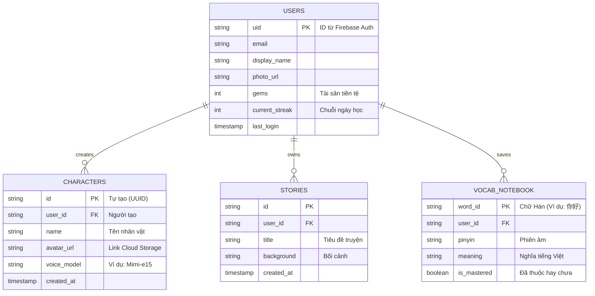
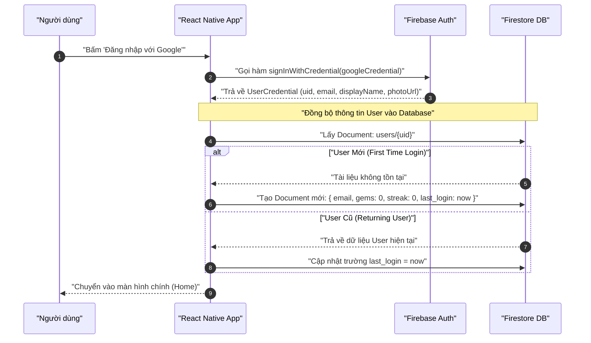
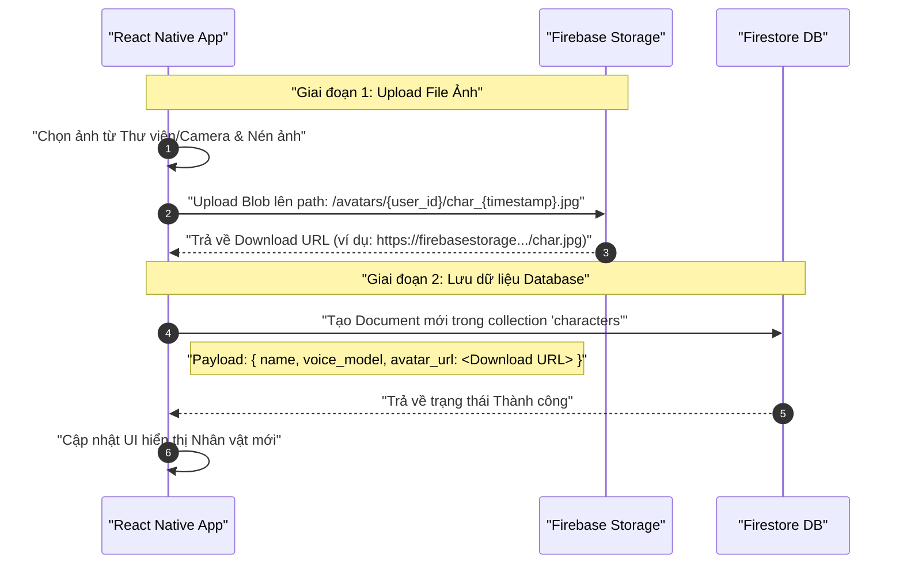
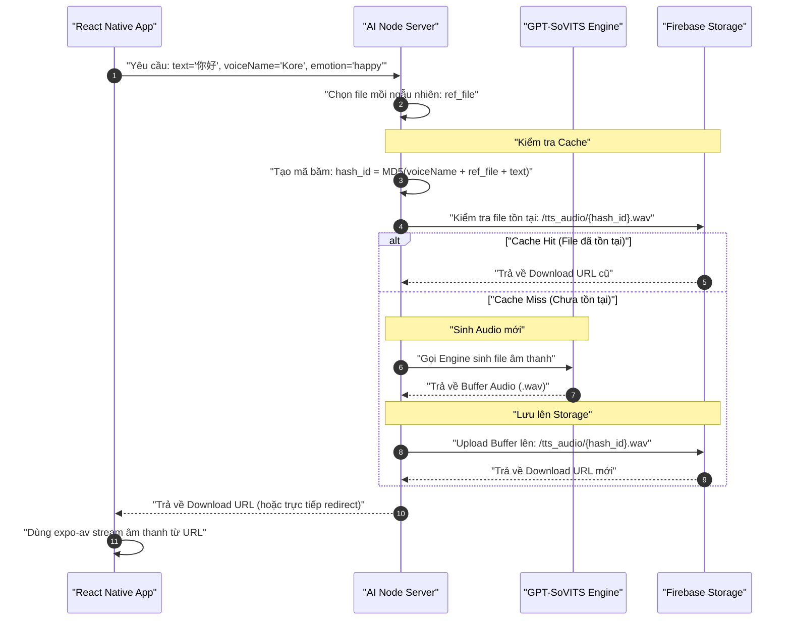

# Kế hoạch Tích hợp Firebase (Database, Storage & Authentication)

> ⚠️ **PHIÊN BẢN CŨ (v1)** — Tài liệu này là bản thiết kế ban đầu khi hệ thống dự kiến dùng Firebase làm backend chính (BaaS).  
> **Kiến trúc chính thức (v2)** đã chuyển sang **Polyglot Persistence**: PostgreSQL (domain data) + Firestore (chỉ sync profile realtime) + ChromaDB (vector memory). Xem [`technical documentation/00_overview_architecture.md`](technical%20documentation/00_overview_architecture.md) và [`technical documentation/01_database_schema.md`](technical%20documentation/01_database_schema.md).  
> **Những gì vẫn còn đúng trong tài liệu này:**  
> - Firebase Authentication (Google Sign-In) — giữ nguyên  
> - Firebase Storage (avatars, TTS cache) — giữ nguyên nhưng TTS cache có thể chuyển sang VPS disk (xem `11_cost_estimation.md`)  
> - Security Rules — giữ nguyên, đã cập nhật trong `10_security_design.md`  
> **Những gì đã THAY ĐỔI:**  
> - Cloud Firestore KHÔNG còn là DB chính cho Stories, Characters, Vocabulary, Missions — đã chuyển sang PostgreSQL  
> - Client KHÔNG ghi trực tiếp domain data vào Firestore — phải qua NestJS API  
> - Schema Firestore chỉ còn collection `users/{uid}` với subset fields  

---

*(Nội dung dưới đây giữ nguyên để tham khảo thiết kế ban đầu)*

Tài liệu này vạch ra kế hoạch chi tiết để sử dụng hệ sinh thái Firebase làm backend (BaaS - Backend as a Service) cho ứng dụng Roleplay Chat AI. Firebase sẽ giải quyết 3 bài toán cốt lõi: Đăng nhập, Lưu trữ dữ liệu có cấu trúc, và Lưu trữ File Media (Hình ảnh, Âm thanh).

---

## 1. Phân bổ Dịch vụ Firebase

### 1.1. Firebase Authentication (Xác thực người dùng)
- **Phương thức:** Google Sign-In.
- **Mục đích:** Đăng nhập nhanh chóng, an toàn mà không cần quản lý mật khẩu. Lấy các thông tin cơ bản như Email, Tên hiển thị, và Ảnh đại diện mặc định của người dùng từ Google.

### 1.2. Cloud Firestore (Database NoSQL)
- **Mục đích:** Lưu trữ dữ liệu động, đồng bộ hóa thời gian thực (Real-time sync) xuống Client (React Native).
- **Các dữ liệu cần lưu:** 
  - Thông tin người chơi (Số Gem, Tiến độ Streak, Level HSK).
  - Danh sách nhân vật (Characters).
  - Các cốt truyện (Stories) và metadata của phiên chat.
  - Sổ tay từ vựng (Vocabulary Notebook) đã sưu tầm.

### 1.3. Firebase Cloud Storage (Lưu trữ Media)
- **Mục đích:** Lưu trữ file vật lý dung lượng lớn.
- **Cấu trúc thư mục (Bucket structure):**
  - `/avatars/{user_id}/`: Chứa ảnh đại diện do người dùng tự upload khi tạo nhân vật.
  - `/tts_audio/`: Chứa các file âm thanh `.wav` hoặc `.mp3` sinh ra từ GPT-SoVITS. (Việc lưu trữ trên Cloud Storage giúp tạo cơ chế Caching: Nếu một câu thoại đã được AI sinh ra trước đó, hệ thống chỉ cần gọi URL tải về thay vì tốn GPU để sinh lại).

---

## 2. Lược đồ Cơ sở dữ liệu (Firestore ERD)

Dưới đây là sơ đồ quan hệ các thực thể sẽ được lưu trong Cloud Firestore.



---

## 3. Các Sơ đồ Tuần tự (Sequence Diagrams)

### 3.1. Luồng Đăng nhập bằng Google

Sơ đồ mô tả cách React Native tương tác với Firebase Auth và Firestore để khởi tạo tài khoản.



---

### 3.2. Luồng Tạo Nhân vật (Upload Avatar lên Storage)

Sơ đồ mô tả quy trình lưu trữ Avatar vào Cloud Storage và lấy link để lưu vào Database.



---

### 3.3. Luồng Lưu trữ Âm thanh TTS (Với Caching)

Thay vì trực tiếp stream âm thanh từ Server xử lý AI tới App, việc upload âm thanh lên Firebase Storage giúp tái sử dụng (Cache) và giảm tải cho GPU.



---

## 4. Cấu hình Bảo mật (Firebase Security Rules)

Để đảm bảo dữ liệu không bị truy cập trái phép, cần thiết lập các Rule bảo mật cho Firestore và Storage:

**Firestore Rules:**
```javascript
rules_version = '2';
service cloud.firestore {
  match /databases/{database}/documents {
    // Chỉ User đã đăng nhập mới được đọc/ghi dữ liệu của chính họ
    match /users/{userId} {
      allow read, write: if request.auth != null && request.auth.uid == userId;
    }
    match /characters/{charId} {
      allow read, write: if request.auth != null && request.auth.uid == resource.data.user_id;
    }
  }
}
```

**Storage Rules:**
```javascript
rules_version = '2';
service firebase.storage {
  match /b/{bucket}/o {
    // Cho phép mọi user đã đăng nhập đọc file audio
    match /tts_audio/{allPaths=**} {
      allow read: if request.auth != null;
      allow write: if false; // Chỉ Server (Admin SDK) mới được upload
    }
    
    // User chỉ được upload và đọc avatar của chính họ
    match /avatars/{userId}/{allPaths=**} {
      allow read, write: if request.auth != null && request.auth.uid == userId;
    }
  }
}
```
