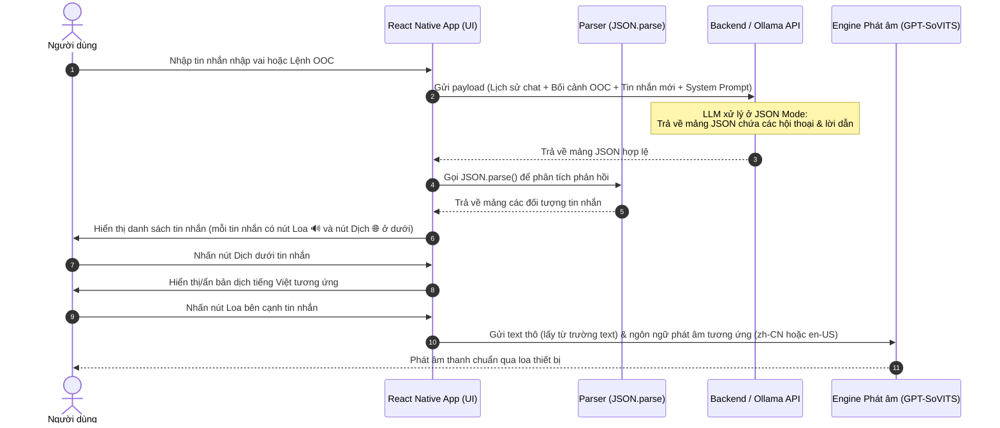
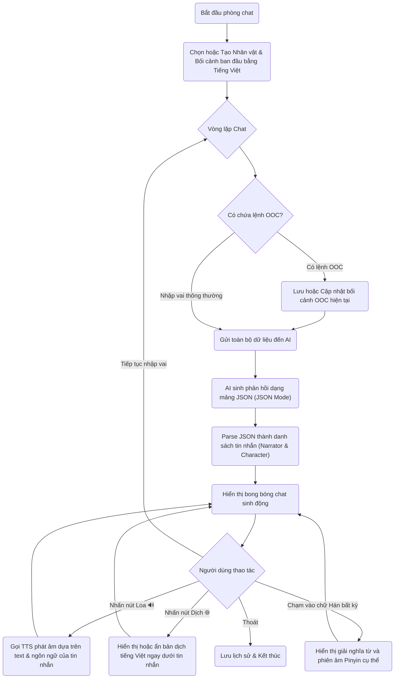

# Kế hoạch phát triển ứng dụng React Native Roleplay Chat AI & Học tiếng Trung

> ⚠️ **PHIÊN BẢN CŨ (v1)** — Đây là bản kế hoạch ban đầu (concept/ideation phase).  
> **Tài liệu kỹ thuật chính thức (v2)** nằm trong thư mục [`technical documentation/`](technical%20documentation/00_overview_architecture.md) gồm 12 file chi tiết (00-11).  
> **Những thay đổi chính so với bản này:**  
> - Kiến trúc: Thêm NestJS backend server (Client không gọi trực tiếp LLM API nữa)  
> - Database: Chuyển từ Firestore-only sang PostgreSQL + Firestore (profile sync) + ChromaDB (memory)  
> - Thêm: Redis (cache/lock), BullMQ (queue), Event-driven architecture  
> - Thêm modules: Mission/Streak, Shop, Journal, Vocabulary SRS, Tutorial  
> - TTS: Chi tiết hơn với cache hash, FFmpeg pitch, distributed lock  
> - Memory: RAG pipeline với LangChain + ChromaDB + Sliding Window  
> **File này giữ nguyên để tham khảo ý tưởng ban đầu và System Prompt draft.**

---

Chào bạn! Dưới đây là kế hoạch chi tiết với sơ đồ UML tuần tự và luồng hoạt động đã được sửa lại cú pháp Mermaid chuẩn để hiển thị chính xác.

---

## 1. Sơ đồ UML tuần tự (Sequence Diagram)

Sơ đồ thể hiện luồng tương tác giữa các thành phần trong hệ thống (sử dụng định dạng JSON thay vì thẻ HTML/XML):



---

## 2. Sơ đồ luồng hoạt động (Flowchart)

Sơ đồ mô tả chi tiết các bước vận hành của ứng dụng:



---

## 3. Cách thức hoạt động của AI & System Prompt Đề xuất (Chế độ JSON)

Để đảm bảo tính nhất quán dữ liệu 100% và dễ dàng xử lý ở Client, AI sẽ hoạt động ở **JSON Mode** và trả về một **mảng JSON (JSON Array)** chứa danh sách các tin nhắn của người dẫn chuyện (Narrator) và các nhân vật (Characters).

### Cấu trúc Schema của mỗi Object trong mảng JSON:
1. `characterName`: `string` - Tên của nhân vật đang thoại, hoặc `"Narrator"` nếu là người dẫn chuyện/mô tả hành động.
2. `text`: `string` - Nội dung câu thoại hoặc lời dẫn.
   - Nếu `characterName` là tên nhân vật: Viết bằng **tiếng Trung**.
   - Nếu `characterName` là `"Narrator"`: Có thể viết bằng **tiếng Việt**, **tiếng Anh**, hoặc **tiếng Trung** tùy theo cấu hình ngôn ngữ của phòng chat.
3. `Emotion`: `string` - Cảm xúc của câu thoại hoặc hành động đó. Các cảm xúc chính bao gồm:
   - `Angry`: Giận dữ (tương ứng ký hiệu biểu thị: `!!!`)
   - `Shouting`: Hét lên (tương ứng ký hiệu biểu thị: `!!!!!`)
   - `Disgusted`: Ghê tởm (tương ứng ký hiệu biểu thị: `呃... ...`)
   - `Sad`: Buồn bã (tương ứng ký hiệu biểu thị: `... ...`)
   - `Scared`: Sợ hãi (tương ứng ký hiệu biểu thị: `ah... ...`)
   - `Surprised`: Ngạc nhiên (tương ứng ký hiệu biểu thị: `咦?! ?!`)
   - `Shy`: Ngại ngùng (tương ứng ký hiệu biểu thị: `...`)
   - `Affectionate`: Trìu mến (tương ứng ký hiệu biểu thị: `嗯...`)
   - `Happy`: Vui vẻ (tương ứng ký hiệu biểu thị: `!`)
   - `Excited`: Phấn khích (tương ứng ký hiệu biểu thị: `哇! !!!`)
   - `Serious`: Nghiêm túc (tương ứng ký hiệu biểu thị: `.`)
   - `Neutral`: Bình thường (giữ nguyên, không đổi giọng, không có ký hiệu đặc biệt)
4. `Intensity`: `string` - Mức độ cảm xúc nâng cao giọng, bao gồm: `low`, `medium`, `high`.
5. `translation`: `string` - Bản dịch tiếng Việt sát nghĩa.
   - BẮT BUỘC có đối với Character.
   - Đối với Narrator: BẮT BUỘC nếu `text` viết bằng tiếng Anh hoặc tiếng Trung; bỏ qua/không điền nếu `text` viết bằng tiếng Việt.
6. `words`: `array of object` - Mảng phân rã các từ/chữ Hán trong câu thoại/lời dẫn để hiển thị bính âm và dịch nghĩa tương ứng cho từng từ.
   - BẮT BUỘC đối với Character.
   - Đối với Narrator: BẮT BUỘC nếu `text` viết bằng tiếng Trung; bỏ qua/không điền nếu `text` viết bằng tiếng Việt hoặc tiếng Anh.
   - Cấu trúc của mỗi object trong mảng `words`:
     - `hz`: `string` - Chữ Hán hoặc từ ghép (ví dụ: `"你"`, `"干嘛"`).
     - `py`: `string` - Phiên âm Pinyin tương ứng (ví dụ: `"nǐ"`, `"gàn má"`).
     - `vn`: `string` - Nghĩa tiếng Việt tương ứng (ví dụ: `"Em/Mày"`, `"làm gì"`).

---

### System Prompt Đề xuất:

```text
Bạn là Game Master điều phối Roleplay. 

[DATABASE NHÂN VẬT]: {danh_sach_nhan_vat}
[CỐT TRUYỆN CHÍNH]: {tom_tat_cot_truyen_tu_overview}
[TIẾN ĐỘ TRUYỆN]: {tien_do_truyen_hien_tai}
[HSK LEVEL]: {hsk_level_tu_profile}
[NGÔN NGỮ NARRATOR]: {ngon_ngu_cua_nguoi_dung} (Ví dụ: Tiếng Việt)

QUY TẮC:
1. Trình độ: Từ vựng/ngữ pháp của nhân vật bám sát [HSK LEVEL], không dùng từ phức tạp.
2. Vai trò: Chỉ đóng vai [ACTIVE CHARACTERS] hoặc "Narrator".
3. Bối cảnh: Tuân thủ [BỐI CẢNH (OOC)] và lập tức phản ánh [DIỄN BIẾN MỚI (OOC)].
4. Ngôn ngữ: NHÂN VẬT thoại bằng Tiếng Trung. NARRATOR BẮT BUỘC dùng [NGÔN NGỮ NARRATOR].
5. Bán vật phẩm (Tùy chọn): Dựa theo hoàn cảnh, Narrator có thể mời người dùng mua một vật phẩm cho nhân vật. Hãy tự định giá hợp lý từ 10 - 20 gem. Khi bán, trả về thêm trường `shopEvent` trong khối JSON của Narrator.

JSON SCHEMA BẮT BUỘC:
[{
  "characterName": "Tên nhân vật hoặc 'Narrator'",
  "text": "Câu thoại hoặc Lời dẫn",
  "Emotion": "Angry|Sad|Happy|Scared|Surprised|Shy|Neutral",
  "Intensity": "low|medium|high",
  "translation": "Dịch Tiếng Việt (Bắt buộc nếu text là ngoại ngữ)",
  "words": [{"hz": "chữ Hán", "py": "pinyin", "vn": "nghĩa"}], // (Chỉ sinh ra nếu text là Tiếng Trung)
  "shopEvent": {"itemName": "Tên món đồ", "price": 15} // (Tùy chọn) Chỉ dành cho Narrator khi bán đồ
}]

VÍ DỤ TRẢ VỀ (Lưu ý: text của Narrator phải dùng đúng [NGÔN NGỮ NARRATOR]):
[
  {"characterName": "Narrator", "text": "<Lời dẫn chuyện chào bán chiếc váy>", "Emotion": "Neutral", "Intensity": "low", "shopEvent": {"itemName": "Chiếc váy hồng", "price": 12}},
  {"characterName": "Mimi", "text": "哇！", "Emotion": "Surprised", "Intensity": "medium", "translation": "Oa!", "words": [{"hz": "哇", "py": "wā", "vn": "oa"}]}
]
```

**Bộ phân tích (Parser) trên Client**:
- Client sử dụng `JSON.parse(response)` trực tiếp để có được một mảng các đối tượng tin nhắn sạch sẽ.
- Không cần sử dụng các biểu thức chính quy (Regex) phức tạp để bóc tách chuỗi thô nữa, tránh lỗi định dạng và tăng hiệu năng.
- Khi render, client duyệt qua mảng này:
  - Mỗi đối tượng được hiển thị thành một tin nhắn riêng biệt.
  - Dưới mỗi tin nhắn đều tích hợp:
    - **Nút Loa 🔊**: Khi nhấn, gọi TTS phát âm nội dung `text` (nếu ngôn ngữ là zh-CN thì dùng giọng tiếng Trung, en-US dùng giọng tiếng Anh, vi-VN dùng giọng tiếng Việt).
    - **Nút Dịch 🌐**: Cho phép bật/tắt hiển thị bản dịch `translation` ở ngay phía dưới tin nhắn đó (nếu tin nhắn có bản dịch).
  - Nếu `characterName` là `"Narrator"`, render dạng tin nhắn dẫn chuyện/hành động (in nghiêng, màu xám nhẹ). Nếu có Pinyin (khi Narrator nói tiếng Trung), vẫn hiển thị Pinyin nhỏ trên đầu chữ Hán tương ứng.
  - Nếu `characterName` là tên nhân vật, render thành bong bóng chat nhập vai nổi bật, duyệt qua mảng `words` và ghép cặp cột dọc từng phần tử `hz` với `py` tương ứng. Cảm xúc `Emotion` và `Intensity` được dùng để hiển thị ký hiệu cảm xúc tương ứng (ví dụ: `Shy` hiển thị kèm dấu `...`) hoặc điều phối giọng nói của TTS.

**Tính năng Chạm để tra từ & Sưu tầm từ vựng (Tap-to-Translate & Collect)**:
- Người học thường không biết nghĩa của từng từ đơn trong câu tiếng Trung. Khi họ chạm vào một từ cụ thể (ví dụ chạm vào từ `干嘛` trong câu `你在干嘛`), một pop-up nhỏ sẽ hiển thị:
  - **Từ**: Chữ Hán của từ vừa chạm (lấy từ trường `hz` tương ứng).
  - **Phiên âm**: Phiên âm bính âm (lấy từ trường `py` tương ứng).
  - **Nghĩa**: Nghĩa tiếng Việt sát nghĩa (lấy từ trường `vn` tương ứng).
  - **Nút "Sưu tầm" (Collect/Save)**: Nhấn vào nút này sẽ lưu ngay từ vựng này vào **Sổ tay từ vựng** cá nhân. Từ vựng đã sưu tầm có thể dùng để ôn tập lại qua Flashcard.
- **Giải pháp kỹ thuật**: Sử dụng trực tiếp cấu trúc mảng đối tượng `words` (`[{ hz, py, vn }]`) do Ollama trả về. Client duyệt qua mảng `words` để hiển thị từng từ dưới dạng nút bấm độc lập. Khi nhấn vào từ ở chỉ mục `i`, client hiển thị Pop-up Tooltip tra từ bằng cách lấy trực tiếp bính âm từ `words[i].py` và nghĩa dịch sát từ `words[i].vn`. Nút "Sưu tầm" trong popup sẽ gọi hàm lưu trữ trạng thái (State/Zustand) để lưu từ vựng vào bộ lưu trữ cục bộ và đồng bộ lên server.

---

## 4. Các ý tưởng thảo luận thêm (Nâng cấp Premium)

Để ứng dụng không chỉ là một chatbox thông thường mà thực sự là một **công cụ học tiếng Trung đột phá**, mình đề xuất thêm các tính năng sau:

### 💡 A. Luyện phát âm phản hồi (Speech-to-Text)
- **Ý tưởng**: Cho phép người dùng trả lời AI bằng giọng nói tiếng Trung của chính mình thay vì chỉ gõ phím.
- **Giải pháp kỹ thuật**: Người dùng nhấn giữ biểu tượng Micro, nói tiếng Trung. App dùng công cụ Speech-to-Text (như Whisper API hoặc thư viện hệ điều hành) để chuyển thành văn bản tiếng Trung và gửi đi. AI có thể giúp sửa lỗi ngữ pháp hoặc phát âm nếu phát hiện sai sót lớn.

### 💡 B. Tùy chỉnh tốc độ phát âm (TTS Speed Controller)
- **Ý tưởng**: Người mới bắt đầu học thường nghe không kịp tốc độ nói tự nhiên của người bản xứ.
- **Giải pháp kỹ thuật**: Cho phép điều chỉnh tốc độ nói (ví dụ: `0.75x`, `1.0x`, `1.25x`) của Loa 🔊 ngay trong phần cài đặt của phòng chat.

### 💡 C. Gợi ý câu thoại (Smart Hints)
- **Ý tưởng**: Khi người dùng không biết nên đối đáp lại nhân vật AI như thế nào bằng tiếng Trung, họ có thể nhấn nút "Gợi ý". Hệ thống sẽ tạo ra 3 phương án trả lời gợi ý (kèm Pinyin và dịch nghĩa tiếng Việt) để người dùng tham khảo hoặc nhấn chọn nhanh.

---

## 5. Đề xuất các thư viện/công nghệ chính cho React Native

1. **Expo**: Dùng Expo để phát triển nhanh, tương thích tốt trên cả iOS và Android.
2. **LLM Engine (Ollama)**: Sử dụng **Ollama** để chạy mô hình ngôn ngữ (local hoặc private server). Ollama cung cấp API tương thích với định dạng OpenAI (`/v1/chat/completions`) và hỗ trợ tính năng định dạng đầu ra bắt buộc là JSON (JSON Mode/Structured Outputs), giúp bảo đảm dữ liệu mảng JSON trả về luôn đúng định dạng.
3. **TTS (Text to Speech - GPT-SoVITS)**: Tích hợp API **GPT-SoVITS** (chạy trên server riêng/colab). Client sẽ gửi văn bản chữ Hán/tiếng Anh cần phát âm qua API của GPT-SoVITS kèm theo cấu hình giọng đọc của từng nhân vật nhập vai cụ thể (Voice Cloning). Server trả về file âm thanh (WAV/MP3), Client sử dụng thư viện `expo-av` để phát âm thanh biểu cảm này trực tiếp trên thiết bị.
4. **Quản lý trạng thái**: `Zustand` (nhẹ nhàng, dễ dùng cho React Native) để lưu trữ bối cảnh OOC, lịch sử chat và các cài đặt.
