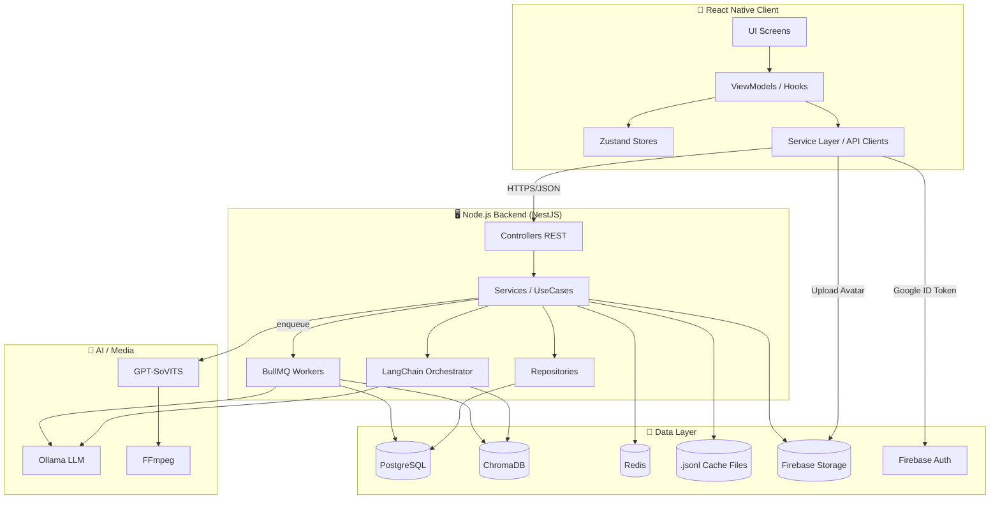

# 00 — Tổng quan Kiến trúc Hệ thống & MVC

> Tài liệu chỉ định nghĩa **kế hoạch triển khai code** (không phải bản code). Mọi sơ đồ và đặc tả ở đây là chỉ dẫn để team Dev đối chiếu khi thực hiện. Các file `01_*`, `02_*`, `03_*`, `04_*`, `05_*` chi tiết hóa các phần tương ứng.

---

## 1. Phạm vi & Mục tiêu Sản phẩm

Ứng dụng **Roleplay Chat AI để Học Tiếng Trung** gồm 8 trụ tính năng:

| # | Module | Tài liệu nguồn |
|---|--------|----------------|
| 1 | Xác thực & Tài khoản (Google Sign-In + Firebase) | `Account.md`, `firebase.md` |
| 2 | Home + Profile + Onboarding/Tutorial | `home.md`, `Profile/profile_diagrams.md`, `tutorial.md` |
| 3 | Story (CRUD + cập nhật tiến độ cốt truyện) | `Story/overview.md` |
| 4 | Character (CRUD + tạm thời + nghe thử voice) | `Character/overview.md`, `chat/add_character.md` |
| 5 | Chat Roleplay (LLM + JSON Mode + OOC + Auto + Cache `.jsonl` + Checkpoint + Long-term Memory) | `chat/*.md` |
| 6 | TTS GPT-SoVITS (Cache Hash + FFmpeg Pitch + Mồi cảm xúc) | `text-to-speed.md` |
| 7 | Journal & Vocabulary Notebook (lưu vĩnh viễn + SRS) | `Journal/overview.md`, `Vocabulary/*` |
| 8 | Gamification: Streak, Mission, Shop (Contextual + System) | `Mission/mission_streak.md`, `Shop/shop_system.md` |

---

## 2. Tech Stack Mục tiêu

### 2.1. Client (Mobile)
- **React Native + Expo (SDK 51+)**, TypeScript strict.
- **Navigation**: `@react-navigation/native` (Stack + Bottom Tab).
- **State**: `Zustand` (slices per module) + persist middleware (AsyncStorage / SecureStore).
- **Form**: `react-hook-form` + `zod` validator.
- **Audio**: `expo-av` (sequential playback queue).
- **Media**: `expo-image-picker`, `expo-image-manipulator` (compress).
- **Auth**: `@react-native-google-signin/google-signin` + `@react-native-firebase/auth` (hoặc `firebase` JS SDK).
- **Firestore/Storage**: `@react-native-firebase/firestore`, `@react-native-firebase/storage`.
- **Speech-to-Text** (Premium phase): `expo-speech-recognition` hoặc Whisper API.
- **i18n**: `i18next` (vi-VN mặc định).
- **UI Kit**: `react-native-paper` hoặc custom theme + `react-native-reanimated` cho animation (Streak fire, Confetti).

### 2.2. Backend (Node.js Server)
- **Runtime**: Node.js 20 LTS + **TypeScript**.
- **Framework**: **NestJS** (module-based, DI, dễ scale) hoặc **Fastify** (nếu ưu tiên tốc độ).
  > Khuyến nghị: **NestJS** vì rõ ràng theo Domain Module, dễ chia trách nhiệm khớp với MVC.
- **AI Orchestration**: **LangChain.js** (Multi-Query, Parallel Retriever) → Ollama.
- **LLM**: **Ollama** (local/remote private) — `qwen2.5:14b` cho Large AI, `qwen2.5:3b` cho Small AI (summarizer).
- **Vector DB**: **ChromaDB** (HTTP server, isolated by `user_id` + `story_id`).
- **Relational DB**: **PostgreSQL** (Journal: Sessions, Messages, Vocabulary, Mission, Shop, Stories.current_progress). Lý do: ACID, JSONB cho `words`, query phức tạp.
- **Cache & Lock**: **Redis** (rate-limit, session lock, mission counter, distributed lock cho TTS).
- **File Cache phiên chat**: file `.jsonl` trên disk Server (per `session_id`).
- **Storage**: **Firebase Cloud Storage** (avatars + TTS audio cache).
- **Auth (verify)**: Firebase Admin SDK (verify ID token).
- **TTS Engine**: **GPT-SoVITS** chạy độc lập (Python FastAPI) trên server có GPU.
- **Media Tool**: **FFmpeg** (chỉnh pitch).
- **Queue**: **BullMQ** (Redis-backed) cho tóm tắt nền, write memory, generate TTS async.
- **Observability**: Winston/Pino logger + OpenTelemetry trace.

### 2.3. Hạ tầng
- **Containerization**: Docker + docker-compose (dev), Kubernetes (prod option).
- **CI/CD**: GitHub Actions (lint, test, build EAS, deploy server).
- **Mobile Build**: EAS Build (Expo).
- **Server Hosting**: VPS GPU (cho GPT-SoVITS), VPS thường (cho Node API), Managed Postgres + Redis.

---

## 3. Kiến trúc tổng thể (High-Level)



---

## 4. Mô hình MVC (Áp dụng cho Client và Server)

### 4.1. MVC ở Client (React Native — biến thể MVVM)

| Lớp | Vai trò | Hiện thực hoá |
|-----|---------|---------------|
| **Model** | Entity & DTO | `src/models/*.ts` (TypeScript interface, zod schema) |
| **View** | Component thuần (presentational) | `src/screens/`, `src/components/` |
| **ViewModel** | Hook + Zustand store + Service Layer (mediator UI ↔ API) | `src/hooks/use*`, `src/stores/*`, `src/services/*` |
| **Controller (Router)** | React Navigation | `src/navigation/RootNavigator.tsx` |

### 4.2. MVC ở Server (NestJS)

| Lớp | Vai trò | Hiện thực hoá |
|-----|---------|---------------|
| **Model** | Entity DB + DTO | `entities/*.entity.ts`, `dto/*.dto.ts` |
| **Controller** | Nhận HTTP Request, validate DTO, gọi Service | `*.controller.ts` |
| **View** | JSON Response (REST) | DTO Response trả về |
| **Service** (UseCase) | Logic nghiệp vụ | `*.service.ts` |
| **Repository** | Truy cập DB | `*.repository.ts` (TypeORM/Prisma) |

### 4.3. Cấu trúc thư mục đề xuất

```
chatAI/
├── apps/
│   ├── mobile/                          # React Native (Expo)
│   │   └── src/
│   │       ├── api/                     # axios clients, interceptors
│   │       ├── components/              # presentational
│   │       ├── features/                # feature-sliced
│   │       │   ├── auth/
│   │       │   ├── home/
│   │       │   ├── story/
│   │       │   ├── character/
│   │       │   ├── chat/
│   │       │   │   ├── components/
│   │       │   │   ├── hooks/
│   │       │   │   ├── store/           # zustand slices
│   │       │   │   ├── services/
│   │       │   │   └── screens/
│   │       │   ├── journal/
│   │       │   ├── vocabulary/
│   │       │   ├── mission/
│   │       │   ├── shop/
│   │       │   └── profile/
│   │       ├── models/                  # zod schemas + types
│   │       ├── navigation/
│   │       ├── theme/
│   │       └── utils/
│   │
│   ├── server/                          # NestJS API
│   │   └── src/
│   │       ├── modules/
│   │       │   ├── auth/
│   │       │   ├── users/
│   │       │   ├── stories/
│   │       │   ├── characters/
│   │       │   ├── chat/                # message, history-store, ooc, end-chat
│   │       │   ├── journal/
│   │       │   ├── vocabulary/          # SRS
│   │       │   ├── missions/
│   │       │   ├── shop/
│   │       │   ├── tts/
│   │       │   └── memory/              # ChromaDB + LangChain
│   │       ├── shared/                  # guards, interceptors, filters
│   │       ├── config/                  # .env loader
│   │       ├── workers/                 # BullMQ processors
│   │       └── main.ts
│   │
│   └── tts-engine/                      # GPT-SoVITS (Python wrapper)
│       └── app.py
│
├── packages/
│   ├── shared-types/                    # TS interfaces dùng chung Client/Server
│   └── prompts/                         # System prompts versioned
│
├── docker-compose.yml
└── package.json (workspaces)
```

---

## 5. Nguyên tắc kiến trúc xuyên suốt

1. **Tách trách nhiệm rõ ràng**: Chat module KHÔNG ghi trực tiếp DB Postgres trong khi đang chat; chỉ ghi `.jsonl`. End-Chat orchestrator bàn giao cho Journal + Story + Memory modules.
2. **Idempotent API**: Mọi endpoint mutating gửi kèm `Idempotency-Key` (UUID) để chống double-tap.
3. **JSON Mode bắt buộc với LLM**: Dùng `format: "json"` của Ollama + JSON Schema validator phía Server. Nếu parse fail → retry tối đa 2 lần với prompt sửa lỗi.
4. **Streaming là tuỳ chọn**: Mặc định trả full JSON; Premium phase sẽ streaming token-by-token cho hiệu ứng "AI đang gõ".
5. **Optimistic UI** cho thao tác nhẹ (toggle setting, send message preview); rollback khi server fail.
6. **Bảo mật**: Firebase ID Token verify ở mọi request; rules Firestore/Storage strict; secrets qua `.env` + KMS.
7. **Versioning Prompt**: Mọi System Prompt nằm trong `packages/prompts/v1/...` để rollback dễ dàng.
8. **Test pyramid**: Unit (services) → Integration (controllers + DB test container) → E2E (Detox cho mobile, Supertest cho server).

---

## 6. Mapping Tài liệu → Module Code

| Tài liệu thiết kế | Module Server | Module Client |
|-------------------|---------------|---------------|
| `Account.md`, `firebase.md` | `auth`, `users` | `features/auth`, `features/profile` |
| `home.md` | (read-only aggregates) | `features/home` |
| `tutorial.md` | (state lưu trong `users.tutorial_step`) | `features/tutorial` (overlay) |
| `Story/overview.md` | `stories` | `features/story` |
| `Character/overview.md`, `chat/add_character.md` | `characters` (+ temp characters ở chat state) | `features/character`, `features/chat` |
| `chat/overview.md`, `message_chat.md`, `history_store.md`, `ooc_context.md`, `auto_chat.md`, `end_chat.md` | `chat`, `memory` | `features/chat` |
| `text-to-speed.md` | `tts` | `features/chat` (player queue) |
| `Journal/overview.md` | `journal` | `features/journal` |
| `Vocabulary/*` | `vocabulary` | `features/vocabulary` |
| `Mission/mission_streak.md` | `missions` (event-driven listener) | `features/mission`, `features/home` |
| `Shop/shop_system.md` | `shop` | `features/shop`, integrated trong `features/chat` |

---

Xem chi tiết:
- [01_database_schema.md](01_database_schema.md) — ERD đầy đủ cho Firestore, Postgres, ChromaDB, Redis.
- [02_class_diagrams.md](02_class_diagrams.md) — UML Class cho Client (ViewModel/Store) và Server (Service/Repository).
- [03_event_diagrams.md](03_event_diagrams.md) — Sequence/Event diagrams tổng hợp các luồng quan trọng.
- [04_api_specification.md](04_api_specification.md) — REST API endpoints chuẩn.
- [05_workplan_phases.md](05_workplan_phases.md) — Lộ trình triển khai code theo Sprint.
