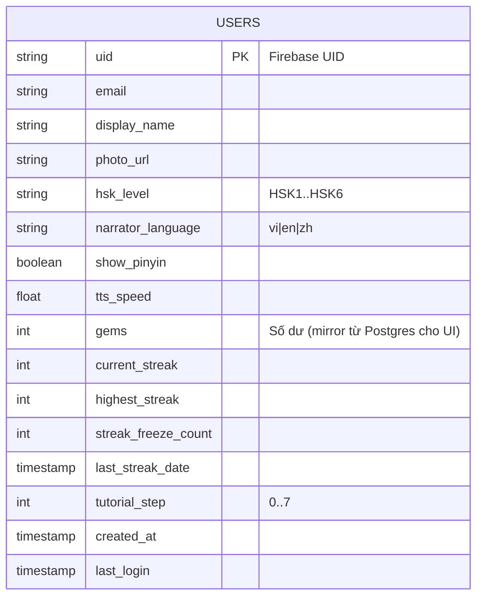
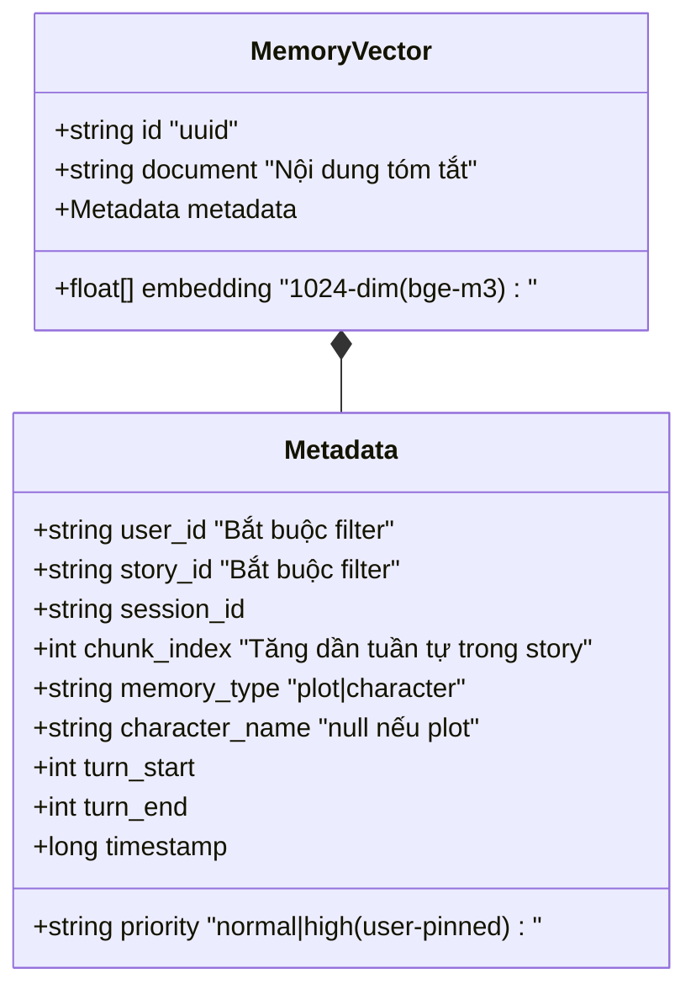

# 01 — Sơ đồ Cơ sở Dữ liệu (ERD)

Hệ thống sử dụng **đa nguồn dữ liệu** (Polyglot Persistence) — mỗi loại dữ liệu chọn DB phù hợp nhất:

| Kho dữ liệu | Mục đích | Lý do chọn |
|-------------|----------|-----------|
| **Firebase Auth** | Xác thực Google Sign-In | Quản lý token, OAuth out-of-the-box |
| **Cloud Firestore** | User profile (đồng bộ realtime với client) | Realtime sync, offline cache |
| **PostgreSQL** | Stories, Sessions, Messages, Vocabulary, Missions, Shop, Inventory | ACID, JSONB cho `words`, query phức tạp, foreign keys |
| **ChromaDB** | Long-term Memory (Plot + Character) — vector embeddings | Semantic search có metadata filter |
| **Redis** | Cache session state, rate-limit, mission counter, distributed lock | In-memory tốc độ cao |
| **`.jsonl` files** (disk Server) | Cache 1 phiên chat đang diễn ra | Append-only an toàn, đơn giản, không cần DB connection mỗi turn |
| **Firebase Storage** | Avatar người dùng/nhân vật, TTS audio cache | CDN sẵn có, secure rules |

---

## 1. Cloud Firestore (User Profile Sync)

Lưu thông tin tối thiểu để Client realtime sync. **Dữ liệu nghiệp vụ chính (chat, vocabulary, mission…) nằm ở Postgres** để truy vấn linh hoạt.



**Ghi chú đồng bộ**:
- `gems`, `current_streak` được cập nhật ở **Postgres trước** (source of truth), sau đó Server gọi Admin SDK `set/update` lên Firestore để Client realtime nhận event.
- Client KHÔNG ghi trực tiếp các trường nghiệp vụ này; chỉ ghi `display_name`, `photo_url`, `hsk_level`, `narrator_language`, `show_pinyin`, `tts_speed`, `tutorial_step` (qua security rules).

---

## 2. PostgreSQL (Domain DB)

```mermaid
erDiagram
    USERS_META ||--o{ STORIES : owns
    USERS_META ||--o{ VOCABULARY : collects
    USERS_META ||--o{ USER_MISSIONS : has
    USERS_META ||--o{ INVENTORY : holds
    USERS_META ||--o{ SHOP_TRANSACTIONS : pays
    STORIES ||--o{ CHARACTERS : contains
    STORIES ||--o{ SESSIONS : has
    SESSIONS ||--o{ MESSAGES : logs
    SESSIONS ||--o{ VOCABULARY : sourced_from
    CHARACTERS ||--o{ MESSAGES : "spoke (nullable)"
    MISSION_TEMPLATES ||--o{ USER_MISSIONS : instantiated
    SHOP_ITEMS ||--o{ SHOP_TRANSACTIONS : purchased

    USERS_META {
        uuid uid PK "= Firebase UID"
        int gems
        int current_streak
        int highest_streak
        int streak_freeze_count
        date last_streak_date
        int tutorial_step
        timestamptz created_at
        timestamptz updated_at
    }

    STORIES {
        uuid id PK
        uuid user_id FK
        string title
        text initial_setting "Bối cảnh khởi tạo"
        text current_progress "Cập nhật sau mỗi End-Chat"
        timestamptz created_at
        timestamptz updated_at
    }

    CHARACTERS {
        uuid id PK
        uuid story_id FK
        string name
        int age
        text personality
        string avatar_url "Firebase Storage URL"
        string voice_name "Achernar|Aoede|Charon|Fenrir|Kore|Leda|Zephyr"
        float pitch "0.8 - 1.5"
        timestamptz created_at
    }

    SESSIONS {
        uuid id PK
        uuid user_id FK
        uuid story_id FK
        string status "active|ended"
        text summary "Tóm tắt session sau End-Chat"
        bigint started_at
        bigint ended_at
        timestamptz created_at
    }

    MESSAGES {
        uuid id PK
        uuid session_id FK
        uuid character_id FK "nullable (Narrator hoặc character bị xoá)"
        string role "user|assistant|persistent_ooc|ephemeral_ooc"
        string character_name "snapshot tĩnh"
        text text
        text translation
        string emotion
        string intensity
        jsonb words "[{hz,py,vn}]"
        jsonb shop_event "{itemName, price} nullable"
        int turn_order
        bigint timestamp
    }

    VOCABULARY {
        uuid id PK
        uuid user_id FK
        uuid source_session_id FK "nullable"
        string hz "Chữ Hán"
        string py "Pinyin"
        string vn "Nghĩa Việt"
        text source_sentence
        string status "learning|mastered"
        int step_index "0..25 (SRS_SCHEDULE)"
        bigint next_review_date
        timestamptz created_at
        UNIQUE_user_hz "UNIQUE(user_id, hz)"
    }

    MISSION_TEMPLATES {
        string id PK "send_messages|collect_words|complete_review"
        string title
        string description
        int target
        int reward_gems
    }

    USER_MISSIONS {
        uuid id PK
        uuid user_id FK
        string template_id FK
        date for_date "Ngày của mission (reset 00:00)"
        int progress
        string status "in_progress|completed|claimed"
        timestamptz completed_at
        UNIQUE_user_template_date "UNIQUE(user_id, template_id, for_date)"
    }

    SHOP_ITEMS {
        string id PK "streak_freeze|..."
        string name
        text description
        int price_gems
        string category "system|cosmetic"
        boolean active
    }

    SHOP_TRANSACTIONS {
        uuid id PK
        uuid user_id FK
        string item_id FK
        int price_paid
        string source "system_shop|contextual_event"
        uuid session_id FK "nullable - nếu mua từ contextual"
        timestamptz created_at
    }

    INVENTORY {
        uuid id PK
        uuid user_id FK
        string item_id FK
        int quantity
        timestamptz acquired_at
    }
```

### Index gợi ý
- `MESSAGES (session_id, turn_order)` — list-by-session nhanh.
- `VOCABULARY (user_id, next_review_date, status)` — SRS query hàng ngày.
- `USER_MISSIONS (user_id, for_date)` — load missions hôm nay.
- `SESSIONS (user_id, story_id, status)` — resume session.

---

## 3. ChromaDB (Long-term Memory)



**Collection naming**: 1 collection duy nhất `roleplay_memory` — filter bằng metadata để cô lập.  
**Embedding model**: `bge-m3` (đa ngôn ngữ, tốt cho Việt + Trung).

---

## 4. Redis Key Schema

| Key Pattern | TTL | Mục đích |
|-------------|-----|----------|
| `session:{session_id}:active_characters` | session lifetime | Set tên nhân vật active |
| `session:{session_id}:persistent_ooc` | session lifetime | String bối cảnh cố định |
| `session:{session_id}:ephemeral_ooc` | đến khi consumed | String OOC tạm thời |
| `session:{session_id}:lock` | 60s | Distributed lock 1-turn-at-a-time |
| `tts:lock:{hash}` | 120s | Tránh sinh trùng TTS cùng lúc |
| `mission:counter:{user_id}:{date}:{template_id}` | 48h | Bộ đếm tăng dần realtime |
| `rate:user:{user_id}:chat` | 60s | Rate-limit 30 req/phút |
| `idempotency:{key}` | 24h | Idempotent endpoint result |

---

## 5. Cache File `.jsonl` (Server Disk)

Mỗi phiên chat = 1 file: `/var/lib/chatai/sessions/history_{session_id}.jsonl`

**Đặc điểm**:
- Append-only, không bao giờ rewrite middle.
- 1 dòng = 1 JSON object self-contained.
- Cleanup khi End-Chat hoàn tất, hoặc cron quét file > 7 ngày không động vào.

**Các `role` chấp nhận**:
| role | Ý nghĩa |
|------|---------|
| `persistent_ooc` | Bối cảnh cố định (Sidebar setting) |
| `ephemeral_ooc` | OOC tạm thời (1 lượt) |
| `user` | Tin nhắn người dùng (kèm `temporary_characters`, OOC inline) |
| `assistant` | Mảng phản hồi AI (raw JSON `content[]`) |
| `checkpoint` | Tóm tắt khi vượt `MAX_HISTORY_TOKENS` |
| `shop_event_result` | Lưu nhánh chọn Mua/Không cho audit |

Chi tiết cấu trúc xem `chat/history_store.md`.

---

## 6. Firebase Cloud Storage

```
/avatars/users/{uid}/avatar_{timestamp}.jpg
/avatars/characters/{user_id}/{character_id}_{timestamp}.jpg
/tts_audio/{hash}.wav           # hash = MD5(voice_name + ref_file + text)
```

**Security Rules** xem `firebase.md` §4 (đã định nghĩa).

---

## 7. Ma trận Quyền truy cập Dữ liệu

| Dữ liệu | Client đọc trực tiếp | Client ghi trực tiếp | Server (Admin) |
|---------|----------------------|----------------------|----------------|
| Firestore `users/{uid}` | ✅ (own) | ✅ (subset fields) | ✅ |
| Firebase Storage avatars/users/{uid} | ✅ | ✅ | ✅ |
| Firebase Storage tts_audio/* | ✅ (download URL) | ❌ | ✅ |
| Postgres tất cả bảng | ❌ | ❌ | ✅ (qua API) |
| ChromaDB | ❌ | ❌ | ✅ (qua API/Worker) |
| Redis | ❌ | ❌ | ✅ |
| `.jsonl` files | ❌ | ❌ | ✅ |

---

## 8. Migration & Seed

- **Tool**: Prisma Migrate (hoặc TypeORM migrations).
- **Seed bắt buộc**:
  - `MISSION_TEMPLATES`: 3 mission cố định (xem `Mission/mission_streak.md` §2).
  - `SHOP_ITEMS`: `streak_freeze` (240 gem), placeholder cho cosmetic.
- **Seed dev**: 1 user demo + 1 story + 2 character + 10 vocabulary mẫu.
