# 02 — Sơ đồ Class (UML)

Sơ đồ class chia 2 phía: **Client (React Native / MVVM)** và **Server (NestJS / Layered)**. Mỗi class kèm trách nhiệm rõ ràng để khi triển khai code, Dev tạo file đúng cấu trúc.

---

## 1. CLIENT — React Native (Zustand + Service)

### 1.1. Auth & Profile

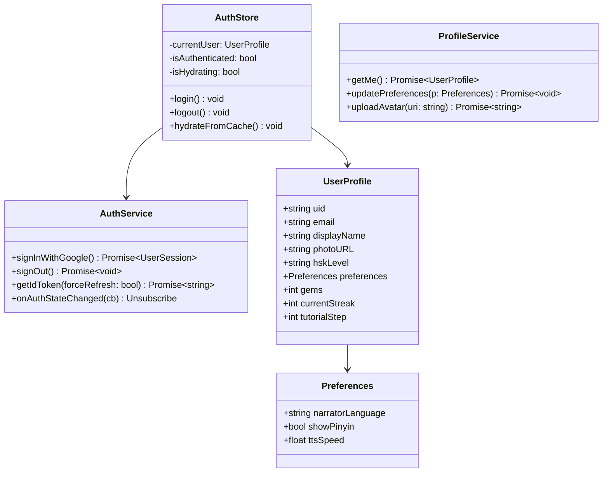

### 1.2. Chat (module trọng tâm)

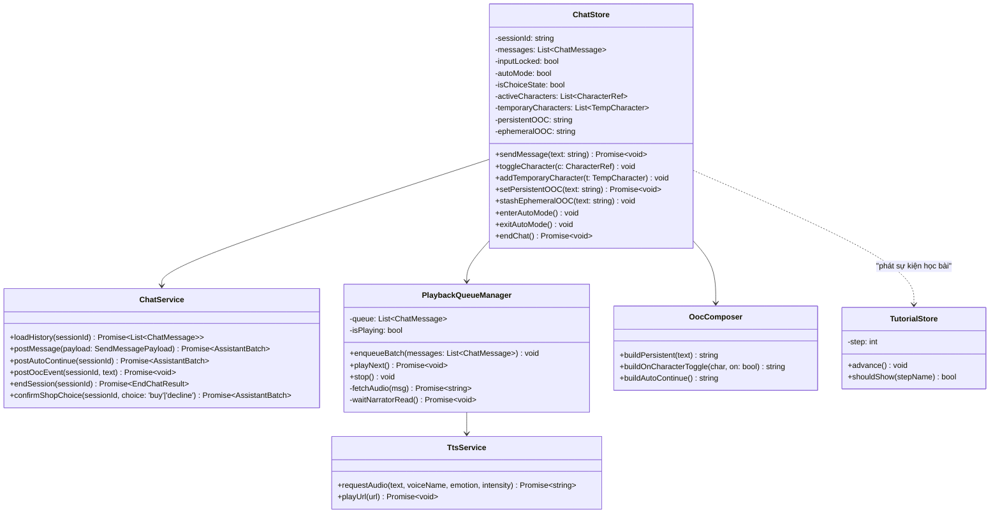

### 1.3. Story / Character / Journal / Vocabulary

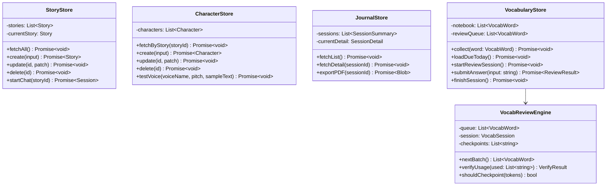

### 1.4. Mission / Shop / Streak

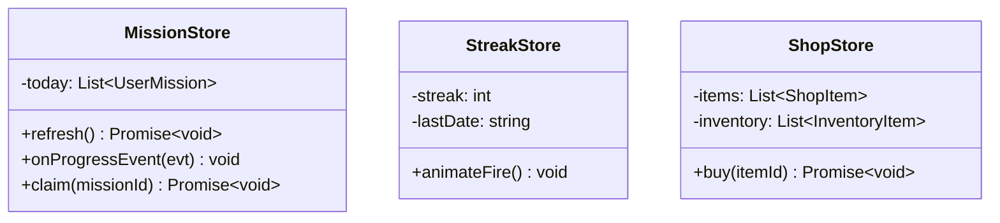

---

## 2. SERVER — NestJS (Module → Controller → Service → Repository)

### 2.1. Auth & Users

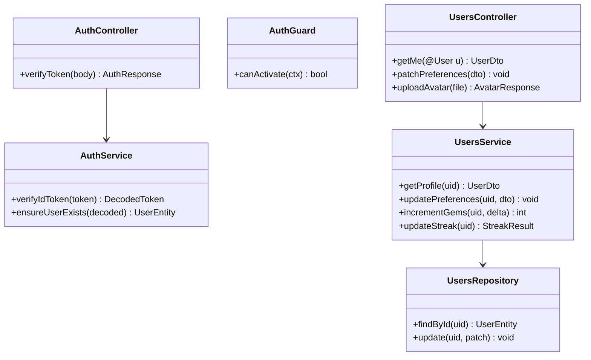

### 2.2. Chat Module (cốt lõi)

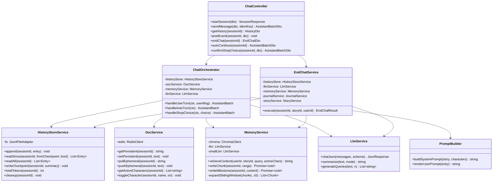

### 2.3. TTS Module

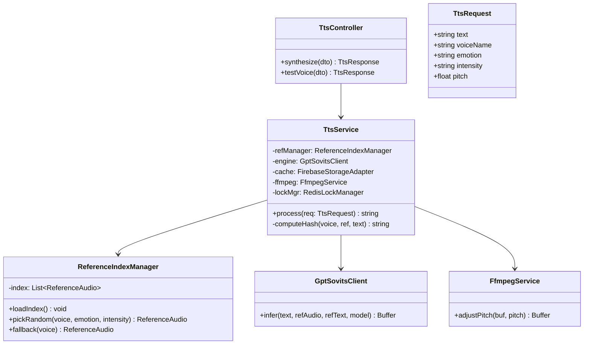

### 2.4. Story / Character / Journal

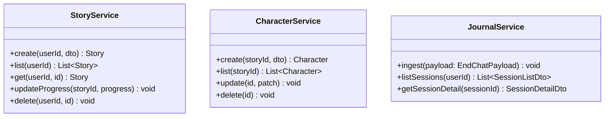

### 2.5. Vocabulary (SRS)

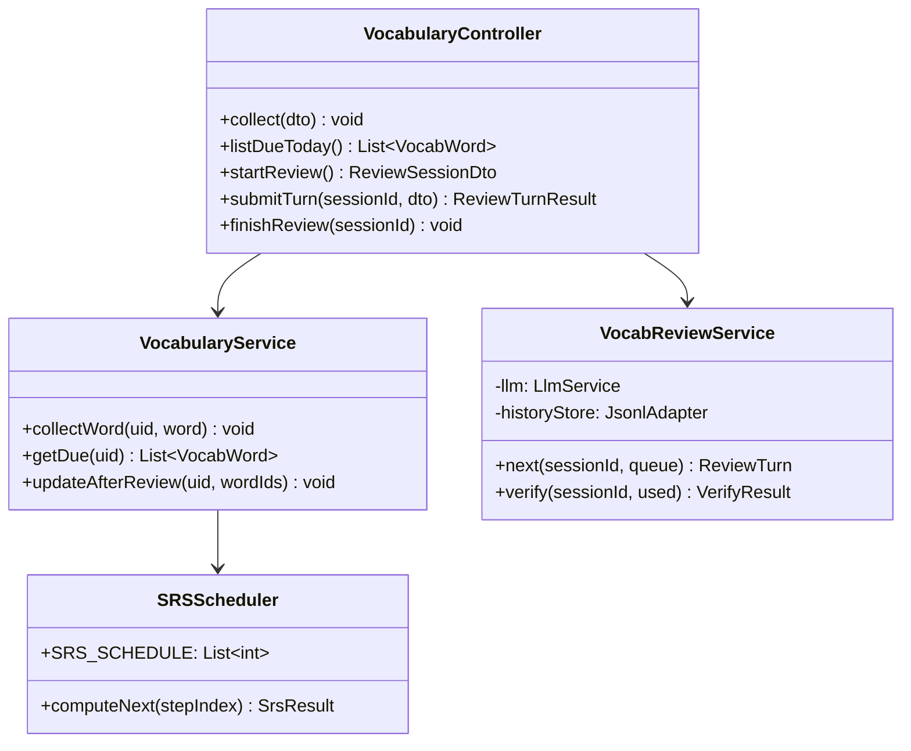

### 2.6. Mission & Shop (Event-Driven)

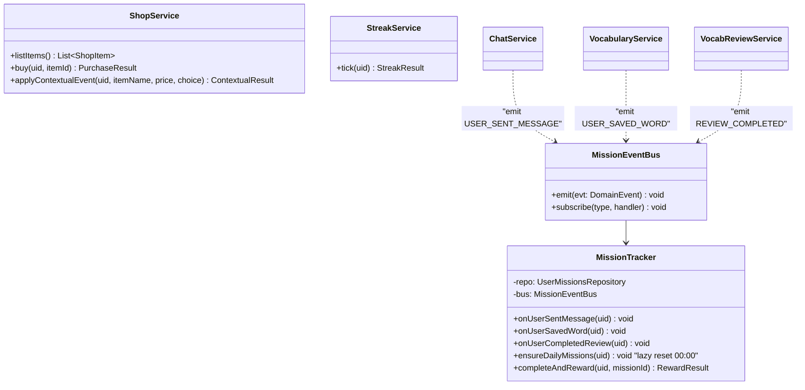

### 2.7. Worker (BullMQ)

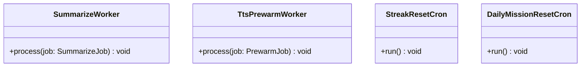

---

## 3. Shared Types (TS interfaces dùng chung)

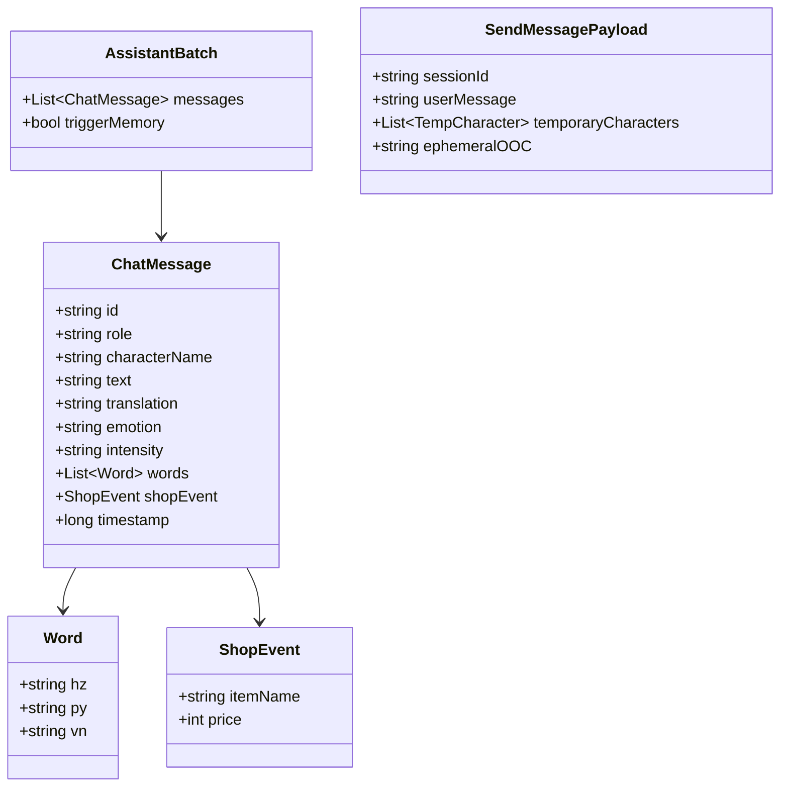

---

## 4. Quy ước tổ chức code (cho mỗi feature module Server)

Ví dụ `modules/chat/`:
```
chat/
├── chat.module.ts
├── chat.controller.ts
├── chat.orchestrator.ts        # use-case chính
├── services/
│   ├── history-store.service.ts
│   ├── ooc.service.ts
│   ├── prompt-builder.service.ts
│   └── end-chat.service.ts
├── dto/
│   ├── send-message.dto.ts
│   ├── end-chat.dto.ts
│   └── ...
├── adapters/
│   └── jsonl-file.adapter.ts
└── tests/
    ├── orchestrator.spec.ts
    └── history-store.spec.ts
```

Ví dụ `features/chat/` (Client):
```
chat/
├── screens/
│   ├── ChatRoomScreen.tsx
│   └── HistoryDetailScreen.tsx
├── components/
│   ├── MessageBubble.tsx
│   ├── NarratorBubble.tsx
│   ├── InputBar.tsx
│   ├── AutoControlBar.tsx
│   ├── ShopChoiceCard.tsx
│   ├── PinyinTooltip.tsx
│   └── AddCharacterModal.tsx
├── hooks/
│   ├── useChatRoom.ts
│   ├── useSequentialPlayback.ts
│   └── useTapToTranslate.ts
├── store/
│   ├── chat.store.ts
│   └── tts-queue.store.ts
├── services/
│   └── chat.api.ts
└── models/
    └── chat.types.ts
```
