# 03 — Sơ đồ Event / Sequence

Tổng hợp các luồng quan trọng nhất, đã consolidate & tinh chỉnh từ tài liệu thiết kế nguồn. Mỗi luồng nêu rõ **actor, thành phần tham gia, event phát sinh** để Dev triển khai event-driven chuẩn xác.

---

## 0. Event Bus toàn hệ thống (Domain Events)

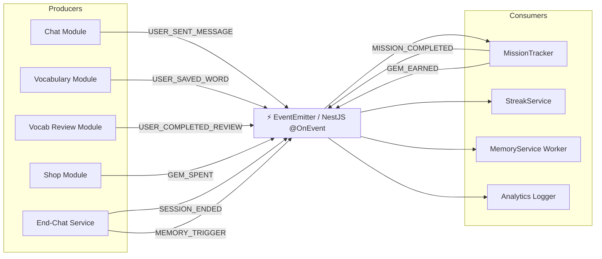

**Danh sách event chuẩn**:
| Event | Payload | Producer | Consumer |
|-------|---------|----------|----------|
| `USER_SENT_MESSAGE` | `{userId, sessionId}` | Chat | Mission, Streak |
| `USER_SAVED_WORD` | `{userId, wordId}` | Vocabulary | Mission, Streak |
| `USER_COMPLETED_REVIEW` | `{userId, sessionId, wordCount}` | Review | Mission, Streak |
| `SESSION_ENDED` | `{userId, sessionId, storyId}` | EndChat | Memory, Analytics |
| `MEMORY_TRIGGER` | `{sessionId, range, type}` | EndChat / Auto | Memory Worker |
| `MISSION_COMPLETED` | `{userId, missionId, reward}` | Mission | Streak, UI push |
| `GEM_EARNED` / `GEM_SPENT` | `{userId, amount, source}` | Mission/Shop | UI push |
| `STREAK_UPDATED` | `{userId, current, isNewHighest}` | Streak | UI push |
| `TUTORIAL_STEP_DONE` | `{userId, step}` | Client (qua API) | Users repo |

---

## 1. Đăng nhập & Boot ứng dụng

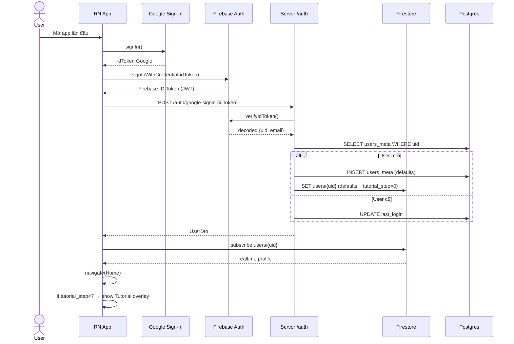

---

## 2. Gửi tin nhắn Chat (Full Lifecycle)

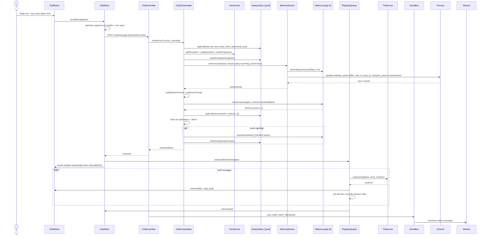

---

## 3. OOC Flows (3 nguồn)

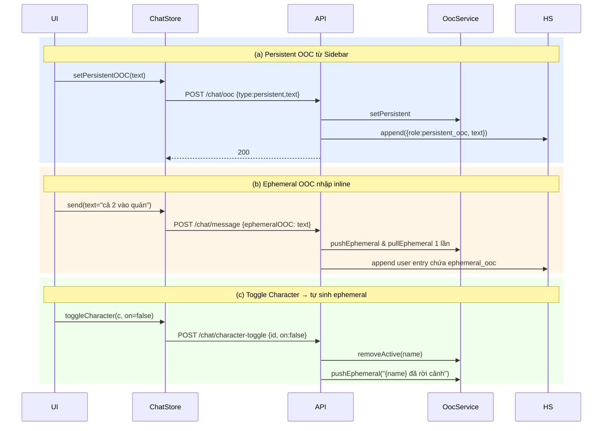

---

## 4. Auto Chat

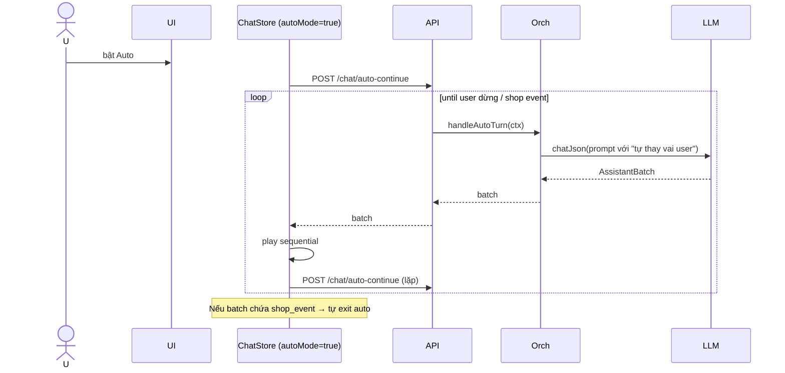

---

## 5. End Chat Orchestration

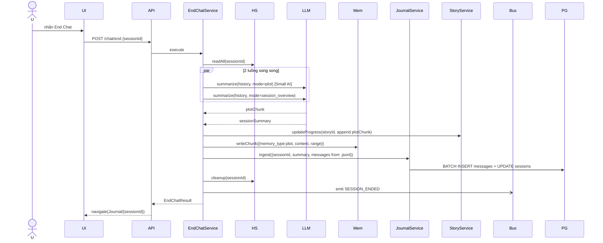

---

## 6. Long-term Memory Write (theo `MEMORY_TRIGGER`)

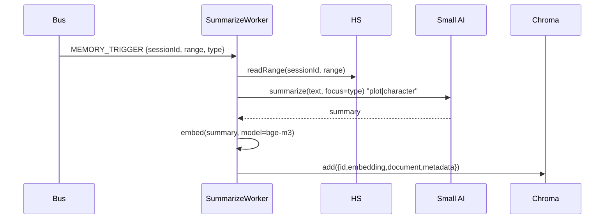

Trigger source:
- End-Chat (mặc định) → `type=plot`
- Cuối phiên có character mới được thêm → `type=character`
- User pin "lưu kí ức" thủ công (Premium) → `priority=high`

---

## 7. TTS Sequential Playback (Client)

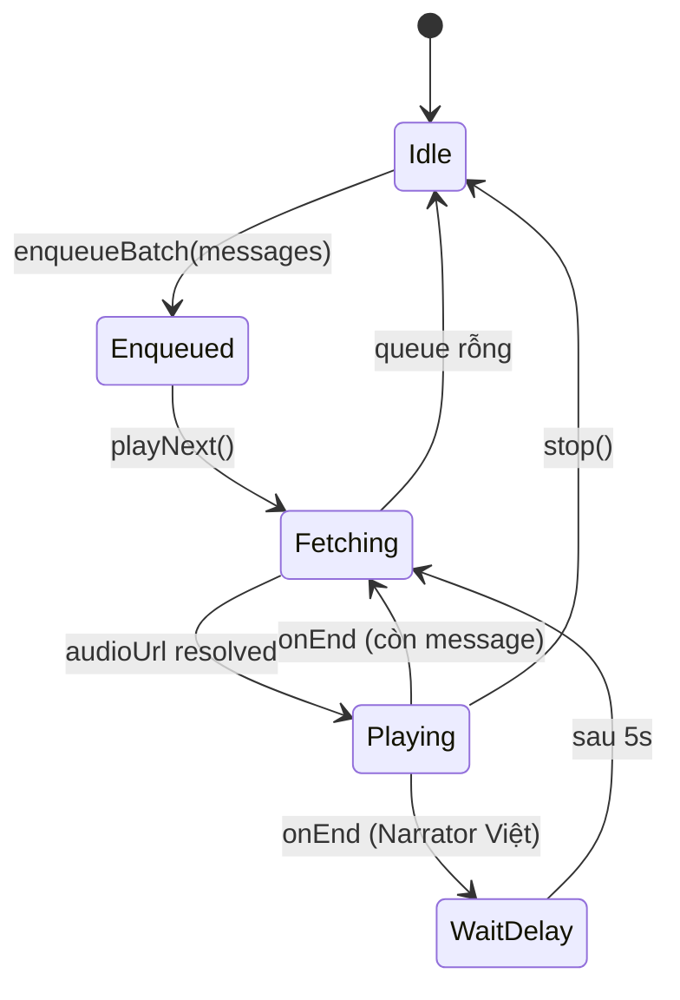

---

## 8. TTS Server (Cache Hash + GPT-SoVITS)

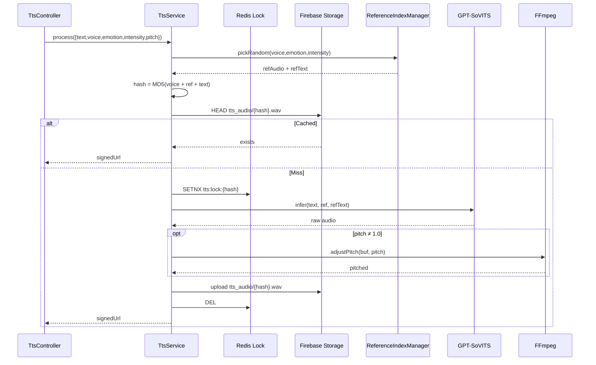

---

## 9. Shop Contextual Event (mua trong Chat)

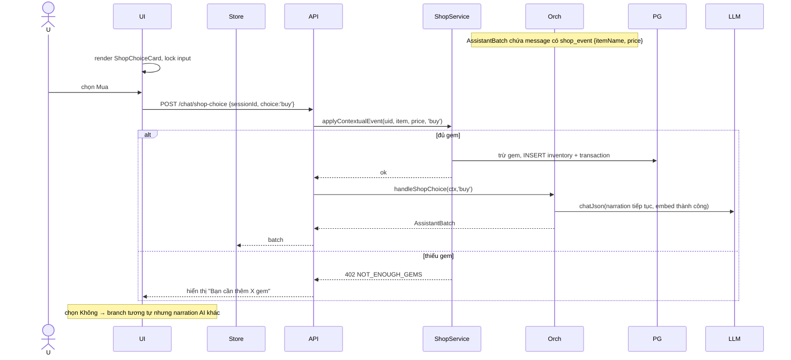

---

## 10. Vocabulary — Save từ Chat + SRS Review

### 10.1. Lưu từ vào sổ tay
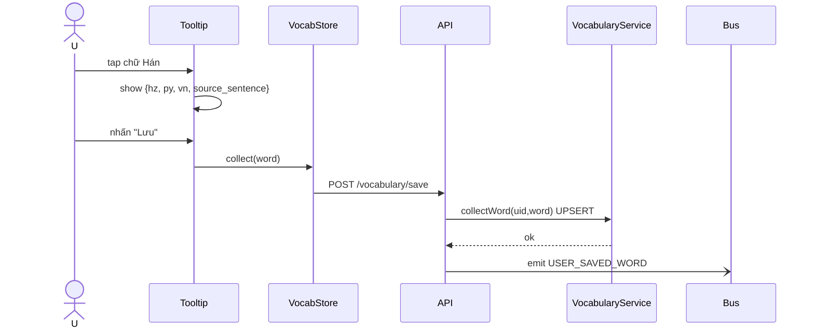

### 10.2. Phiên Review (Story Review)
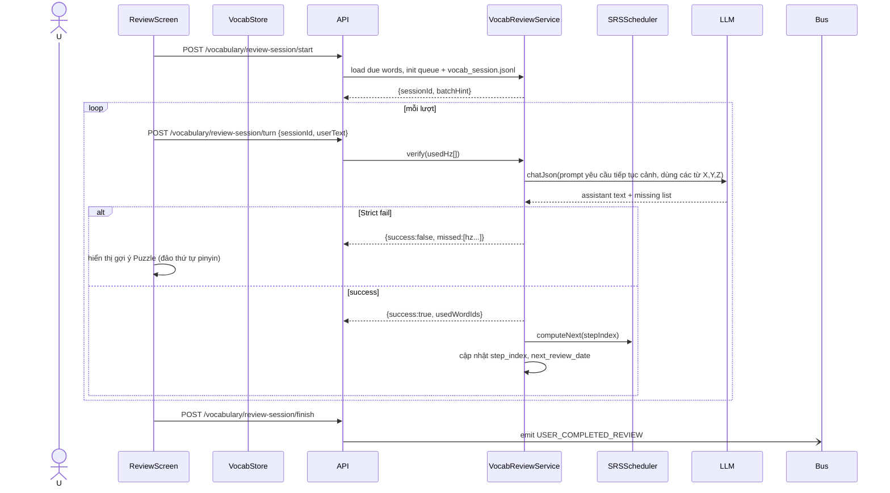

---

## 11. Mission Completion (Event-Driven)

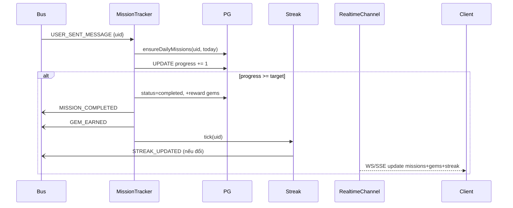

---

## 12. Streak Daily Reset (Cron)

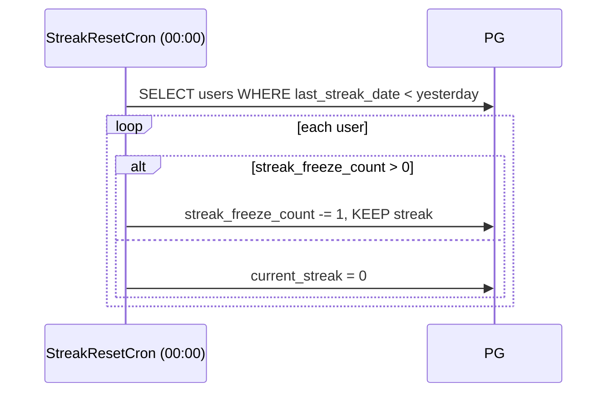

---

## 13. Tutorial State Machine

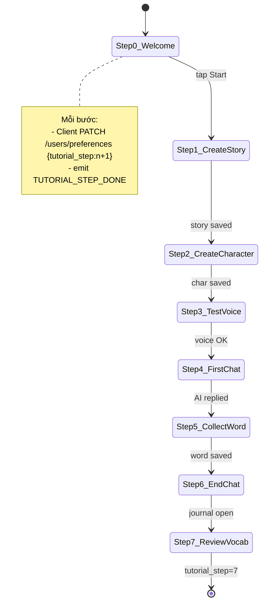

---

## 14. Add Character (giữa cuộc chat)

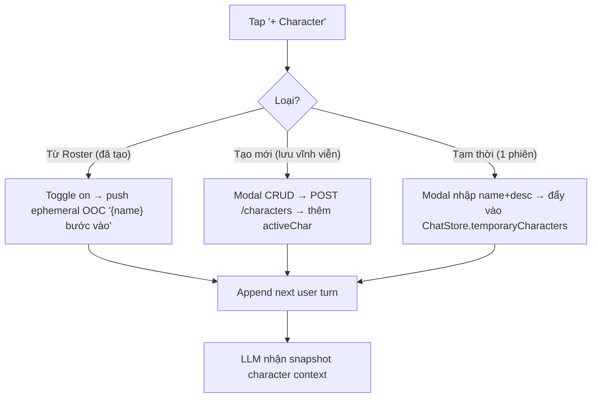

---

## 15. Profile/Preferences Update (Optimistic)

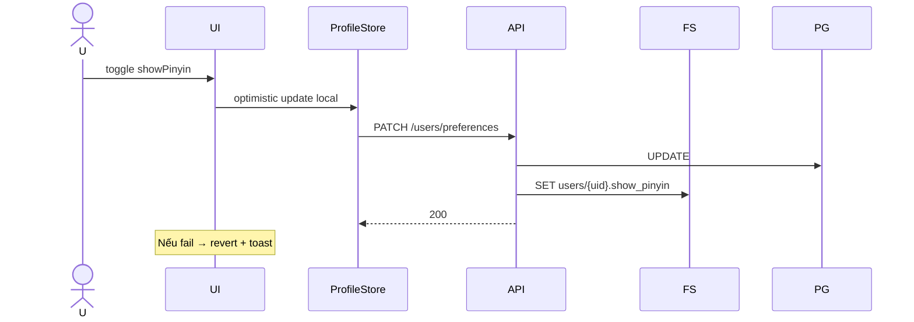
