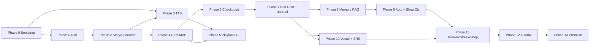

# 05 — Workplan Triển khai Code (theo Phase)

> Tổ chức theo **logical phases / dependency**, không gắn ước lượng thời gian. Mỗi phase nêu rõ: **Mục tiêu**, **Deliverables**, **Acceptance Criteria**, **Phụ thuộc**, **Test scope**, **Rủi ro**.  
> Phase nhỏ chạy tuần tự theo dependency; trong nội bộ 1 phase Dev có thể chia task song song.

---

## Phase 0 — Bootstrap & Foundation

**Mục tiêu**: Khung dự án sẵn sàng để tất cả các phase sau cắm vào.

**Deliverables**:
- Monorepo (`pnpm` / `yarn workspaces`): `apps/mobile`, `apps/server`, `apps/tts-engine`, `packages/shared-types`, `packages/prompts`.
- `apps/server` NestJS skeleton + ESLint + Prettier + Jest + path alias.
- `apps/mobile` Expo skeleton + TypeScript strict + ESLint + path alias + Zustand + React Navigation.
- `docker-compose.yml`: Postgres 16, Redis 7, ChromaDB, Ollama (mount model), MinIO option (mock Firebase Storage dev).
- `.env.example`, secret manager hướng dẫn.
- GitHub Actions: lint + unit test cho 2 apps; Detox & EAS placeholders.
- Logger (Pino) + global error filter + `X-Request-Id` interceptor + AuthGuard skeleton.
- Prisma init (hoặc TypeORM) + first migration trống.

**Acceptance**:
- `docker compose up` → tất cả container healthy.
- `pnpm dev` chạy server + mobile + lint pass.
- Endpoint `GET /healthz` trả `{status:"ok"}`.

**Test**: smoke test CI.

**Risks**: chọn sai ORM → migration đau. Mitigation: PoC nhỏ với Prisma trước khi commit.

---

## Phase 1 — Auth + User Profile

**Phụ thuộc**: Phase 0.

**Deliverables**:
- Firebase project tạo, Google OAuth client. Service account JSON cho Admin SDK.
- Client: Google Sign-In flow + AuthStore + persist token + interceptor inject Bearer.
- Server: `AuthModule` (verify ID token middleware), `UsersModule` (upsert), bảng `users_meta`, sync `users/{uid}` Firestore (set defaults + tutorial_step=0).
- Endpoint `/users/me`, `/users/preferences`, `/users/avatar`.
- Firestore Security Rules + Storage Rules cơ bản (xem `firebase.md`).
- Profile screen tối thiểu (avatar, displayName, preferences toggles).

**Acceptance**:
- User đăng nhập, refresh app vẫn còn session.
- Đổi `showPinyin` → Firestore realtime cập nhật.
- 401 đúng khi token sai/expire.

**Test**: integration `AuthGuard`, unit `UsersService`, Detox login happy path.

**Risks**: SHA-1 sai → Google Sign-In fail. Có doc setup cho cả dev/release keystore.

---

## Phase 2 — Story + Character CRUD

**Phụ thuộc**: Phase 1.

**Deliverables**:
- Bảng `stories`, `characters` + Prisma migration.
- `StoriesModule`, `CharactersModule` (controller + service + repo + DTO + tests).
- Endpoint `/stories/*`, `/stories/:id/characters`, `/characters/*`, upload avatar character.
- Mobile screens: StoryList, StoryDetail, CharacterEditor (form react-hook-form + zod), Roster.
- Cascade rules (xoá story → soft delete sessions? — Quyết định: Hard cascade nhưng chặn nếu có active session).

**Acceptance**:
- Tạo / sửa / xoá story, character full lifecycle.
- Avatar upload thành công → URL hiển thị.

**Test**: unit services + Detox CRUD.

**Risks**: validate `voiceName` enum chặt theo `dataset_chinese/reference_index.json`.

---

## Phase 3 — TTS Service

**Phụ thuộc**: Phase 0 (storage), Phase 2 (character voice).

**Deliverables**:
- `apps/tts-engine`: FastAPI wrapper GPT-SoVITS + healthcheck.
- `TtsModule` server: `ReferenceIndexManager` (load `dataset_chinese/reference_index.json`), `GptSovitsClient`, `FfmpegService`, `CacheHashService`, distributed lock Redis.
- Endpoint `/tts/synthesize`, `/tts/test-voice`.
- Firebase Storage upload helper + signed URL generator.
- Client `TtsService` (request + cache URL map).

**Acceptance**:
- 2 request cùng `{voice,ref,text}` → 2nd hit cache, no infer.
- Pitch khác nhau tạo audio khác.
- `/tts/test-voice` thử nhanh < 5s khi cached.

**Test**: integration cache hash, mock GPT-SoVITS trong unit test.

**Risks**: model load nặng → cần warmup script + healthcheck đợi sẵn.

---

## Phase 4 — Chat MVP (no memory, no checkpoint)

**Phụ thuộc**: Phase 2, Phase 3 (cho phía Client gọi TTS sau).

**Deliverables**:
- `HistoryStoreService` (.jsonl adapter: append, read, total tokens estimate).
- `OocService` (Redis-backed).
- `PromptBuilder` (System prompt từ Story + Characters; User prompt template từ `chat/message_chat.md`).
- `LlmService` (Ollama JSON mode + retry 2 lần khi parse fail).
- `ChatOrchestrator.handleUserTurn` (chưa có RAG memory).
- Endpoints: `/chat/sessions`, `/chat/sessions/:id/message`, `/chat/sessions/:id/history`, `/chat/sessions/:id/ooc`, `/chat/sessions/:id/character-toggle`, `/chat/sessions/:id/temp-character`.
- Client `ChatStore` + ChatRoom screen tối thiểu (chưa playback).

**Acceptance**:
- Gửi 1 message → nhận `AssistantBatch` đúng schema.
- OOC Persistent / Ephemeral xuất hiện đúng vị trí trong prompt.
- Toggle character on/off ảnh hưởng prompt.

**Test**: 
- Unit: HistoryStore append/read; OocService idempotent push/pull.
- Integration: e2e Ollama mock JSON, kiểm tra retry khi malformed.

**Risks**: prompt drift → JSON sai. Mitigation: ZodSchema validate + JSON Mode + retry.

---

## Phase 5 — Sequential TTS Playback + Chat UI Polish

**Phụ thuộc**: Phase 3 + Phase 4.

**Deliverables**:
- `PlaybackQueueManager` client (expo-av) + state machine ở `03 §7`.
- MessageBubble (text + emotion icon + Pinyin toggle + translation slide).
- NarratorBubble (delay 5s nếu Việt).
- Tap-to-show tooltip (hz/py/vn) + nút Lưu (chưa wire to vocab API ở phase này — Phase 10 sẽ wire).
- InputBar lock/unlock dựa trên queue state.

**Acceptance**:
- Batch 3 messages phát tuần tự, không overlap.
- Pinyin toggle hoạt động theo `preferences.showPinyin`.
- Lock input khi đang phát.

**Test**: snapshot UI + manual queue stress test.

**Risks**: expo-av memory leak. Mitigation: unload sau khi played.

---

## Phase 6 — Checkpoint Mechanism

**Phụ thuộc**: Phase 4.

**Deliverables**:
- Token counter (tiktoken/qwen tokenizer).
- `MAX_HISTORY_TOKENS` config + ngưỡng kích hoạt.
- Small AI summarize hook trong `ChatOrchestrator` post-response.
- Append `checkpoint` line vào `.jsonl`, `readSince` chỉ đọc từ checkpoint mới nhất.

**Acceptance**:
- Chat dài đột nhiên checkpoint xuất hiện trong file, các turn sau context giảm size.
- Không mất thông tin: summary đủ để AI duy trì mạch.

**Test**: integration test với history > ngưỡng, kiểm tra LLM prompt size.

**Risks**: tóm tắt mất chi tiết → Memory layer (Phase 8) bù.

---

## Phase 7 — End Chat + Journal + Story Progress

**Phụ thuộc**: Phase 4, Phase 6.

**Deliverables**:
- `EndChatService` (sequence ở `03 §5`).
- `JournalModule` (ingest batch INSERT messages, list/detail endpoints).
- `StoriesService.updateProgress` append.
- Endpoint `/chat/sessions/:id/end`, `/journal/*`.
- Mobile: JournalListScreen + JournalDetailScreen (read-only chat replay UI tái dùng MessageBubble).
- Cleanup `.jsonl` sau khi commit thành công (transactional flag).

**Acceptance**:
- End Chat → Journal entry xuất hiện, file cache bị xoá, `current_progress` cập nhật.
- Idempotency: gọi End Chat 2 lần → trả cùng kết quả, không double insert.

**Test**: e2e end-chat full flow trên Detox + DB snapshot.

**Risks**: partial failure giữa các bước → cần transaction outbox hoặc compensating. Mitigation: dùng Postgres transaction cho `messages + sessions + stories`, sau đó mới `.jsonl cleanup` + memory enqueue.

---

## Phase 8 — Long-term Memory (ChromaDB + RAG)

**Phụ thuộc**: Phase 7.

**Deliverables**:
- ChromaDB collection `roleplay_memory` + embedding adapter (bge-m3 qua Ollama embed endpoint).
- `MemoryService.writeChunk` + Worker tiêu thụ event `MEMORY_TRIGGER`.
- `MemoryService.retrieveContext`: Multi-Query (LLM sinh 3 query) + parallel search + filter metadata + Sliding Window expand ±5.
- Tích hợp vào `ChatOrchestrator.handleUserTurn`.

**Acceptance**:
- Story chạy > 3 phiên, phiên 4 AI nhớ chi tiết từ phiên 1 (manual scenario test).
- Filter cô lập: User A không bao giờ thấy chunk của User B.

**Test**: integration mock Chroma + LLM, snapshot prompt cuối có chứa context.

**Risks**: embed chậm → batch + cache; query irrelevant → tinh chỉnh `k`, threshold.

---

## Phase 9 — Auto Chat + Shop Contextual

**Phụ thuộc**: Phase 8.

**Deliverables**:
- `ChatOrchestrator.handleAutoTurn` + endpoint `/chat/auto-continue`.
- Client Auto control bar + loop logic, auto-exit khi gặp `shop_event` hoặc user tap stop.
- `ShopModule` + `ShopService.applyContextualEvent` + endpoint `/chat/sessions/:id/shop-choice`.
- ShopChoiceCard UI + lock input.
- Bảng `shop_items`, `shop_transactions`, `inventory` + seed.

**Acceptance**:
- Auto chạy 10 lượt mượt, dừng đúng khi shop_event đến.
- Mua thành công → gem giảm, narration tiếp tục đúng nhánh.

**Test**: e2e shop happy + insufficient gem branch.

**Risks**: AI không sinh shop_event đúng format → ZodSchema chặt + retry.

---

## Phase 10 — Vocabulary Notebook + SRS Review

**Phụ thuộc**: Phase 5 (tooltip Lưu), Phase 7 (Journal).

**Deliverables**:
- Bảng `vocabulary` + UPSERT theo `(user_id, hz)`.
- `VocabularyModule`: collect, list, due, delete.
- `SRSScheduler` (mảng 26 cấp từ `Vocabulary/srs_schedule.md`).
- `VocabReviewService` với `vocab_session.jsonl` riêng + Strict Verification + Puzzle Hint khi fail.
- Endpoint review-session start/turn/finish.
- Mobile: VocabReviewScreen, kết quả screen.
- Wire nút "Lưu" trong tooltip Chat → `/vocabulary/save`.

**Acceptance**:
- Từ mới UPSERT đúng (không duplicate).
- Sau 1 phiên review thành công, `next_review_date` nhảy đúng theo bảng SRS.
- Strict verify: thiếu từ → hiện hint, không tính qua.

**Test**: unit SRS table, e2e review flow.

**Risks**: tokenize Pinyin để verify "đã dùng" → so khớp `hz` trong response AI là đủ (tham chiếu `story_review.md`).

---

## Phase 11 — Mission + Streak + System Shop

**Phụ thuộc**: Phase 4, 7, 9, 10 (cần các event nguồn).

**Deliverables**:
- NestJS `EventEmitterModule` setup các DomainEvent ở `03 §0`.
- `MissionTracker` listener: send_messages / collect_words / complete_review.
- `MISSION_TEMPLATES` seed + lazy daily ensure.
- `StreakService.tick` + cron reset (BullMQ scheduled job 00:00) + Streak Freeze tiêu thụ.
- `ShopService.buy` (System Shop) — chỉ `streak_freeze` ở MVP.
- Endpoints `/missions/today`, `/missions/:id/claim`, `/shop/items`, `/shop/buy`, `/streak`.
- Mobile: HomeScreen widget mission + streak; Shop screen.
- SSE `/realtime/stream` push event GEM_EARNED, STREAK_UPDATED, MISSION_COMPLETED.

**Acceptance**:
- Send 1 message → counter mission tăng realtime trên Home.
- Claim mission → gem cộng, animation confetti.
- Mất 1 ngày streak nhưng có freeze → freeze giảm, streak giữ.

**Test**: integration event bus, cron unit test, e2e claim.

**Risks**: race condition giữa nhiều event cùng user. Mitigation: lock Redis theo `(uid,mission_id,date)` khi update counter.

---

## Phase 12 — Tutorial Overlay

**Phụ thuộc**: Phase 1 (users.tutorial_step), 2, 4, 10.

**Deliverables**:
- TutorialStore + Coachmark component + step machine `03 §13`.
- Mỗi step lắng nghe domain event tương ứng → advance + PATCH `/users/preferences {tutorialStep}`.
- Skip option (jump to 7).

**Acceptance**: User mới chạy hết 7 bước, `tutorial_step` persist; reopen app không show lại.

**Test**: Detox onboarding script.

**Risks**: overlay che UI thật → cần positioning relative.

---

## Phase 13 — Premium Polish

**Phụ thuộc**: tất cả phase trên.

**Deliverables (chọn theo ưu tiên kinh doanh)**:
- STT (Whisper) nhập giọng nói thay text.
- Setting TTS Speed nâng cao (0.75x–1.25x).
- Smart Hints / gợi ý câu trả lời khi user "đứng".
- Export PDF Journal (`pdfkit` server-side).
- Leaderboard streak/gems (cần GDPR opt-in).
- Streaming token-by-token cho Large AI (SSE).
- Memory pinning thủ công (`/memory/pin`).
- A/B test prompt versions (`packages/prompts/v2`).

**Acceptance**: từng tính năng có flag bật/tắt, không phá vỡ MVP.

**Test**: regression toàn bộ + load test bằng k6/artillery.

---

## Phase Cross-Cutting (chạy song song mọi phase)

| Hạng mục | Mô tả |
|----------|-------|
| **Observability** | Pino structured log, OpenTelemetry trace, Sentry mobile + server. |
| **Security audit** | Quarterly: kiểm tra Firestore rules, dependency `npm audit`, OWASP top 10. |
| **Test coverage** | Mục tiêu 70% service layer, 50% controller, ≥1 e2e per critical flow. |
| **Doc** | Cập nhật `Document/technical documentation/*` khi đổi API. |
| **Prompt eval** | Bộ test prompt regression (golden output) trước mỗi release. |

---

## Dependency Graph các Phase

---

## Definition of Done chung cho mỗi Phase

1. Code passed lint + format.
2. Unit + integration test mới ≥ 70% coverage cho module mới.
3. PR review ≥ 1 senior.
4. Migration DB review (nếu có).
5. API documented (file `04`) cập nhật nếu đổi endpoint.
6. Smoke test trên dev environment.
7. Feature flag (nếu Premium / risky) sẵn sàng tắt.
8. Changelog cập nhật.

---

## Rủi ro tổng & Mitigation

| Rủi ro | Mức | Mitigation |
|--------|-----|-----------|
| LLM trả JSON sai | Cao | JSON Mode + Zod + retry 2 lần + fallback narration generic |
| GPT-SoVITS chậm/down | Cao | Cache aggressive + fallback voice mặc định + queue async |
| Chroma drift filter sai (leak data) | Nghiêm trọng | Test cô lập userId/storyId; review code Memory bắt buộc 2 người |
| Cost LLM tăng | Trung | Checkpoint sớm, Sliding Window có giới hạn, Small AI rẻ cho summarize |
| Mobile crash do expo-av | Trung | Cleanup audio object; sentry monitor |
| Streak/mission race | Trung | Redis lock per user-mission |
| Firebase rules quá lỏng | Cao | Audit định kỳ, integration test rules với emulator |

---

✅ **Tóm tắt 6 tài liệu kế hoạch** trong thư mục `Document/technical documentation/`:
1. [00_overview_architecture.md](00_overview_architecture.md)
2. [01_database_schema.md](01_database_schema.md)
3. [02_class_diagrams.md](02_class_diagrams.md)
4. [03_event_diagrams.md](03_event_diagrams.md)
5. [04_api_specification.md](04_api_specification.md)
6. [05_workplan_phases.md](05_workplan_phases.md)
