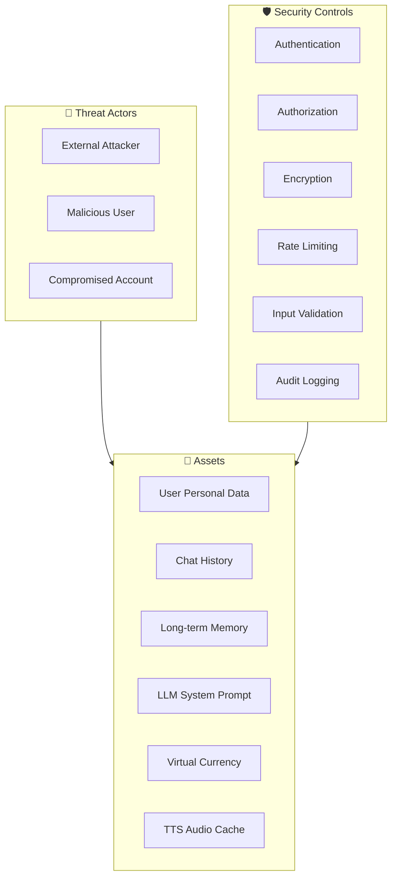
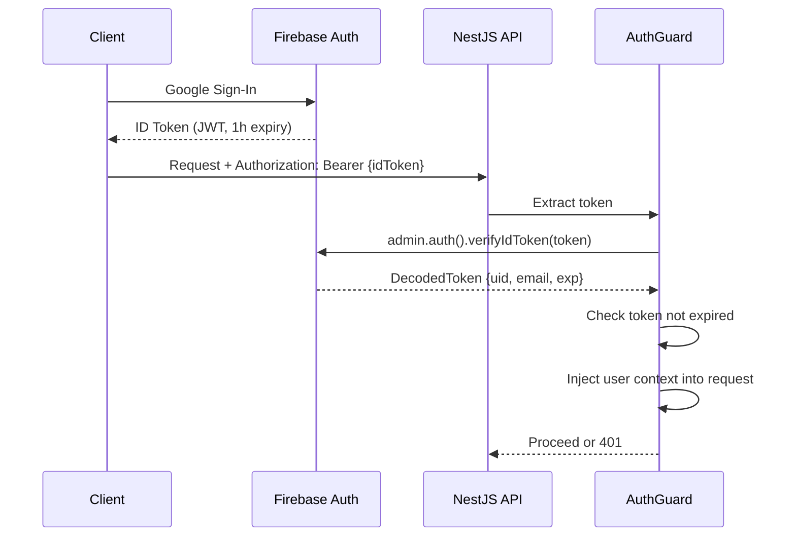

# 10 — Security Design

> Tài liệu bảo mật toàn diện theo OWASP Top 10, đặc biệt cho ứng dụng AI Chat.  
> Bao gồm: Authentication, Authorization, Data Protection, LLM Security, Infrastructure Security.

---

## 1. Threat Model Overview



---

## 2. Authentication & Authorization

### 2.1. Authentication Flow



### 2.2. AuthGuard Implementation

```typescript
@Injectable()
export class FirebaseAuthGuard implements CanActivate {
  constructor(private readonly firebaseAdmin: FirebaseAdminService) {}

  async canActivate(context: ExecutionContext): Promise<boolean> {
    const request = context.switchToHttp().getRequest();
    const authHeader = request.headers.authorization;

    if (!authHeader?.startsWith('Bearer ')) {
      throw new UnauthorizedException('Missing authorization header');
    }

    const token = authHeader.split(' ')[1];
    
    try {
      const decoded = await this.firebaseAdmin.auth().verifyIdToken(token);
      request.user = { uid: decoded.uid, email: decoded.email };
      return true;
    } catch (error) {
      if (error.code === 'auth/id-token-expired') {
        throw new UnauthorizedException('Token expired');
      }
      throw new UnauthorizedException('Invalid token');
    }
  }
}
```

### 2.3. Authorization Rules

| Resource | Owner check | Rule |
|----------|-------------|------|
| Stories | `story.userId === req.user.uid` | CRUD chỉ chủ sở hữu |
| Characters | `character.story.userId === req.user.uid` | Qua story ownership |
| Sessions | `session.userId === req.user.uid` | Chỉ owner chat |
| Vocabulary | `vocab.userId === req.user.uid` | Chỉ owner xem |
| Journal | `session.userId === req.user.uid` | Qua session ownership |
| ChromaDB | `metadata.user_id === req.user.uid` | Filter bắt buộc |

### 2.4. Firestore Security Rules (Production)

```javascript
rules_version = '2';
service cloud.firestore {
  match /databases/{database}/documents {
    // User profile - chỉ owner đọc/ghi subset
    match /users/{userId} {
      allow read: if request.auth != null && request.auth.uid == userId;
      allow write: if request.auth != null && request.auth.uid == userId
        && request.resource.data.diff(resource.data).affectedKeys()
           .hasOnly(['display_name', 'photo_url', 'hsk_level', 
                     'narrator_language', 'show_pinyin', 'tts_speed', 'tutorial_step']);
      // Các trường gems, streak chỉ Server (Admin SDK) mới ghi được
    }
    
    // Deny all other paths
    match /{document=**} {
      allow read, write: if false;
    }
  }
}
```

### 2.5. Firebase Storage Rules

```javascript
rules_version = '2';
service firebase.storage {
  match /b/{bucket}/o {
    // User avatars - chỉ owner upload
    match /avatars/users/{userId}/{allPaths=**} {
      allow read: if request.auth != null;
      allow write: if request.auth != null 
        && request.auth.uid == userId
        && request.resource.size < 5 * 1024 * 1024  // Max 5MB
        && request.resource.contentType.matches('image/.*');
    }

    // Character avatars - chỉ owner upload
    match /avatars/characters/{userId}/{allPaths=**} {
      allow read: if request.auth != null;
      allow write: if request.auth != null 
        && request.auth.uid == userId
        && request.resource.size < 5 * 1024 * 1024
        && request.resource.contentType.matches('image/.*');
    }

    // TTS audio - server only write, authenticated read
    match /tts_audio/{allPaths=**} {
      allow read: if request.auth != null;
      allow write: if false; // Only Admin SDK
    }
  }
}
```

---

## 3. Data Protection

### 3.1. Data Classification

| Data Type | Classification | Storage | Encryption |
|-----------|---------------|---------|-----------|
| Firebase ID Token | Secret | Memory only (never persist) | TLS in transit |
| User email/name | PII | Firestore + Postgres | At rest (provider managed) |
| Chat messages | Sensitive | Postgres + .jsonl | At rest (disk encryption) |
| Vocabulary | Personal | Postgres | At rest |
| Long-term Memory | Sensitive | ChromaDB | ⚠️ Xem §3.3 |
| TTS audio | Non-sensitive | Firebase Storage | CDN HTTPS |
| Gems/Streak | Business | Postgres + Firestore | At rest |

### 3.2. Encryption Strategy

| Layer | Method | Implementation |
|-------|--------|----------------|
| **In Transit** | TLS 1.3 | Caddy auto HTTPS, all internal via Tailscale (WireGuard) |
| **At Rest (Postgres)** | Provider/OS level | VPS disk encryption (LUKS) hoặc managed DB encryption |
| **At Rest (.jsonl)** | OS level disk encryption | LUKS on volume mount |
| **At Rest (ChromaDB)** | ⚠️ Không có built-in | Rely on disk encryption |
| **At Rest (Redis)** | Volatile (AOF backup only) | Disk encryption cho AOF file |
| **Secrets (.env)** | File permissions | `chmod 600 .env`, root only |

### 3.3. ChromaDB Data Isolation (Critical)

ChromaDB không có built-in authentication. **Isolation hoàn toàn dựa vào code logic.**

**Mandatory rules:**
1. **LUÔN** filter `user_id` trong mọi query — không có exception
2. Double-check: Service layer validate `user_id` match authenticated user TRƯỚC khi gọi ChromaDB
3. Code review rule: Mọi PR touching `MemoryService` phải verify filter logic

```typescript
// apps/server/src/modules/memory/memory.service.ts
async retrieveContext(userId: string, storyId: string, query: string): Promise<string> {
  // SECURITY: Always filter by authenticated userId
  const results = await this.chromaClient.query({
    collection: 'roleplay_memory',
    queryTexts: [query],
    nResults: 5,
    where: {
      $and: [
        { user_id: { $eq: userId } },    // MANDATORY
        { story_id: { $eq: storyId } },  // MANDATORY
      ],
    },
  });
  return this.formatContext(results);
}
```

**Integration test bắt buộc:**
```typescript
it('should NEVER return memories from other users', async () => {
  // Setup: user A writes memory
  await memoryService.writeChunk('userA', 'story1', 'Secret memory');
  
  // Test: user B queries
  const results = await memoryService.retrieveContext('userB', 'story1', 'Secret');
  expect(results).toBe(''); // Must be empty
});
```

### 3.4. `.jsonl` File Security

```bash
# File permissions
chmod 600 /var/lib/chatai/sessions/*.jsonl
chown chatai:chatai /var/lib/chatai/sessions/

# Volume mount (Docker) - not accessible from other containers
volumes:
  - jsonl_cache:/var/lib/chatai/sessions:rw
```

**Access control in code:**
```typescript
// sessionId MUST contain userId to prevent path traversal
getFilePath(sessionId: string, userId: string): string {
  // Validate sessionId format (UUID only)
  if (!isUUID(sessionId)) {
    throw new BadRequestException('Invalid session ID format');
  }
  
  // Verify session belongs to user (DB check)
  const session = await this.sessionRepo.findOne({ id: sessionId, userId });
  if (!session) throw new ForbiddenException();
  
  return path.join(this.cacheDir, `history_${sessionId}.jsonl`);
}
```

---

## 4. Input Validation & Sanitization

### 4.1. API Input Validation (Zod)

```typescript
// Tất cả DTO validate bằng Zod trước khi xử lý
const SendMessageSchema = z.object({
  userMessage: z.string()
    .min(1, 'Message cannot be empty')
    .max(2000, 'Message too long')  // Prevent token abuse
    .trim(),
  ephemeralOOC: z.string().max(500).optional(),
  temporaryCharacters: z.array(z.object({
    name: z.string().min(1).max(50),
    description: z.string().min(1).max(200),
  })).max(3).optional(),  // Max 3 temp characters
});
```

### 4.2. Path Traversal Prevention

```typescript
// Prevent path injection in sessionId, fileNames
function sanitizeFilename(input: string): string {
  return input.replace(/[^a-zA-Z0-9\-_]/g, '');
}

// Validate UUID format strictly
function isValidUUID(str: string): boolean {
  return /^[0-9a-f]{8}-[0-9a-f]{4}-[0-9a-f]{4}-[0-9a-f]{4}-[0-9a-f]{12}$/i.test(str);
}
```

### 4.3. File Upload Validation

```typescript
// Avatar upload
const ALLOWED_IMAGE_TYPES = ['image/jpeg', 'image/png', 'image/webp'];
const MAX_FILE_SIZE = 5 * 1024 * 1024; // 5MB

function validateUpload(file: Express.Multer.File) {
  if (!ALLOWED_IMAGE_TYPES.includes(file.mimetype)) {
    throw new BadRequestException('Invalid file type');
  }
  if (file.size > MAX_FILE_SIZE) {
    throw new BadRequestException('File too large');
  }
  // Check magic bytes (not just extension)
  const buffer = readFileSync(file.path);
  const type = fileTypeFromBuffer(buffer);
  if (!type || !ALLOWED_IMAGE_TYPES.includes(type.mime)) {
    throw new BadRequestException('File content does not match type');
  }
}
```

---

## 5. LLM Security (Prompt Injection Defense)

### 5.1. Threat: Prompt Injection

User có thể cố gắng inject vào tin nhắn để:
- Trích xuất system prompt
- Bypass HSK level constraints
- Inject malicious content vào memory

### 5.2. Defenses

```typescript
// 1. User input NEVER placed in system role
// System prompt chỉ chứa templates — user input luôn ở user role

// 2. Input sanitization trước khi đưa vào prompt
function sanitizeForPrompt(userInput: string): string {
  // Remove potential prompt markers
  return userInput
    .replace(/\[SYSTEM\]/gi, '')
    .replace(/\[OOC\]/gi, '')  // Chỉ xử lý nếu qua /ooc flow đúng cách
    .replace(/```/g, '')        // Remove code blocks
    .substring(0, 2000);        // Hard length limit
}

// 3. Output validation — verify AI response conforms to schema
function validateAiResponse(response: unknown): AssistantBatch {
  const parsed = AssistantBatchSchema.safeParse(response);
  if (!parsed.success) {
    logger.warn({ error: parsed.error }, 'AI response failed validation');
    return FALLBACK_RESPONSE;
  }
  
  // Additional checks
  for (const msg of parsed.data.content) {
    // Verify characterName is in allowed list
    if (msg.characterName !== 'Narrator' && 
        !activeCharacters.includes(msg.characterName)) {
      logger.warn(`AI used unknown character: ${msg.characterName}`);
      msg.characterName = 'Narrator'; // Fallback
    }
    
    // Verify shopEvent price is reasonable
    if (msg.shopEvent && (msg.shopEvent.price < 1 || msg.shopEvent.price > 50)) {
      msg.shopEvent = null; // Remove invalid shop event
    }
  }
  
  return parsed.data;
}
```

### 5.3. Memory Poisoning Prevention

```typescript
// Trước khi write vào ChromaDB, validate content
function validateMemoryContent(content: string): boolean {
  // Reject if too short (likely garbage)
  if (content.length < 10) return false;
  
  // Reject if contains system prompt fragments
  const blacklist = ['JSON SCHEMA', 'QUY TẮC BẮT BUỘC', 'System:', 'Assistant:'];
  if (blacklist.some(b => content.includes(b))) {
    logger.warn('Potential memory poisoning attempt');
    return false;
  }
  
  return true;
}
```

---

## 6. Rate Limiting & DDoS Protection

### 6.1. Rate Limits

| Endpoint | Limit | Window | Key |
|----------|-------|--------|-----|
| `POST /chat/*/message` | 30 req | 1 min | userId |
| `POST /chat/*/auto-continue` | 20 req | 1 min | userId |
| `POST /tts/synthesize` | 60 req | 1 min | userId |
| `POST /vocabulary/save` | 30 req | 1 min | userId |
| `POST /auth/google-signin` | 5 req | 1 min | IP |
| `POST /shop/buy` | 10 req | 1 min | userId |
| All other endpoints | 100 req | 1 min | userId |

### 6.2. Implementation

```typescript
// Redis-backed rate limiter
@Injectable()
export class RateLimitGuard implements CanActivate {
  constructor(private readonly redis: RedisService) {}

  async canActivate(context: ExecutionContext): Promise<boolean> {
    const request = context.switchToHttp().getRequest();
    const userId = request.user?.uid || request.ip;
    const endpoint = `${request.method}:${request.route.path}`;
    
    const key = `rate:${userId}:${endpoint}`;
    const current = await this.redis.incr(key);
    
    if (current === 1) {
      await this.redis.expire(key, 60); // 1 minute window
    }
    
    const limit = this.getLimit(endpoint);
    if (current > limit) {
      throw new HttpException('Rate limit exceeded', 429);
    }
    
    // Set headers
    const response = context.switchToHttp().getResponse();
    response.setHeader('X-RateLimit-Limit', limit);
    response.setHeader('X-RateLimit-Remaining', Math.max(0, limit - current));
    
    return true;
  }
}
```

### 6.3. Cloudflare Protection

- Enable Cloudflare proxy (orange cloud) cho domain
- Bot Fight Mode: ON
- Rate Limiting Rule: 1000 req/min per IP (Cloudflare free tier)
- Under Attack Mode: available for emergencies

---

## 7. Session Security

### 7.1. Concurrent Session Lock

```typescript
// Chỉ 1 active turn-at-a-time per session
async acquireTurnLock(sessionId: string): Promise<boolean> {
  const key = `session:${sessionId}:lock`;
  const result = await this.redis.set(key, '1', 'EX', 60, 'NX');
  return result === 'OK';
}

async releaseTurnLock(sessionId: string): Promise<void> {
  await this.redis.del(`session:${sessionId}:lock`);
}
```

### 7.2. Idempotency Key Security

```typescript
// Prevent replay attacks
async checkIdempotency(key: string, userId: string): Promise<CachedResponse | null> {
  // Key includes userId to prevent cross-user replay
  const cacheKey = `idempotency:${userId}:${key}`;
  const cached = await this.redis.get(cacheKey);
  if (cached) return JSON.parse(cached);
  return null;
}
```

---

## 8. Infrastructure Security

### 8.1. Server Hardening Checklist

- [ ] SSH: Key-only auth, disable password login
- [ ] SSH: Change default port (optional)
- [ ] Firewall: `ufw allow 22,80,443/tcp` only
- [ ] Fail2Ban: Install and configure for SSH
- [ ] Auto-updates: `unattended-upgrades` enabled
- [ ] Docker: Non-root user inside containers
- [ ] Docker: Read-only filesystem where possible
- [ ] Secrets: `.env` file chmod 600, not in git
- [ ] Postgres: Strong password, not exposed to internet
- [ ] Redis: No external access, requirepass in production
- [ ] ChromaDB: No external access (Docker internal only)

### 8.2. Dependency Security

```yaml
# .github/workflows/security.yml
name: Security Audit
on:
  schedule:
    - cron: '0 6 * * 1'  # Weekly Monday 6AM
  push:
    paths: ['**/package.json', '**/pnpm-lock.yaml']

jobs:
  audit:
    runs-on: ubuntu-latest
    steps:
      - uses: actions/checkout@v4
      - run: pnpm audit --audit-level=high
      - uses: snyk/actions/node@master
        env:
          SNYK_TOKEN: ${{ secrets.SNYK_TOKEN }}
```

### 8.3. Secrets Management

| Secret | Storage | Rotation |
|--------|---------|----------|
| Firebase Service Account | `.env` file on VPS (chmod 600) | Yearly |
| Postgres password | `.env` file | Quarterly |
| Redis password | `.env` file | Quarterly |
| Sentry DSN | `.env` file | Never (non-secret) |
| Tailscale auth key | One-time setup | Auto-expire |
| GitHub Actions secrets | GitHub encrypted secrets | As needed |

---

## 9. OWASP Top 10 Checklist

| # | Vulnerability | Status | Mitigation |
|---|--------------|--------|-----------|
| A01 | Broken Access Control | ✅ | AuthGuard + ownership checks + Firestore rules |
| A02 | Cryptographic Failures | ✅ | TLS everywhere, disk encryption, no plaintext secrets |
| A03 | Injection | ✅ | Zod validation, parameterized queries (Prisma), prompt sanitization |
| A04 | Insecure Design | ✅ | Threat model documented, ChromaDB isolation tested |
| A05 | Security Misconfiguration | ✅ | Hardening checklist, security headers, firebase rules |
| A06 | Vulnerable Components | ✅ | Weekly `pnpm audit`, Snyk scan |
| A07 | Auth Failures | ✅ | Firebase Auth (managed), rate limit on auth endpoints |
| A08 | Data Integrity | ✅ | Idempotency keys, Postgres transactions, .jsonl append-only |
| A09 | Logging & Monitoring | ✅ | Pino structured logs, Sentry, redacted PII |
| A10 | SSRF | ✅ | GPU only via Tailscale VPN, no user-controlled URLs to internal services |

---

## 10. Incident Response Plan

### 10.1. Severity Levels

| Level | Description | Example | Response Time |
|-------|-------------|---------|---------------|
| P0 | Data breach / Complete outage | DB exposed, user data leaked | Immediate |
| P1 | Partial outage / Security vuln | LLM down, auth bypass | < 4 hours |
| P2 | Degraded service | TTS slow, high error rate | < 24 hours |
| P3 | Minor issue | UI bug, non-critical error | Next sprint |

### 10.2. P0 Response Steps

1. **Contain**: Take affected service offline
2. **Assess**: Check logs for scope of breach
3. **Notify**: Users (if data affected), Firebase (if auth related)
4. **Fix**: Patch vulnerability
5. **Recover**: Restore from backup if needed
6. **Post-mortem**: Document and prevent recurrence

---

## 11. Privacy & Data Retention

| Data | Retention | Deletion Trigger |
|------|-----------|-----------------|
| User profile | Until account deletion | User requests deletion |
| Chat messages (Postgres) | Indefinite | User deletes story (cascade) |
| .jsonl cache | 7 days (cron cleanup) | End Chat or expiry |
| ChromaDB memories | Until story deletion | User deletes story |
| TTS audio cache | 30 days | Cron cleanup |
| Logs | 14 days | Auto-rotate |
| Backups | 30 days | Auto-cleanup |

**Account Deletion (GDPR-like):**
```typescript
async deleteUserAccount(userId: string): Promise<void> {
  // 1. Delete all stories (cascades: characters, sessions, messages)
  await this.prisma.stories.deleteMany({ where: { userId } });
  // 2. Delete vocabulary
  await this.prisma.vocabulary.deleteMany({ where: { userId } });
  // 3. Delete missions, inventory, transactions
  await this.prisma.userMissions.deleteMany({ where: { userId } });
  await this.prisma.inventory.deleteMany({ where: { userId } });
  // 4. Delete ChromaDB entries
  await this.chromaClient.delete({ where: { user_id: userId } });
  // 5. Delete Postgres user meta
  await this.prisma.usersMeta.delete({ where: { uid: userId } });
  // 6. Delete Firestore profile
  await this.firebaseAdmin.firestore().doc(`users/${userId}`).delete();
  // 7. Delete Firebase Storage files
  await this.deleteUserStorageFiles(userId);
  // 8. Delete Firebase Auth account
  await this.firebaseAdmin.auth().deleteUser(userId);
}
```
