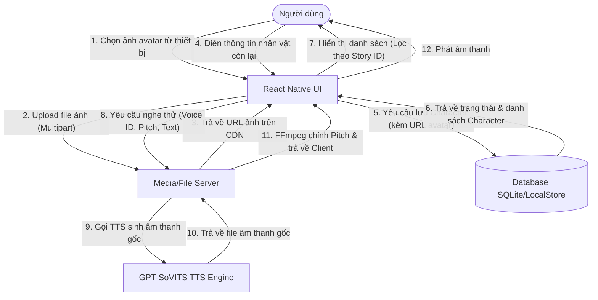
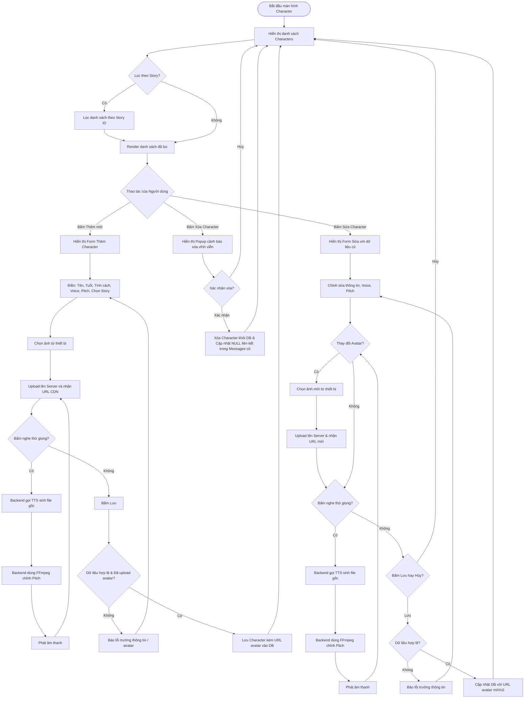
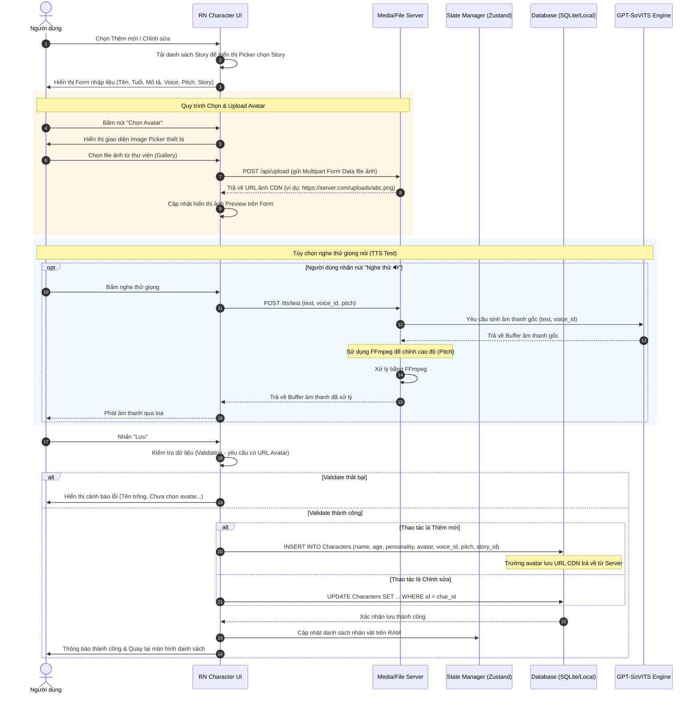
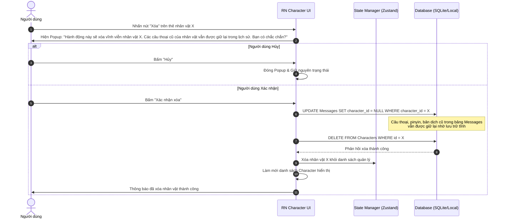
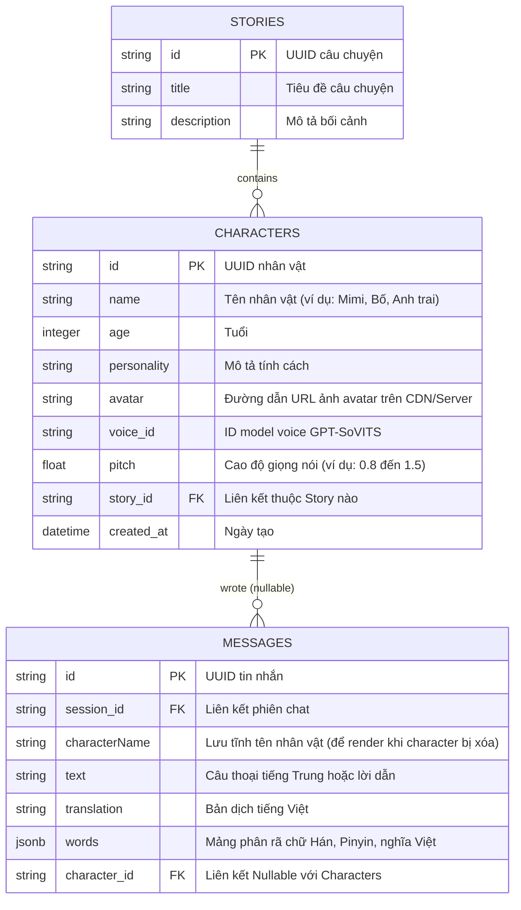

# Tổng quan Tính năng: Quản lý Nhân vật (Character)

Tài liệu này mô tả chi tiết thiết kế hệ thống, sơ đồ luồng dữ liệu, sơ đồ hoạt động và sơ đồ tuần tự cho tính năng quản lý nhân vật (CRUD) trong ứng dụng.

---

## 1. Sơ đồ Luồng Dữ liệu (Data Flow Diagram - DFD)

Sơ đồ này mô tả cách thông tin nhân vật di chuyển giữa Người dùng, Giao diện React Native, Server lưu trữ media, Cơ sở dữ liệu cục bộ và Engine phát âm (TTS) để nghe thử giọng nói:

---

## 2. Sơ đồ Hoạt động (Activity Diagram)

Mô tả luồng tương tác và rẽ nhánh của người dùng khi sử dụng giao diện quản lý nhân vật:

---

## 3. Sơ đồ Tuần tự (Sequence Diagram)

### 3.1. Luồng Thêm mới & Chỉnh sửa Nhân vật

Sơ đồ thể hiện tiến trình thêm mới hoặc cập nhật thông tin nhân vật, bao gồm cả bước chọn ảnh từ thiết bị, tải lên server lưu trữ, và tùy chọn nghe thử giọng nói:

---

### 3.2. Luồng Xóa Nhân vật (Đảm bảo an toàn lịch sử)

Khi xóa một nhân vật, để tránh việc các tin nhắn hội thoại cũ (đang được lưu trong History Store hoặc Journal) bị lỗi hiển thị hoặc bị xóa mất do ràng buộc khóa ngoại (Cascading Delete), hệ thống sẽ gỡ liên kết khóa ngoại trước khi xóa hẳn nhân vật trong Database:

---

## 4. Đặc tả Cấu trúc Dữ liệu (Database Schema / ERD)

