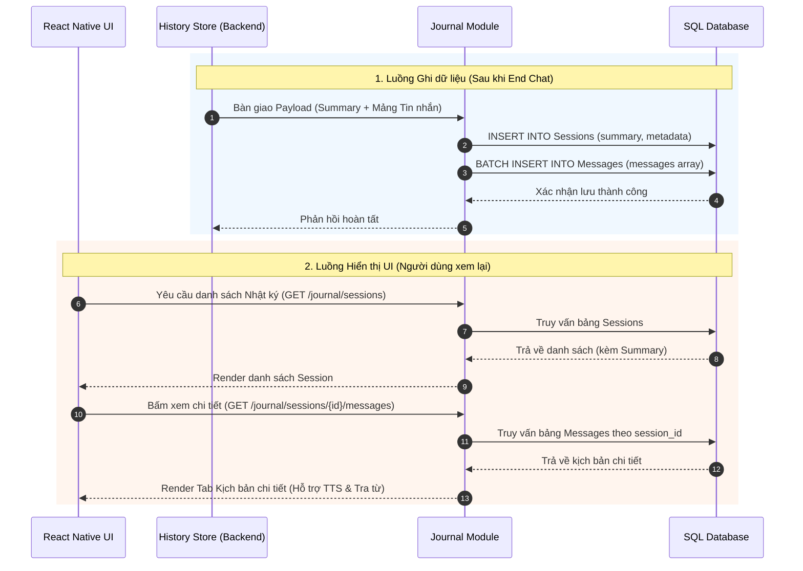
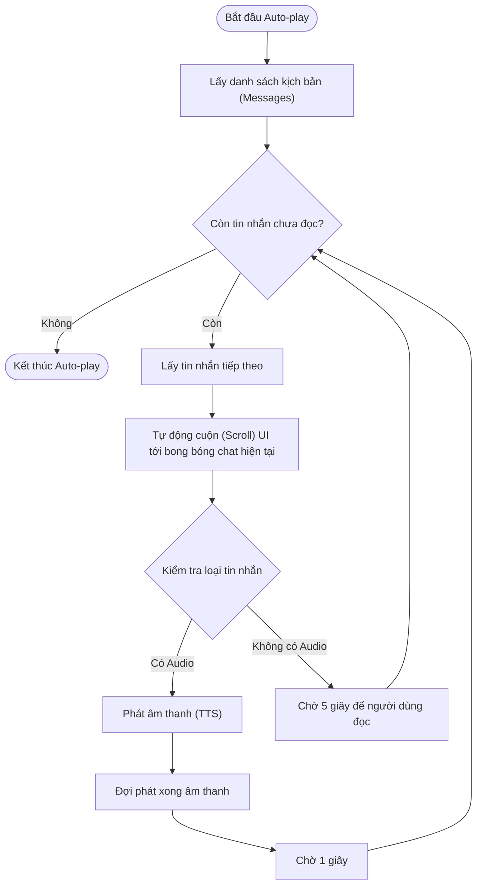

# Tổng quan Tính năng: Nhật ký & Lưu trữ vĩnh viễn (Journal)

Tài liệu này trình bày thiết kế kiến trúc, luồng hoạt động và giao diện của module **Nhật ký (Journal)**. Nếu như History Store quản lý dữ liệu đệm tạm thời khi đang chat, thì Journal đóng vai trò là "Kho lưu trữ vĩnh viễn" và "Không gian học tập/ôn luyện" sau khi phiên chat đã khép lại.

---

## 1. Vai trò và Mục tiêu

1. **Lưu trữ vĩnh viễn (Permanent Storage)**: Quản lý và lưu trữ dữ liệu (Metadata, Summary, Messages) vào Cơ sở dữ liệu (SQL/NoSQL) một cách có cấu trúc sau khi nhận bàn giao từ Backend/History Store.
2. **Giao diện Đọc lại (Playback UI)**: Cung cấp giao diện trực quan cho người dùng đọc lại tóm tắt cốt truyện tiếng Việt và xem lại chi tiết kịch bản (Script) của các cuộc hội thoại cũ.
3. **Quản lý Từ vựng (Vocabulary Notebook)**: Quản lý tập hợp các từ vựng người dùng đã thu thập được thông qua tính năng "Chạm để tra từ & Sưu tầm" trong lúc chat.
4. **Cô lập trách nhiệm**: Tách biệt hoàn toàn việc lưu trữ DB dài hạn ra khỏi luồng xử lý realtime của phòng chat, giúp phòng chat luôn nhẹ và mượt mà.

---

## 2. Kiến trúc Dữ liệu và Luồng tiếp nhận (Data Ingestion Flow)

Khi phiên chat kết thúc (End Chat), Journal Module hoạt động như một REST/GraphQL Service hoặc một Module Backend xử lý luồng dữ liệu cuối cùng.

### 2.1. Payload đầu vào từ History Store
Journal tiếp nhận một khối JSON hoàn chỉnh, sạch sẽ (đã phẳng hóa):
```json
{
  "session_id": "session_uuid",
  "user_id": "user_123",
  "story_id": "story_cabin_001",
  "started_at": 1782500000000, 
  "ended_at": 1782500500000,
  "summary": "Bối cảnh ban đầu là bão tuyết trong cabin gỗ...",
  "messages": [
    { "role": "persistent_ooc", "content": "..." },
    { "role": "user", "text": "..." },
    { "role": "assistant", "characterName": "Mimi", "text": "...", "words": [...] }
  ]
}
```

### 2.2. Quá trình xử lý lưu trữ vào Database (SQL)
- Bảng `Sessions`: Lưu `session_id`, thời gian, và đặc biệt là trường `summary`.
- Bảng `Messages`: Duyệt mảng `messages`, lưu từng tin nhắn với Foreign Key là `session_id`. Đảm bảo lưu thứ tự (`turn_order`) chính xác. Cấu trúc `words` (chữ Hán, Pinyin, Tiếng Việt) có thể lưu dưới dạng JSONB.
- Cập nhật trạng thái của Session thành `ended`.

---

## 3. Thiết kế Giao diện UI/UX (Màn hình Journal)

Màn hình Nhật ký được truy cập từ Màn hình chính (Home) của ứng dụng, gồm các phân khu sau:

### 3.1. Danh sách Hành trình (Session List)
- Hiển thị dạng danh sách thẻ (Card) hoặc dòng thời gian (Timeline).
- Mỗi thẻ gồm: Tên câu chuyện / Chủ đề, Thời gian chơi, và một đoạn trích ngắn của **Tóm tắt cốt truyện (Summary)**.
- Khi người dùng nhấn vào thẻ, hệ thống chuyển sang Màn hình Chi tiết Nhật ký.

### 3.2. Màn hình Chi tiết Nhật ký (Journal Detail)
Được chia thành 2 Tab chính:
- **Tab 1: Tóm lược (Story Summary)**
  - Hiển thị toàn văn bản tóm tắt cốt truyện bằng tiếng Việt. Giúp người dùng hình dung lại câu chuyện đã diễn ra như thế nào như đọc một cuốn tiểu thuyết ngắn.
- **Tab 2: Kịch bản chi tiết (Full Script)**
  - Hiển thị lại toàn bộ đoạn hội thoại giống như giao diện chat ban đầu nhưng **không có thanh nhập liệu (Input Bar)**.
  - Vẫn hỗ trợ tính năng tra từ: Bấm vào chữ Hán vẫn hiện Pinyin/Nghĩa và nút thêm vào sổ tay.
  - Vẫn hỗ trợ tính năng phát âm (TTS) thông qua nút Loa 🔊 bên cạnh mỗi câu thoại.
  - **Chế độ Tự động phát (Auto-play)**: Có nút "Phát tự động". Khi bật, hệ thống sẽ tự động cuộn đến từng bong bóng chat:
    - Đối với câu thoại có âm thanh (nhân vật, hoặc Narrator ngoại ngữ): Phát xong âm thanh sẽ tự động **chờ 1 giây** rồi chuyển sang câu tiếp theo.
    - Đối với lời dẫn tiếng Việt (Narrator, không có âm thanh): Hệ thống **chờ 5 giây** để người dùng đọc xong rồi mới chuyển sang câu tiếp theo.

### 3.3. Sổ tay Từ vựng (Vocabulary Notebook)
- Một khu vực riêng trong Journal chứa các từ vựng người dùng đã "Sưu tầm".
- Liệt kê từ vựng theo dạng bảng hoặc Flashcard.
- Cung cấp tính năng ôn tập (Spaced Repetition) để người học ghi nhớ lâu hơn.

---

## 4. Các sơ đồ UML và Luồng hoạt động

### 4.1. Luồng tiếp nhận & Hiển thị (Sequence Diagram)



### 4.2. Luồng hoạt động Chế độ Tự động phát (Auto-play Flowchart)

Sơ đồ mô tả logic xử lý của hệ thống khi người dùng bật chế độ tự động phát kịch bản để xem lại.



---

## 5. Ý tưởng Nâng cấp (Premium)

- **Xuất bản Kịch bản (Export PDF/Doc)**: Cung cấp nút "Tải xuống" để xuất toàn bộ kịch bản chi tiết (gồm tiếng Trung, Pinyin, và bản dịch tiếng Việt) thành file PDF. Giúp người dùng in ra giấy để học offline hoặc chia sẻ với bạn bè.
- **Thống kê Học tập (Learning Analytics)**: Trong mỗi bản Nhật ký, tổng hợp thống kê: Người dùng đã dùng bao nhiêu câu, số lượng từ vựng mới xuất hiện, và đánh giá độ lưu loát (nếu có sử dụng tính năng luyện nói qua Micro).
