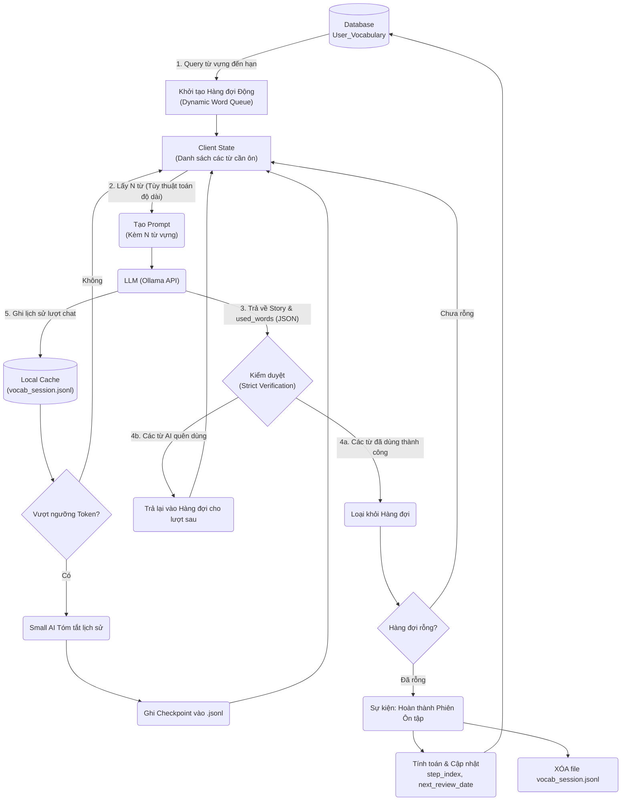
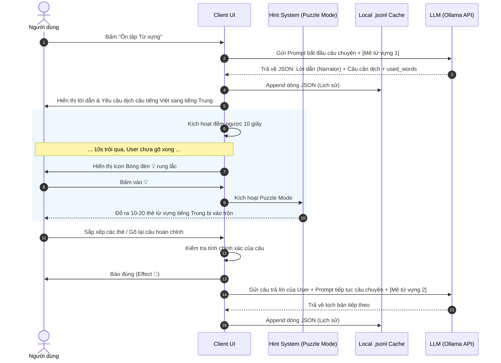
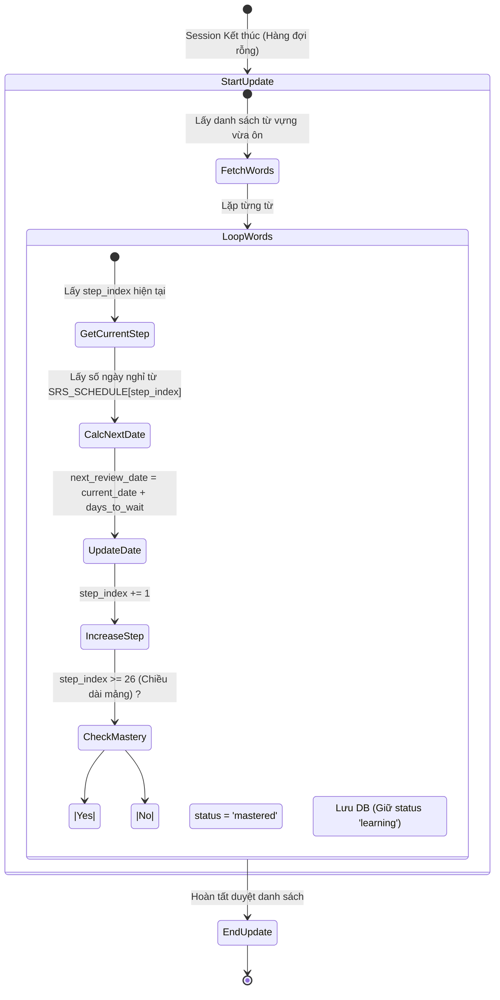
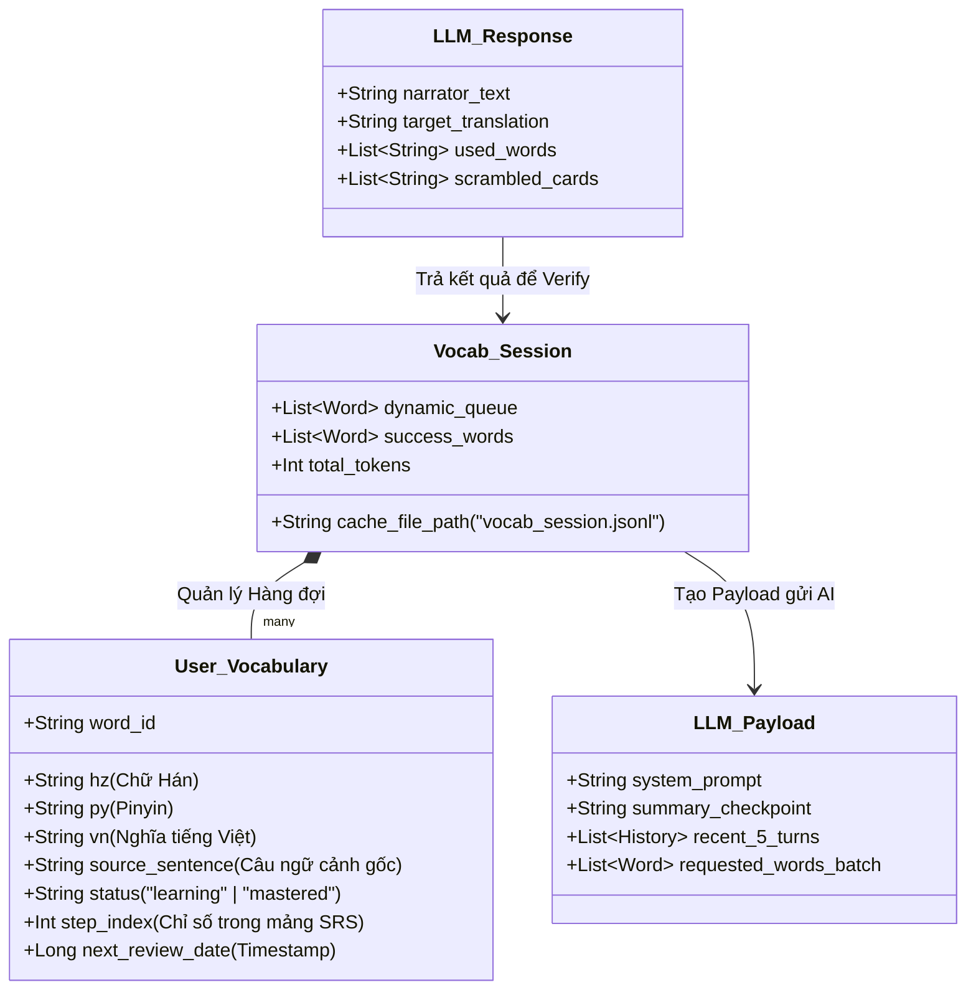

# Tổng hợp Sơ đồ Hệ thống: Ôn tập Từ vựng (Vocabulary Review)

Tài liệu này cung cấp các sơ đồ trực quan mô tả luồng hoạt động, luồng dữ liệu và thiết kế hệ thống cho tính năng **Story-based Vocabulary Review** (bao gồm cơ chế Super Sentence và Hardcore SRS Schedule).

---

## 1. Sơ đồ Luồng Dữ liệu (Data Flow Diagram)

Sơ đồ này mô tả cách dữ liệu từ vựng được lấy từ Database, đưa vào Hàng đợi (Queue), gửi lên AI và xử lý phần bù (những từ AI quên dùng), sau cùng là lưu trạng thái vào DB và xóa cache.

---

## 2. Sơ đồ Tuần tự (Sequence Diagram) - Trải nghiệm Người dùng

Sơ đồ này mô tả chi tiết tương tác giữa Người dùng, Giao diện, Backend và API khi chơi Story Review, đặc biệt là cơ chế Bóng đèn (Hint) và giải đố xếp hình.

---

## 3. Sơ đồ Hoạt động (Activity Diagram) - Thuật toán Hardcore SRS

Sơ đồ diễn tả quá trình xử lý ngầm khi hệ thống cập nhật chỉ số của từ vựng sau một phiên ôn tập dựa trên mảng `SRS_SCHEDULE` cực đoan.

---

## 4. Biểu đồ Lớp (UML Class Diagram) - Cấu trúc Dữ liệu

Sơ đồ mô tả các thực thể dữ liệu chính tham gia vào tiến trình Ôn tập.

