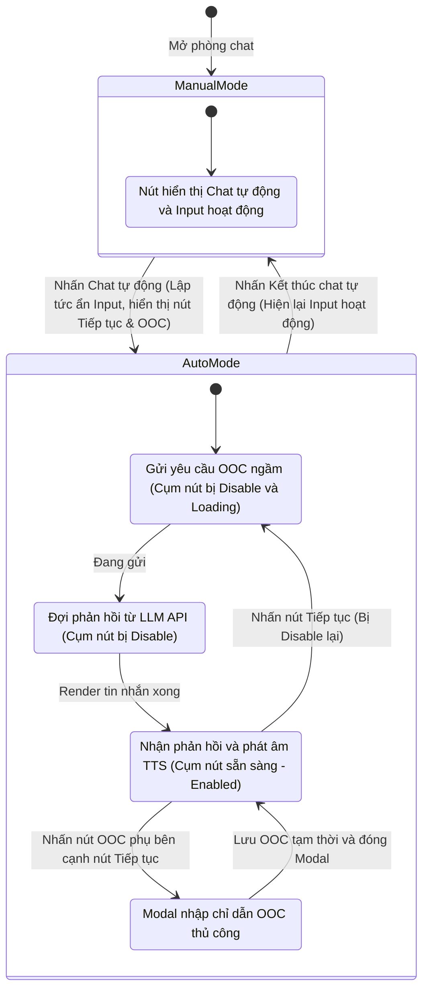
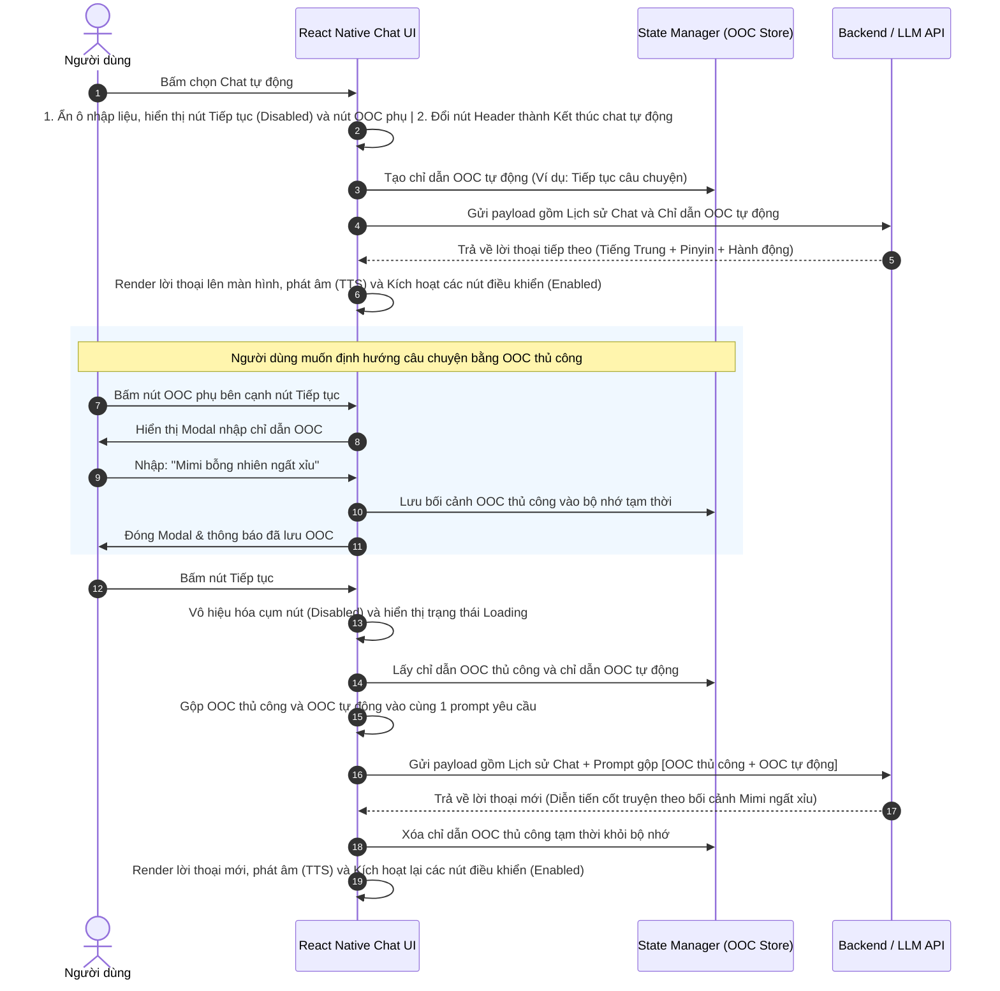

# Tính năng con: Chat tự động (Auto Chat)

Tính năng **Chat tự động (Auto Chat)** cho phép người học tiếng Trung tạm thời "nhường lượt" cho AI để AI tự động tiếp nối mạch truyện, giúp người dùng tập trung vào việc đọc hiểu (Comprehensible Input) và nghe phát âm mà không cần phải liên tục suy nghĩ câu thoại tiếp theo.

---

## 1. Mô tả hoạt động

- **Vị trí**: Nút **"Chat tự động"** trong Menu góc phải của Header (hoặc nút chuyển đổi nhanh trên thanh công cụ chat).
- **Cách thức hoạt động**:
  - **Trạng thái ban đầu**: 
    - Nút hiển thị nhãn: **"Chat tự động"**.
    - Ô nhập liệu tin nhắn (Chat Input) hoạt động bình thường, cho phép người dùng nhập vai thủ công.
  - **Khi nhấn kích hoạt**:
    - Ngay lập tức, ô nhập liệu chat (Input Bar) bị ẩn đi hoàn toàn và được thay thế bằng cụm nút điều khiển gồm: một **Nút "Tiếp tục"** lớn chiếm phần lớn không gian nhập liệu và một **Nút "OOC"** phụ (biểu tượng chiếc bút hoặc bánh răng chỉ dẫn) nằm bên cạnh. Nút trên Header chuyển sang hiển thị nhãn: **"Kết thúc chat tự động"**.
    - Hệ thống tự động gửi yêu cầu OOC ngầm đầu tiên đến AI: `[OOC]: Hãy tiếp tục câu chuyện và sinh ra phản hồi hoặc lời thoại tiếp theo của nhân vật.`
    - **Lưu ý quan trọng**: Trong suốt thời gian này, nút **"Tiếp tục"** và nút **"OOC"** phụ sẽ bị **Vô hiệu hóa (Disabled)** hoàn toàn và hiển thị trạng thái Loading để tránh việc người dùng thao tác gây loạn dữ liệu.
    - AI sinh phản hồi, Client nhận kết quả, render lên màn hình chat và tự động phát âm (TTS).
    - Sau khi tin nhắn hiển thị hoàn tất và phát âm kết thúc, cụm nút mới được chuyển sang trạng thái **Kích hoạt (Enabled/Sẵn sàng)**.
    - **Định hướng câu chuyện bằng bối cảnh OOC thủ công**:
      - Nếu người dùng muốn câu chuyện đi theo hướng của mình, họ có thể nhấn vào nút **"OOC"** phụ bên cạnh nút "Tiếp tục".
      - Một Modal nhập chỉ dẫn OOC sẽ hiện ra để người dùng nhập mong muốn bằng tiếng Việt (Ví dụ: `Mimi bỗng nhiên ngất xỉu` hoặc `Chuyển cảnh sang ngày hôm sau tại trường học`).
      - Chỉ dẫn OOC này sẽ được lưu tạm thời vào bộ nhớ ứng dụng (`OOC Store`).
      - Khi người dùng nhấn nút **"Tiếp tục"**, hệ thống sẽ gộp chỉ dẫn OOC này với prompt tự động để gửi lên AI: `[OOC]: <Chỉ dẫn OOC của người dùng>. Hãy tiếp tục câu chuyện và sinh ra phản hồi hoặc lời thoại tiếp theo của nhân vật dựa trên chỉ dẫn này.`
      - Sau khi AI nhận phản hồi và trả kết quả thành công, chỉ dẫn OOC tạm thời của người dùng sẽ **tự động được giải phóng (xóa sạch)** khỏi bộ nhớ tạm để tránh lặp lại bối cảnh cũ ở các lượt chat tự động tiếp theo.
    - Nếu không nhập chỉ dẫn OOC thủ công, khi nhấn nút **"Tiếp tục"**, hệ thống sẽ chỉ gửi prompt OOC mặc định như bình thường.
  - **Khi nhấn dừng (tắt chế độ)**:
    - Người dùng nhấn nút **"Kết thúc chat tự động"** trên Header.
    - Nút **"Tiếp tục"** và nút **"OOC"** phụ lập tức biến mất, ô nhập liệu chat (Chat Input) được hiển thị và hoạt động bình thường trở lại. Nút trên Header chuyển lại thành nhãn **"Chat tự động"**.

---

## 2. Sơ đồ trạng thái Auto Chat (State Machine Diagram)

Sơ đồ mô tả chi tiết các trạng thái hoạt động của Client và sự thay đổi giao diện nút bấm tương ứng:

---

## 3. Sơ đồ tuần tự Auto Chat (Sequence Diagram)

Sơ đồ thể hiện luồng tương tác giữa Người dùng, Client và LLM API trong chế độ Chat tự động khi người dùng kết hợp nhập bối cảnh OOC thủ công:

---

## 4. Ý tưởng phát triển (Premium)

* **Tự động chuyển đổi thông minh (Auto-Play Mode):** Bên cạnh nút "Tiếp tục" bấm tay, cung cấp thêm một công tắc nhỏ để bật "Tự động phát câu tiếp theo" sau một khoảng thời gian được cấu hình động bởi người dùng (từ 3 đến 15 giây).
* **Tùy biến Prompt OOC tự động:** Cho phép người dùng cấu hình nội dung prompt OOC tự động gửi đi (ví dụ: tự động hướng câu chuyện theo hướng lãng mạn, kịch tính, hoặc tập trung vào từ vựng hội thoại sinh hoạt hằng ngày).

