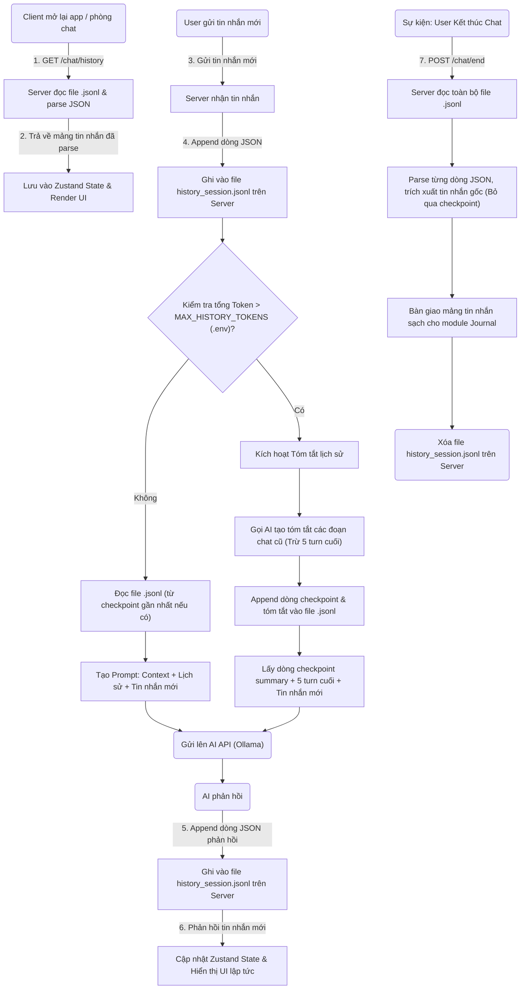
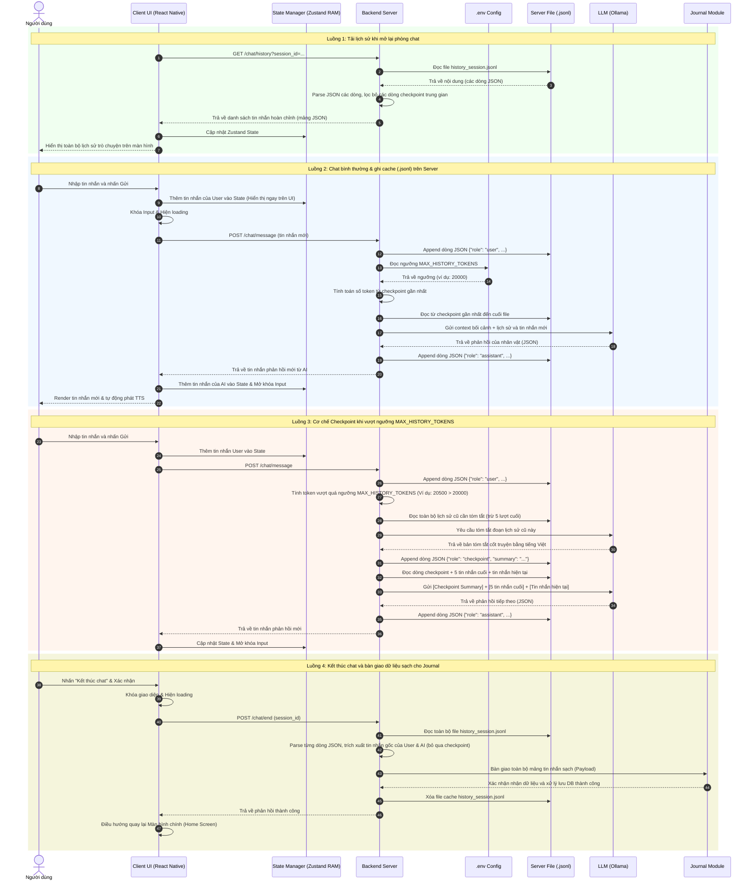

# Tính năng con: Quản lý Lịch sử Bộ nhớ đệm (History Store)

Tính năng này phụ trách quản lý luồng lưu trữ lịch sử hội thoại tạm thời trong quá trình chat để tối ưu hóa context window (số token) gửi lên AI, và bàn giao dữ liệu sạch cho module Journal để lưu trữ lâu dài khi kết thúc phiên. Khác với tính năng Journal (Nhật ký - lưu trữ tóm tắt chung để người dùng xem lại), History Store tập trung vào luồng xử lý kỹ thuật, quản lý cache trên Server và tối ưu hóa hiệu suất API.

---

## 1. Mục tiêu và Nguyên tắc hoạt động
1. **Lưu tin nhắn hiện tại dưới dạng JSON Lines (.jsonl) trên Server:** Tất cả những gì User gửi và AI trả về đều được lưu lại nguyên bản bằng cách ghi nối tiếp (append) một dòng JSON vào một file `.jsonl` cục bộ trên Server (ví dụ: `history_session_<session_id>.jsonl`). File `.jsonl` này đóng vai trò là cache tạm thời để Server có thể dựng lại ngay lập tức context gửi lên AI mà không cần truy vấn Database liên tục.
2. **Cấu hình Ngưỡng Token Checkpoint qua `.env`:**
   - Hệ thống đếm tổng số token của lịch sử. Nếu lịch sử vượt quá ngưỡng tối đa được cấu hình trong file `.env` của Server (ví dụ: `MAX_HISTORY_TOKENS=20000`), cơ chế tóm tắt checkpoint sẽ được kích hoạt.
   - AI sẽ tóm tắt lại toàn bộ lịch sử cũ. Hệ thống đưa đoạn tóm tắt này thành một dòng checkpoint trong file `.jsonl` dưới dạng JSON Object `{"role": "checkpoint", "summary": "..."}` và **chỉ giữ lại 5 tin nhắn gần nhất** (của User và Assistant) để duy trì luồng hội thoại mượt mà tiếp theo.
   - Khi chuẩn bị gửi request lên AI, Server chỉ cần quét ngược từ cuối file `.jsonl` lên để tìm dòng checkpoint gần nhất, rồi lấy dữ liệu từ điểm checkpoint này trở xuống.
3. **Tải lịch sử khi mở lại App (Client Reload):**
   - Khi người dùng thoát ra ngoài và quay lại phòng chat hoặc khởi động lại ứng dụng, Client (React Native) sẽ gửi một request `GET /chat/history?session_id=...` lên Backend Server.
   - Backend Server đọc file `.jsonl` tương ứng trên Server, phân tích (parse) toàn bộ các dòng JSON, lọc bỏ các dòng checkpoint trung gian, khôi phục lại danh sách tin nhắn hoàn chỉnh và trả về cho Client.
   - Client không cần tự quản lý hay khôi phục cache phức tạp trên local storage của thiết bị.
4. **Tối ưu hóa bộ nhớ và IO (Zustand & Server Append):**
   - Trong quá trình chat đang diễn ra, Client quản lý lịch sử tin nhắn hiển thị trong bộ nhớ RAM qua **Zustand State Manager** để cập nhật UI mượt mà tức thì.
   - Khi người dùng gửi tin nhắn hoặc AI phản hồi, dữ liệu được cập nhật trực tiếp vào Zustand.
   - Đồng thời, Client chỉ gửi tin nhắn mới lên API. Server nhận tin nhắn, thực hiện ghi append trực tiếp vào file `.jsonl` trên đĩa cứng của Server và phản hồi dữ liệu sạch về. Không có luồng nào bắt Client hoặc Server phải đọc/ghi lại toàn bộ file `.jsonl` liên tục ở mỗi lượt chat.
5. **Lưu trữ vĩnh viễn khi Kết thúc chat (End Chat):** Khi phiên chat kết thúc (người dùng nhấn End Chat), Server sẽ đọc file `.jsonl` tạm thời này từ đầu đến cuối, parse từng dòng JSON, trích xuất tất cả các tin nhắn gốc (bỏ qua các khối checkpoint), bàn giao dữ liệu sạch này cho **module Journal** xử lý lưu trữ lâu dài vĩnh viễn. Sau đó, Server xóa file cache `.jsonl` trên Server để giải phóng tài nguyên.

---

## 2. Sơ đồ Luồng dữ liệu (Data Flow Diagram)

Sơ đồ mô tả dòng chảy của dữ liệu và mối liên hệ giữa các thành phần khi xử lý lịch sử:



---

## 3. Sơ đồ UML Tuần tự (Sequence Diagram)

Sơ đồ mô tả tương tác chi tiết giữa các luồng: Tải lịch sử khi mở phòng chat, Chat bình thường, Checkpoint (Tóm tắt token), và Luồng xử lý End Chat.



---

## 4. Hệ thống File Format & Cơ chế Xử lý

### 4.1. Định dạng quy chuẩn của File JSON Lines (`history_session.jsonl`)
Mỗi dòng trong file cache là một đối tượng JSON tự chứa (self-contained) biểu diễn một trạng thái hoặc một tin nhắn cụ thể. Định dạng này giúp Server đọc ghi cực kỳ an toàn, có thể append trực tiếp bằng cách ghi thêm một dòng text chứa chuỗi JSON kết thúc bằng dấu xuống dòng `\n`.

Các loại dòng JSON trong file `.jsonl`:

1.  **Dòng bối cảnh cố định (`persistent_ooc`):**
    ```json
    {"role": "persistent_ooc", "content": "Chúng ta đang ở trong một cabin gỗ giữa rừng sâu hoang vắng lúc nửa đêm, trời đang bão tuyết dữ dội.", "timestamp": 1782500000000}
    ```
2.  **Dòng diễn biến tạm thời (`ephemeral_ooc`):**
    ```json
    {"role": "ephemeral_ooc", "content": "Một tiếng gõ cửa mạnh dồn dập vang lên cắt ngang cuộc hội thoại.", "timestamp": 1782500100000}
    ```
3.  **Dòng tin nhắn của User (`user`):**
    ```json
    {
      "role": "user",
      "temporary_characters": [],
      "persistent_ooc": "Chúng ta đang ở trong một cabin gỗ giữa rừng sâu hoang vắng lúc nửa đêm, trời đang bão tuyết dữ dội.",
      "ephemeral_ooc": "",
      "text": "Anh trai: \"Mimi, em đang làm gì thế?\"",
      "timestamp": 1782500050000
    }
    ```
4.  **Dòng tin nhắn phản hồi của Assistant (`assistant`):**
    *(Lưu ý: AI phản hồi gì thì ghi y chang mảng dữ liệu đó vào thuộc tính `content` của dòng assistant)*
    ```json
    {
      "role": "assistant",
      "content": [
        {
          "characterName": "Narrator",
          "text": "Mimi was startled, quickly hid the phone behind her back and answered in confusion:",
          "Emotion": "Scared",
          "Intensity": "medium",
          "translation": "Mimi hoảng hốt vội giấu chiếc điện thoại ra sau lưng và lúng túng trả lời:"
        },
        {
          "characterName": "Mimi",
          "text": "我没做什么。",
          "Emotion": "Shy",
          "Intensity": "medium",
          "translation": "Em không làm gì cả.",
          "words": [
            {"hz": "我", "py": "wǒ", "vn": "Em"},
            {"hz": "没", "py": "méi", "vn": "không/chưa"},
            {"hz": "做", "py": "zuò", "vn": "làm"},
            {"hz": "化学", "py": "huàxué", "vn": "hóa học"},
            {"hz": "。", "py": "", "vn": ""}
          ]
        }
      ],
      "timestamp": 1782500060000
    }
    ```
5.  **Dòng checkpoint tóm tắt (`checkpoint`):**
    ```json
    {
      "role": "checkpoint",
      "summary": "Bối cảnh ban đầu là bão tuyết trong cabin gỗ. Có tiếng gõ cửa lạ, hai anh em phát hiện ra chú chó lạc và đưa vào nhà. Bão tuyết hiện đã ngớt.",
      "timestamp": 1782500200000
    }
    ```

#### Ví dụ tổng hợp file `history_session.jsonl` thực tế (mỗi dòng là một JSON object đơn):
```text
{"role":"persistent_ooc","content":"Chúng ta đang ở trong một cabin gỗ giữa rừng sâu hoang vắng lúc nửa đêm, trời đang bão tuyết dữ dội.","timestamp":1782500000000}
{"role":"user","temporary_characters":[],"persistent_ooc":"Chúng ta đang ở trong một cabin gỗ giữa rừng sâu hoang vắng lúc nửa đêm, trời đang bão tuyết dữ dội.","ephemeral_ooc":"","text":"Anh trai: \"Mimi, em đang làm gì thế?\"","timestamp":1782500050000}
{"role":"assistant","content":[{"characterName":"Narrator","text":"Mimi was startled, quickly hid the phone behind her back and answered in confusion:","Emotion":"Scared","Intensity":"medium","translation":"Mimi hoảng hốt vội giấu chiếc điện thoại ra sau lưng và lúng túng trả lời:"},{"characterName":"Mimi","text":"我没做什么。","Emotion":"Shy","Intensity":"medium","translation":"Em không làm gì cả.","words":[{"hz":"...","py":"...","vn":"..."}]}],"timestamp":1782500060000}
{"role":"ephemeral_ooc","content":"Một tiếng gõ cửa mạnh dồn dập vang lên cắt ngang cuộc hội thoại của hai anh em.","timestamp":1782500100000}
{"role":"user","temporary_characters":[],"persistent_ooc":"Chúng ta đang ở trong một cabin gỗ giữa rừng sâu hoang vắng lúc nửa đêm, trời đang bão tuyết dữ dội.","ephemeral_ooc":"Một tiếng gõ cửa mạnh dồn dập vang lên cắt ngang cuộc hội thoại của hai anh em.","text":"Anh trai: \"Mimi, em có nghe thấy tiếng gõ cửa không? Ngồi im đây để anh ra xem.\"","timestamp":1782500150000}
{"role":"assistant","content":[{"characterName":"Mimi","text":"啊！我怕了，哥哥别开门！","Emotion":"Scared","Intensity":"high","translation":"A! Em sợ lắm, anh đừng mở cửa!","words":[{"hz":"啊","py":"ā","vn":"A"},{"hz":"！","py":"","vn":""},{"hz":"我","py":"wǒ","vn":"Em"},{"hz":"怕","py":"pà","vn":"sợ"},{"hz":"了","py":"le","vn":"lắm/rồi"},{"hz":"，","py":"","vn":""},{"hz":"哥哥","py":"gēge","vn":"anh trai"},{"hz":"别","py":"bié","vn":"đừng"},{"hz":"开门","py":"kāi mén","vn":"mở cửa"},{"hz":"！","py":"","vn":""}]}],"timestamp":1782500180000}
{"role":"checkpoint","summary":"Bối cảnh ban đầu là bão tuyết trong cabin gỗ. Có tiếng gõ cửa lạ, sau khi kiểm tra thì hai anh em phát hiện ra một chú chó lạc và đưa vào nhà. Bão tuyết hiện đã ngớt.","timestamp":1782500200000}
```

---

### 4.2. Cơ chế Parse khi hiển thị lên UI (GET /chat/history)
Khi Client yêu cầu tải lại phòng chat, Server sẽ đọc file `.jsonl` tuần tự từ trên xuống và dựng lại mảng tin nhắn gửi về Client:
1.  **Dòng `persistent_ooc`**: Render tin nhắn hệ thống biểu diễn bối cảnh.
2.  **Dòng `ephemeral_ooc`**: Render tin nhắn hệ thống biểu diễn sự kiện tạm thời.
3.  **Dòng `user`**: Trích xuất trường `text` (ví dụ: `Anh trai: "Mimi, em đang làm gì thế?"`) để hiển thị bong bóng chat cho người dùng.
4.  **Dòng `assistant`**: Duyệt qua mảng `content` bên trong để render thành từng bong bóng thoại tương ứng (nếu `characterName` là `Narrator` thì render dạng chữ in nghiêng màu xám; nếu là tên nhân vật thì render bong bóng thoại có kèm Pinyin/dịch từ mảng `words`).
5.  **Dòng `checkpoint`**: Bỏ qua dòng này (vì đây là dữ liệu phục vụ riêng cho context của AI, không hiển thị trên UI của người học để tránh làm đứt mạch đọc câu chuyện).

---

### 4.3. Cơ chế Parse khi End Chat (Bàn giao cho Journal)
Khi kết thúc phiên chat, Backend Server sẽ đọc và phân tích tuần tự file `.jsonl` để chuẩn bị dữ liệu bàn giao cho Journal:
- **Bỏ qua hoàn toàn** các dòng có `"role": "checkpoint"`.
- Với các dòng `"role": "persistent_ooc"`, `"role": "ephemeral_ooc"`, `"role": "user"`:
  - Trích xuất nội dung tương ứng đưa vào mảng dữ liệu sạch.
- Với dòng `"role": "assistant"`:
  - Tiến hành **làm sạch và phẳng hóa (flat)**: Duyệt qua mảng `content` của dòng này, tách từng tin nhắn của các nhân vật/lời dẫn thành các đối tượng riêng biệt độc lập có `"role": "assistant"`, chứa đầy đủ thông tin chi tiết (`characterName`, `text`, `Emotion`, `Intensity`, `translation`, `words`). Cách này giúp Journal nhận được một danh sách các tin nhắn phẳng hoàn toàn, sẵn sàng lưu trữ.
- **Bàn giao dữ liệu:** Toàn bộ mảng tin nhắn sạch đã trích xuất theo thứ tự thời gian sẽ được gửi trực tiếp sang **module Journal**. Module Journal chịu trách nhiệm tự quản lý và lưu trữ vĩnh viễn mảng dữ liệu này vào Database theo nghiệp vụ riêng của nó (History Store hoàn toàn không can thiệp hay ghi trực tiếp vào Database).
- **Giải phóng cache:** Xóa file `.jsonl` tạm thời trên Server sau khi module Journal xác nhận tiếp nhận dữ liệu thành công.

#### Ví dụ Payload dữ liệu sạch bàn giao cho Journal:
```json
{
  "session_id": "session_123456-uuid-abcd",
  "user_id": "user_789",
  "story_id": "story_cabin_in_snow_001",
  "started_at": 1782500000000, 
  "ended_at": 1782500500000,
  "messages": [
    {
      "role": "persistent_ooc",
      "content": "Chúng ta đang ở trong một cabin gỗ giữa rừng sâu hoang vắng lúc nửa đêm, trời đang bão tuyết dữ dội.",
      "timestamp": 1782500000000
    },
    {
      "role": "user",
      "text": "Anh trai: \"Mimi, em đang làm gì thế?\"",
      "timestamp": 1782500050000
    },
    {
      "role": "assistant",
      "characterName": "Narrator",
      "text": "Mimi was startled, quickly hid the phone behind her back and answered in confusion:",
      "Emotion": "Scared",
      "Intensity": "medium",
      "translation": "Mimi hoảng hốt vội giấu chiếc điện thoại ra sau lưng và lúng túng trả lời:",
      "timestamp": 1782500055000
    },
    {
      "role": "assistant",
      "characterName": "Mimi",
      "text": "我没做什么。",
      "Emotion": "Shy",
      "Intensity": "medium",
      "translation": "Em không làm gì cả.",
      "words": [
        {"hz": "我", "py": "wǒ", "vn": "Em"},
        {"hz": "没", "py": "méi", "vn": "không/chưa"},
        {"hz": "做", "py": "zuò", "vn": "làm"},
        {"hz": "什么", "py": "shénme", "vn": "cái gì"},
        {"hz": "。", "py": "", "vn": ""}
      ],
      "timestamp": 1782500060000
    },
    {
      "role": "ephemeral_ooc",
      "content": "Một tiếng gõ cửa mạnh dồn dập vang lên cắt ngang cuộc hội thoại của hai anh em.",
      "timestamp": 1782500100000
    },
    {
      "role": "user",
      "text": "Anh trai: \"Mimi, em có nghe thấy tiếng gõ cửa không? Ngồi im đây để anh ra xem.\"",
      "timestamp": 1782500150000
    },
    {
      "role": "assistant",
      "characterName": "Mimi",
      "text": "啊！我怕了，哥哥别开门！",
      "Emotion": "Scared",
      "Intensity": "high",
      "translation": "A! Em sợ lắm, anh đừng mở cửa!",
      "words": [
        {"hz": "啊", "py": "ā", "vn": "A"},
        {"hz": "！", "py": "", "vn": ""},
        {"hz": "我", "py": "wǒ", "vn": "Em"},
        {"hz": "怕", "py": "pà", "vn": "sợ"},
        {"hz": "了", "py": "le", "vn": "lắm/rồi"},
        {"hz": "，", "py": "", "vn": ""},
        {"hz": "哥哥", "py": "gēge", "vn": "anh trai"},
        {"hz": "别", "py": "bié", "vn": "đừng"},
        {"hz": "开门", "py": "kāi mén", "vn": "mở cửa"},
        {"hz": "！", "py": "", "vn": ""}
      ],
      "timestamp": 1782500180000
    }
  ]
}
```

---

### 4.4. Cơ chế lấy dữ liệu từ [CHECKPOINT] khi gửi lên AI
Để tối ưu hóa cơ chế **KV Caching (Prompt Caching)** của Ollama và tránh làm mất cache tính toán của System Prompt chính cố định, bối cảnh từ checkpoint sẽ được tách biệt thành một tin nhắn dẫn chuyện độc lập với vai trò `"role": "user"`.

Khi Server cần dựng Payload gửi lên Ollama API:
1. Server quét ngược từ cuối file `.jsonl` lên đầu để tìm dòng có `"role": "checkpoint"` gần nhất.
2. **Nếu tìm thấy checkpoint:**
   - Server dựng một tin nhắn OOC độc lập mang vai trò `"user"` ngay sau System Prompt chính (cố định) để làm cột mốc bối cảnh cũ:
     ```json
     {
       "role": "user",
       "content": "[Tóm tắt các sự kiện đã xảy ra trước đó: <Summary>. Hãy tiếp tục cuộc hội thoại dưới đây dựa trên bối cảnh này]"
     }
     ```
   - Server chỉ đọc tiếp các dòng nằm bên dưới dòng checkpoint đó đến cuối file (gồm 5 lượt chat cuối và tin nhắn mới) để làm context tiếp theo cho AI.
3. **Nếu không tìm thấy checkpoint:**
   - Server đọc toàn bộ file `.jsonl` từ đầu để làm context lịch sử.
4. Quá trình gửi request Ollama sẽ bỏ qua các dòng OOC riêng lẻ, vì bối cảnh OOC đã được nhúng trực tiếp trong Prompt của dòng `user` tương ứng (theo cấu trúc biên dịch dưới đây).

### 4.4.1. Công thức Biên dịch (Render) Prompt cho dòng `user`
Khi Server duyệt qua file `.jsonl` để xây dựng danh sách tin nhắn (`history`) gửi lên Ollama, mỗi đối tượng có `"role": "user"` trong file `.jsonl` sẽ được biên dịch (render) thành một chuỗi prompt văn bản thô (String) trước khi gán vào trường `"content"` của payload gửi đi: `{"role": "user", "content": "<Prompt văn bản biên dịch>"}`.

#### Mẫu Template Biên dịch (Prompt Template):
```text
[ACTIVE CHARACTERS]: {active_characters}
[TEMPORARY CHARACTER PROFILES]:
{temporary_profiles}

[BỐI CẢNH TOÀN CỤC (OOC)]:
{persistent_ooc}

[DIỄN BIẾN MỚI PHÁT SINH (OOC - Chỉ áp dụng lượt này)]:
{ephemeral_ooc}

[HỘI THOẠI CỦA NGƯỜI CHƠI]:
{text}

Dựa trên danh sách nhân vật active, bối cảnh nền, diễn biến mới phát sinh và hội thoại của người chơi, hãy tiếp tục đóng vai các nhân vật phụ (hoặc người dẫn chuyện Narrator) để phản hồi dưới dạng mảng JSON hợp lệ theo Schema yêu cầu.
```

#### Quy tắc điền các tham số động:
1. **`{active_characters}`:** Lấy danh sách tên các nhân vật đang Active từ State của Session hiện tại trên Server (ví dụ: `Mimi, Anh trai`).
2. **`{temporary_profiles}`:** Duyệt qua mảng `temporary_characters` trong đối tượng `user` và render danh sách chi tiết (ví dụ: `- Bác bán rau: Thân thiện, giọng to.`). Nếu mảng rỗng, điền `(Không có)`.
3. **`{persistent_ooc}`:** Lấy trực tiếp từ trường `persistent_ooc` của đối tượng `user`.
4. **`{ephemeral_ooc}`:** Lấy từ trường `ephemeral_ooc` của đối tượng `user`. Nếu rỗng, điền `(Không có)`.
5. **`{text}`:** Lấy trực tiếp từ trường `text` của đối tượng `user` (ví dụ: `Anh trai: "Mimi, em đang làm gì thế?"`).

