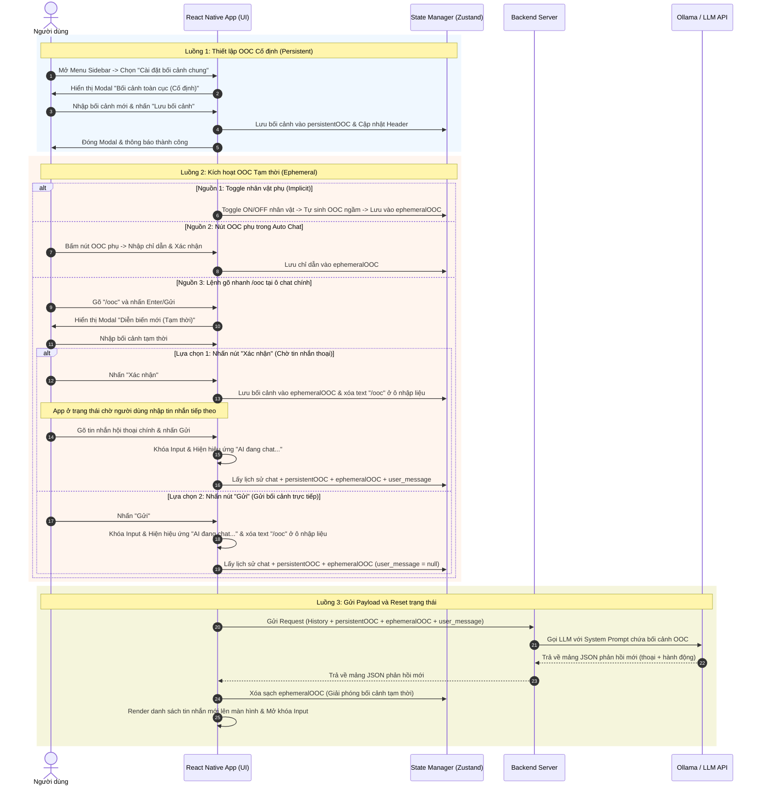
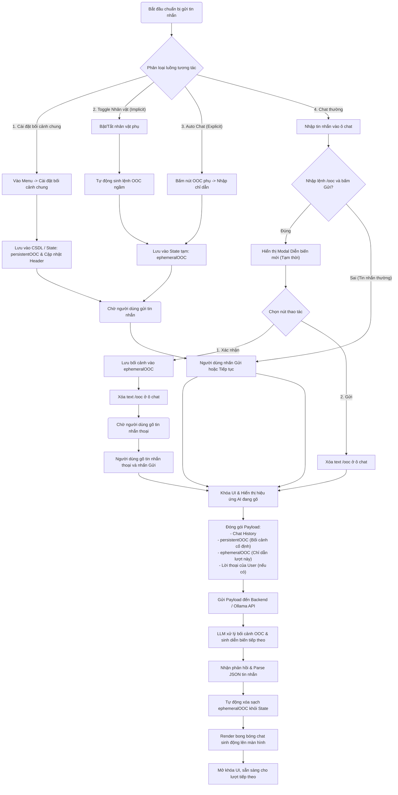

# Tính năng con: Chỉ dẫn ngoài vai (OOC - Out of Character Context)

Tài liệu này đặc tả chi tiết thiết kế hệ thống, luồng hoạt động và tích hợp giao diện cho tính năng **Chỉ dẫn ngoài vai (OOC)** trong phòng chat nhập vai.

---

## 1. Phân loại Chỉ dẫn OOC

Hệ thống quản lý OOC thông qua hai hình thức lưu trữ và áp dụng khác nhau nhằm tối ưu hóa bối cảnh truyện:

### 1.1. OOC Cố định (Persistent OOC / Static)
* **Khái niệm**: Là bối cảnh nền chung hoặc hướng dẫn hệ thống được áp dụng cố định xuyên suốt phòng chat từ đầu đến cuối phiên (không tự động thay đổi giữa các lượt chat).
* **Nguồn kích hoạt**: 
  * **Thiết lập bối cảnh chung**: Menu Sidebar -> Chọn **"Cài đặt bối cảnh chung"** (icon 🌍) -> Hiển thị Modal `persistent-ooc-modal` để người dùng tự do nhập mô tả bối cảnh toàn cục. Nhấn "Lưu bối cảnh" sẽ cập nhật trực tiếp lên Header phòng chat.
  * **Hồ sơ nhân vật tĩnh (System Prompt)**: Chứa mô tả chi tiết của tất cả nhân vật cố định có trong CSDL phòng chat được ghi cố định vào System Prompt lúc khởi tạo session.
* **Ví dụ**: *"Chúng ta đang ở trên một trạm vũ trụ bị bỏ hoang năm 2088. Oxy sắp cạn kiệt."* hoặc *"Mimi bị mất trí nhớ tạm thời và không biết anh trai là ai."*

### 1.2. OOC Tạm thời (Ephemeral OOC / Dynamic)
* **Khái niệm**: Là các chỉ thị, bối cảnh động hoặc diễn biến ngắn hạn thay đổi theo từng tin nhắn, có thể bị xóa đi sau khi AI phản hồi để tránh lặp lại bối cảnh cũ.
* **Nguồn kích hoạt**:
  * **Danh sách nhân vật đang active (Active Characters List)**: Danh sách tên các nhân vật đang có mặt trong phòng chat. Danh sách này thay đổi linh hoạt khi người dùng Toggle Bật/Tắt nhân vật phụ và được gửi kèm dưới dạng context động trong *từng request*.
  * **Sự kiện ngầm tự động (Implicit Event)**: Khi người dùng Bật/Tắt nhân vật phụ (đặc tả tại [add_character.md](add_character.md)). Hệ thống chỉ gửi sự kiện vào lượt chat kế tiếp (Ví dụ: *"Nhân vật A vừa bước vào phòng"* hoặc *"Nhân vật A đã rời phòng"*). Từ lượt tiếp theo, bối cảnh sự kiện này bị xóa khỏi State để tránh AI lặp lại hành động ra/vào.
  * **OOC chủ động trong Auto Chat (Explicit)**: Khi người dùng nhấn nút OOC phụ cạnh nút "Tiếp tục" trong chế độ Auto Chat (đặc tả tại [auto_chat.md](auto_chat.md)).
  * **Lệnh gõ nhanh `/ooc` (Explicit Trigger)**: Khi người dùng gõ `/ooc` vào ô nhập liệu chính và nhấn Enter/Gửi, hệ thống lập tức hiển thị Modal `ephemeral-ooc-modal` (Diễn biến mới tạm thời) với 2 nút chức năng chính:
    * **Nút 1: "Xác nhận"**: Lưu bối cảnh này vào `ephemeralOOC` và xóa trống ô nhập liệu chat chính. App sẽ ở trạng thái chờ người dùng nhập tin nhắn hội thoại chính. Khi người dùng nhắn tin tiếp theo và bấm Gửi, hệ thống sẽ gửi đồng thời bối cảnh tạm thời này cùng tin nhắn thoại của người dùng lên AI.
    * **Nút 2: "Gửi"**: Gửi trực tiếp bối cảnh tạm thời này lên server ngay lập tức mà không cần người dùng nhập thêm tin nhắn thoại nào (tin nhắn thoại của user gửi đi sẽ để trống/null).

---

## 2. Sơ đồ UML tuần tự (Sequence Diagram)

Sơ đồ dưới đây mô tả cách hệ thống lưu trữ các loại bối cảnh OOC vào State Manager, gửi Payload hợp nhất đến AI Game Master và giải phóng bộ nhớ tạm sau khi có phản hồi:



---

## 3. Sơ đồ luồng hoạt động (Flowchart)

Sơ đồ mô tả quy trình tiếp nhận thông tin, phân tách OOC và điều phối dữ liệu trước khi gửi sang mô hình AI:



---

## 4. Tích hợp API và Prompt Engineering (Kiến trúc Hybrid tối ưu Prompt Cache)

Để tận dụng tối đa tính năng **Prompt Cache của Ollama** giúp phản hồi nhanh và tiết kiệm tài nguyên, hệ thống áp dụng kiến trúc Hybrid (Lai):
1. **System Prompt (Cố định/Tĩnh)**: Chứa thông tin mô tả chi tiết (Tên, tuổi, tính cách) của **tất cả** nhân vật cố định trong CSDL của phòng chat.
2. **Context tin nhắn (Động/Nhẹ)**: Chỉ gửi danh sách Tên các nhân vật hiện đang Active (đang có mặt) trong phòng ở lượt này, không cần lặp lại mô tả chi tiết của họ.

### 4.1. Cấu trúc Payload gửi đến Backend

```json
{
  "session_id": "session_123456",
  "active_character_names": ["Mimi", "Anh trai"], 
  "temporary_characters": [
    {
      "name": "Bác bán rau (Tạm thời)",
      "description": "Thân thiện, giọng nói to rõ."
    }
  ],
  "persistent_ooc": "Chúng ta đang ở trong một cabin gỗ giữa rừng sâu hoang vắng lúc nửa đêm, trời đang bão tuyết dữ dội.",
  "ephemeral_ooc": "Một tiếng gõ cửa mạnh dồn dập vang lên cắt ngang cuộc hội thoại của hai anh em.",
  "user_message": "Mimi, em có nghe thấy tiếng gì không?",
  "history": [
    {
      "characterName": "Anh trai",
      "text": "Mimi, em đi ngủ sớm đi.",
      "translation": "Mimi, em đi ngủ sớm đi."
    }
  ]
}
```
*(Lưu ý: Đối với nhân vật tạm thời, do không có sẵn trong System Prompt tĩnh, ta sẽ gửi kèm hồ sơ mô tả của họ trong trường `temporary_characters` động).*

### 4.2. Cách Backend nhúng bối cảnh OOC vào Prompt cho LLM

Backend Server sẽ xử lý nhúng thông tin tối ưu như sau:

#### A. System Prompt (Gửi vào vai trò System - Cố định)
```text
Bạn là một Game Master (Quản trò) điều phối câu chuyện nhập vai tương tác.
Dưới đây là cơ sở dữ liệu hồ sơ tất cả nhân vật cố định trong kịch bản này:
- Mimi: Nhút nhát, sợ anh trai, ham chơi điện thoại.
- Anh trai: Nghiêm khắc nhưng rất thương em.
- Bố: Nghiêm nghị, bận rộn.

QUY TẮC: Hãy đối chiếu danh sách [ACTIVE CHARACTERS] ở mỗi lượt để biết nhân vật nào đang có mặt và được phép đối thoại/hành động. Không cho phép các nhân vật không active xuất hiện.
```

#### B. User Prompt (Gửi kèm lượt chat hiện tại - Động)
```text
[ACTIVE CHARACTERS]: Mimi, Anh trai, Bác bán rau (Tạm thời)
[TEMPORARY CHARACTER PROFILES]:
- Bác bán rau (Tạm thời): Thân thiện, giọng nói to rõ.

[BỐI CẢNH TOÀN CỤC (OOC)]:
Chúng ta đang ở trong một cabin gỗ giữa rừng sâu hoang vắng lúc nửa đêm, trời đang bão tuyết dữ dội.

[DIỄN BIẾN MỚI PHÁT SINH (OOC - Chỉ áp dụng lượt này)]:
Một tiếng gõ cửa mạnh dồn dập vang lên cắt ngang cuộc hội thoại của hai anh em.

[HỘI THOẠI CỦA NGƯỜI CHƠI]:
Anh trai: "Mimi, em có nghe thấy tiếng gì không?"

Dựa trên danh sách nhân vật active, bối cảnh nền, diễn biến mới phát sinh và hội thoại của người chơi, hãy tiếp tục đóng vai các nhân vật phụ (hoặc người dẫn chuyện Narrator) để phản hồi dưới dạng mảng JSON hợp lệ theo Schema yêu cầu.
```

---

## 5. Thiết kế UI/UX và Lưu trữ Lịch sử cho OOC

Để đảm bảo người dùng nắm bắt được dòng chảy logic của cốt truyện nhưng không làm rối mắt giao diện nhập vai chính, UI/UX và cơ chế lưu trữ của OOC được thiết kế như sau:

### 5.1. Hiển thị OOC trong lịch sử Chat (Chat Log)
* Các chỉ dẫn OOC đã được kích hoạt (cả ngầm và chủ động) sẽ được hiển thị như một **"Tin nhắn hệ thống / Sự kiện cốt truyện"** (System Message) nằm giữa các bong bóng thoại.
* **Bối cảnh cố định (Persistent OOC)**: Khi được thiết lập hoặc thay đổi, nó sẽ hiển thị dạng sự kiện:
  > *🌍 [Thiết lập bối cảnh]: Chúng ta đang ở trong một cabin gỗ giữa rừng sâu hoang vắng...*
* **Diễn biến tạm thời (Ephemeral OOC)**: Khi được gửi đi, nó hiển thị dạng sự kiện:
  > *📝 [Sự kiện]: Một tiếng gõ cửa mạnh dồn dập vang lên cắt ngang cuộc hội thoại.*
* **Styling**: Render ở giữa màn hình (centered text), không có bong bóng chat, sử dụng chữ in nghiêng nhỏ kèm icon tương ứng để người dùng phân biệt dễ dàng.

### 5.2. Đồng bộ hóa với Bộ nhớ Cache (.txt) và Database
Để UI luôn tái dựng đúng trình tự lịch sử chat (bao gồm cả thời điểm bối cảnh thay đổi):
1.  **Ghi Cache tạm**: 
    - Khi bối cảnh OOC được áp dụng hoặc cập nhật, hệ thống ghi lập tức khối OOC riêng biệt (`[ROLE: PERSISTENT_OOC]` hoặc `[ROLE: EPHEMERAL_OOC]`) vào file `.txt` để Client dễ dàng phát hiện và render tin nhắn hệ thống.
    - Đồng thời, bối cảnh này vẫn được nhúng đầy đủ trong Prompt biên dịch gửi lên LLM và được ghi nhận trong khối `[ROLE: USER]` (chi tiết xem tại [history_store.md](file:///c:/Users/Draco/OneDrive%20-%20NEXON%20COMPANY/Unity/chatAI/chat/history_store.md)).
2.  **Lưu DB vĩnh viễn**: Khi kết thúc chat, Parser đọc tuần tự và lưu trực tiếp các block OOC riêng lẻ và block hội thoại (bóc tách từ `[ROLE: USER]`) vào DB theo đúng trình tự thời gian (`turn_order`).

### 5.3. Modal Bối cảnh toàn cục (Persistent)
*   **Kích hoạt**: Được mở thông qua Menu Sidebar (Cài đặt bối cảnh chung).
*   **Giao diện**: Chỉ có một ô nhập liệu textarea dành riêng cho Bối cảnh cố định.
*   **Chức năng**: Nút "Lưu bối cảnh" sẽ cập nhật trực tiếp mô tả lên Header của phòng chat, lưu vào state `persistentOOC`, đồng thời **ghi ngay một block `[ROLE: PERSISTENT_OOC]`** độc lập vào file `.txt` lịch sử. Nội dung này cũng sẽ được nhúng vào phần `[BỐI CẢNH TOÀN CỤC (OOC)]` của khối `[ROLE: USER]` tiếp theo khi người dùng gửi tin nhắn thoại.

### 5.4. Modal Diễn biến mới (Ephemeral)
*   **Kích hoạt**: Được mở thông qua lệnh `/ooc` từ thanh Chat hoặc nút Auto Chat.
*   **Giao diện**: Chỉ có một ô nhập liệu textarea dành cho Diễn biến phát sinh hoặc lệnh điều hướng tức thời.
*   **Chức năng**:
    *   **Nút Xác nhận**: Lưu nội dung vào bộ nhớ tạm thời (`ephemeralOOC`) và chờ đợi người dùng gửi một tin nhắn thoại thông thường để đính kèm. Khi người dùng bấm Gửi tin nhắn thoại, hệ thống sẽ **ghi block `[ROLE: EPHEMERAL_OOC]` độc lập trước**, sau đó ghi tiếp khối `[ROLE: USER]` chứa Prompt biên dịch hoàn chỉnh vào file `.txt`.
    *   **Nút Gửi**: Gửi lập tức nội dung đó dưới dạng một "Sự kiện cốt truyện" (không cần tin nhắn thoại đi kèm). Hệ thống **ghi block `[ROLE: EPHEMERAL_OOC]` độc lập**, đồng thời ghi tiếp một khối `[ROLE: USER]` với phần thoại là `(Không có)` để gọi AI xử lý phản hồi tức thời.