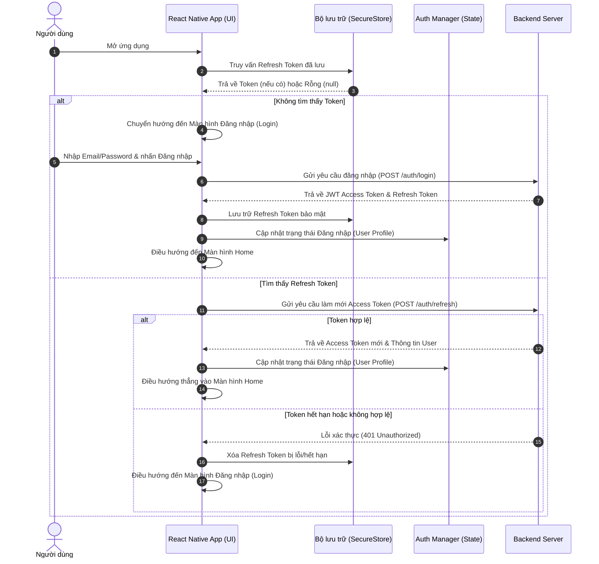
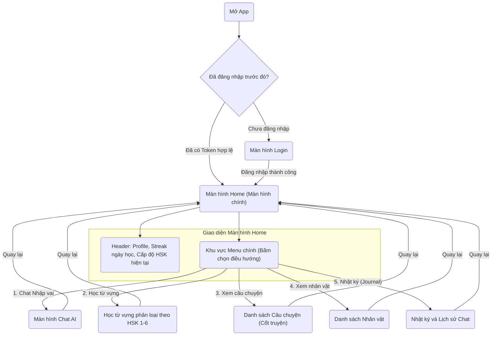

# Thiết kế tính năng: Màn hình chính (Home Screen) & Xác thực (Authentication)

Tài liệu này mô tả chi tiết luồng xác thực khi người dùng mở ứng dụng và cấu trúc hiển thị của màn hình chính (Home Screen).

---

## 1. Sơ đồ UML tuần tự (Sequence Diagram) - Xác thực & Khởi động App

Sơ đồ này mô tả chi tiết quá trình kiểm tra Token khi khởi chạy ứng dụng để quyết định hiển thị màn hình Đăng nhập (Login) hay màn hình Chính (Home).

---

## 2. Sơ đồ luồng hoạt động (Flowchart) - Điều hướng màn hình Home

Sơ đồ thể hiện cách phân phối các tính năng từ màn hình chính sau khi đăng nhập thành công:

---

## 3. Giao diện hiển thị ban đầu của Màn hình Home

Trước mắt, màn hình Home sẽ tập trung hiển thị trực quan cấu trúc menu điều hướng rõ ràng, tạo cảm giác chuyên nghiệp:

1. **Thanh tiêu đề (Header Section)**:
   - Ảnh đại diện (Avatar), Tên người dùng và Lời chào thân thiện (ví dụ: *"Chào bạn, hôm nay bạn muốn nhập vai vào câu chuyện nào?"*).
   - Chỉ số **Streak ngày học liên tiếp** (biểu tượng ngọn lửa) để khích lệ thói quen truy cập app hàng ngày.
   - Cấp độ HSK mục tiêu hiện tại của người học (ví dụ: HSK 3).

2. **Bố cục các phím chức năng chính (Menu Grid Layout)**:
   - **Nút "Chat Nhập vai (AI Chat)"**: Nút to nhất ở vị trí trung tâm, giúp người dùng bắt đầu nhanh cuộc hội thoại nhập vai.
   - **Nút "Học từ vựng HSK (Vocabulary)"**: Đi vào khu vực ôn luyện từ vựng phân cấp từ HSK 1 đến HSK 6.
   - **Nút "Danh sách Câu chuyện (Stories)"**: Khám phá các cốt truyện đã tạo hoặc các kịch bản mẫu (Ví dụ: Đời sống, Cổ trang, Trinh thám...).
   - **Nút "Danh sách Nhân vật (Characters)"**: Xem thông tin các nhân vật AI có sẵn hoặc tạo nhân vật mới (Ví dụ: Bạn học, Sếp, Người lạ trên tàu hỏa...).
   - **Nút "Nhật ký (Journal)"**: Xem lại lịch sử các cuộc hội thoại nhập vai cũ, đọc lại tin nhắn đã gửi/nhận và các bản tóm tắt cốt truyện tương ứng đã lưu.

---

## 4. Ý tưởng phát triển mở rộng cho Màn hình Home (Premium)

Để tăng độ hấp dẫn và khả năng giữ chân người dùng (Retention Rate), màn hình Home có thể bổ sung các ý tưởng sau:

### 💡 A. Quick Resumption (Chat nhanh câu chuyện đang dở)
- Hiển thị một widget nhỏ ở góc trên: **"Tiếp tục trò chuyện"**. 
- Widget này lưu lại cuộc chat gần nhất với nhân vật AI cùng tóm tắt ngắn (ví dụ: *"Đang chat với Mimi ở bối cảnh phòng ngủ"*), người dùng chỉ cần nhấn 1 phát là vào thẳng cuộc chat đang dang dở mà không cần qua nhiều bước chọn lại câu chuyện.

### 💡 B. Thanh tiến trình HSK hàng ngày (Daily HSK Progress)
- Hiển thị tiến độ học từ vựng HSK trong ngày dạng thanh phần trăm (ProgressBar).
- Ví dụ: *"Hôm nay đã học 8/20 từ HSK 3"* để tạo động lực hoàn thành chỉ tiêu.

### 💡 C. Nhiệm vụ hàng ngày (Daily Quests)
- Đưa vào các thử thách học tập nhẹ nhàng:
  - *Nói chuyện với 1 nhân vật mới.*
  - *Học thêm 10 từ vựng.*
  - *Gửi ít nhất 5 tin nhắn tiếng Trung.*
- Khi hoàn thành, người dùng nhận được điểm kinh nghiệm (XP) hoặc huy hiệu ảo.

### 💡 D. Bảng xếp hạng (Leaderboard) hoặc Bạn bè
- Tạo tính năng so sánh số ngày học liên tục (Streak) hoặc số lượng từ vựng đã học với bạn bè hoặc cộng đồng để kích thích tính ganh đua lành mạnh (giống mô hình Duolingo).
