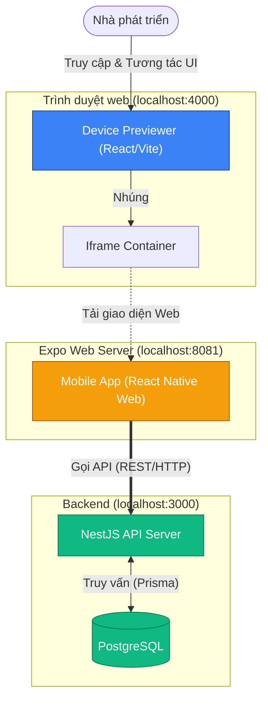

# Tài liệu Thiết kế & Hướng dẫn: Device Previewer

**Device Previewer** là một công cụ tiện ích nội bộ (Internal Developer Tool) được xây dựng dành riêng cho đội ngũ phát triển dự án ChatAI. Thay vì phải mở trình mô phỏng giả lập nặng nề của Android/iOS, Previewer cung cấp một giao diện web phản hồi theo thời gian thực (real-time) với đầy đủ các cấu hình thiết bị di động phổ biến.

---

## 1. Công nghệ sử dụng

- **Frontend Framework:** React (khởi tạo qua Vite)
- **Styling:** Vanilla CSS kết hợp với hiệu ứng Glassmorphism (đổ bóng, làm mờ xuyên thấu cao cấp)
- **Cơ chế nhúng:** Sử dụng thẻ `<iframe sandbox="...">` bảo mật để tải ứng dụng di động dạng web (React Native Web).
- **Package Manager:** Liên kết thông qua hệ thống `pnpm workspace`.

---

## 2. Tính năng chính

- **Lựa chọn thiết bị:** Cung cấp menu dạng thả để xem trước ứng dụng trên `iPhone 14 Pro`, `iPhone SE`, `iPad Pro 11"`, và `Responsive`.
- **Cơ chế Xoay màn hình:** Có thể lật giao diện từ dọc (Portrait) sang ngang (Landscape).
- **Reload cục bộ:** Reload lại riêng vùng Iframe (Ứng dụng di động) mà không cần phải reload cả giao diện Tool Preview.
- **Tích hợp liền mạch:** Hoạt động trơn tru cùng với Server (NestJS) và Mobile (Expo) chỉ bằng một câu lệnh `pnpm start` từ gốc dự án.

---

## 3. Biểu đồ UML (Kiến trúc Component)

Dưới đây là biểu đồ mô tả cách mà Device Previewer tương tác với các hệ thống khác trong dự án ChatAI:

---

## 4. Giải thích tương tác qua Biểu đồ

1. **Khởi tạo:** Khi chạy lệnh `pnpm start`, tệp script gốc `start-dev.js` sẽ khởi động đồng thời 3 hệ thống: `NestJS API`, `Expo Web` và `Previewer`.
2. **Luồng dữ liệu:** Nhà phát triển thao tác trên Web Browser ở cổng `4000`. Previewer đóng vai trò như một bộ "khung máy tính/điện thoại" bọc bên ngoài. Lõi bên trong là thẻ `Iframe` liên tục ánh xạ và tải nội dung từ `localhost:8081` (Nơi Expo đang host phiên bản Web của ứng dụng di động).
3. **Kết nối:** Bất kỳ tương tác đăng nhập, chat hay lấy dữ liệu nào từ ứng dụng được nhúng đều kết nối trực tiếp đến backend `NestJS` tại cổng `3000`. Điều này tạo nên một chu trình khép kín hoàn chỉnh, dễ dàng gỡ lỗi (debug).
