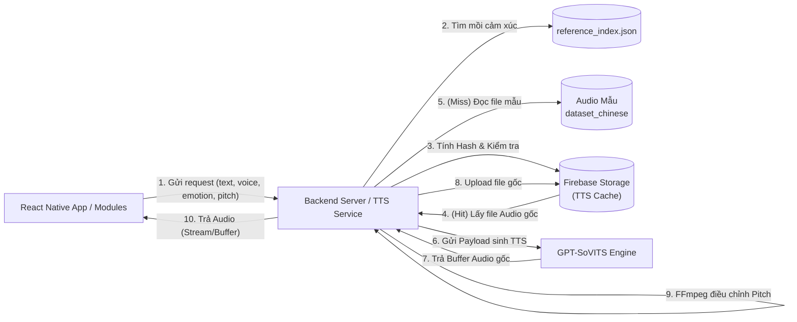
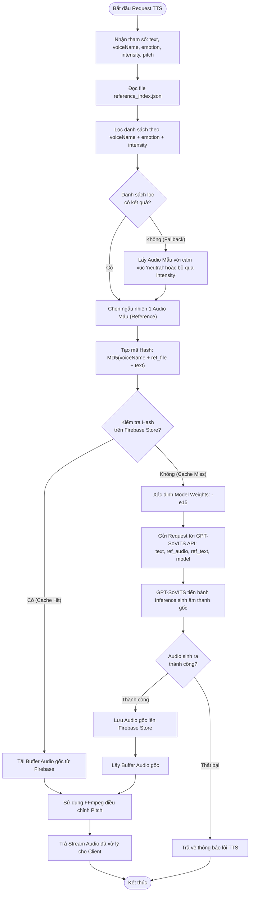
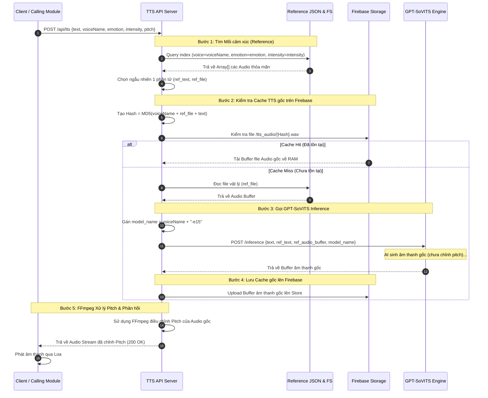
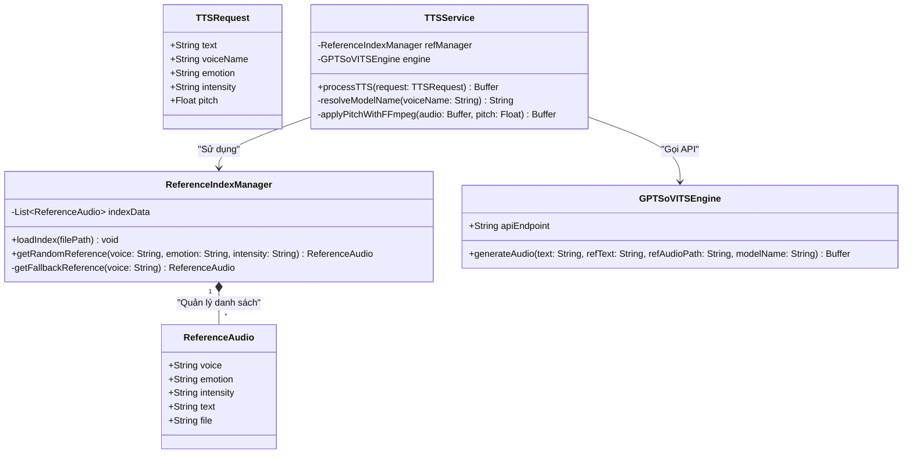

# Thiết kế Kỹ thuật: Hệ thống Text-to-Speech (GPT-SoVITS)

Tài liệu này mô tả chi tiết kiến trúc và luồng hoạt động của hệ thống Text-to-Speech (TTS) dựa trên nền tảng **GPT-SoVITS**. Hệ thống sử dụng cơ chế "Mồi cảm xúc" (Reference Audio) lấy từ bộ dữ liệu đã được phân loại theo 12 cảm xúc và mức độ (Intensity) để tạo ra giọng nói sinh động, tự nhiên nhất.

---

## 1. Cơ chế "Mồi Cảm Xúc" (Emotion Prompting)

Mô hình GPT-SoVITS hoạt động tốt nhất khi được cung cấp một file âm thanh mẫu (Reference Audio) cùng văn bản tương ứng (Reference Text) để bắt chước tông giọng, nhịp điệu và cảm xúc.

- **Dữ liệu nguồn:** Danh sách các mồi cảm xúc được lưu trong file `dataset_chinese/reference_index.json`.
- **Cấu trúc dữ liệu:** Mỗi bản ghi trong JSON chứa `voice` (tên nhân vật), `emotion` (12 loại cảm xúc), `intensity` (mức độ: low, medium, high), `text` (văn bản mẫu), và `file` (tên file `.wav` mẫu).
- **Quy trình chọn mồi:** Khi Server nhận được yêu cầu phát âm một đoạn `text` với `emotion` và `intensity` cụ thể, nó sẽ lọc trong `reference_index.json` tất cả các audio của nhân vật đó khớp với `emotion` và `intensity`. Sau đó, **chọn ngẫu nhiên một audio** để làm mồi cảm xúc. Điều này giúp giọng nói của nhân vật không bị rập khuôn ngay cả khi nói cùng một biểu cảm nhiều lần.
- **Quy trình chọn Model:** Hệ thống sẽ tự động chỉ định mô hình đã được huấn luyện với số epoch cao nhất (ví dụ: `<voicename>-e15`) để gửi cho GPT-SoVITS xử lý.

---

## 2. Sơ đồ Luồng dữ liệu (Data Flow Diagram - DFD)

Sơ đồ này mô tả đường đi của dữ liệu từ Client cho đến khi nhận được file âm thanh hoàn chỉnh từ Engine GPT-SoVITS.

---

## 3. Sơ đồ Hoạt động (Activity Diagram)

Sơ đồ này mô tả logic rẽ nhánh bên trong Backend khi xử lý một Request TTS.

---

## 4. Sơ đồ Tuần tự (Sequence Diagram)

Sơ đồ tuần tự mô tả các bước tương tác chi tiết giữa các hệ thống theo thứ tự thời gian.

---

## 5. Sơ đồ Lớp UML (Class Diagram)

Sơ đồ lớp mô tả cấu trúc dữ liệu và các đối tượng nội bộ của Backend quản lý luồng TTS.

