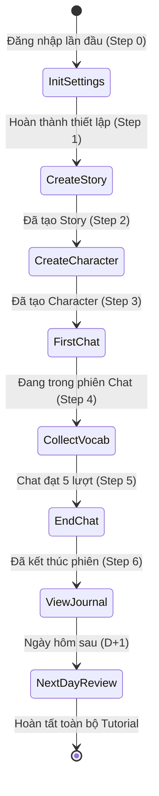
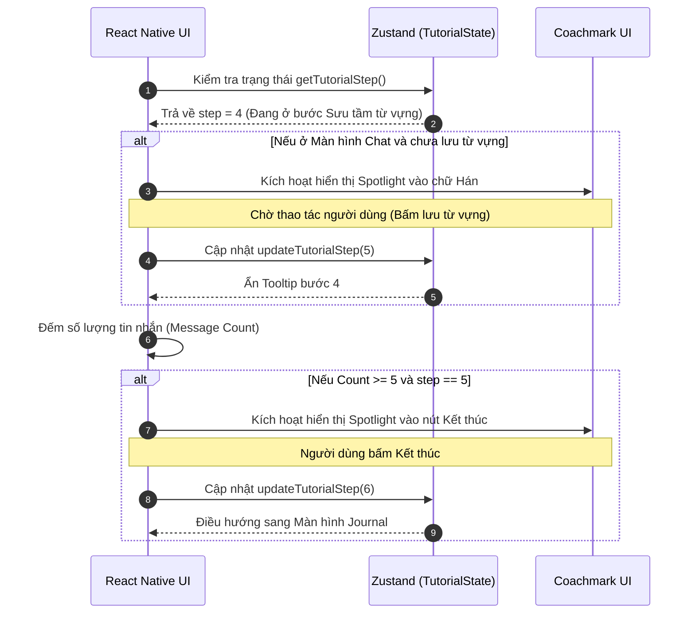

# Thiết kế Kỹ thuật: Hệ thống Hướng dẫn Người dùng (Onboarding & Tutorial)

Tài liệu này mô tả chi tiết luồng trải nghiệm (User Journey) dành cho người dùng mới khi lần đầu tiên đăng nhập vào ứng dụng. Trải nghiệm Tutorial được thiết kế theo dạng từng bước (Step-by-step) nhằm giúp người dùng làm quen với toàn bộ tính năng cốt lõi: Thiết lập -> Cốt truyện -> Nhân vật -> Chat -> Từ vựng -> Nhật ký -> Ôn tập.

---

## 1. Sơ đồ Trạng thái (Tutorial State Machine)

Hệ thống sẽ lưu trữ một biến `tutorial_step` trong User Profile (Firestore) hoặc Local Storage (AsyncStorage) để theo dõi tiến độ hướng dẫn.

---

## 2. Chi tiết Các Giai đoạn Hướng dẫn (Coachmarks)

Ứng dụng sẽ sử dụng các thành phần UI dạng **Tooltip / Spotlight (Làm tối nền và làm sáng phần tử mục tiêu)** để hướng dẫn người dùng.

### 2.1. Giai đoạn 1: Thiết lập ban đầu (Initial Settings)
- **Kích hoạt:** Ngay sau khi đăng nhập Google thành công lần đầu tiên.
- **Giao diện:** Màn hình Onboarding bắt buộc.
- **Hành động:**
  1. Yêu cầu người dùng nhập **Tên hiển thị / Biệt danh**.
  2. Chọn **Trình độ tiếng Trung (Ví dụ: HSK 1 đến HSK 6)**. Thông số này cực kỳ quan trọng để cài đặt vào System Prompt, giúp AI (Large AI) điều chỉnh độ khó của từ vựng và ngữ pháp trong lúc Chat.
- **Hoàn thành:** Bấm nút "Bắt đầu cuộc hành trình". `tutorial_step = 1`.

### 2.2. Giai đoạn 2: Tạo Cốt truyện (Create Story)
- **Kích hoạt:** Sau khi vào Màn hình chính (Home).
- **Hành động:**
  - Màn hình phủ đen, Spotlight chiếu sáng vào nút dấu `(+) Thêm Cốt Truyện`.
  - Tooltip: *"Mọi chuyến phiêu lưu đều bắt đầu từ một bối cảnh. Hãy tạo cốt truyện đầu tiên của bạn!"*
  - Người dùng nhập Tên truyện (VD: Quán cà phê tuổi thanh xuân) và Bối cảnh.
- **Hoàn thành:** Cốt truyện được tạo thành công trên DB. `tutorial_step = 2`.

### 2.3. Giai đoạn 3: Tạo Nhân vật (Create Character)
- **Kích hoạt:** Ngay sau khi ở trong chi tiết cốt truyện vừa tạo.
- **Hành động:**
  - Spotlight trỏ vào nút `(+) Thêm Nhân vật`.
  - Tooltip: *"Cốt truyện cần có người để tương tác. Hãy tạo một người bạn đồng hành!"*
  - Hướng dẫn nhập Tên, Tính cách, chọn Avatar, và đặc biệt là chỉ cho người dùng nút **Nghe thử (Test Voice)** để chọn giọng (VoiceName + Pitch).
- **Hoàn thành:** Nhân vật được tạo thành công. `tutorial_step = 3`.

### 2.4. Giai đoạn 4: Bắt đầu Chat & Sưu tầm Từ vựng
- **Kích hoạt:** Spotlight trỏ vào nút `Bắt đầu Trò chuyện (Chat)` với nhân vật vừa tạo.
- **Hành động:**
  - Người dùng vào màn hình Chat. AI sẽ chủ động gửi câu chào đầu tiên.
  - Người dùng gửi lại 1 câu.
  - **Sưu tầm từ vựng:** Khi tin nhắn của AI hiện ra, Spotlight chiếu vào một chữ Hán khó (hoặc được bôi đậm).
  - Tooltip: *"Bấm vào một từ vựng tiếng Trung để xem Pinyin và Nghĩa. Thử ngay nào!"*
  - Khi Bottom Sheet chi tiết từ vựng mở lên, Spotlight trỏ vào nút `(Bookmark) Lưu vào Sổ tay`.
  - Tooltip: *"Lưu lại từ này để ôn tập vào ngày mai nhé!"*
- **Hoàn thành:** Người dùng lưu thành công 1 từ vựng. `tutorial_step = 4`.

### 2.5. Giai đoạn 5: Kết thúc Chat (Sau 5 câu)
- **Kích hoạt:** Hệ thống đếm tổng số tin nhắn trong phiên. Khi `message_count >= 5`.
- **Hành động:**
  - Màn hình tạm dừng, Spotlight chiếu vào nút `(Stop) Kết thúc cuộc trò chuyện` ở góc màn hình.
  - Tooltip: *"Bạn đã chat đủ dài rồi. Hãy kết thúc phiên để AI ghi nhớ và tóm tắt lại cốt truyện nhé!"*
  - Người dùng bấm Xác nhận kết thúc. Hệ thống kích hoạt ngầm AI Tóm tắt (Summarize).
- **Hoàn thành:** Phiên chat đổi trạng thái thành `Ended`. `tutorial_step = 5`.

### 2.6. Giai đoạn 6: Xem lại Nhật ký (Journal)
- **Kích hoạt:** Tự động điều hướng (Redirect) về màn hình Nhật ký (Journal) ngay sau khi AI tóm tắt xong.
- **Hành động:**
  - Spotlight chiếu vào thẻ Nhật ký (Journal Card) vừa được tạo ra.
  - Tooltip: *"Mọi diễn biến quan trọng vừa rồi đã được ghi chép lại ở đây. AI sẽ dùng trí nhớ này cho các lần chat tiếp theo để câu chuyện liền mạch."*
- **Hoàn thành:** Người dùng bấm xem và thoát. `tutorial_step = 6`.

### 2.7. Giai đoạn 7: Ôn tập Từ vựng (Ngày hôm sau)
- **Kích hoạt:** Hệ thống tính toán thời gian `CurrentDate > TutorialStartDate`. Hoặc qua thông báo đẩy (Local Push Notification).
- **Hành động:**
  - Lần tiếp theo người dùng mở App vào ngày hôm sau, Spotlight chiếu vào Tab `Sổ tay Từ vựng (Vocabulary)`.
  - Tooltip: *"Đã đến lúc ôn lại những từ vựng bạn học hôm qua để não bộ ghi nhớ sâu hơn (Cơ chế Spaced Repetition)!"*
  - Hướng dẫn người dùng bấm vào Flashcard hoặc làm bài Quiz nhỏ.
- **Hoàn thành:** Kết thúc chuỗi Hướng dẫn Onboarding. `tutorial_step = 7`.

---

## 3. Sơ đồ Luồng Sequence (Tutorial Engine)

Sơ đồ mô tả cách UI tương tác với Local Store để kiểm soát việc hiển thị Tutorial.

