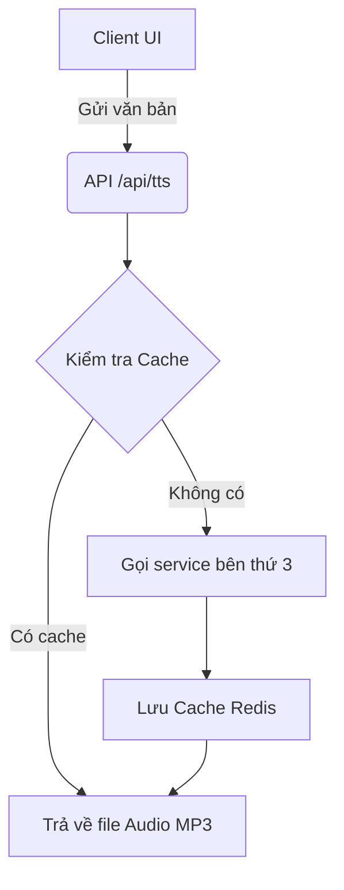

# Nhật ký phát triển: Hệ thống TTS Engine

## Mô tả tính năng
Tích hợp Text-to-Speech Engine vào ứng dụng Chat AI.

## Kiến trúc (Data Flow)

## Những lỗi từng mắc phải và bài học (LƯU Ý QUAN TRỌNG)
1. **Lỗi timeout:** Khi gọi API TTS bên thứ 3 thường mất thời gian khá lâu (trên 10 giây đối với văn bản dài). Ban đầu quên set timeout ở phía frontend làm cho UI bị treo cứng.
   -> **Giải pháp:** Luôn bắt buộc thêm `abortController` với timeout 15s ở phía Client khi gọi API `/api/tts`. Trả về lỗi thân thiện cho user.
2. **Lỗi tràn bộ nhớ Cache:** Chưa giới hạn kích thước file âm thanh lưu vào Redis, gây ra Out of Memory.
   -> **Giải pháp:** Chỉ lưu vào Redis đối với các đoạn văn bản dưới 50 ký tự (các câu nói phổ biến).

**Hãy luôn kiểm tra 2 lỗi này nếu bạn động vào module TTS.**
