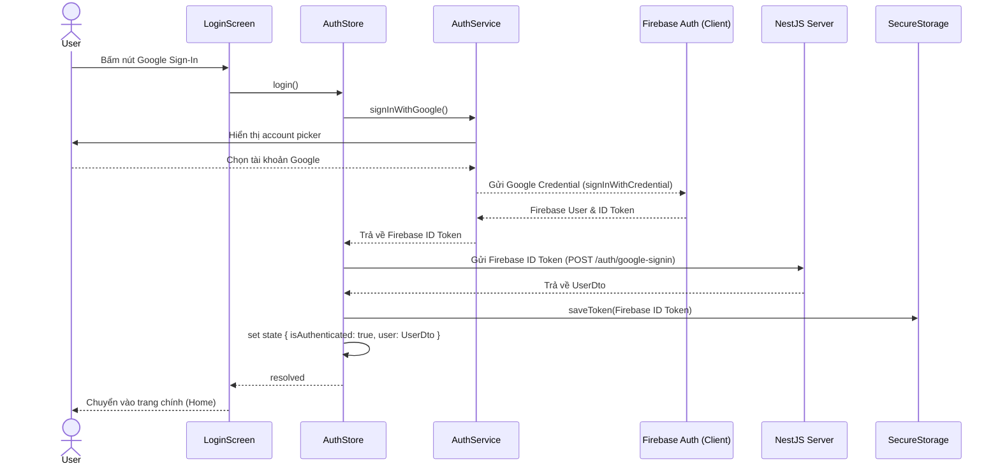

# Tài liệu kỹ thuật: Google Sign-In & AuthStore (Mobile)

Tài liệu này ghi chép lại chi tiết thiết kế, các hàm cốt lõi, sơ đồ hoạt động và các lưu ý quan trọng (gotchas) trong quá trình thực hiện task **P01.T4** — tích hợp Google Sign-In, Firebase Auth Client SDK, Zustand AuthStore và Axios interceptors trên ứng dụng di động React Native (Expo).

---

## 1. Mô tả tính năng
Tích hợp thành công luồng đăng nhập Google trên Mobile App:
1. Đăng nhập qua tài khoản Google để lấy **Google ID Token**.
2. Dùng Google ID Token xác thực với Firebase Auth Client SDK nhằm lấy **Firebase ID Token**.
3. Gửi Firebase ID Token lên API server NestJS để kiểm tra/khởi tạo người dùng trong cơ sở dữ liệu (`/auth/google-signin`), nhận về thông tin người dùng (`UserDto`).
4. Lưu Firebase ID Token an toàn bằng `expo-secure-store`.
5. Quản lý trạng thái đăng nhập qua Zustand Store (`useAuthStore`).
6. Tự động đính kèm Token vào mọi API Request bằng Axios request interceptor và tự động đăng xuất người dùng khi nhận phản hồi 401 Unauthorized từ server.
7. Cung cấp cơ chế **Bypass Login (Dev Mode)** dành riêng cho môi trường phát triển để test nhanh trên simulator/web mà không cần Google Play Services.

---

## 2. Chi tiết các hàm & API

### 2.1. `authService` (`features/auth/services/auth.service.ts`)
- **`configure()`**: Cấu hình Google Sign-In SDK sử dụng `webClientId` lấy từ biến môi trường.
- **`signInWithGoogle()`**: 
  - Gọi Google Sign-In để lấy Google ID Token.
  - Khởi tạo credential của Firebase Auth và đăng nhập vào Firebase bằng `signInWithCredential`.
  - Lấy Firebase ID Token từ user và trả về thông tin đăng nhập cùng profile.
- **`signOut()`**: Gọi đăng xuất ở cả Firebase Auth và Google Sign-In SDK.
- **`getCurrentIdToken(forceRefresh?)`**: Lấy ID Token hiện tại của Firebase Auth, tự động refresh nếu token hết hạn.

### 2.2. `secureStorage` (`utils/secure-storage.ts`)
- **`saveToken(token)`**: Lưu Firebase ID Token vào `expo-secure-store`.
- **`loadToken()`**: Tải token từ `expo-secure-store`.
- **`deleteToken()`**: Xóa token khỏi `expo-secure-store`.

### 2.3. `useAuthStore` (`stores/auth.store.ts`)
- **`login()`**: Thực hiện toàn bộ quy trình đăng nhập, lưu token, đồng bộ server NestJS và cập nhật state.
- **`bypassLoginDev()`**: Chỉ chạy ở môi trường dev. Đăng nhập vô danh (`signInAnonymously`) vào Firebase Auth Emulator để lấy ID token hợp lệ, sau đó đồng bộ với NestJS server.
- **`logout()`**: Gọi API đăng xuất trên server, đăng xuất SDK, xóa Secure Store và reset state.
- **`hydrate()`**: Chạy khi khởi động ứng dụng. Đọc token cũ, lấy token mới nhất từ Firebase Auth, gọi API `/users/me` để phục hồi phiên đăng nhập.

### 2.4. Axios Interceptors (`api/client.ts`)
- **Request Interceptor**: Tự động inject header `Authorization: Bearer <Firebase_ID_Token>`.
- **Response Interceptor**: Lắng nghe mã lỗi `401` từ server (loại trừ các API `/auth/*` để tránh lặp vô hạn) để tự động gọi `useAuthStore.getState().logout()`.

---

## 3. Sơ đồ luồng dữ liệu (Data Flow)



---

## 4. Lưu ý quan trọng & Lỗi đã giải quyết (Gotchas)

### 4.1. Firebase ID Token vs Google ID Token
- **Lỗi**: Ban đầu tài liệu thiết kế chỉ ra việc gửi trực tiếp Google ID Token từ Google Sign-In SDK lên backend NestJS.
- **Vấn đề**: Server NestJS sử dụng Firebase Admin SDK `verifyIdToken()` để verify token. Hàm này chỉ chấp nhận token được cấp bởi Firebase Auth chứ không chấp nhận Google ID Token trực tiếp.
- **Giải quyết**: Client bắt buộc phải lấy Google ID Token trước, dùng nó đăng nhập vào Firebase Auth Client SDK ở client side để sinh ra Firebase ID Token, sau đó mới gửi Firebase ID Token này lên backend NestJS.

### 4.2. Bypass Login cho Dev trên Emulator
- **Vấn đề**: Các simulator Android/iOS thường không có Google Play Services hoặc thiếu chứng chỉ, khiến việc test luồng Google Sign-In trực tiếp gặp lỗi hoặc bắt buộc phải build native.
- **Giải quyết**: Thêm tính năng `bypassLoginDev()` sử dụng `signInAnonymously()` từ Firebase Auth. Vì Firebase Client SDK đã kết nối tới Firebase Auth Emulator chạy local ở cổng 9099, việc đăng nhập vô danh sẽ thành công lập tức và trả về một Firebase ID token giả lập hợp lệ. Backend NestJS (cũng kết nối Emulator) sẽ verify token này thành công và tạo user thực tế trong PostgreSQL.

### 4.3. Lỗi Jest transform trong pnpm Monorepo
- **Lỗi**: Khi chạy test, Jest ném lỗi `SyntaxError: Cannot use import statement outside a module` từ các file ES module trong `node_modules` (như `@react-native/jest-preset` hay `expo-modules-core`).
- **Nguyên nhân**: Trong pnpm monorepos, các gói phụ thuộc được symlink qua cấu trúc thư mục `.pnpm/...`. Do đó, `transformIgnorePatterns` regex mặc định của Jest-Expo không nhận dạng được các module này vì chúng bị bao bọc bởi thư mục `.pnpm`.
- **Giải quyết**: Sửa lại regex của `transformIgnorePatterns` trong `jest.config.js` để tìm các từ khóa ở bất kỳ đâu, kể cả sau `.pnpm/`:
  ```javascript
  transformIgnorePatterns: [
    'node_modules/(?!(.*\\.pnpm/)?(react-native|@react-native|expo|@expo|react-navigation|@react-navigation|@react-native-google-signin))',
  ]
  ```

### 4.4. Sai lệch phiên bản Jest-Expo
- **Lỗi**: Lỗi `Cannot find module 'expo/src/async-require/messageSocket'` xảy ra khi chạy Jest.
- **Nguyên nhân**: Khi cài đặt `jest-expo` mà không chỉ định phiên bản, pnpm cài bản mới nhất (56.x) trong khi dự án đang chạy Expo SDK 52.
- **Giải quyết**: Hạ cấp và cài đặt chính xác phiên bản tương thích: `jest-expo@~52.0.0`.
