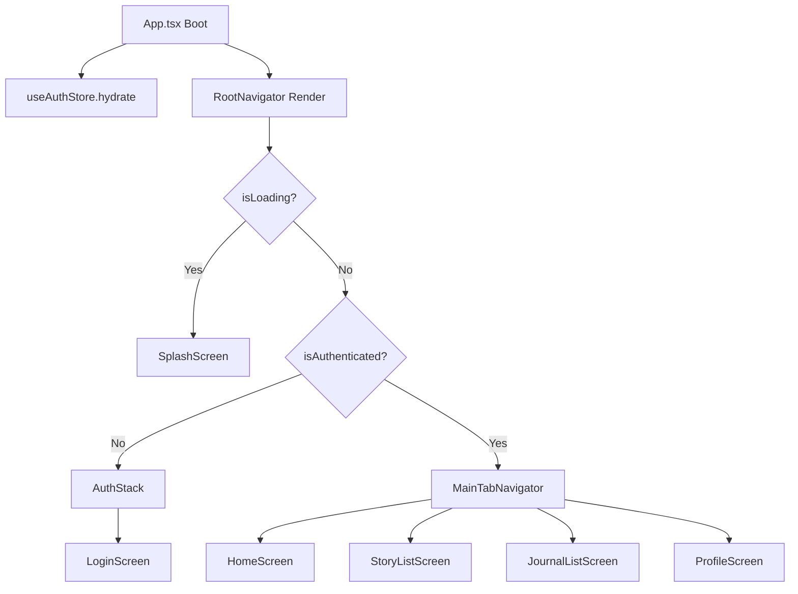

---
date: 2026-05-30
---
# Memori: Cấu trúc Điều hướng Client (Auth + Main)

Tài liệu này ghi lại chi tiết triển khai cấu trúc điều hướng phân nhánh (conditional navigation) và Bottom Tab Bar cho client di động sử dụng React Navigation v7 trong Expo.

## 1. Mô tả Tính năng
Xây dựng luồng điều phối hiển thị màn hình tự động dựa trên trạng thái xác thực (`useAuthStore`):
- Khi ứng dụng khởi động (boot): Kích hoạt `SplashScreen` trong khi khôi phục session (`hydrate()`).
- Nếu chưa đăng nhập: Điều hướng đến `AuthStack` (chứa `LoginScreen`).
- Nếu đã đăng nhập: Điều hướng thẳng vào `MainTabNavigator` (chứa 4 tab: Trang chủ, Truyện AI, Nhật ký, Hồ sơ cá nhân).

## 2. Chi tiết Thành phần & Hàm

### 2.1. `App.tsx`
- **Chức năng**: Khởi động các dịch vụ nền của client.
- **Chi tiết**: Gọi `authService.configure()` cấu hình Google Sign-In và gọi `useAuthStore.getState().hydrate()` khôi phục phiên đăng nhập từ Secure Store trong hook `useEffect` chạy một lần lúc khởi chạy ứng dụng.

### 2.2. `RootNavigator.tsx`
- **Chức năng**: Bộ điều phối điều hướng gốc của ứng dụng.
- **Chi tiết**: Lắng nghe trạng thái `isLoading` và `isAuthenticated` từ store:
  - `isLoading === true`: Trả về trực tiếp component `<SplashScreen />`.
  - `isLoading === false`: Render `NavigationContainer` chứa `Stack.Navigator`. Stack này phân nhánh hiển thị component `MainTabNavigator` (nếu đã xác thực) hoặc `AuthStack` (nếu chưa xác thực).

### 2.3. `AuthStack.tsx`
- **Chức năng**: Chứa các màn hình thuộc luồng đăng nhập/xác thực.
- **Chi tiết**: Sử dụng `createNativeStackNavigator` để chứa duy nhất `LoginScreen` (route name: `Login`).

### 2.4. `MainTabNavigator.tsx`
- **Chức năng**: Hệ thống Menu Tab chính của ứng dụng.
- **Chi tiết**: Sử dụng `createBottomTabNavigator` với 4 màn hình:
  - `Home` → `HomeScreen` (Trang chủ)
  - `Stories` → `StoryListScreen` (Học qua truyện AI)
  - `Journal` → `JournalListScreen` (Nhật ký học tập)
  - `Profile` → `ProfileScreen` (Hồ sơ & Cài đặt)
  - Sử dụng `@expo/vector-icons/Ionicons` làm icon cho mỗi tab (tự động thay đổi active/inactive state).

### 2.5. `SplashScreen.tsx`
- **Chức năng**: Màn hình chờ khởi động.
- **Chi tiết**: Hiển thị logo chữ "文" cách điệu màu trắng trên nền Indigo (thương hiệu của ChatAI) kết hợp vòng xoay tải dữ liệu (`ActivityIndicator`).

### 2.6. `types.ts`
- **Chức năng**: Định nghĩa các kiểu dữ liệu cho React Navigation.
- **Chi tiết**: Định nghĩa `RootStackParamList` sử dụng `NavigatorScreenParams` cho `Auth` và `Main` stacks để giữ sự type-safe tuyệt đối khi điều phối route.

---

## 3. Sơ đồ Luồng Hoạt động (Data Flow)

---

## 4. Lưu ý quan trọng (Gotchas & Bugs)

1. **Thiếu thư viện khi dựng Tab Navigator v7**:
   - *Vấn đề*: Mặc định dự án chưa cài đặt thư viện `@react-navigation/bottom-tabs` dẫn tới không import được `createBottomTabNavigator`. Ngoài ra cũng cần cài đặt `@expo/vector-icons` để phục vụ hiển thị Icon trên Tab.
   - *Cách giải quyết*: Sử dụng pnpm cài đặt trực tiếp vào package mobile:
     `pnpm --filter @chatai/mobile add @react-navigation/bottom-tabs @expo/vector-icons`

2. **Lỗi TypeScript do file cũ mâu thuẫn**:
   - *Vấn đề*: File `PlaceholderHomeScreen.tsx` cũ gọi lệnh `navigation.navigate('Profile')` trong khi `RootStackParamList` đã được định nghĩa lại theo cấu trúc phân cấp (không còn trực tiếp chứa route `Profile` ở root stack mà nested trong `MainTabNavigator`). Điều này gây lỗi biên dịch TypeScript `tsc --noEmit`.
   - *Cách giải quyết*: Vì `PlaceholderHomeScreen.tsx` không còn được import hay sử dụng ở bất kỳ nơi nào khác trong dự án (do đã được thay thế hoàn toàn bởi `HomeScreen` mới trong `features/home/screens/HomeScreen.tsx`), tiến hành xóa bỏ hoàn toàn file thừa này để làm sạch mã nguồn.
