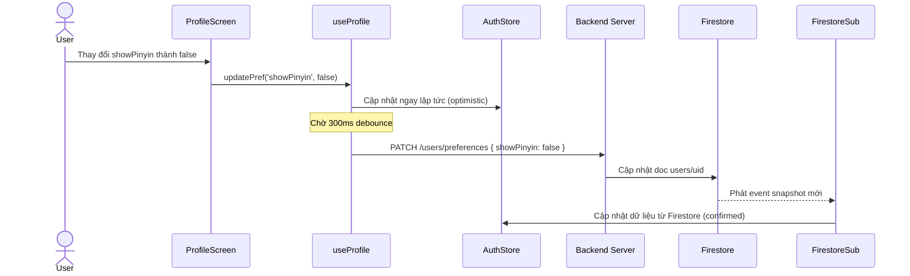
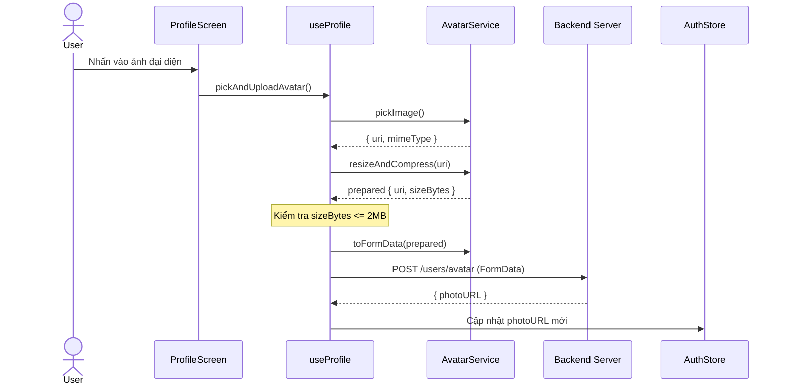

---
date: 2026-05-30
---
# Tài liệu kỹ thuật: Màn hình Profile, Cập nhật Preferences & Upload Avatar (Mobile)

Tài liệu này ghi chép lại chi tiết thiết kế, các dịch vụ cốt lõi, sơ đồ hoạt động và các lỗi đã được giải quyết (gotchas) trong quá trình thực hiện task **P01.T5** — tích hợp màn hình Hồ sơ cá nhân (ProfileScreen), cài đặt preferences với cơ chế optimistic & debounce, upload avatar, và Firestore realtime sync trên client di động React Native (Expo).

---

## 1. Mô tả tính năng
Tích hợp thành công màn hình Profile và các tiện ích liên quan:
1. **Thông tin & Chỉ số**: Hiển thị avatar, tên người dùng, email cùng hàng chỉ số học tập (Streak hiện tại, Streak kỷ lục, số lượng Gems) được cập nhật theo thời gian thực.
2. **Cập nhật Preferences & Debounce**:
   - Thay đổi các tuỳ chọn học tập (cấp độ HSK, hiển thị Pinyin, ngôn ngữ phụ đề, tốc độ đọc TTS).
   - Sử dụng **Optimistic Update** để UI phản hồi lập tức.
   - Sử dụng **Debounce 300ms** gom các thao tác liên tiếp thành duy nhất 1 API request PATCH lên server.
   - Cơ chế tự động khôi phục lại cài đặt cũ (**Rollback**) nếu gặp lỗi mạng/API.
3. **Upload Avatar**:
   - Chạm vào avatar mở thư viện ảnh và yêu cầu cấp quyền.
   - Resize ảnh về `512x512` JPEG và nén chất lượng `80%` bằng `expo-image-manipulator`.
   - Kiểm tra dung lượng file bằng `expo-file-system`, từ chối ảnh lớn hơn 2MB.
   - Upload ảnh dạng `FormData` lên server qua Axios và cập nhật lại `photoURL` mới.
4. **Firestore Realtime Subscription**: Lắng nghe tài liệu `users/{uid}` trực tiếp qua Firestore client SDK và tự động cập nhật vào Zustand AuthStore.
5. **Điều hướng an toàn**: Tích hợp `hydrate` kiểm tra trạng thái token cũ khi khởi động app, phân luồng điều hướng bảo vệ: chưa đăng nhập hiển thị `LoginScreen`, đã đăng nhập hiển thị màn hình chính và `ProfileScreen`.

---

## 2. Chi tiết các dịch vụ & API

### 2.1. `avatarService` (`features/profile/services/avatar.service.ts`)
- **`pickImage()`**: Yêu cầu quyền truy cập thư viện ảnh, mở thư viện chọn ảnh dạng vuông `[1, 1]` và trả về URI cùng mimetype.
- **`resizeAndCompress(uri)`**: Resize ảnh về tối đa `512x512`, nén định dạng JPEG chất lượng `80%` và sử dụng `FileSystem` để lấy dung lượng file (size bytes).
- **`toFormData(prepared)`**: Đóng gói đối tượng ảnh đã nén thành `FormData` đúng định dạng upload cho React Native.

### 2.2. `firestoreSubscription` (`features/profile/services/firestore.subscription.ts`)
- **`subscribeUserDoc(uid, onChange)`**: Sử dụng `onSnapshot` để subscribe realtime tài liệu `users/{uid}` từ Firestore, gọi callback `onChange` để đồng bộ state.

### 2.3. `profileApi` (`features/profile/services/profile.api.ts`)
- **`patchPreferences(dto)`**: Gửi API `PATCH /users/preferences` cập nhật các tuỳ chọn.
- **`uploadAvatar(formData)`**: Gửi API `POST /users/avatar` kèm header `multipart/form-data`.

### 2.4. `useProfile` (`features/profile/hooks/useProfile.ts`)
- Đăng ký Firestore subscription khi mount và dọn dẹp khi unmount.
- Triển khai hàm `updatePref` với cơ chế optimistic update và debounce 300ms, tự động rollback trạng thái local nếu API lỗi.
- Chuỗi điều phối upload avatar: `pickImage -> resizeAndCompress -> size check -> toFormData -> uploadAvatar -> update store`.

---

## 3. Sơ đồ luồng dữ liệu (Data Flow)

### 3.1. Luồng thay đổi cài đặt (Optimistic + Debounce + Realtime Sync)


### 3.2. Luồng chọn và tải lên ảnh đại diện (Avatar Upload Flow)


---

## 4. Lưu ý quan trọng & Lỗi đã giải quyết (Gotchas)

### 4.1. Lỗi size của ActivityIndicator
- **Vấn đề**: Việc thiết lập `size="medium"` trên component `ActivityIndicator` của React Native gây ra lỗi kiểm tra kiểu TypeScript (`TS2769: No overload matches this call`).
- **Giải quyết**: React Native chỉ hỗ trợ hai giá trị chuỗi cho size là `"small"` và `"large"` (hoặc number trên Android). Đã đổi thành `size="large"`.

### 4.2. Lỗi an toàn khi chọn ảnh (Null-safety)
- **Vấn đề**: `result.assets[0]` có thể gây lỗi `possibly undefined` vì TypeScript không tự động giả định mảng `assets` luôn có ít nhất một phần tử.
- **Giải quyết**: Thêm kiểm tra an toàn trước khi sử dụng:
  ```typescript
  const asset = result.assets?.[0];
  if (!asset) return null;
  ```

### 4.3. Thiếu module `@react-native-google-signin/google-signin`
- **Vấn đề**: File dịch vụ xác thực `auth.service.ts` import thư viện này nhưng gói này bị thiếu trong `package.json` của `@chatai/mobile`, dẫn đến compile error.
- **Giải quyết**: Chạy cài đặt bằng lệnh `expo install @react-native-google-signin/google-signin` để cấu hình đúng phiên bản plugin native tương thích với Expo SDK 52.

### 4.4. Lỗi kiểu kiểm thử Jest trong tsconfig
- **Vấn đề**: TypeScript compiler (`tsc`) cố gắng kiểm tra kiểu trong file test `auth.store.test.ts` và báo lỗi không tìm thấy các hàm của Jest (`describe`, `it`, `expect`, `jest`). Đồng thời nếu cấu hình `exclude` file test, IDE sẽ coi file đó là nằm ngoài cấu trúc dự án và vẫn hiển thị các gạch đỏ báo lỗi Diagnostics.
- **Giải quyết**: Cài đặt gói phát triển `@types/jest` cục bộ trong `@chatai/mobile`, đồng thời bổ sung `"types": ["jest"]` vào phần `compilerOptions` của [tsconfig.json](file:///d:/Web/chatAI/apps/mobile/tsconfig.json) và giữ nguyên việc include file test. Cách này giúp cả IDE lẫn compiler tsc nhận dạng hoàn hảo các cú pháp kiểm thử toàn cục của Jest.
  ```json
  "compilerOptions": {
    "types": ["jest"]
  }
  ```
