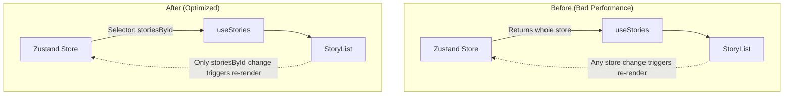

---
date: 2026-05-30
---
# Task P02.R — Refactor & Review Fixes (Phase 2)

## 1. Mô Tả Tính Năng
Thực hiện các chỉnh sửa, refactor mã nguồn (đặc biệt là các lỗi bảo mật) sau khi hoàn thành Phase 2 Code Review. Mục tiêu là loại bỏ rủi ro lộ dữ liệu (`userId` trong `StoryDto`), chặn cache poisoning, tối ưu performance và type-safety cho dự án.

## 2. Chi Tiết Tính Năng

### 2.1. Bảo mật & Ownership (Critical)
- **`StoryDto`**: Loại bỏ trường `userId` khỏi `StoryDto` trong gói `@chatai/shared-types` để tránh leak ID người dùng về phía client.
- **`OwnershipService`**: Loại bỏ `as any` casting, sử dụng trực tiếp Prisma types hợp lệ cho `story` và `character`. Bổ sung unit tests cho các logic kiểm tra quyền.
- **Cache Poisoning Fix**: Sửa đổi `StoriesService.getById()` để kiểm tra quyền sở hữu _trước_ khi tạo hoặc truy xuất Redis cache.

### 2.2. DTO & Type-Safety
- **Response DTOs**: Tạo `StoryResponseDto` và `CharacterResponseDto` implements các DTO của shared-types, với decorator `@Expose()` và `@Exclude()` từ `class-transformer`.
- Thêm `ClassSerializerInterceptor` global vào `main.ts` để tự động loại bỏ các field nhạy cảm khi trả về HTTP response.
- **Validation**: Bổ sung `@MaxLength(50)` cho `name` và `@MaxLength(3000)` cho `personality` vào `CreateCharacterDto` và `UpdateCharacterDto`.

### 2.3. Cải tiến React Native Mobile
- **Zustand Hooks (`useStories`, `useCharacters`)**: Thay vì destructing toàn bộ `store` object gây re-render không đáng có cho toàn bộ component, refactor sang sử dụng pattern destructing từng state/action thông qua selector (vd: `useStoryStore((s) => s.upsert)`).
- **Shared Types**: Chuyển Voice metadata (`VOICE_METADATA`, `VoiceMeta`) từ mobile lên `@chatai/shared-types` để dùng chung.

### 2.4. Performance & Other Fixes
- Đổi cách import thư viện `sharp` trong `CharactersService` từ động (`require()`) sang import tĩnh để bundler và type checking tốt hơn.

## 3. Sơ đồ Data Flow (Zustand Re-render Fix)

## 4. Lưu Ý Quan Trọng (Gotchas & Bugs)

1. **Lưu ý khi xóa `userId` khỏi DTO**:
   - Ở task T6 trước đây đã cảnh báo phải giữ `userId` trong `StoryDto`. Tuy nhiên, sau khi Code Review, quyết định kiến trúc chuẩn là: DTO (Data Transfer Object) dùng để giao tiếp qua mạng **KHÔNG ĐƯỢC** chứa thông tin nội bộ server như `userId`.
   - **Cách giải quyết**: Xóa `userId` trong `packages/shared-types/src/story.ts`. Tuy nhiên, logic kiểm tra `userId` trong NestJS server vẫn hoạt động trên `row.userId` của Prisma model *trước* khi convert qua DTO.
   
2. **`ClassSerializerInterceptor` và Response Mapping**:
   - Khi áp dụng `@Exclude()` vào DTO, phải cấu hình `app.useGlobalInterceptors(new ClassSerializerInterceptor(app.get(Reflector)))` trong `main.ts`.
   - Các services (`StoriesService`, `CharactersService`) phải dùng `plainToInstance(StoryResponseDto, obj)` trong hàm `toDto()` thay vì trả về object literal thông thường, nếu không interceptor sẽ bỏ qua.

3. **Zustand Selector Gotchas**:
   - Trong React, khi hook lấy một function từ Zustand: `const getLoading = useCharacterStore(s => s.loadingByStory)`. Việc trả về function này trong array dependency của `useCallback` sẽ vẫn khiến hàm recreate liên tục do `loadingByStory` là một object sinh ra reference mới. Cần thiết kế hook khéo léo hơn để component con đăng ký trực tiếp selector vào Zustand thay vì truyền qua custom hook cha.

4. **Circular Dependency / Cache Gotcha**:
   - Trong `getById`, nếu check ownership _bên trong_ block cache, và bị ném lỗi `FORBIDDEN`, cache sẽ bị lưu trạng thái sai hoặc liên tục tái tạo. Giải pháp: Check ownership DB trước (vì đằng nào check ownership cũng tốn 1 query DB lấy data gốc). Sau đó nếu pass thì mới đi vào logic lấy/lưu Cache.
