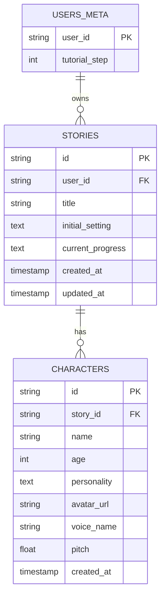

# P02.T1: DB Schema - Stories & Characters

## 1. Mô tả tính năng
Thiết kế và triển khai Database Schema cho hai đối tượng dữ liệu cốt lõi của ứng dụng học tiếng Anh:
- **Story (Câu chuyện):** Lưu trữ thông tin về bối cảnh câu chuyện, tiến trình và người sở hữu câu chuyện.
- **Character (Nhân vật):** Lưu trữ thông tin chi tiết về từng nhân vật trong câu chuyện (tuổi, tính cách, avatar, giọng đọc AI, cao độ giọng đọc).
- Cập nhật **UsersMeta** để hỗ trợ quan hệ một-nhiều với **Story**.
- Thực hiện chạy prisma migration và generate client.

## 2. Đặc tả các model / File chính
- `apps/server/prisma/schema.prisma`:
  - `UsersMeta`: Thêm liên kết quan hệ `stories Story[]`.
  - `Story`: Định nghĩa các trường `id`, `userId` (FK -> users_meta), `title`, `initialSetting`, `currentProgress`, `createdAt`, `updatedAt`. Thiết lập cascade delete trên `userId` và tạo index trên `userId`.
  - `Character`: Định nghĩa các trường `id`, `storyId` (FK -> stories), `name`, `age`, `personality`, `avatarUrl`, `voiceName`, `pitch` (default 1.0), `createdAt`. Thiết lập cascade delete trên `storyId` và tạo index trên `storyId`.
- `apps/server/prisma/migrations/<ts>_add_stories_characters/migration.sql`: File SQL migration tự động tạo ra và apply vào PostgreSQL.

## 3. Biểu đồ ERD

## 4. Lưu ý quan trọng (Gotchas & Bugs)
- **Khai báo relation trước cho các model chưa tồn tại**: Đối với các mối quan hệ có liên quan đến các thực thể ở phase sau (ví dụ: `Session[]` trong `Story` và `Message[]` trong `Character`), nếu khai báo trực tiếp Prisma CLI sẽ báo lỗi biên dịch do thiếu model tương ứng. Để giải quyết, hãy viết các khai báo này dưới dạng comment (ví dụ: `// sessions Session[]`) và sẽ mở khóa ở Phase 4 khi tạo model `Session` và `Message`.
- **Database Connection Error (P1001)**: Khi chạy prisma migration trên máy local, hãy chắc chắn Docker Desktop và dịch vụ PostgreSQL đã được khởi động. Nếu Docker bị dừng, cần chạy lệnh khởi động Docker (trên Windows có thể chạy file executable `Docker Desktop.exe` bằng quyền người dùng) và khởi chạy các containers thông qua lệnh `pnpm docker:up`.
- **TypeScript Error TS2459 (FIREBASE_ADMIN)**: Khi thực hiện verify bằng lệnh `npm run typecheck`, có thể gặp lỗi TypeScript do `FIREBASE_ADMIN` khai báo cục bộ trong `firebase.module.ts` mà không được export tường minh dạng ES module, mặc dù đã có trong mảng `exports` của module NestJS. Đã giải quyết bằng cách thêm dòng `export { FIREBASE_ADMIN };` trực tiếp trong file `firebase.module.ts`.
