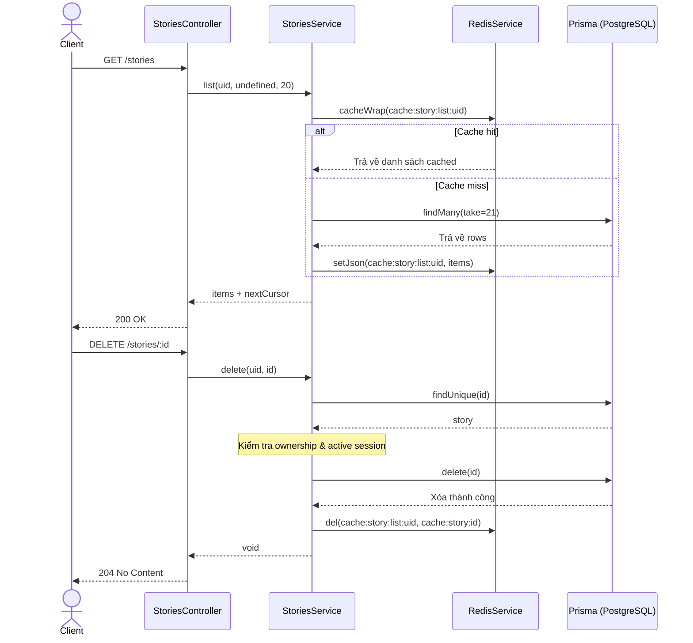

---
date: 2026-05-30
---
# Bộ nhớ Dự án (Memori) - StoriesModule (CRUD)

Tài liệu này lưu trữ bối cảnh thiết kế, đặc tả chức năng và các lưu ý kỹ thuật quan trọng của module quản lý câu chuyện (`StoriesModule`) trên server NestJS.

## 1. Mô tả tính năng
Module `StoriesModule` cung cấp các API RESTful để thực hiện các thao tác CRUD (Create, Read, Update, Delete) cho các câu chuyện của người dùng hiện tại, bao gồm:
- Phân trang cursor-paginated cho danh sách câu chuyện.
- Kiểm tra quyền sở hữu đối với các thao tác đọc chi tiết, cập nhật và xóa.
- Tự động quản lý cache danh sách và chi tiết thông qua Redis.
- Ngăn chặn xóa câu chuyện nếu đang có phiên hội thoại (session) đang hoạt động.

## 2. Chi tiết cấu trúc và chức năng từng hàm

### `StoriesService`

- `list(uid, cursor?, limit)`: Lấy danh sách câu chuyện của người dùng.
  - **Tối ưu hóa Cache**: Để tránh việc cache list bị stale khi phân trang, service chỉ áp dụng `redis.cacheWrap` với key `cache:story:list:<uid>` cho trang đầu tiên (khi `!cursor` và `limit = 20`). Các trang sau hoặc các limit tùy biến khác sẽ được đọc trực tiếp từ DB.
- `getById(uid, id)`: Lấy chi tiết một câu chuyện.
  - Sử dụng `redis.cacheWrap` với key `cache:story:<id>` để cache thông tin chi tiết câu chuyện.
  - Kiểm tra quyền sở hữu `story.userId === uid` sau khi lấy dữ liệu ra từ cache để đảm bảo an toàn bảo mật.
- `create(uid, dto)`: Tạo mới câu chuyện.
  - Insert dữ liệu mới vào bảng `stories`.
  - Invalidate cache danh sách bằng cách xóa key `cache:story:list:<uid>`.
- `update(uid, id, dto)`: Cập nhật thông tin câu chuyện.
  - Gọi `assertOwnership` để kiểm tra quyền sở hữu.
  - Cập nhật dữ liệu trong DB.
  - Invalidate cache danh sách và chi tiết bằng cách xóa key `cache:story:list:<uid>` và `cache:story:<id>`.
- `delete(uid, id)`: Xóa câu chuyện.
  - Gọi `assertOwnership`.
  - Gọi `hasActiveSession` để chặn việc xóa nếu câu chuyện đang có phiên hội thoại hoạt động.
  - Thực hiện xóa câu chuyện trong DB (hệ thống DB sẽ tự động xóa cascade characters nhờ khóa ngoại).
  - Invalidate cache danh sách và chi tiết.
- `assertOwnership(uid, id)`: Phương thức nội bộ dùng để xác thực quyền sở hữu câu chuyện.
  - Ném lỗi `NOT_FOUND` (404) nếu câu chuyện không tồn tại.
  - Ném lỗi `FORBIDDEN` (403) nếu `userId` của câu chuyện khác với `uid` đang request.
- `hasActiveSession(storyId)`: Kiểm tra xem câu chuyện có session hoạt động hay không. Do ở Phase 2 bảng `Session` chưa được định nghĩa, logic này sẽ tạm thời được mock trả về `false` để tránh lỗi biên dịch. Khi có bảng `Session` ở Phase 4, logic này sẽ được cập nhật để query trực tiếp từ Prisma.

## 3. Biểu đồ luồng dữ liệu (Data Flow Diagram)



## 4. Lưu ý quan trọng & Bài học kinh nghiệm (Gotchas & Bugs)

1. **Lỗi Strict Property Initialization trong NestJS DTO**:
   - *Vấn đề*: Khi thiết lập tsconfig có `strictPropertyInitialization: true`, các thuộc tính DTO không có hàm khởi tạo hoặc giá trị mặc định sẽ báo lỗi compile: `Property 'title' has no initializer and is not definitely assigned in the constructor.`
   - *Cách giải quyết*: Sử dụng toán tử definite assignment assertion `!` cho các thuộc tính bắt buộc (ví dụ: `title!: string;`) thay vì khai báo thông thường.
2. **Lỗi TypeScript "Object is possibly 'undefined'"**:
   - *Vấn đề*: Khi thực hiện `items[items.length - 1].id`, typescript báo lỗi vì mảng `items` có khả năng rỗng dẫn đến phần tử cuối cùng là `undefined`.
   - *Cách giải quyết*: Thực hiện gán biến trung gian và kiểm tra trước khi lấy thuộc tính:
     ```typescript
     const lastItem = items[items.length - 1];
     const nextCursor = hasMore && lastItem ? lastItem.id : undefined;
     ```
3. **Chiến lược invalidate cache của phân trang**:
   - Không nên cache wrap cho các request có cursor động vì sẽ làm phình to số lượng cache keys và khó dọn sạch (invalidate) khi dữ liệu thay đổi. Chỉ cache wrap cho trang đầu (`!cursor` và limit mặc định).
