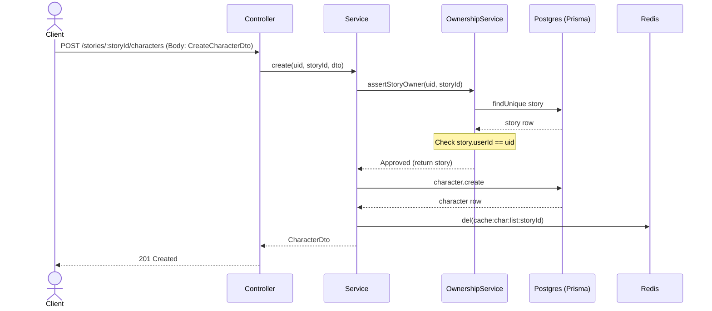
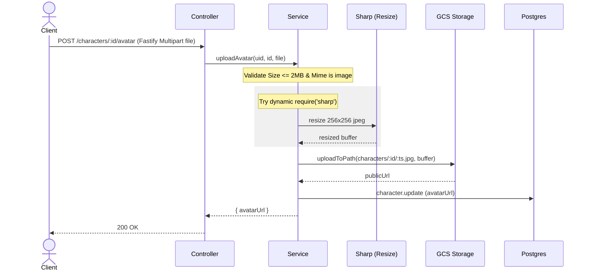

# Tài liệu kỹ thuật: CharactersModule (CRUD + Avatar + Voice Validation) - P02.T3

Tài liệu này ghi nhận quá trình triển khai CharactersModule phục vụ quản lý nhân vật trong câu chuyện, tích hợp upload avatar, kiểm tra phân quyền sở hữu và tích hợp package Prompts mới.

## 1. Mô tả tính năng
Module Characters cung cấp các API để thực hiện thao tác CRUD (Create, Read, Update, Delete) đối với các nhân vật của từng câu chuyện (Story) do người dùng sở hữu. Nó thực thi cơ chế xác thực quyền sở hữu nghiêm ngặt, đảm bảo người dùng chỉ được chỉnh sửa/xóa/xem các nhân vật thuộc câu chuyện của chính họ. Ngoài ra, module cung cấp chức năng tải lên ảnh đại diện của nhân vật, tự động định cấu hình cấu trúc âm thanh TTS qua package nội bộ `@chatai/prompts`.

---

## 2. Chi tiết các hàm

### 2.1. `OwnershipService` (`apps/server/src/shared/ownership/ownership.service.ts`)
- `assertStoryOwner(uid, sid)`: Truy vấn Story từ Database theo `sid`. Nếu không tìm thấy, ném lỗi `NOT_FOUND`. Nếu `story.userId !== uid`, ném lỗi `FORBIDDEN`. Trả về đối tượng `Story`.
- `assertCharacterOwner(uid, cid)`: Truy vấn Character kèm theo Story (`include: { story: true }`). Nếu không tìm thấy, ném lỗi `NOT_FOUND`. Nếu `char.story.userId !== uid`, ném lỗi `FORBIDDEN`. Trả về đối tượng `Character` (bao gồm story).

### 2.2. `StorageService` (`apps/server/src/shared/firebase/storage.service.ts`)
- `uploadToPath(path, buffer, contentType)`: Lưu trữ buffer thô lên Google Cloud Storage tại `path` chỉ định với `contentType` tương ứng. Tự động chuyển file thành public (nếu bucket hỗ trợ ACLs). Trả về public URL và storage path.
- `uploadAvatar(uid, buffer, contentType)`: Hàm wrapper sinh path tự động theo định dạng `avatars/${uid}/${Date.now()}.${ext}` và gọi `uploadToPath`.

### 2.3. `CharactersService` (`apps/server/src/modules/characters/characters.service.ts`)
- `listByStory(uid, storyId)`: Lấy danh sách nhân vật thuộc story. Sử dụng `RedisService.cacheWrap` để cache kết quả (TTL 300s) với key `cache:char:list:${storyId}`.
- `create(uid, storyId, dto)`: Xác thực quyền sở hữu story, kiểm tra `voiceName` có thuộc danh sách giọng nói hợp lệ (`isValidVoice`), tạo bản ghi trong Postgres qua Prisma, xóa cache danh sách.
- `update(uid, id, dto)`: Xác thực quyền sở hữu character, kiểm tra `voiceName` (nếu có thay đổi), cập nhật Postgres, xóa cache chi tiết nhân vật `cache:char:${id}` và cache danh sách của story.
- `delete(uid, id)`: Xác thực quyền sở hữu, thực thi trong một `$transaction` để gỡ bỏ character liên kết khỏi các Message (set `characterId = null` thông qua khối try/catch defensive phòng trường hợp bảng Message chưa có ở Phase này), xóa character khỏi DB, xóa cache.
- `uploadAvatar(uid, id, file)`: Xác thực quyền sở hữu, validate file upload (size <= 2MB, mimetype `image/jpeg|png|webp`). Thử resize ảnh về `256x256` bằng thư viện `sharp` dưới dạng dynamic require để tránh lỗi môi trường. Upload lên Storage tại `characters/${id}/${Date.now()}.jpg`, cập nhật DB và xóa cache.

---

## 3. Biểu đồ Data Flow & Sequence Diagram

### 3.1. CRUD và Ownership Check


### 3.2. Upload Avatar & Sharp Fallback


---

## 4. Các lỗi từng gặp (Gotchas & Bugs) và Cách giải quyết

1. **Fastify Multipart vs NestJS Interceptors**:
   - *Lỗi*: Sử dụng `@UseInterceptors(FileInterceptor('file'))` truyền thống của NestJS sẽ gây lỗi crash vì runtime đang sử dụng Fastify adapter, không tích hợp sẵn middleware Multer của Express.
   - *Giải quyết*: Sử dụng custom parameter decorator `@UploadedFileFastify()` đã được định nghĩa cho Fastify, trả về kiểu `FastifyFile` chứa file buffer và metadata.

2. **TypeScript Self-Referencing in Test Mocks**:
   - *Lỗi*: Khi định nghĩa `mockPrisma` trong unit test:
     ```typescript
     const mockPrisma = {
       ...,
       $transaction: jest.fn((cb) => cb(mockPrisma))
     }
     ```
     Trình biên dịch TypeScript ném lỗi `TS7022` và `TS7024` do `mockPrisma` tự tham chiếu trực tiếp trong lúc khởi tạo object literal.
   - *Giải quyết*: Khai báo kiểu `any` tường minh cho `mockPrisma` và gán thuộc tính `$transaction` riêng biệt sau khi khởi tạo object:
     ```typescript
     const mockPrisma: any = { ... };
     mockPrisma.$transaction = jest.fn((cb) => cb(mockPrisma));
     ```

3. **Sharp Native Binary Compilation**:
   - *Lỗi*: Import trực tiếp `import sharp from 'sharp'` có thể làm crash server khi khởi động nếu runtime trên hệ điều hành đích thiếu build toolchain cho C++ để compile sharp native modules.
   - *Giải quyết*: Sử dụng `require('sharp')` trong khối `try/catch` để nếu load sharp thất bại, server vẫn có thể hoạt động bình thường bằng cách sử dụng trực tiếp buffer ảnh gốc mà client gửi lên (fallback resize).
