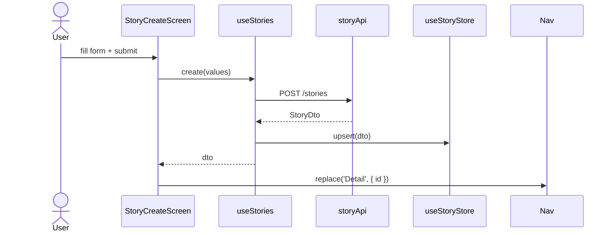

---
date: 2026-05-30
---
# P02.T4 — Client Story Screens (StoryListScreen, StoryCreateScreen, StoryDetailScreen)

## 1. Mô tả tính năng

Triển khai 3 screens và toàn bộ layer hỗ trợ (service, store, hook, component) cho tính năng Stories trên mobile (Expo/React Native).

---

## 2. Chi tiết các module

### 2.1. `story.schemas.ts` — Zod Validation
- `createStorySchema`: `title` (min 1, max 100), `initialSetting` (min 1, max 5000).
- `updateStorySchema = createStorySchema.partial()`.
- Export `CreateStoryInput`, `UpdateStoryInput` qua `z.infer`.

### 2.2. `story.api.ts` — API Service
- `list(cursor?, limit=20)` → `apiClient.get('/stories', { params: { cursor, limit } })`
- `getById(id)` → `apiClient.get('/stories/${id}')`
- `create(dto: CreateStoryInput)` → `apiClient.post('/stories', dto)`
- `update(id, dto: UpdateStoryInput)` → `apiClient.patch('/stories/${id}', dto)`
- `delete(id)` → `apiClient.delete('/stories/${id}')`

### 2.3. `story.store.ts` — Zustand Store
```ts
State:
  storiesById: Record<string, StoryDto>
  order: string[]  // id[] sorted updatedAt desc
  nextCursor?: string
  loading: boolean

Actions:
  setPage(items, nextCursor, replace: boolean)  // replace=true: reset, false: append
  upsert(story)   // thêm vào đầu order nếu mới
  remove(id)
  setLoading(bool)
```

### 2.4. `useStories.ts` — Hook
- Kết hợp `useStoryStore` + `storyApi`.
- `refresh()`: `api.list(undefined, 20)` → `store.setPage(..., true)`.
- `loadMore()`: nếu `nextCursor` tồn tại → `api.list(nextCursor)` → `store.setPage(..., false)`.
- `create(input)`: `api.create()` → `store.upsert()` → return dto.
- `update(id, patch)`: `api.update()` → `store.upsert()`.
- `delete(id)`: `api.delete()` → `store.remove()`.

### 2.5. `StoryCard.tsx` — Component
- Props: `{ story, onPress, onDelete }`.
- Long-press → animate card left 80px, hiện nút Delete đỏ ở phải.
- Nhấn Delete → Alert confirm → gọi `onDelete()`.
- Hiển thị: title, preview 2 dòng, 👥 count / 💬 count, updatedAt relative (vi-VN).

### 2.6. `StoryForm.tsx` — Component
- Props: `{ initial?, onSubmit, submitting }`.
- `react-hook-form` + `zodResolver(createStorySchema)` + `mode: 'onChange'`.
- TextInput title, multiline TextInput initialSetting (6 dòng).
- Submit button disabled khi `!isValid || submitting`.

### 2.7. `StoryListScreen.tsx`
- Load `useStories()`, `useEffect → refresh()` khi mount.
- FlatList với `StoryCard`, `RefreshControl`, `onEndReached → loadMore`.
- FAB "+" navigate → `Create { mode: 'create' }`.
- Empty state: text + button "Tạo Story đầu tiên".
- Loading overlay khi `loading && stories.length === 0`.

### 2.8. `StoryCreateScreen.tsx`
- Route params: `{ mode: 'create' }` hoặc `{ mode: 'edit', id, title, initialSetting }`.
- Render `<StoryForm>`.
- `onSubmit`:
  - create → `navigation.replace('Detail', { id: newStory.id })`.
  - edit → `navigation.goBack()`.

### 2.9. `StoryDetailScreen.tsx`
- Params: `{ id }`.
- Load `storyApi.getById(id)` (fallback về `useStoryStore cache` để hiển thị ngay).
- Header: title + pencil edit button → navigate `Create { mode: 'edit', ... }`.
- Sections: initialSetting, currentProgress (nếu có), `CharacterListSection` stub.
- Footer: "Bắt đầu Chat" button — disabled khi `story.characterCount === 0`.

---

## 3. Navigation

```
MainTabNavigator
  └── Stories (Tab) → StoryStack
        ├── List   → StoryListScreen
        ├── Create → StoryCreateScreen
        └── Detail → StoryDetailScreen
```

### Type changes (`navigation/types.ts`)
```ts
export type StoryStackParamList = {
  List: undefined;
  Create: { mode: 'create' } | { mode: 'edit'; id: string; title: string; initialSetting: string };
  Detail: { id: string };
};
// MainTabParamList.Stories: NavigatorScreenParams<StoryStackParamList>
```

---

## 4. Data Flow Diagram



---

## 5. Dependencies cần cài

```
pnpm add react-hook-form @hookform/resolvers zod
```
(trong `apps/mobile`)

---

## 6. Lưu ý quan trọng (Gotchas & Bugs)

| Vấn đề | Giải pháp |
|--------|-----------|
| `filter(Boolean)` không đủ để TS suy luận `StoryDto[]` | Dùng type predicate: `.filter((s): s is StoryDto => s !== undefined)` |
| `MainTabParamList.Stories` ban đầu là `undefined` | Phải đổi thành `NavigatorScreenParams<StoryStackParamList>` để nested stack hoạt động |
| `StoryStack` cần `headerShown: false` trên màn hình `List` | Tab navigator đã có header; nested stack không cần header thêm |
| `@hookform/resolvers` v5+ tương thích với `zod` v4+ | Cài cùng phiên bản major: `@hookform/resolvers ^5` + `zod ^4` |
| `useStoryStore` cần `setLoading(false)` trong catch | Nếu quên, spinner sẽ không bao giờ tắt khi lỗi mạng |

---

## 7. Files tạo/sửa

| File | Loại |
|------|------|
| `apps/mobile/src/features/story/services/story.schemas.ts` | NEW |
| `apps/mobile/src/features/story/services/story.api.ts` | NEW |
| `apps/mobile/src/features/story/store/story.store.ts` | NEW |
| `apps/mobile/src/features/story/hooks/useStories.ts` | NEW |
| `apps/mobile/src/features/story/components/StoryCard.tsx` | NEW |
| `apps/mobile/src/features/story/components/StoryForm.tsx` | NEW |
| `apps/mobile/src/features/story/screens/StoryListScreen.tsx` | REPLACE |
| `apps/mobile/src/features/story/screens/StoryCreateScreen.tsx` | NEW |
| `apps/mobile/src/features/story/screens/StoryDetailScreen.tsx` | NEW |
| `apps/mobile/src/navigation/StoryStack.tsx` | NEW |
| `apps/mobile/src/navigation/types.ts` | MODIFY |
| `apps/mobile/src/navigation/MainTabNavigator.tsx` | MODIFY |
