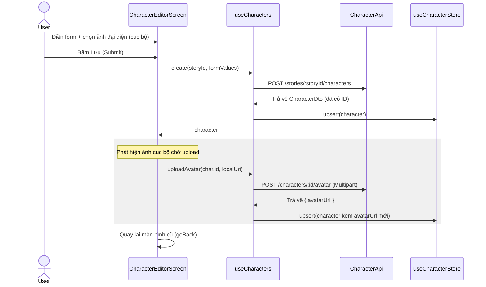

# Tài liệu kỹ thuật: Client Character Editor (P02.T5)

Tài liệu này ghi nhận quá trình thiết kế, cấu trúc và triển khai tính năng Quản lý/Chỉnh sửa nhân vật phía Client trên nền tảng React Native (Expo).

## 1. Mô tả tính năng
Tính năng Character Editor cho phép người dùng quản lý danh sách nhân vật và cấu hình chi tiết giọng đọc TTS của từng nhân vật trong câu chuyện của họ. Bao gồm các thành phần:
- Xem danh sách nhân vật thuộc Story ngay tại màn hình `StoryDetailScreen`.
- Tạo mới hoặc chỉnh sửa nhân vật với đầy đủ các thông tin: Tên, Tuổi (tùy chọn), Cá tính, Chọn 1 trong 7 giọng nói (`VoiceSelector`), Điều chỉnh cao độ giọng nói (`PitchSlider` từ 0.8x đến 1.5x).
- Tải lên ảnh đại diện nhân vật sử dụng ảnh chụp/thư viện ảnh thiết bị.
- Nút nghe thử giọng nói hiển thị dưới dạng placeholder (sẽ wire với API TTS ở Phase 3).

---

## 2. Chi tiết các hàm & Component

### 2.1. Hằng số giọng đọc (`apps/mobile/src/features/character/constants/voices.ts`)
- Định nghĩa tập hợp các giọng nói hợp lệ và khớp với cấu hình phía server: `Achernar`, `Aoede`, `Charon`, `Fenrir`, `Kore`, `Leda`, `Zephyr`.
- Định nghĩa kiểu dữ liệu `VoiceName`, `Gender`, và `VoiceMeta`.

### 2.2. Validation Schema (`apps/mobile/src/features/character/services/character.schemas.ts`)
- `createCharacterSchema`: Định nghĩa Zod schema validate dữ liệu đầu vào.
  - `name`: String, 1–50 ký tự.
  - `age`: Number (int), 1–999, hoặc NaN (tùy chọn).
  - `personality`: String, 1–3000 ký tự.
  - `voiceName`: Zod Enum chứa danh sách 7 giọng nói hợp lệ.
  - `pitch`: Number, giới hạn từ 0.8 đến 1.5.
- `updateCharacterSchema`: Zod schema partial của create schema.

### 2.3. API Service (`apps/mobile/src/features/character/services/character.api.ts`)
- `listByStory(sid)`: `GET /stories/:storyId/characters` — Lấy danh sách nhân vật.
- `create(sid, dto)`: `POST /stories/:storyId/characters` — Tạo mới nhân vật.
- `update(id, dto)`: `PATCH /characters/:id` — Cập nhật thông tin nhân vật.
- `delete(id)`: `DELETE /characters/:id` — Xóa nhân vật.
- `uploadAvatar(id, formData)`: `POST /characters/:id/avatar` — Upload ảnh đại diện.

### 2.4. Zustand Store (`apps/mobile/src/features/character/store/character.store.ts`)
- `byStory`: Record map giữa `storyId` và danh sách `CharacterDto[]`.
- `loadingByStory`: Record map trạng thái tải của từng Story.
- `setForStory(sid, list)`: Cập nhật danh sách nhân vật cho story.
- `upsert(character)`: Thêm mới hoặc thay thế nhân vật trong store dựa theo `storyId` có sẵn trong DTO.
- `remove(id, sid)`: Xóa nhân vật khỏi danh sách của story tương ứng.

### 2.5. Custom Hook `useCharacters` (`apps/mobile/src/features/character/hooks/useCharacters.ts`)
- `charactersByStory(sid)`: Lấy danh sách nhân vật từ store.
- `loadingByStory(sid)`: Lấy trạng thái loading từ store.
- `load(sid)`: Tải danh sách nhân vật từ server và lưu vào store.
- `create(sid, dto)`: Gọi API tạo nhân vật, cập nhật store.
- `update(id, dto)`: Gọi API sửa nhân vật, cập nhật store.
- `delete(id, sid)`: Gọi API xóa nhân vật, xóa khỏi store.
- `uploadAvatar(id, uri)`: Nén ảnh qua `avatarService`, gửi ảnh lên server, sau đó cập nhật thông tin ảnh mới vào nhân vật trong store.

### 2.6. Component `VoiceSelector` (`apps/mobile/src/features/character/components/VoiceSelector.tsx`)
- Hiển thị danh sách 7 card giọng nói dưới dạng FlatList cuộn ngang.
- Tự động hiển thị emoji giới tính tương ứng (`👩` cho female, `👨` cho male, `👤` cho neutral).
- Hiển thị nổi bật (highlight border màu primary) khi card được chọn.

### 2.7. Component `PitchSlider` (`apps/mobile/src/features/character/components/PitchSlider.tsx`)
- Custom Slider xây dựng dựa trên `PanResponder` của React Native giúp điều khiển kéo mượt mà, không phụ thuộc thư viện native bên ngoài (an toàn cho Expo Go và Web).
- Hiển thị giá trị thực tế theo thời gian thực (định dạng 2 chữ số thập phân).
- Cung cấp 3 nút bấm nhanh: Thấp (0.8), Bình thường (1.0), Cao (1.5).

### 2.8. Component `CharacterCard` (`apps/mobile/src/features/character/components/CharacterCard.tsx`)
- Hiển thị avatar tròn, thông tin tên, tuổi, cá tính tóm tắt và thẻ thông tin giọng đọc.
- Bấm để sửa, nhấn giữ hoặc bấm biểu tượng Thùng rác sẽ kích hoạt dialog native xác nhận xóa.

### 2.9. Component `CharacterListSection` (`apps/mobile/src/features/character/components/CharacterListSection.tsx`)
- Nhúng trực tiếp vào màn chi tiết Story. Tải danh sách nhân vật khi mount.
- Hiển thị trạng thái rỗng kèm gợi ý trực quan, nút thêm nhanh nhân vật điều hướng sang Editor.

### 2.10. Màn hình `CharacterEditorScreen` (`apps/mobile/src/features/character/screens/CharacterEditorScreen.tsx`)
- Hỗ trợ cả 2 chế độ tạo mới và chỉnh sửa nhân vật chung trên 1 màn hình.
- Tích hợp `react-hook-form` + `zodResolver`.
- Quản lý quy trình upload ảnh:
  - Nếu ở chế độ **Sửa**: Khi bấm chọn ảnh mới sẽ nén và upload lên server lập tức, cập nhật UI và store tức thì.
  - Nếu ở chế độ **Tạo mới**: Lưu tạm URI ảnh cục bộ trên thiết bị, sau khi submit form tạo nhân vật thành công và lấy được ID, mới tiến hành upload ảnh lên server. Nếu upload ảnh lỗi thì vẫn hoàn tất tạo nhân vật và báo lỗi riêng biệt (defensive logic).

---

## 3. Biểu đồ Sequence Diagram cho Create Character


---

## 4. Các lỗi từng gặp (Gotchas & Bugs) và Cách giải quyết

1. **Lỗi tham số Zod Enum với Custom Message**:
   - *Lỗi*: Trình biên dịch TypeScript báo lỗi `TS2769` khi gọi `z.enum(entries, { errorMap: ... })` do kiểu `entries` truyền vào dạng tuple không tương thích với thuộc tính `errorMap` trực tiếp trong tham số thứ hai của phiên bản Zod hiện tại.
   - *Giải quyết*: Thay thế bằng cách sử dụng tham số `message` chuẩn trong options hoặc sử dụng các thuộc tính `required_error` / `invalid_type_error` tương ứng:
     ```typescript
     voiceName: z.enum(voiceNames, {
       message: 'Vui lòng chọn giọng nói',
     })
     ```

2. **Lỗi Object is possibly 'undefined' khi duyệt State Store**:
   - *Lỗi*: Trong hook `useCharacters`, khi tìm kiếm nhân vật trên tất cả các key của `byStory` để cập nhật avatar:
     ```typescript
     const char = storeState.byStory[sid].find((c) => c.id === id);
     ```
     TypeScript báo lỗi do `byStory[sid]` có thể chưa được khởi tạo (undefined) đối với một storyId nào đó.
   - *Giải quyết*: Thêm toán tử optional chaining `?.` khi truy cập để đảm bảo an toàn kiểu dữ liệu:
     ```typescript
     const char = storeState.byStory[sid]?.find((c) => c.id === id);
     ```

3. **Lỗi Deprecate của Slider trong React Native Core**:
   - *Lỗi*: Sử dụng component `Slider` từ core `react-native` sẽ bị báo lỗi crash/không tồn tại trên các phiên bản React Native mới (0.76+). Cài đặt `@react-native-community/slider` thì đòi hỏi phải rebuild native code hoặc Expo Dev Client.
   - *Giải quyết*: Thiết kế một custom `PitchSlider` sử dụng `PanResponder` và các View chuẩn của React Native. Việc này đảm bảo tính năng kéo slider hoạt động mượt mà, độc lập trên cả iOS, Android, Expo Go và Web mà không cần cài đặt thêm thư viện native.
