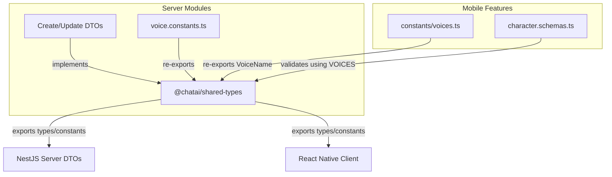

# Task P02.T6 — Shared Types Update: Story + Character

## 1. Mô Tả Tính Năng
Cập nhật và làm phong phú hệ thống định nghĩa kiểu dữ liệu dùng chung (`@chatai/shared-types`), liên kết đồng bộ hóa cấu trúc dữ liệu giữa NestJS Backend DTOs và React Native Mobile Client Zod Schemas/Stores.

---

## 2. Chi Tiết Thay Đổi

### 2.1. `@chatai/shared-types`
- **`packages/shared-types/src/story.ts`**:
  - Giữ nguyên `StoryDto` có trường `userId` để phục vụ kiểm tra sở hữu ở server.
  - Thêm `CreateStoryDto` và `UpdateStoryDto`.
- **`packages/shared-types/src/character.ts`**:
  - Định nghĩa danh sách hằng số giọng nói `VOICES` (`'Achernar' | 'Aoede' | 'Charon' | 'Fenrir' | 'Kore' | 'Leda' | 'Zephyr'`).
  - Định nghĩa union type `VoiceName`.
  - Cập nhật kiểu `age` của `CharacterDto` thành bắt buộc `number | null`.
  - Thêm `CreateCharacterDto` và `UpdateCharacterDto`.

### 2.2. NestJS Backend
- **`apps/server/src/modules/characters/voice.constants.ts`**:
  - Thay đổi khai báo cục bộ, import trực tiếp `VOICES` và `VoiceName` từ `@chatai/shared-types` và re-export chúng nhằm giữ tính tương thích với hàm `isValidVoice`.
- **`create-story.dto.ts` & `update-story.dto.ts`**:
  - Cho các class DTO `implements` tương ứng các interface `CreateStoryDto` và `UpdateStoryDto` từ shared-types.
- **`create-character.dto.ts` & `update-character.dto.ts`**:
  - Cho các class DTO `implements` tương ứng các interface `CreateCharacterDto` và `UpdateCharacterDto` từ shared-types.

### 2.3. React Native Mobile
- **`apps/mobile/src/features/character/constants/voices.ts`**:
  - Loại bỏ định nghĩa `VoiceName` thủ công. Import trực tiếp `VoiceName` từ `@chatai/shared-types` và `export type { VoiceName }`.
- **`apps/mobile/src/features/character/services/character.schemas.ts`**:
  - Import trực tiếp `VOICES` và `VoiceName` từ `@chatai/shared-types` để dùng cho zod enum schema (thông qua ép kiểu tuple).

---

## 3. Sơ đồ Cấu trúc Liên kết (Mermaid)

---

## 4. Lưu Ý Quan Trọng (Gotchas & Bugs)

1. **Giữ trường `userId` trong `StoryDto`**:
   - Mặc dù spec trong file kế hoạch không viết trường này, chúng ta bắt buộc phải giữ lại `userId: string` vì phía NestJS Server (`stories.service.ts`) dựa vào trường này để check quyền sở hữu và mapping DTO (`story.userId !== uid`). Nếu xóa đi sẽ gây lỗi compile hàng loạt trên Backend.

2. **Lỗi Import type cục bộ ở Mobile Client**:
   - Khi chuyển sang sử dụng `VoiceName` từ shared-types trong file `voices.ts` của mobile client, chúng ta phải dùng cú pháp `export type { VoiceName }` để xuất ngược lại ra ngoài.
   - Nếu không export lại, các file khác ở mobile client (`VoiceSelector.tsx` và `CharacterEditorScreen.tsx`) import `VoiceName` từ `../constants/voices` sẽ báo lỗi `declares 'VoiceName' locally, but it is not exported`.
