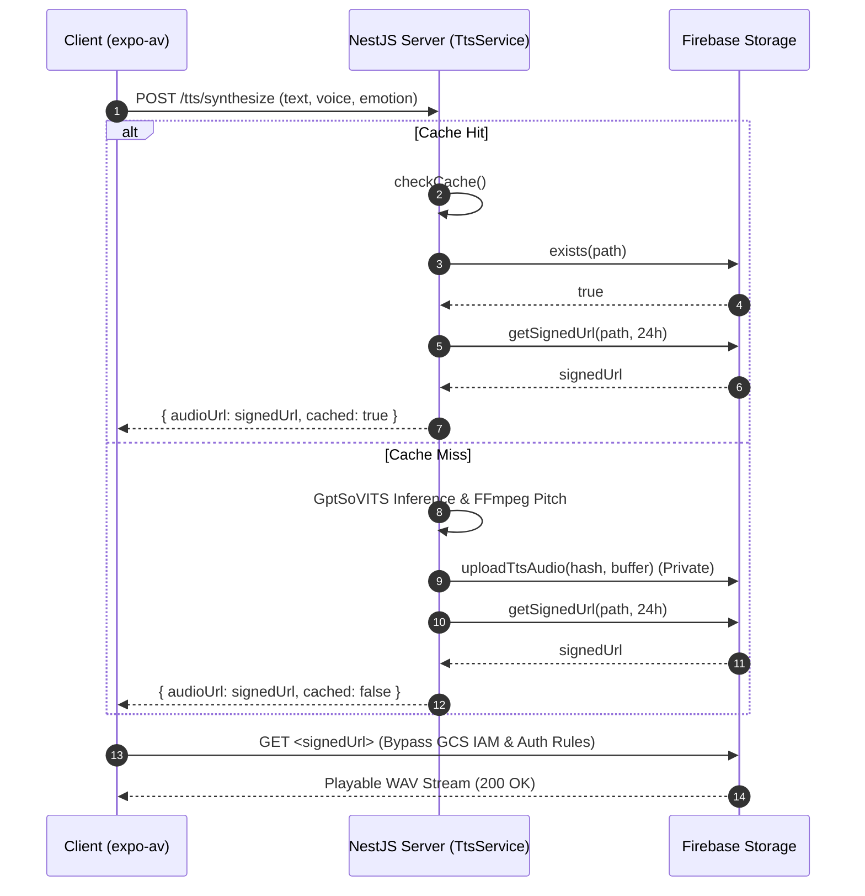

# Memori: Refactor Code Review & Fixes (P03.R)

## 1. Mô tả ngắn gọn
Refactor và vá các lỗi được phát hiện sau đợt rà soát mã nguồn (Code Review) Phase 3 liên quan đến tính năng Text-To-Speech (TTS) trên cả Server (NestJS) và Client (Expo mobile). Mục tiêu chính là sửa lỗi chặn phát audio do cơ chế phân quyền Firebase Storage, tối ưu hóa các kiểu dữ liệu (TypeScript types), loại bỏ code dư thừa và cải thiện cấu trúc mã nguồn.

---

## 2. Chi tiết tính năng & Các hàm sửa đổi

### 2.1. `StorageService` (`apps/server/src/shared/firebase/storage.service.ts`)
- **`uploadTtsAudio(cacheHash, buffer)`**:
  - Trả về đối tượng kiểu `StorageUploadResult` (chỉ chứa `storagePath`), không còn trả về `publicUrl`.
  - Loại bỏ hoàn toàn phương thức `.makePublic()` đối với tệp tin âm thanh nhằm đảm bảo tính riêng tư của dữ liệu trên Cloud Storage.

### 2.2. `TtsService` (`apps/server/src/modules/tts/tts.service.ts`)
- **`checkCache(hash)`**:
  - Đổi từ việc lấy URL công khai (`getPublicUrl`) sang tạo **Signed URL** có thời hạn sống (TTL) là **24 giờ** (`getSignedUrl(path, TTS_SIGNED_URL_TTL_MS)`).
- **`uploadAndCache(hash, buffer)`**:
  - Hàm private mới dùng để thực thi tuần tự việc tải file lên Storage và ngay lập tức lấy Signed URL 24h để trả về.
- **`sleep(ms)`**:
  - Hàm helper thay thế cho đoạn mã thô `new Promise((resolve) => setTimeout(resolve, ms))` nhằm tăng tính tường minh.

### 2.3. `TtsController` (`apps/server/src/modules/tts/tts.controller.ts`)
- Loại bỏ tham số `@CurrentUser() _user` và các imports liên quan tại hai endpoint `POST /tts/synthesize` và `POST /tts/test-voice` do việc giới hạn tần suất (Rate Limiting) đã được guard tự động trích xuất `uid`/`ip` từ context.

### 2.4. `ReferenceIndexManager` (`apps/server/src/modules/tts/reference-index.manager.ts`)
- Định nghĩa interface `ReferenceIndexEntry` chặt chẽ cho cấu trúc dữ liệu âm thanh tham chiếu mồi cảm xúc.
- Loại bỏ kiểm tra null dư thừa (redundant null-check) khi lấy khóa đầu tiên của emotion block trong `pickRandom`.

### 2.5. `RedisThrottlerGuard` (`apps/server/src/shared/throttler/redis-throttler.guard.ts`)
- Thêm comment chuẩn hóa chính sách **fail-open** trong khối `catch`: Nếu Redis down, bỏ qua chặn rate limit và cho phép request đi qua để duy trì dịch vụ luôn sẵn sàng.

### 2.6. Client Mobile
- **`App.tsx`**: Thêm `.catch()` khi khởi chạy `initAudioMode()` để ghi nhận lỗi khởi tạo Audio Mode thay vì nuốt lỗi lặng lẽ.
- **`tts.service.ts`**: Loại bỏ toàn bộ JSDoc tiếng Việt mô tả chi tiết chức năng hàm (chỉ mô tả WHAT) để giữ mã nguồn chuẩn hóa theo phong cách code của dự án.

---

## 3. Quy trình dữ liệu (Data Flow)

---

## 4. Lưu ý quan trọng (Gotchas & Bugs)

> [!WARNING]
> **Lỗi 403 Forbidden khi phát audio trên client**:
> - **Nguyên nhân**: Khi Firebase Storage rules có cấu hình `allow read: if request.auth != null`, cấu hình này chỉ áp dụng đối với các cuộc gọi thông qua Firebase SDK (có kèm token). Thư viện phát âm thanh trên di động (`expo-av`) phát file bằng cách gọi HTTP GET trực tiếp tới URL, dẫn đến việc bị chặn và nhận mã lỗi `403 Forbidden`.
> - **Giải pháp**: Phải sử dụng **Signed URL** để bypass qua rules một cách an toàn mà không cần mở public toàn bộ bucket. URL này có token ký số nhúng sẵn (`X-Goog-Signature`) và hết hạn sau 24h.
> - **Lưu ý kiểm thử**: Khi thay đổi kiểu trả về của các hàm liên quan đến Storage, bắt buộc phải cập nhật lại mock tương ứng trong file spec test (`tts.service.spec.ts` và `tts.controller.spec.ts`) để tránh lỗi biên dịch TypeScript `tsc --noEmit`.
