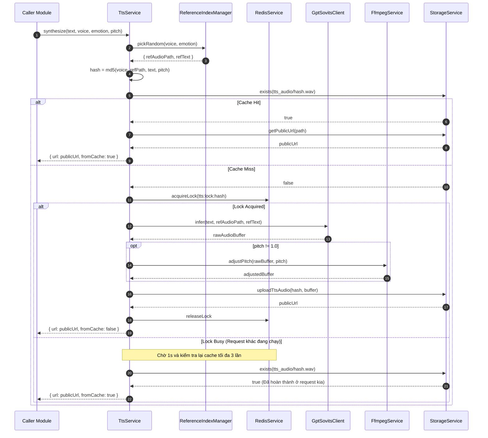

# Memori: Server TtsModule (ReferenceIndex + Cache + FFmpeg)

## 1. Mô tả tính năng
TtsModule là hệ thống Text-to-Speech (TTS) trên NestJS Server chịu trách nhiệm chuyển văn bản thành giọng nói bằng cách:
- Giao tiếp với API của engine AI GPT-SoVITS để suy luận (inference) âm thanh gốc từ các tệp âm thanh tham chiếu (mồi cảm xúc).
- Chỉnh sửa pitch (cao độ) của âm thanh in-memory bằng FFmpeg (qua child_process) trước khi phản hồi.
- Tối ưu hóa hiệu năng, giảm thiểu chi phí gọi API AI nhờ hệ thống cache Firebase Storage (`tts_audio/{hash}.wav`) và cơ chế chống trùng lặp request (Redis lock).

---

## 2. Chi tiết các hàm & API

### 2.1. `ReferenceIndexManager`
- `onModuleInit()`: Đọc tệp cấu hình phẳng `reference_index.json` trực tiếp từ thư mục dataset vật lý (được cấu hình qua biến `TTS_DATASET_ABS_PATH`) nếu tồn tại. Nếu không tồn tại, tự động fallback về `@chatai/prompts` (bản build tĩnh) và chuyển đổi sang dạng chỉ mục lồng nhau (`Record<string, Record<string, Record<string, string[]>>>`) để tối ưu hóa việc lookup theo cấu trúc `voice -> emotion -> intensity`.
- `pickRandom(voice, emotion, intensity)`: Chọn ngẫu nhiên mẫu audio tương thích từ chỉ mục. Nếu không có cảm xúc được yêu cầu, tự động fallback về cảm xúc `Neutral`, sau đó là cường độ `medium` để tăng tính bền bỉ của hệ thống.
- `resolveRefText(refAudioPath, voice, fileRel)`: Đọc văn bản mồi từ file `.txt` đi kèm tệp âm thanh mẫu hoặc tra cứu trực tiếp trong dữ liệu metadata JSON của tệp index được nạp (hoặc `@chatai/prompts` nếu fallback). Nếu không tìm thấy, tự động trích xuất từ tên file để làm prompt text gửi tới GPT-SoVITS.

### 2.2. `GptSovitsClient`
- `infer(text, refAudioPath, refText, language)`: Gửi yêu cầu POST tới `/tts` của engine GPT-SoVITS.
  - Hỗ trợ cơ chế **retry 1 lần** nếu gặp lỗi mạng, timeout hoặc lỗi server (>= 500) để gia tăng tỉ lệ thành công của request.
  - Các lỗi kết nối được chuyển thành `AppException(ERR.TTS_ENGINE_DOWN)`. Lỗi 404 được chuyển thành `AppException(ERR.REFERENCE_NOT_FOUND)`.
- `health()`: Kiểm tra trạng thái engine bằng request GET `/tts` và bắt lỗi `400 Bad Request` (chứng tỏ engine đang chạy và bắt lỗi thiếu tham số) để trả về trạng thái sống/chết của engine.

### 2.3. `FfmpegService`
- `adjustPitch(buffer, pitch)`: Chỉnh cao độ của âm thanh trực tiếp trong RAM.
  - Sử dụng `child_process.spawn('ffmpeg')` đẩy dữ liệu qua stdin (`pipe:0`) và nhận dữ liệu qua stdout (`pipe:1`), loại bỏ hoàn toàn thao tác ghi file tạm lên ổ cứng để tối đa hóa tốc độ xử lý.
  - Sử dụng timeout 10 giây để kill tiến trình ffmpeg chạy ngầm tránh gây rò rỉ tài nguyên hệ thống nếu tiến trình bị treo.

### 2.4. `TtsService`
- `synthesize(req)`: Thực hiện điều phối quy trình:
  1. Tạo MD5 cache hash từ các thuộc tính `voiceName + refAudioPath + text + pitch` để đảm bảo cache theo đúng giọng nói, văn bản và cao độ riêng biệt.
  2. Kiểm tra cache trên Firebase Storage. Nếu tồn tại, lập tức trả về URL CDN của Firebase Storage mà không cần gọi API AI hay FFmpeg.
  3. Nếu cache bị hụt (miss):
     - Gửi yêu cầu acquire Redis lock.
     - Áp dụng cơ chế **Retry & Wait**: Nếu một request khác đang sinh cùng một tệp âm thanh (lock đang bị giữ), request hiện tại sẽ tạm dừng 1 giây và kiểm tra lại cache, tối đa lặp lại 3 lần. Nếu sau 3 giây tệp vẫn chưa được sinh ra, nó mới ném lỗi Conflict. Cơ chế này loại bỏ hoàn toàn hiện tượng nghẽn cổ chai và sinh trùng lặp file audio.
     - Gọi `GptSovitsClient.infer`, chạy `FfmpegService.adjustPitch`, và upload buffer âm thanh lên Firebase Storage qua `StorageService.uploadTtsAudio`.
- `testVoice(voiceName, pitch, sampleText)`: Test thử giọng nói nhanh bằng mẫu text mặc định.

### 2.5. `StorageService` (Firebase Shared Extension)
- `uploadTtsAudio(cacheHash, buffer)`: Upload tệp âm thanh wav lên thư mục `tts_audio/` kèm cấu hình caching CDN `public, max-age=2592000` (30 ngày).
- `exists(path)`: Kiểm tra xem tệp âm thanh đã tồn tại trên Cloud Storage hay chưa.
- `getPublicUrl(path)`: Trả về địa chỉ URL CDN trực tiếp của tệp tin.

---

## 3. Quy trình dữ liệu (Sequence Diagram)



---

## 4. Lưu ý quan trọng & Cách giải quyết lỗi (Gotchas)

1. **Lỗi TypeScript Strict Mode với Catch Block**:
   - *Lỗi*: TypeScript mặc định ép kiểu của đối tượng lỗi bắt được trong block `catch (err)` thành `unknown`, dẫn đến lỗi biên dịch khi truy cập `.message` hoặc `.stack`.
   - *Giải quyết*: Sử dụng phép kiểm tra `err instanceof Error ? err.message : String(err)` để lấy thông báo lỗi một cách an toàn và đúng kiểu trước khi log hoặc ném ra exception mới.

2. **Lỗi Inicializer của Class Property**:
   - *Lỗi*: TypeScript báo lỗi `Property 'datasetRoot' has no initializer and is not definitely assigned in the constructor` trong `ReferenceIndexManager`.
   - *Giải quyết*: Gán giá trị mặc định lúc khai báo: `private datasetRoot = '';` thay vì để rỗng không gán trị.

3. **Lỗi index type của `Object.keys()`**:
   - *Lỗi*: Truy cập index bằng `keys[0]` trả về kiểu `string | undefined`, dẫn đến lỗi index type `undefined cannot be used as an index type`.
   - *Giải quyết*: Ràng buộc check `if (firstKey) { emoBlock = voiceBlock[firstKey]; }` trước khi lấy giá trị.

4. **Lỗi Jest Test Timeout do treo Event Loop**:
   - *Lỗi*: Khi viết kiểm thử logic Timeout của `FfmpegService` bằng cách sử dụng `jest.useFakeTimers()` kết hợp với việc chờ microtask `await new Promise((resolve) => setImmediate(resolve))`, Jest bị treo và báo lỗi quá thời gian chạy (timeout 5s). Nguyên nhân do fake timers chặn không cho `setImmediate` giải quyết.
   - *Giải quyết*: Loại bỏ hoàn toàn fake timers của Jest và thay thế bằng việc mock trực tiếp hàm toàn cục `global.setTimeout` của Node.js:
     ```typescript
     (global as any).setTimeout = jest.fn().mockImplementation((cb) => { cb(); return 123; });
     ```
     Cách mock này lập tức kích hoạt callback giả lập timeout ngay khi `setTimeout` được khởi chạy, giúp test chạy tức thời và tuyệt đối an toàn.

5. **Nạp động reference_index.json từ Thư mục Dataset**:
   - *Đặc tả*: Ban đầu hệ thống chỉ nạp tĩnh từ package `@chatai/prompts`. Tuy nhiên, để đảm bảo tính đồng bộ khi dữ liệu dataset thay đổi thực tế trên ổ cứng, hệ thống đã được cập nhật để kiểm tra và nạp động tệp `reference_index.json` tại đường dẫn `TTS_DATASET_ABS_PATH`.
   - *Giải quyết*: Sử dụng `fs.existsSync` và `fs.readFileSync` để kiểm tra và nạp động file JSON tại runtime, đồng thời giữ nguyên cơ chế fallback về `referenceIndex` tĩnh của package prompts để các môi trường kiểm thử (CI/CD hoặc unit test) không bị lỗi do thiếu tệp vật lý.
