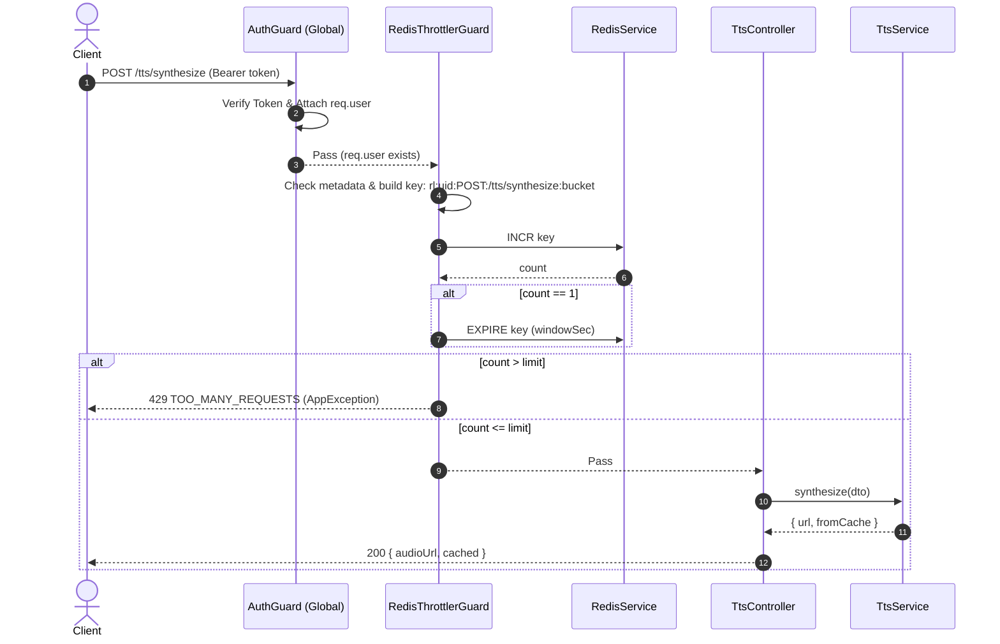

---
date: 2026-05-30
---
# Memori: Server TTS Controller & Rate Limiting

## 1. Mô tả tính năng
TtsController cung cấp hai endpoint API công khai để giao tiếp với dịch vụ Text-to-Speech (TTS):
- `POST /tts/synthesize`: Chuyển đổi văn bản (tối đa 500 ký tự) thành giọng nói, trả về liên kết âm thanh và trạng thái cache.
- `POST /tts/test-voice`: Nghe thử giọng nói bằng văn bản mẫu ngắn (tối đa 100 ký tự).

Cả hai API đều được bảo vệ bởi cơ chế Rate Limiting tự xây dựng bằng Redis (`RedisThrottlerGuard`), giới hạn 30 request mỗi phút cho mỗi người dùng hoặc mỗi IP địa chỉ để ngăn chặn tấn công spam hoặc quá tải hệ thống TTS Engine.

---

## 2. Chi tiết cấu phần và Hàm

### 2.1. `@Throttle(limit, windowSec)` Decorator
- Dùng để đặt cấu hình giới hạn tần suất yêu cầu lên metadata của route handler hoặc controller class bằng key `'throttle'`.
- Lưu trữ một cấu trúc dữ liệu `{ limit, windowSec }`.

### 2.2. `RedisThrottlerGuard`
- Kế thừa `CanActivate` từ NestJS.
- **Logic kiểm soát**:
  1. Sử dụng `Reflector` lấy metadata `'throttle'` được gắn trên route handler hoặc controller class. Nếu không tìm thấy, cho phép request đi qua trực tiếp (`return true`).
  2. Xác định định danh: Lấy `uid = req.user?.uid` (nếu đã đăng nhập qua `AuthGuard` toàn cục) hoặc fallback về `req.ip` (nếu là request vãng lai).
  3. Xác định route đang truy cập: Lấy thông tin từ Fastify `req.routeOptions?.url` hoặc fallback về `req.url` kết hợp với `req.method` thành dạng `METHOD:ROUTE` (ví dụ: `POST:/tts/synthesize`).
  4. Tính toán cửa sổ thời gian cố định (Fixed-Window):
     `windowBucket = Math.floor(Date.now() / 1000 / windowSec) * windowSec`
  5. Khóa Redis: `rl:<uid>:<route>:<windowBucket>`.
  6. Thực hiện lệnh `INCR` khóa Redis. Nếu giá trị trả về bằng `1` (lần đầu tạo khóa trong window), đặt thời gian hết hạn của khóa qua lệnh `EXPIRE` bằng `windowSec` giây.
  7. Nếu giá trị đếm vượt quá `limit`, ghi log cảnh báo và ném ngoại lệ `AppException(ERR.RATE_LIMIT)` tương ứng HTTP Status `429 Too Many Requests`.
- **Cơ chế Fail-Open**: Nếu Redis gặp sự cố (lỗi kết nối, crash), guard sẽ ghi nhận log lỗi và cho phép request đi qua (`return true`) thay vì làm treo cả hệ thống.

### 2.3. Data Transfer Objects (DTOs)
- **`SynthesizeDto`**:
  - `text`: Chuỗi văn bản, bắt buộc, tối đa 500 ký tự.
  - `voiceName`: Tên giọng nói bắt buộc, phải khớp với danh sách `VOICES` hợp lệ từ `@chatai/shared-types`.
  - `emotion`: Cảm xúc tùy chọn, thuộc `EMOTIONS` (từ `tts.constants.ts`).
  - `intensity`: Cường độ tùy chọn, thuộc `INTENSITIES` (từ `tts.constants.ts`).
  - `pitch`: Cao độ tùy chọn, số thực nằm trong khoảng `[0.8, 1.5]`.
- **`TestVoiceDto`**:
  - `voiceName`: Tên giọng nói bắt buộc, thuộc `VOICES`.
  - `pitch`: Cao độ bắt buộc, số thực từ 0.8 đến 1.5.
  - `sampleText`: Văn bản nghe thử tùy chọn, tối đa 100 ký tự.

### 2.4. `TtsController`
- Prefix route `/tts`.
- Được gắn `@UseGuards(RedisThrottlerGuard)` ở mức Class để áp dụng rate limit cho toàn bộ endpoints bên trong.
- **`synthesize`**: Nhận `SynthesizeDto`, gọi `ttsService.synthesize` và trả về cấu trúc `{ audioUrl: url, cached: fromCache }`.
- **`testVoice`**: Nhận `TestVoiceDto`, gọi `ttsService.testVoice` và trả về `{ audioUrl: url }`.

---

## 3. Quy trình dữ liệu (Sequence Diagram)

---

## 4. Lưu ý quan trọng & Cách giải quyết lỗi (Gotchas)

1. **Khác biệt về định dạng Request giữa Express và Fastify**:
   - *Lưu ý*: Project sử dụng Fastify làm HTTP Adapter (qua `@nestjs/platform-fastify`). Express dùng `req.route.path` nhưng Fastify sử dụng `req.routeOptions.url` để lấy định nghĩa route tĩnh (ví dụ: `/stories/:storyId` thay vì route thực tế chứa id cụ thể `/stories/123`).
   - *Giải quyết*: Sử dụng cú pháp an toàn: `const routeUrl = req.routeOptions?.url ?? req.url` để đảm bảo hoạt động chính xác trên cả môi trường Fastify lẫn các môi trường test mock.

2. **Cơ chế Fail-Open cho Rate Limiting Guard**:
   - *Lưu ý*: Rate Limit là một lớp bảo vệ bên ngoài. Nếu máy chủ Redis gặp sự cố, ta không nên làm gián đoạn toàn bộ hoạt động của người dùng (dẫn đến lỗi HTTP 500 diện rộng).
   - *Giải quyết*: Bọc toàn bộ logic kiểm tra của Guard trong block `try-catch`, ghi log lại lỗi Redis và trả về `true` (fail-open) để hệ thống hoạt động bình thường kể cả khi Redis gặp sự cố.

3. **Validation cho thuộc tính Tùy chọn (Optional Validation)**:
   - *Lưu ý*: class-validator `@IsIn` sẽ báo lỗi nếu thuộc tính đó không được truyền lên (undefined).
   - *Giải quyết*: Bắt buộc phải gắn kèm `@IsOptional()` trước decorator `@IsIn` hoặc `@IsNumber` cho các tham số như `emotion`, `intensity`, `pitch` trong `SynthesizeDto`.
