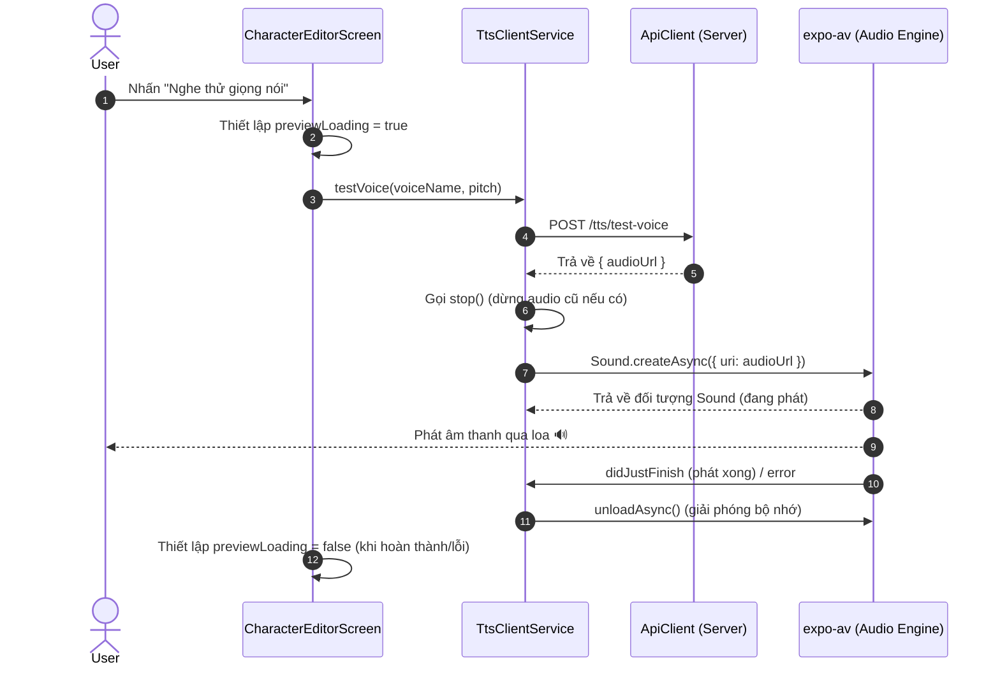

---
date: 2026-05-30
---
# Memori: Client TTS Preview Integration (expo-av)

## 1. Mô tả tính năng
Tích hợp âm thanh phía Client (React Native / Expo) hỗ trợ tính năng "Nghe thử giọng nói" trong màn hình Chỉnh sửa/Tạo Nhân vật (`CharacterEditorScreen`). Tính năng bao gồm:
- Tự động cấu hình chế độ âm thanh hệ thống để phát bình thường ngay cả khi điện thoại ở chế độ im lặng (iOS Silent Mode).
- Gửi yêu cầu sinh âm thanh nghe thử lên Server thông qua API `/tts/test-voice`.
- Phát âm thanh trực tiếp từ URL trả về và dọn dẹp tài nguyên (unload) khi hoàn thành.
- Quản lý trạng thái loading/disabled trên UI của nút bấm nghe thử một cách đồng bộ.

---

## 2. Chi tiết các hàm & logic

### 2.1. Khởi tạo Âm thanh (`apps/mobile/src/utils/audio-init.ts`)
- `initAudioMode()`: Sử dụng `Audio.setAudioModeAsync` của `expo-av` để thiết lập cấu hình:
  - `playsInSilentModeIOS: true`: Phát âm thanh kể cả khi gạt nút im lặng trên iPhone.
  - `interruptionModeIOS`/`interruptionModeAndroid`: Thiết lập thành `DoNotMix` để tạm dừng hoặc không trộn lẫn với các ứng dụng phát nhạc khác.
  - `staysActiveInBackground: false`: Không tiếp tục phát âm thanh nền khi app vào background.

### 2.2. Dịch vụ TTS Client (`apps/mobile/src/features/character/services/tts.service.ts`)
- `testVoice(voiceName, pitch, sampleText?)`: Gửi request `POST /tts/test-voice` kèm payload lên server để nhận về `{ audioUrl: string }`.
- `playUrl(url)`: 
  1. Gọi `stop()` để hủy âm thanh đang chạy trước đó (nếu có).
  2. Tạo đối tượng `Audio.Sound` từ URL thông qua `Audio.Sound.createAsync(..., { shouldPlay: true })`.
  3. Đăng ký callback `setOnPlaybackStatusUpdate` để tự động gọi `unloadAsync()` và gán `currentSound = null` khi âm thanh phát xong (`didJustFinish === true`) hoặc gặp lỗi (`status.error` tồn tại).
- `stop()`: Dừng phát (`stopAsync`) và giải phóng tài nguyên (`unloadAsync`) của âm thanh hiện tại một cách an toàn.

### 2.3. Màn hình chỉnh sửa (`apps/mobile/src/features/character/screens/CharacterEditorScreen.tsx`)
- Theo dõi các trường `voiceName` và `pitch` của form thông qua `watch` để kích hoạt/vô hiệu hóa nút "Nghe thử giọng nói".
- Sử dụng `previewLoading` state để hiển thị icon loading trên nút nghe thử khi đang giao tiếp API hoặc tải âm thanh.
- Gọi `ttsClientService.stop()` trong hàm clean-up của `useEffect` lúc unmount màn hình để đảm bảo không bị phát âm thanh thừa khi người dùng rời khỏi màn hình.

---

## 3. Quy trình Dữ liệu (Sequence Diagram)

---

## 4. Lưu ý quan trọng & Các lỗi thường gặp (Gotchas)

> [!WARNING]
> **1. Lỗi cài đặt package trong Monorepo:**
> Khi sử dụng NPM trong một package thuộc monorepo có khai báo `"workspace:*"` (như `@chatai/shared-types`), việc chạy `npm install` thông thường trong thư mục con sẽ lỗi vì npm không nhận dạng được cú pháp `workspace:`. Luôn luôn sử dụng `pnpm add <package>` trong thư mục con hoặc `pnpm --filter <package-name> add <package>` từ thư mục gốc.
> 
> **2. iOS Silent Mode (Chế độ im lặng):**
> Mặc định trên iOS, nếu thiết bị gạt nút Mute, âm thanh từ `expo-av` sẽ không phát ra ngoài. Do đó bắt buộc phải thiết lập cấu hình `playsInSilentModeIOS: true` trong `Audio.setAudioModeAsync`.
> 
> **3. Rò rỉ bộ nhớ (Memory Leak) do không Unload Sound:**
> Đối tượng `Audio.Sound` tải âm thanh từ mạng sẽ chiếm dụng bộ nhớ đệm. Nếu phát nhiều lần hoặc thoát màn hình mà không gọi `unloadAsync()`, ứng dụng có thể bị crash do tràn bộ nhớ. Luôn dọn dẹp bằng callback `setOnPlaybackStatusUpdate` và hook clean-up `useEffect` khi unmount màn hình.
