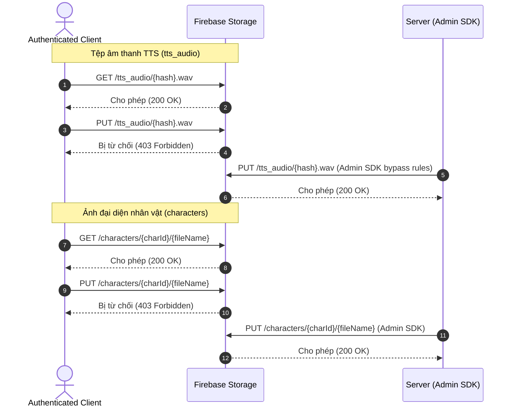

---
date: 2026-05-30
---
# Task P03.T5 — Cập nhật Firebase Storage Security Rules cho TTS Audio

## 1. Mô tả tính năng
Cập nhật quy tắc bảo mật của Firebase Storage (`storage.rules`) để hỗ trợ lưu trữ tệp âm thanh TTS (`tts_audio`) và ảnh đại diện nhân vật (`characters`), đảm bảo phân quyền chính xác giữa Client và Backend Server (Admin SDK).

## 2. Chi tiết cấu hình quy tắc bảo mật (Storage Rules)
Quy tắc bảo mật được cập nhật trong file [storage.rules](file:///d:/Web/chatAI/storage.rules) với cấu trúc như sau:

- **Đường dẫn `/avatars/{uid}/{file=**}`**:
  - `allow read`: Cho phép tất cả các tài khoản đã đăng nhập đọc ảnh đại diện của người dùng khác.
  - `allow write`: Chỉ cho phép chính chủ sở hữu tài khoản ghi (`request.auth.uid == uid`), kèm theo điều kiện giới hạn kích thước tệp < 2MB và định dạng phải là hình ảnh (`image/*`).
- **Đường dẫn `/characters/{charId}/{file=**}`**:
  - `allow read`: Cho phép tất cả các tài khoản đã đăng nhập đọc ảnh nhân vật.
  - `allow write`: Chặn toàn bộ các thao tác ghi từ phía Client (`allow write: if false;`). Chỉ cho phép Server (sử dụng Firebase Admin SDK) thực hiện tải lên hoặc cập nhật ảnh nhân vật.
- **Đường dẫn `/tts_audio/{file=**}`**:
  - `allow read`: Cho phép mọi tài khoản đã đăng nhập đọc/tải tệp âm thanh TTS (`allow read: if request.auth != null;`). Việc này nhằm hỗ trợ cơ chế cache âm thanh dùng chung (global cache) cho các tệp âm thanh được tạo ra bởi AI.
  - `allow write`: Khóa quyền ghi từ Client (`allow write: if false;`). Mọi tệp âm thanh được tải lên và lưu vào bộ nhớ đệm (cache) sẽ do Backend Server (Admin SDK) thực hiện.

## 3. Luồng phân quyền và dữ liệu (Security Flow)

## 4. Lưu ý quan trọng (Gotchas & Bugs)
- **Shared Cache cho TTS**: Trước đây, các tệp âm thanh TTS được cấu hình theo đường dẫn `/tts_audio/{userId}/{file=**}` và chỉ chủ sở hữu mới đọc được. Để tối ưu hóa và tái sử dụng các mẫu TTS được tạo bởi cùng một giọng nói và văn bản cho nhiều người dùng khác nhau (global cache), đường dẫn đã được chuyển sang dạng phẳng `/tts_audio/{file=**}` và cho phép mọi tài khoản đã đăng nhập (`request.auth != null`) đều có quyền đọc.
- **Bypass Rule bằng Admin SDK**: Khai báo `allow write: if false;` chỉ chặn các hoạt động ghi từ SDK Client thông thường. Firebase Admin SDK chạy trên môi trường Node.js Server của chúng ta được cấp đặc quyền cao và tự động bypass các quy tắc bảo mật này, do đó Server vẫn có thể thực hiện tải lên tệp âm thanh TTS một cách bình thường.
