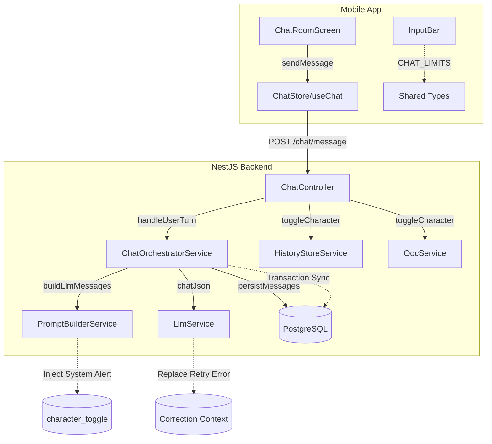

# Memori Documentation - P04 Refactor Review (Chat MVP)

## 1. Mô tả Tính Năng
Task này tập trung vào việc refactor và sửa các lỗi kỹ thuật (bugs) cũng như cải thiện cấu trúc code của Phase 4 (Chat MVP) dựa trên tài liệu đánh giá code `P04_R_refactor_review.md`. Mục tiêu chính là đảm bảo hệ thống Chat MVP hoạt động trơn tru, an toàn (type safety, race conditions) và mang lại UX tốt ở phía mobile client trước khi chuyển sang các Phase tiếp theo.

## 2. Chi tiết Refactoring Từng Thành Phần
- **ChatOrchestratorService**: 
  - Đã đưa thao tác tính toán `startOrder` vào bên trong block Prisma transaction (`persistMessages`) để ngăn chặn race condition về turnOrder khi lưu dữ liệu vào DB.
  - Sửa lỗi hardcode `triggerMemory: false` thành truyền đúng thuộc tính từ kết quả phản hồi của mô hình (LLM Response).
  - Loại bỏ các type `any` cho `characters` và `messages` bằng cách dùng các kiểu định nghĩa Prisma (`Character`, `Prisma.MessageGetPayload`) nhằm tăng Type Safety.
- **HistoryStoreService**: Đã bỏ lệnh gọi thủ công `writeLocks.delete(sid)` trong hàm `cleanup` để tránh gián đoạn các luồng I/O write đang được enqueue, vì việc xoá khoá đã được xử lý an toàn tự động.
- **ChatController & PromptBuilderService**: Thay vì đánh dấu thao tác thay đổi nhân vật vào nhóm dữ liệu `persistent_ooc`, đã định nghĩa thêm một loại history event mới là `character_toggle`. Tại `PromptBuilderService`, thông báo "nhân vật vừa xuất hiện/rời đi" được tự động inject vào dưới dạng system prompt cho LLM.
- **ChatSessionService**: Thêm dòng cảnh báo (logger warn) khi session hết hạn `24h` trong Redis và phải tự động rehydrate active character list từ story (tạm thời khắc phục cảnh báo mù, sẽ nâng cấp DB persistent sau).
- **LlmService**: Chỉnh sửa phần gom các `system` messages cho retry logic của LLM. Thay vì liên tục đẩy (push) log lỗi vào `workingMessages` mỗi lần retry làm rối loạn ngữ cảnh, nay sửa thành xoá thông báo lỗi cũ đi và ghi đè lỗi mới (replace).
- **Client - ChatRoomScreen & InputBar & MessageBubble**: 
  - Khắc phục lỗi Error Banner không bao giờ hiển thị khi lịch sử có sẵn tin nhắn, đồng thời bổ sung thêm nút "✕" để dismiss (đóng) thông báo. 
  - Chuẩn hoá giới hạn độ dài ký tự (`maxLength`) thành hằng số chung nằm tại `packages/shared-types`.
  - Fix lỗi rò rỉ block scope `eslint(no-case-declarations)` bằng cách đưa logic bên trong `case 'assistant':` vào ngoặc nhọn `{}`.
  - Sử dụng `useShallow` cho `useChat` store (Zustand) để tối ưu re-render performance.

## 3. Class/Flow Diagram

## 4. Lưu ý quan trọng (Gotchas & Bugs)
- **Lỗi Queue & Mutex Lock**: Tuyệt đối **không** dùng lệnh xoá memory object (ví dụ như Map / writeLocks) ở bên ngoài cơ chế async Queue, vì làm thế sẽ đứt chuỗi tuần tự của Promise chain đang chạy ngầm dẫn tới race conditions.
- **Lỗi Transaction**: Những thao tác read-then-write sinh ID tự động phụ thuộc (như `turnOrder` dựa trên max cũ + 1) **PHẢI** được bao bọc trong `$transaction` duy nhất tại DB (tránh việc ID mới sinh ra trùng với request chạy song song).
- **Bơm dữ liệu ngầm cho LLM (Silent Injection)**: Những thao tác tương tác của User (ví dụ: bật/tắt nhân vật) không chỉ là update State phía server mà phải được inject khéo léo vào prompt như hệ thống mô tả thông báo `[Thông báo: <tên> vừa rời khỏi cảnh]` để LLM nhận diện được. Điều này giúp LLM bám sát bối cảnh thực tại.
- **Ollama JSON Mode Retry**: Khi yêu cầu output schema nghiêm ngặt, nếu Ollama gặp lỗi JSON parse thì đừng push dồn tin nhắn sửa lỗi mà hãy replace thông điệp sửa chữa, tránh gây mâu thuẫn context sau nhiều lần retry.
