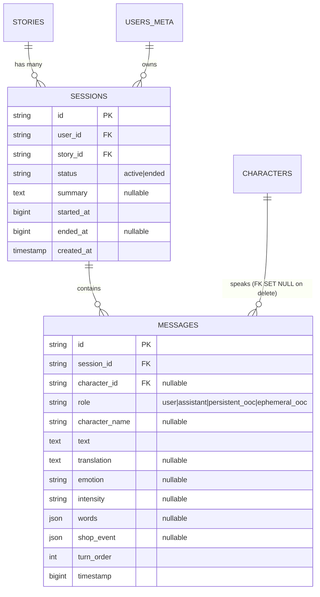

# P04.T1: DB Schema - Sessions & Messages

## 1. Mô tả tính năng
Thiết kế và triển khai Database Schema cho hai đối tượng liên quan đến tính năng Chat MVP của ứng dụng:
- **Session (Phiên trò chuyện):** Lưu trữ thông tin về phiên chat giữa người dùng và các nhân vật trong một câu chuyện nhất định.
- **Message (Tin nhắn):** Lưu trữ nội dung chi tiết của các tin nhắn trong phiên chat (bao gồm văn bản, bản dịch, cảm xúc, thông tin phát âm, lượt hội thoại, timestamp).
- Cập nhật các bảng hiện có (**UsersMeta**, **Story**, **Character**) để liên kết với các bảng mới.
- Chạy prisma migration để đồng bộ hóa cơ sở dữ liệu PostgreSQL.

## 2. Đặc tả các model / File chính
- `apps/server/prisma/schema.prisma`:
  - `UsersMeta`: Thêm liên kết quan hệ `sessions Session[]`.
  - `Story`: Mở comment liên kết quan hệ `sessions Session[]`.
  - `Character`: Mở comment liên kết quan hệ `messages Message[]`.
  - `Session`: Định nghĩa các trường `id`, `userId` (FK -> users_meta), `storyId` (FK -> stories, Cascade), `status` (default: 'active'), `summary`, `startedAt`, `endedAt`, `createdAt`. Thiết lập chỉ mục trên `[userId, storyId, status]` và `[storyId, status]`.
  - `Message`: Định nghĩa các trường `id`, `sessionId` (FK -> sessions, Cascade), `characterId` (FK -> characters, SetNull), `role`, `characterName`, `text`, `translation`, `emotion`, `intensity`, `words`, `shopEvent`, `turnOrder`, `timestamp`. Thiết lập chỉ mục trên `[sessionId, turnOrder]` và `[characterId]`.
- `apps/server/prisma/migrations/<ts>_add_sessions_messages/migration.sql`: File SQL migration được tự động sinh ra và áp dụng vào PostgreSQL.

## 3. Biểu đồ ERD

## 4. Lưu ý quan trọng (Gotchas & Bugs)
- **Multiple Cascade Paths trong PostgreSQL**: Khi thiết kế `Session` có liên kết `onDelete: Cascade` đến cả `UsersMeta` và `Story`, ban đầu có lo ngại PostgreSQL báo lỗi Multiple Cascade Paths (do `Story` cũng cascade tới `UsersMeta`). Tuy nhiên, trên PostgreSQL thực tế, do cả hai hướng đều nhất quán là `CASCADE` và không có hành động mâu thuẫn (như Set Null), DB engine vẫn biên dịch và thực thi hoàn hảo mà không xảy ra lỗi.
- **Chạy Script Test bằng `ts-node` ngoài thư mục dự án**: Khi chạy test tự động/kiểm tra DB bằng script ts-node đặt ở thư mục tạm/scratch ngoài workspace, ts-node sẽ không phân giải được import `@prisma/client` do cơ chế Module Resolution tìm node_modules từ thư mục chứa file script. Giải pháp là tạo file script test tạm ngay bên trong thư mục dự án (ví dụ `apps/server/prisma/test-db.ts`) rồi chạy, sau đó dọn dẹp file đi.
