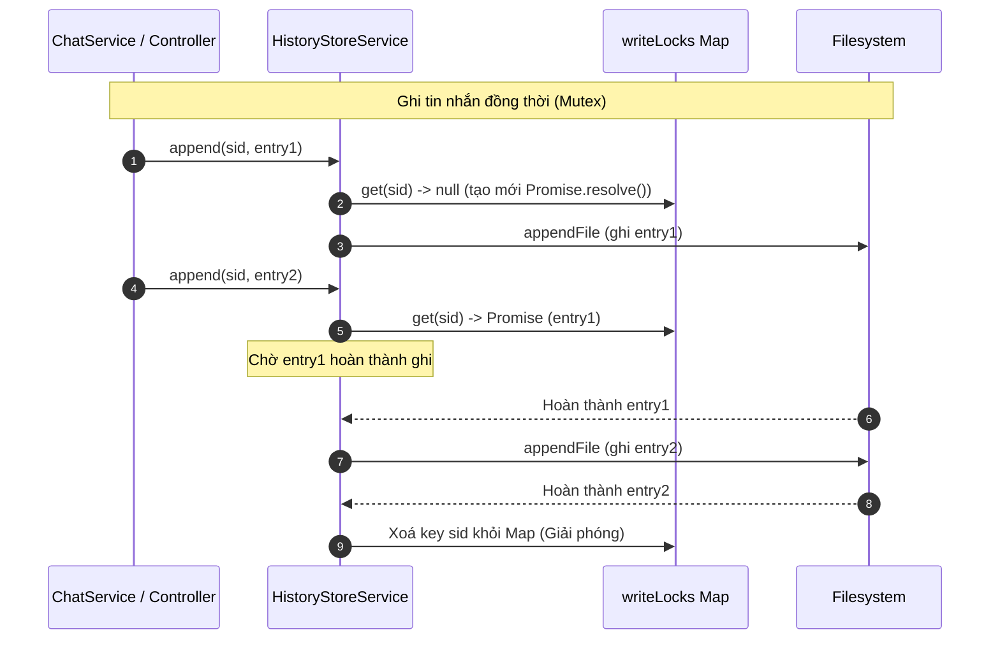

# P04.T2: HistoryStoreService (.jsonl Adapter)

## 1. Mô tả tính năng
Triển khai `HistoryStoreService` quản lý bộ nhớ đệm (cache) lịch sử chat tạm thời trên Server bằng cách ghi nối tiếp (append-only) các tin nhắn hội thoại thành các dòng JSON (.jsonl) phân tách theo từng phiên (`sessionId`). 
Service giải quyết vấn đề bất đồng bộ khi ghi file đồng thời bằng cơ chế khóa tuần tự (Mutex lock) trên từng session, đồng thời ước lượng số lượng token đã sử dụng và cho phép đọc từ checkpoint gần nhất.

## 2. Đặc tả các hàm chi tiết

### `onModuleInit()`
- Khởi tạo `basePath` từ cấu hình `historyStoreBasePath` (mặc định là `./data/chat-cache`).
- Tự động tạo thư mục cache (recursive) nếu chưa tồn tại.

### `pathFor(sid: string): string` (private)
- Kiểm duyệt `sid` có khớp với định dạng UUID chuẩn bằng Regular Expression: `/^[0-9a-f]{8}-[0-9a-f]{4}-[0-9a-f]{4}-[0-9a-f]{4}-[0-9a-f]{12}$/i`.
- Nếu không khớp, ném lỗi `AppException(ERR.INVALID_PAYLOAD, 'Invalid session ID format')` nhằm ngăn chặn các cuộc tấn công Path Traversal.
- Trả về đường dẫn tuyệt đối tới tệp cache: `<basePath>/<sid>.jsonl`.

### `enqueueWrite(sid: string, fn: () => Promise<void>): Promise<void>` (private)
- Triển khai cơ chế Mutex (Sequential Queue) cho mỗi session.
- Sử dụng cấu trúc `Map<sessionId, Promise<void>>` để liên kết chuỗi (chaining) các thao tác ghi file tuần tự qua phương thức `.then()`.
- Xóa lock ra khỏi Map khi tác vụ cuối cùng hoàn thành để giải phóng tài nguyên bộ nhớ.

### `append(sid: string, entry: HistoryEntry): Promise<void>`
- Nhận tin nhắn chat mới, chuyển thành chuỗi JSON một dòng (`JSON.stringify(entry) + '\n'`).
- Thực hiện ghi nối tiếp vào tệp cache thông qua `enqueueWrite` để đảm bảo không bị lỗi race condition khi ghi file đồng thời.

### `readAll(sid: string): Promise<HistoryEntry[]>`
- Kiểm tra sự tồn tại của tệp cache thông qua `exists(sid)`. Nếu không tồn tại, trả về mảng rỗng `[]`.
- Đọc nội dung file, phân tách thành các dòng, loại bỏ dòng trống và chuyển ngược lại thành đối tượng JavaScript thông qua `parseLine`.

### `readSinceLastCheckpoint(sid: string): Promise<HistoryEntry[]>`
- Đọc toàn bộ lịch sử qua `readAll(sid)`.
- Duyệt ngược từ cuối danh sách để tìm phần tử `checkpoint` gần nhất.
- Nếu không tìm thấy, trả về toàn bộ mảng.
- Nếu tìm thấy, cắt mảng từ checkpoint đó trở đi (bao gồm cả dòng checkpoint) để làm context nạp vào LLM.

### `estimateTokens(sid: string): Promise<number>`
- Đọc các entry kể từ checkpoint gần nhất.
- Dùng quy tắc ước lượng sơ bộ `zhEstimate = length / 2` cho các ký tự tiếng Trung/tiếng Việt.
- Tính tổng token của các thuộc tính text, translation, ephemeralOOC trong các entry và làm tròn lên (`Math.ceil`).

### `cleanup(sid: string): Promise<void>`
- Xóa file cache qua `fs.unlink`.
- Chạy thông qua `enqueueWrite` để tránh xung đột ghi/xóa đồng thời, bỏ qua lỗi `ENOENT` (file không tồn tại).

### `exists(sid: string): Promise<boolean>`
- Sử dụng `fs.access` để kiểm tra tệp cache có tồn tại trên ổ đĩa hay không.

### `parseLine(line: string): HistoryEntry` (private)
- Parse dòng JSON thành đối tượng. Nếu JSON bị hỏng, ghi log cảnh báo và ném `AppException(ERR.INTERNAL_ERROR, 'Corrupt history')`.

---

## 3. Sơ đồ luồng (Data Flow & Concurrency Mutex)

---

## 4. Lưu ý quan trọng (Gotchas & Bugs)
- **Lỗi TypeScript `Object is possibly 'undefined'` khi duyệt mảng hoặc index**: Trong môi trường compile TypeScript khắt khe (strict mode), việc truy xuất `all[i]` hoặc `result[0]` có thể bị bắt lỗi compiler. Cần gán biến tạm và thực hiện kiểm tra an toàn hoặc sử dụng assertion `!` (`result[0]!`) khi ta chắc chắn độ dài mảng thỏa mãn điều kiện.
- **Lỗi `Property has no initializer` trong NestJS**: Do thuộc tính `basePath` được khởi tạo trong `onModuleInit` thay vì constructor, compiler TypeScript sẽ báo lỗi nếu không được định nghĩa rõ ràng. Sử dụng dấu gán phủ định `private basePath!: string;` để báo cho compiler biết biến này sẽ chắc chắn được khởi tạo sau.
