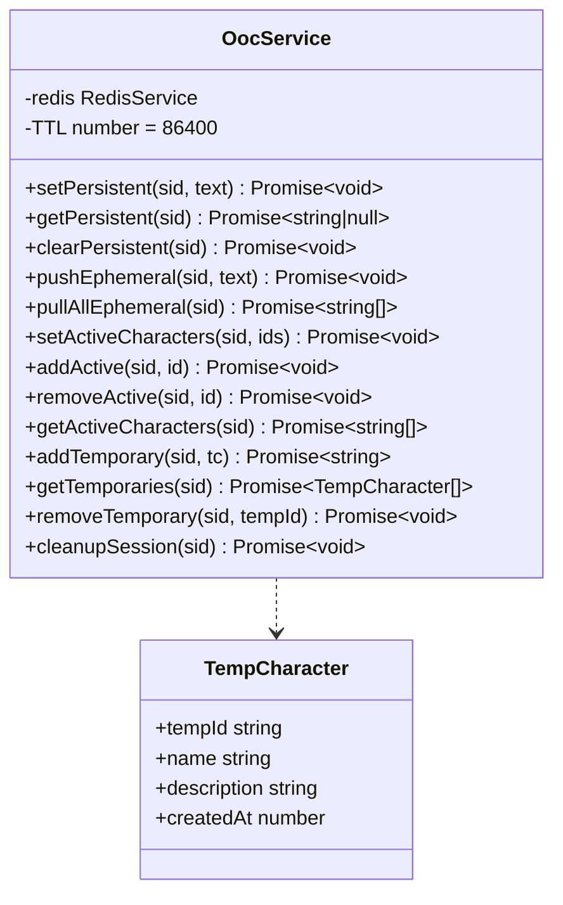

# Task P04.T3 — OocService (Redis-backed)

## 1. Mô tả tính năng
`OocService` chịu trách nhiệm quản lý 4 loại trạng thái liên quan đến Out of Character (OOC) và thông tin nhân vật hoạt động theo từng phiên chat (session) trên Redis, đảm bảo hiệu năng cao và đồng bộ hóa giữa các yêu cầu.

## 2. Chi tiết tính năng từng hàm

- `setPersistent(sid, text)`:
  - Lưu cấu hình OOC dài hạn cho session dưới dạng chuỗi String trong Redis.
  - Tự động ném lỗi `INVALID_PAYLOAD` (`AppException`) nếu độ dài chuỗi vượt quá 5000 ký tự.
  - Đặt TTL 24 giờ.
  
- `getPersistent(sid)`:
  - Lấy chuỗi OOC dài hạn hiện tại của session. Trả về `null` nếu không tồn tại.

- `clearPersistent(sid)`:
  - Xóa khóa lưu trữ OOC dài hạn.

- `pushEphemeral(sid, text)`:
  - RPUSH một tin nhắn OOC tạm thời vào danh sách (List) trong Redis và đặt/làm mới TTL 24 giờ cho list đó.

- `pullAllEphemeral(sid)`:
  - Đọc toàn bộ tin nhắn OOC tạm thời và xóa danh sách một cách nguyên tử (atomic) thông qua việc thực thi Lua script (`LRANGE` + `DEL`). Đảm bảo tránh tình trạng race condition khi có nhiều tiến trình đọc ghi song song.

- `setActiveCharacters(sid, ids)`:
  - Đặt danh sách nhân vật hoạt động trong session bằng kiểu dữ liệu Set của Redis thông qua transaction pipeline (`DEL` -> `SADD` -> `EXPIRE`).

- `addActive(sid, id)`:
  - Thêm một nhân vật vào Set nhân vật đang hoạt động của session và cập nhật TTL.

- `removeActive(sid, id)`:
  - Xóa một nhân vật khỏi Set nhân vật hoạt động của session và cập nhật TTL.

- `getActiveCharacters(sid)`:
  - Lấy tất cả nhân vật đang hoạt động (trả về mảng chuỗi).

- `addTemporary(sid, tc)`:
  - Thêm một nhân vật tạm thời (chỉ tồn tại trong session này) dưới dạng JSON string vào Hash của Redis.
  - Tự động sinh `tempId` theo định dạng `tmp_<UUID>`. Trả về `tempId`.

- `getTemporaries(sid)`:
  - Lấy toàn bộ các nhân vật tạm thời và parse ngược từ chuỗi JSON thành các đối tượng `TempCharacter`.

- `removeTemporary(sid, tempId)`:
  - Xóa nhân vật tạm thời tương ứng với `tempId` khỏi Hash.

- `cleanupSession(sid)`:
  - Xóa toàn bộ 4 khóa trạng thái của session trên Redis nhằm dọn dẹp bộ nhớ khi kết thúc chat.

## 3. Class Diagram

## 4. Lưu ý quan trọng (Gotchas & Bugs)

- **TypeScript Strict Mode in Testing**:
  - *Vấn đề*: Khi viết unit test, việc mock thực thể `ioredis` và in-memory store (`Map`) dẫn tới các cảnh báo biên dịch TypeScript do strict mode (như `Object is possibly 'undefined'` hoặc `data is possibly 'undefined'`).
  - *Giải pháp*: Trong file unit test, luôn thực hiện kiểm tra kiểm soát kiểu (`if (data)`) trước khi truy xuất giá trị từ Mock Redis Store, kết hợp sử dụng toán tử non-null assertion `!` sau khi đã gọi các hàm assert như `expect(record).toBeDefined()`.
- **Atomic Ephemeral Read**:
  - Để đảm bảo tính nguyên tử, phương thức `pullAllEphemeral` bắt buộc phải sử dụng Lua script để gộp chung thao tác lấy dữ liệu và xóa dữ liệu khỏi hàng đợi, thay vì gọi tuần tự `lrange` rồi `del` từ client (có thể gây mất mát tin nhắn khi có ghi đè song song).
