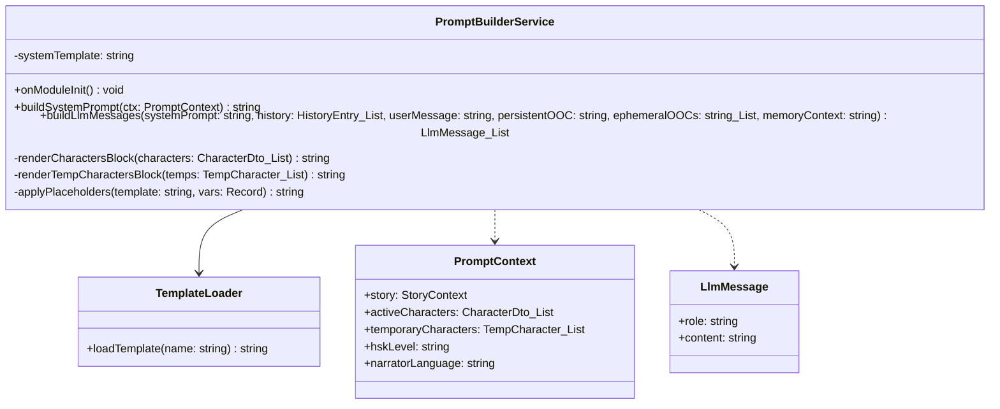

---
date: 2026-05-31
---
# Memori — Task P04.T4 — PromptBuilderService & TemplateLoader

Dài hạn lưu trữ thông tin về việc xây dựng prompt builder service và template loader.

## 1. Mô tả tính năng
Tách biệt phần prompt template khỏi code logic. Quản lý các prompt templates v1 tĩnh trong package `@chatai/prompts`.
Cung cấp `PromptBuilderService` để load templates, render system prompt động thay thế các placeholder (`{{CHARACTERS_BLOCK}}`, `{{STORY_TITLE}}`, v.v.) và chuyển đổi lịch sử chat thành định dạng `LlmMessage[]` chuẩn cho LLM Service.

## 2. Chi tiết các hàm

### `@chatai/prompts` - `TemplateLoader`
- `static loadTemplate(name)`: Đọc file template Markdown đồng bộ từ đĩa (`packages/prompts/v1/${name}.md`) bằng `fs.readFileSync`. Sử dụng Map cache để lưu lại kết quả đọc file, tránh đọc đĩa ở các lượt gọi sau.
- `loadTemplate(name)`: Instance wrapper gọi lại static method trên để tăng tính tương thích khi sử dụng instance injection hoặc static call.

### `@chatai/server` - `PromptBuilderService`
- `onModuleInit()`: Load system prompt `system_chat` một lần duy nhất khi khởi tạo module.
- `buildSystemPrompt(ctx: PromptContext)`: Thay thế toàn bộ placeholders trong template với các giá trị động từ `PromptContext` (Story title, settings, HSK level, active characters block, v.v.).
- `buildLlmMessages(...)`: Xây dựng mảng `LlmMessage[]`:
  1. Thêm system message chứa system prompt đã render, đồng thời tự động chèn thêm bối cảnh cố định (persistent OOC) và ký ức liên quan (memoryContext) nếu có.
  2. Duyệt qua mảng lịch sử `HistoryEntry[]`. Convert các entry loại `user` (hỗ trợ ephemeralOOC prepend), `assistant_batch` (serialize về dạng JSON chuẩn), `checkpoint` (đưa vào dạng system note tóm tắt). Bỏ qua các entry `system`, `persistent_ooc`, `ephemeral_ooc` do đã được handle hoặc không liên quan ở mức hội thoại trực tiếp với LLM.
  3. Thêm tin nhắn lượt hiện tại của user, chèn ephemeralOOCs hiện tại dạng `[OOC: ...]`.
- `renderCharactersBlock(characters)`: Render danh sách character đang active thành chuỗi mô tả chi tiết.
- `renderTempCharactersBlock(temps)`: Render thông tin nhân vật tạm thời nếu có.
- `applyPlaceholders(template, vars)`: Helper thay thế tất cả `{{KEY}}` thành giá trị tương ứng.

## 3. Class Diagram & Data Flow

## 4. Lưu ý quan trọng (Gotchas & Bugs)

- **Lỗi biên dịch TypeScript ở package độc lập**:
  - *Vấn đề*: Khi tạo package `@chatai/prompts` để load file Markdown, dùng các module Node.js (`fs`, `path`, `__dirname`) bị báo lỗi biên dịch do TypeScript không nhận diện được các kiểu Node.js.
  - *Giải pháp*: Phải thêm `@types/node` vào `devDependencies` của `packages/prompts/package.json` và chạy `pnpm install` để tải và link lại dependencies trong workspace.
- **Cache Ollama Prompt**:
  - Đặt phần system rules tĩnh lên trước, thông tin cốt truyện và nhân vật động ở sau giúp tăng tỉ lệ Cache hit của Ollama, cải thiện đáng kể tốc độ phản hồi từ local LLM.
